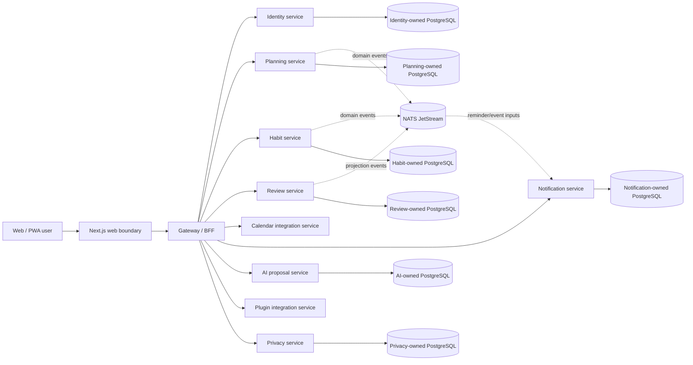
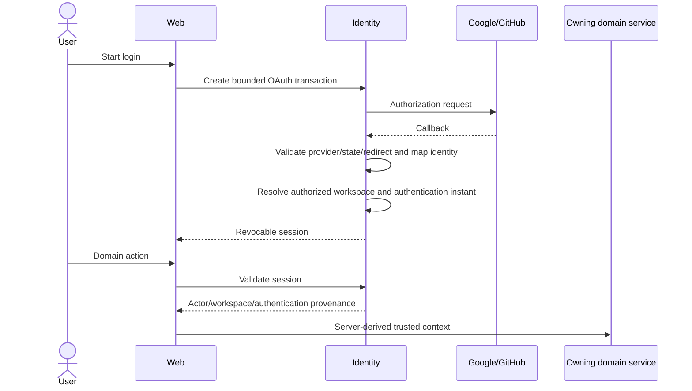
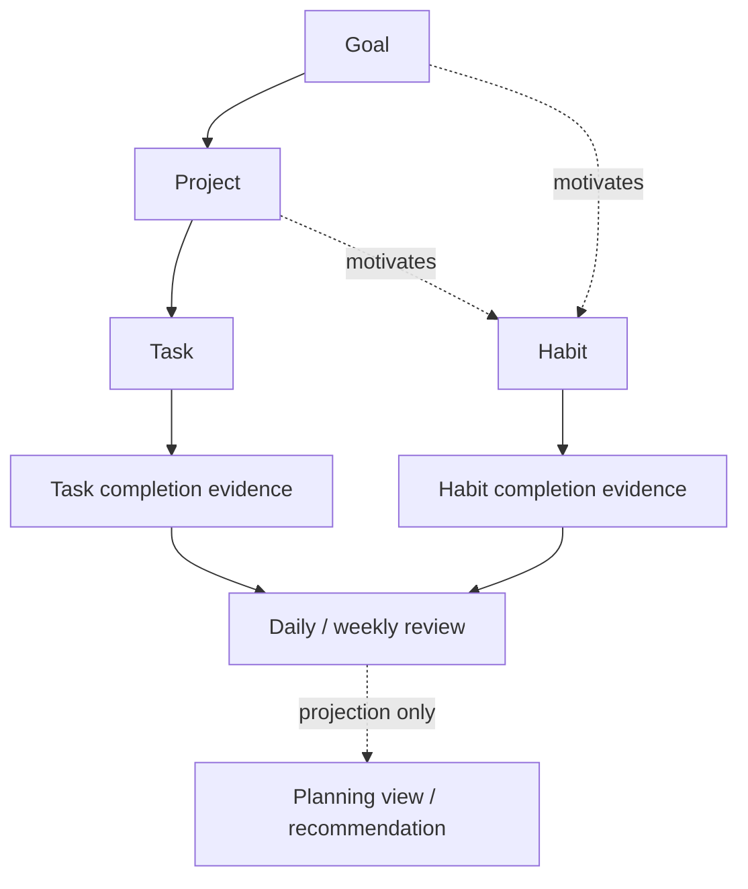
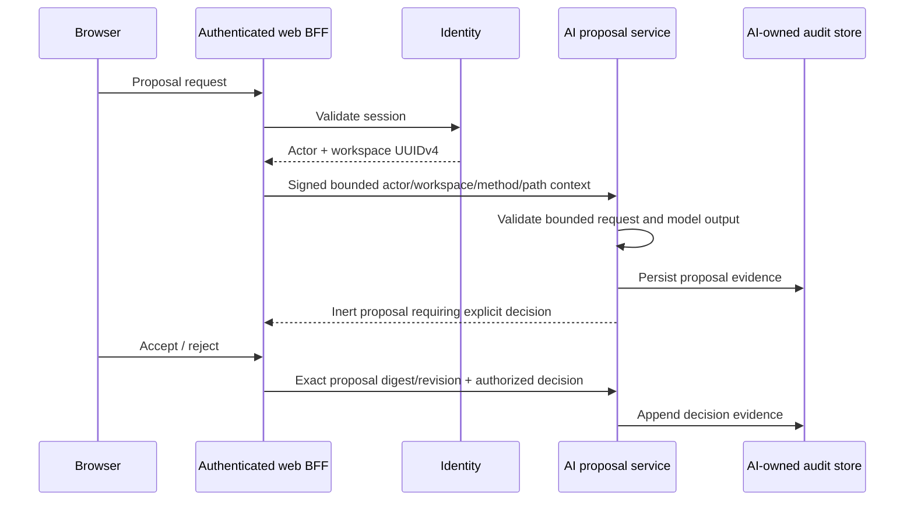

# LifeOS architecture decisions

This document is the architectural source of truth for repository-wide product and service authority. Protected-main source, migrations, tests and live repository policy are the executable evidence for shipped behavior. Canonical PRD/TRD/data/UML/security/operability documents add code-current views; feature specifications and runbooks may add detail but must not weaken these decisions.

## 1. Product and deployment boundary

LifeOS is a privacy-first, multi-user, server-backed and self-hostable personal operating system. It remains usable as an independent product while composing with other ContextualWisdomLab bounded contexts through explicit versioned interfaces.

Earlier login-free/browser-only local-first, private-personal-only, UUIDv7 and single-application primary designs are **superseded**. Browser-local state remains valid for explicit draft/cache/offline interaction and Docker Compose remains a deployment profile, but neither becomes durable data authority or permission to collapse service ownership.

Physical co-location on one PostgreSQL cluster does not create cross-service table authority.

### Required invariants

- Internal object identifiers are opaque UUIDv4 strings. Numeric or provider-native identifiers are explicit external mappings and never internal primary keys.
- Product-owned database object names use descriptive multiword `snake_case` unless an external standard mandates another spelling.
- Each service owns its persistence schema/role, migrations, credentials, runtime configuration, persistence adapters, tests, observability and shutdown behavior.
- Services never read or mutate another service's database tables directly. Cross-service relationships use a versioned HTTP, event, saga, plugin or MCP contract.
- Browser-local state is draft/cache/offline state until an authorized owning service confirms persistence.
- Public errors, metrics, logs, retained artifacts and review evidence exclude credentials, hidden reasoning and unnecessary unbounded tenant content.

## 2. Identity, workspace and authentication provenance

Identity service owns LifeOS user identity, external-provider mappings, workspace membership/authorization, browser sessions and authentication provenance.

Google/GitHub OAuth transactions are server-owned and replay-resistant. Session issuance/rotation time and the underlying authentication ceremony time are different facts. Compatible session rotation preserves the original authentication instant so recent-authentication policy cannot be bypassed by refreshing a session.

The identity service also owns durable data-rights request identity and immutable terminal receipt evidence. Protected main includes tenant-and-requesting-actor scoped request lookup; inaccessible cross-tenant status is not disclosed. Complete cross-domain export/erasure orchestration remains **Partial** under issue #55.

## 3. Planning, Today, habits, reviews and reminders

Planning service owns Goals, Projects, Tasks, planning search and durable Today state. Habit service owns recurring habit definitions and completion evidence. Review service owns guided-review snapshots/projections without becoming planning or habit mutation authority. Notification service owns reminder occurrences, claims/fencing, delivery attempts and bounded outcomes.

Durable Today synchronization is protected-main behavior. The browser requires an explicit local-to-workspace save, uses strong preconditions plus idempotency, and receives explicit conflict/revision evidence rather than silent stale overwrite.

## 4. Calendar integration boundary

Conflict-safe CalDAV/Google synchronization and signed trusted workspace context are protected-main behavior. The calendar service rejects the legacy model in which an arbitrary client-selected workspace header could become tenant authority.

A process/operator-supplied Google access token remains a bounded development/runtime credential path; the complete hosted per-user encrypted credential lifecycle, OAuth state/PKCE, refresh, revocation, discovery and explicit calendar selection remains **Partial** under issue #129.

Provider identities/credentials never become LifeOS internal primary keys or general identity credentials.

## 5. AI proposal safety boundary

AI output is untrusted inert proposal data, not an execution command. The AI service can generate, persist, retrieve and record explicit decisions about proposals, but it has no generic planning mutation repository or command bus.

Deterministic authorization, schema and proposal-quality gates remain authoritative when model providers are unavailable. Live provider execution is bounded conformance evidence, not permission to weaken deterministic correctness.

## 6. Privacy and data-rights authority

Privacy service owns purpose-bound sensitive-access decisions, bounded grants and audit events. Sensitive access binds actor, workspace, resource/resource class, purpose and lifetime. Blanket masking is not the authorization model.

Identity owns the cross-domain data-rights request/receipt lifecycle; each participating bounded context remains authoritative for its own export/erasure contribution. Whole-product completion requires durable contributor registration, reconciliation, protected delivery/erasure semantics, bounded retry/recovery, retention/legal-hold/backup-expiry handling and an immutable final receipt only after all required contributors confirm completion.

## 7. Plugin integration boundary

Protected main owns versioned plugin manifest/event validation and preparation. It does not imply generic installation, durable plaintext secrets, unrestricted outbound delivery, inbound arbitrary commands or direct cross-service database access.

Issue #130 owns the planned runtime trust boundary: explicit installation/capability grants, encrypted secret handles, authorized-origin SSRF-safe outbound delivery, bounded retries/audit and immediate revocation.

## 8. Test-time compute and model-assisted repository development

A strong single-model route is measured before deeper orchestration. Reasoning effort, workflow stage, decomposition, recursion depth, role and access topology are explicit experimental dimensions; deeper orchestration is justified by measured quality or heterogeneous capability coverage rather than agent count.

Scheduled model-assisted repository development uses the reviewed OpenCode/NVIDIA boundary with `NVIDIA_NIM_API_KEY` where model access is required. Development models do not receive product-data authority, review-agent credentials, branch-protection authority, merge authority or release authority. Deterministic reverification remains independent of the model.

## 9. Verification evidence identity and merge safety

Repository evidence has distinct identities and must not be conflated:

- contributor source head;
- PR base snapshot recorded by GitHub;
- independently resolved current live base-ref tip;
- synthetic merge tree;
- workflow/job checkout revision;
- protected-main integrated head;
- release artifact/source identity.

Exact-source verification and merge-tree compatibility answer different questions. Active PR #147 advances issue #132 by making that distinction explicit in required workflows. Until it merges, its implementation is **Implemented on active PR**, not protected-main behavior.

Pull requests follow a work-conserving loop: inspect current evidence, RCA failures, make the smallest test-first correction, rerun exact evidence, resolve only addressed threads, and merge only the unchanged exact head when live repository policy accepts it. A waiting check/reviewer/provider blocks only that lane. Administrative bypass, fabricated approval/checks and stale/predecessor evidence promotion are invalid.

## 10. Mathematical and psychometric modules

LifeOS currently contains no psychometric computation service. If future product scope introduces mathematical or psychometric computation, production numerical kernels are Rust-first; CPU/GPU parity, realistic true-parameter recovery, uncertainty/coverage, multilevel/multiple-membership structure, temporal/repeated-measurement semantics, convergence and reproducibility must be established before product claims. This is a future architecture constraint, not a claim that LifeOS currently implements those models.

## 11. Documentation hierarchy

GitHub must reconstruct current LifeOS without chat history or old PR archaeology. The canonical graph is:

1. `AGENTS.md` — repository-wide agent/merge rules.
2. `ARCHITECTURE.md` — durable product/service authority and boundaries.
3. `docs/PRD.md` — buyer/user outcomes, requirements and maturity.
4. `docs/TRD.md` — shared technical/security/data/release requirements.
5. `docs/adr/README.md` plus ADRs — durable decisions, alternatives and supersession.
6. `docs/DATA_MODEL.md` — logical service-owned ERD; migrations remain physical truth.
7. `docs/UML.md` — product, authority, state, failure and deployment views.
8. `docs/API_CONTRACTS.md` — repository-level API/event ownership/evolution registry.
9. `SECURITY.md` and `docs/THREAT_MODEL.md` — reporting policy and architectural threats.
10. `docs/PRIVACY_DATA_LIFECYCLE.md` — sensitive-data, credential and rights lifecycle.
11. `docs/TEST_STRATEGY.md` — deterministic/live validation evidence.
12. `docs/OPERABILITY.md` — deployment, diagnostics, backup and recovery boundaries.
13. `docs/RELEASE_AND_MIGRATION.md` — versioning, migration and rollback contract.
14. `docs/STANDARDS_TRACEABILITY.md` — standards/research evidence classes.
15. `docs/TRACEABILITY.md` — requirement/decision -> source/test/issue/PR evidence.
16. `docs/DOCUMENTATION_ASSESSMENT.md` — documentation fitness and historical reconciliation.
17. `CLAUDE.md`, `README.md`, `CHANGELOG.md` and scoped specs/plans/runbooks — discoverability and supporting evidence.

Canonical status fields use only `Implemented on protected main`, `Implemented on active PR`, `Partial`, `Accepted architecture`, `Planned`, `Research only`, `Superseded`, or `Out of scope`. File age, file presence and historically resolved review comments do not prove semantic currentness. A material behavior/authority change is documentation-incomplete until the corresponding canonical views and executable documentation contracts reconcile the claim.
