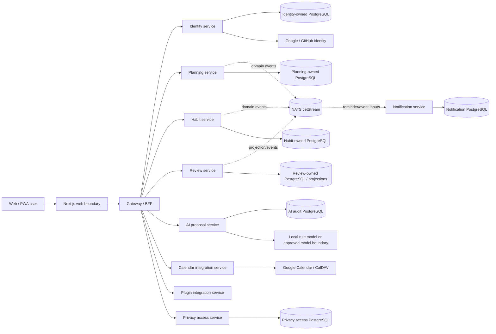
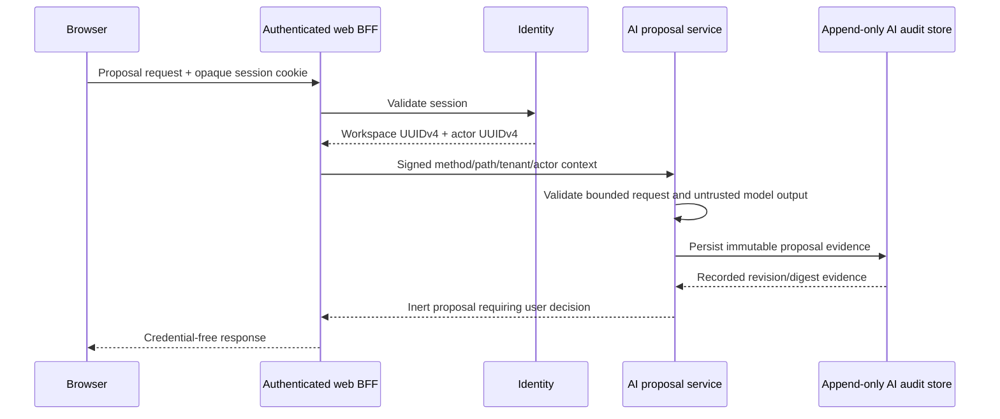
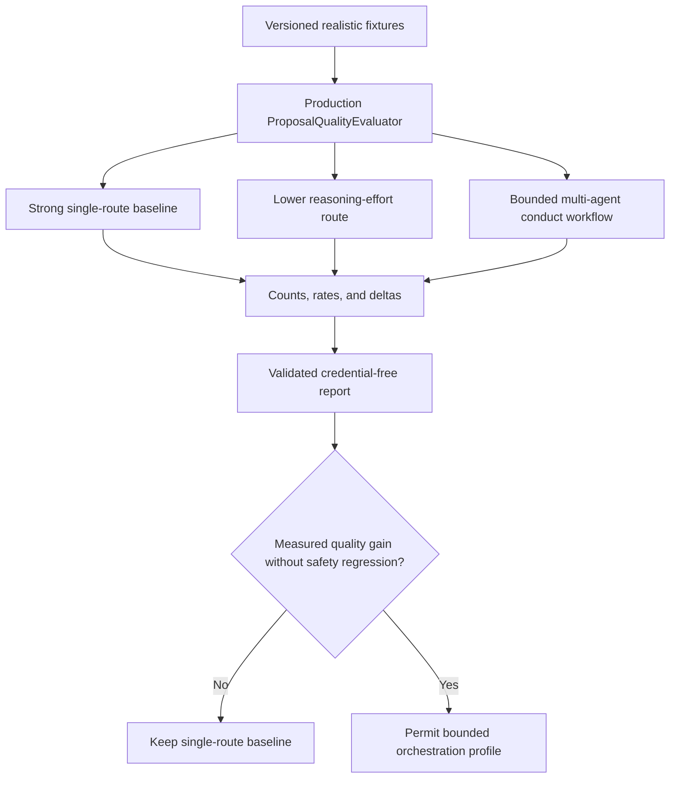

# LifeOS architecture decisions

This document is the architectural source of truth for repository-wide boundaries. `docs/PRD.md` defines product outcomes, `docs/TRD.md` defines shared technical requirements, and feature-level specifications/runbooks add scoped detail without weakening these decisions.

## 0. Architecture status and history

LifeOS is a multi-user, server-backed, self-hostable modular MSA product. Historical proposals for a login-free browser-only local-first product, a single-application primary architecture, and UUIDv7 internal identifiers are retained as rationale but are **superseded** by current protected-main decisions. See `docs/DOCUMENTATION_ASSESSMENT.md` and `docs/adr/`.

Use these status meanings throughout canonical docs: `Implemented on protected main`, `Implemented on active PR`, `Partial`, `Accepted architecture`, `Planned`, `Research only`, `Superseded`, and `Out of scope`.

## 1. Product and deployment boundary

Every bounded service must work independently and remain composable inside the monorepo deployment. Services communicate through versioned HTTP/event/saga/plugin/MCP contracts and never read or mutate another service's database tables directly.

The diagram is a logical topology. Cross-service arrows never imply cross-service database authority.

### Required invariants

- Internal object identifiers are opaque UUIDv4 strings. Numeric/provider-native identifiers never become internal primary keys.
- Database object names contain at least two words and use `snake_case` unless an external standard requires another form.
- Each service owns migrations, runtime configuration, persistence adapters, tests, observability, and shutdown behavior.
- Cross-service writes require an explicit API, event, saga, plugin, or MCP contract; shared-table coupling is prohibited.
- Browser-local state is draft/cache/offline state unless an authorized owning service confirms durable persistence.
- Public errors, metrics, logs, artifacts, and review evidence exclude credentials and unbounded tenant data.
- External provider/model/plugin responses are untrusted until bounded and validated.

## 2. Data authority and consistency

PostgreSQL is the durable source of truth for persisted domain records. A development/self-hosted deployment may place multiple service-owned schemas/databases on one cluster, but logical ownership and credentials remain separated.

Shared `workspace_id`/`actor_id` values are correlation and authorization inputs, not permission to query another service's tables. Cross-service derived views are projections and cannot silently become mutation authority.

Concurrency-sensitive flows use explicit revision/digest/ETag/idempotency/fencing evidence appropriate to the domain. Current examples include habit completion replay protection, notification worker claims/outcomes, calendar preconditions, AI proposal revision/digest decisions, and privacy grant consumption.

See `docs/DATA_MODEL.md` for the logical ERD and `docs/API_CONTRACTS.md` for owned protocol/version boundaries.

## 3. Identity, tenant, and private service context

Google and GitHub are the required login providers in the current product boundary. Provider identity is mapped to LifeOS-owned UUIDv4 identities and workspace authority. Downstream services derive ownership from authenticated/signed context instead of trusting browser-selected workspace/actor headers.

Where a private service context is signed, key identifier, method, path, workspace, actor, and issuance/lifetime are integrity protected. Key rotation supports an explicitly bounded active/previous overlap where implemented. Browser credentials and provider keys do not become generic downstream inputs.

## 4. AI proposal safety boundary

AI output is an inert proposal, not an execution command. The AI service can generate, validate, persist, retrieve, evaluate and record explicit decisions about proposals, but it has no planning mutation repository or generic command bus.

Explicit accept/reject history is append-only/replay-safe evidence. Any future capability that applies an accepted proposal to planning data requires its own narrowly authorized domain command contract; proposal acceptance alone is not mutation authority.

## 5. Purpose-bound privacy access

Sensitive personal data cannot be governed by masking alone. The privacy bounded context authorizes access by actor, workspace/resource, purpose, lifetime and exact operation, records append-only access decisions/events, and may issue bounded/single-use signed grants.

This keeps sensitive information useful for authorized product operations while minimizing standing privilege and retained audit payloads. Expired, reused, wrong-purpose, wrong-resource, or wrong-actor grants fail closed.

See `docs/adr/0005-purpose-bound-sensitive-data-access.md`, `docs/THREAT_MODEL.md`, and `docs/PRIVACY_DATA_LIFECYCLE.md`.

## 6. Notification and calendar boundaries

The notification service owns reminder occurrence/claim/outcome/in-app delivery persistence and timezone/fatigue/retry rules. Worker claims are bounded and recoverable; outcomes are immutable evidence where the persistence contract requires it.

The calendar integration service owns provider adaptation. CalDAV/Google writes use deterministic identifiers/preconditions where supported and return classified, credential-free conflict/unavailable evidence. Provider state is untrusted. Hosted per-user Google Calendar credential storage/refresh/revocation/provider selection remains **Partial** and is tracked by issue #129; an operator-supplied runtime token is not equivalent to a multi-user credential product.

## 7. Plugin and external integration boundary

The plugin SDK/integration service exposes versioned manifest/event contract discovery, validation, and tenant-scoped preparation. It does not grant plugins direct database access.

Generic installation, durable plugin secret storage, outbound webhook delivery, inbound arbitrary commands, and external network authority remain separately reviewed capabilities with least-privilege, SSRF, provenance, retry and audit requirements.

## 8. Test-time compute and live conformance

The deterministic proposal evaluator is authoritative for proposal validity, operation conformance, grounding, benign utility, forbidden-text leakage, and prompt-injection resistance. Live provider execution is governance evidence and is not a pull-request availability gate unless a separately reviewed gate says otherwise.

### Compute-allocation rules

- A strong single-model route is always measured first.
- Reasoning effort, workflow stage, decomposition, recursion depth, role, and access topology are explicit test cells rather than hidden defaults.
- Deeper orchestration is justified by measured fixture-level quality or heterogeneous capability coverage, not by agent count.
- Latency/token use are recorded for capacity review but are not the sole optimization objective.
- Unsupported capabilities remain explicit unavailable cells; tests never fabricate an ablation result.
- Live model evidence excludes provider credentials, prompts, raw responses, traces and hidden reasoning from retained artifacts.

## 9. Mathematical and psychometric modules

LifeOS currently contains no production psychometric computation service. Any future mathematical or psychometric module must before production treatment:

- implement numerical kernels in Rust;
- support deterministic CPU multithreading with low context switching and a parity-verified GPU boundary where justified;
- test true-parameter recovery, bias, interval coverage, convergence, and RMSE on realistic simulations;
- model multilevel and multiple-membership structures where the estimand requires them;
- model temporal change/repeated measurement/drift/state evolution where the estimand changes over time;
- document numerical precision, seed control, convergence diagnostics and fallback behavior;
- cite substantive statistical assumptions/estimands in APA 7 style.

## 10. Deployment and recovery boundary

Docker Compose composes local/self-hosted development behavior. `infra/kubernetes` is a provider-neutral hardened production reference; it does not provision a cluster, database, NATS, ingress/TLS/DNS, registry pipeline, KMS/secret manager, or operator monitoring backend.

Logical PostgreSQL backup/restore verifies archive checksum and requires a deliberately empty target. It is not point-in-time recovery. Deployment rollback claims cover only the workload state explicitly captured/verified by the deployment workflow; completed migrations and external infrastructure are not silently represented as reversible.

See `docs/OPERABILITY.md` and `docs/RELEASE_AND_MIGRATION.md`.

## 11. Automation and merge safety

Pull requests follow one loop: inspect every review/check on the exact current head, perform evidence-backed RCA, make a test-first causal fix, rerun exact-head gates, resolve only addressed threads, and merge only after real repository protections are satisfied. Administrative bypasses and fabricated approval/evidence are prohibited.

Automation is work-conserving: a blocked PR/check/provider/tool path blocks only that action. A repository writer lease prevents competing branch writes, while remaining safe read-only/non-conflicting work continues. One successful commit, documentation update, PR creation, merge or check dispatch is an intermediate result while executable work remains.

The bounded hourly OpenCode commercial-development workflow and deterministic policy package are **Implemented on protected main** from merged PR #122 (`876850018a17323900844e79845ba395b7bf6a9a`). The model does not receive generic GitHub/product-data authority; deterministic policy, exact-head/base/diff checks, and normal review/security/merge gates remain authoritative. Existing independent review-agent credentials are not repurposed.

## 12. Canonical documentation hierarchy

1. `docs/PRD.md` — product outcomes, users, requirements, scope, status.
2. `docs/TRD.md` — shared technical/runtime/security/release requirements.
3. `ARCHITECTURE.md` — durable bounded contexts, authority and architecture invariants.
4. `docs/adr/README.md` — material decisions and supersession history.
5. `docs/DATA_MODEL.md` — logical service-owned data model/ERD.
6. `docs/UML.md` — component/sequence/state/deployment/failure views.
7. `docs/API_CONTRACTS.md` — API/event/provider ownership and evolution registry.
8. `SECURITY.md` — vulnerability reporting/security policy.
9. `docs/THREAT_MODEL.md` — trust boundaries, threats, mitigations and residual risk.
10. `docs/PRIVACY_DATA_LIFECYCLE.md` — sensitive-data lifecycle, retention/export/erasure authority and gaps.
11. `docs/TEST_STRATEGY.md` — deterministic/live quality evidence and release testing.
12. `docs/OPERABILITY.md` — deployment/diagnostics/backup/recovery/operator ownership.
13. `docs/RELEASE_AND_MIGRATION.md` — versioning, migrations, compatibility and rollback contract.
14. `docs/STANDARDS_TRACEABILITY.md` — standards/research source class and product-evidence mapping.
15. `docs/TRACEABILITY.md` — requirement/decision/capability to code/test/runbook/gap evidence.
16. `docs/DOCUMENTATION_ASSESSMENT.md` — documentation completeness and historical reconciliation.
17. `docs/operations/`, `docs/research/`, `docs/legal/`, `docs/superpowers/specs/`, `docs/superpowers/plans/` — scoped supporting evidence.
18. `CHANGELOG.md` — buyer-visible unreleased/released changes.

The original `docs/superpowers/specs/2026-08-02-life-os-design.md` is retained as historical design input, not a parallel current PRD/TRD. A behavior or boundary change is incomplete until relevant canonical docs and executable tests match the implementation.
