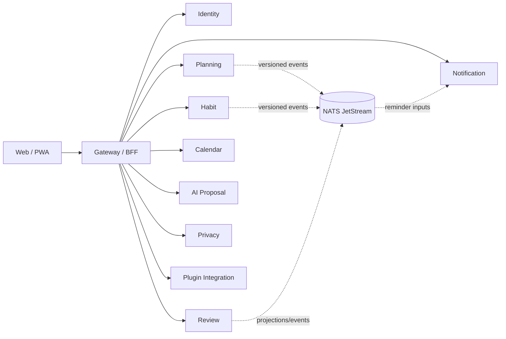

# LifeOS architecture decisions

**Status:** Implemented on active PR

Protected-main `AGENTS.md`, source, migrations, tests, and live repository policy are the executable authority for shipped behavior. This document is the canonical whole-product architecture view. Active pull requests are evidence only until integration.

## 1. Product and deployment boundary

LifeOS is a public, multi-user, server-backed, self-hostable personal operating system. It operates independently and composes with other bounded contexts only through explicit versioned interfaces.

The earlier login-free/browser-only local-first primary design, UUIDv7 internal identifiers, private-personal-only positioning, and single-application durable architecture are **Superseded**. Browser-local state is not durable until the owning service confirms persistence. Offline drafts and Docker Compose remain explicit supported profiles, not alternate sources of durable authority.

### Required invariants

- Internal/public product IDs are opaque UUIDv4; provider IDs are bounded external metadata.
- Product-owned database objects use descriptive multiword `snake_case`.
- Every service owns its persistence, migrations, credentials, runtime composition, tests, observability, and shutdown behavior.
- Services never read or mutate another service's tables directly.
- Cross-service composition uses versioned HTTP, event, saga, plugin, or MCP contracts and never grants SQL authority.
- Public errors, logs, metrics, retained artifacts, and model inputs exclude credentials, hidden reasoning, and unnecessary tenant content.
- AI output is untrusted inert proposal data until an explicit authorized decision; proposal evidence cannot execute its own operations.

## 2. Identity, workspace, and data-rights authority

Identity owns internal user identity, external provider mappings, workspace membership, sessions, authentication provenance, whole-request data-rights identity, and durable aggregate request/receipt evidence. Authentication-ceremony time is distinct from compatible session issuance and rotation.

Protected main includes:

- recent-authentication provenance and policy;
- durable data-rights request and immutable terminal receipt evidence;
- authenticated tenant-and-requesting-user status lookup;
- deterministic contributor export integrity evidence;
- the versioned `life-os.data-rights-contributor.v1` contract from PR #159.

Planning is a protected contributor through PR #179 and its request-bound authenticated transport through PR #194. Habit is a protected contributor through PR #184 and its replay-safe authenticated transport through PR #192. Review contribution is **Implemented on protected main** in PR #195, Notification contribution is **Implemented on active PR** in PR #198, and AI contribution is **Implemented on active PR** in PR #199.

Issue #55 remains **Partial**. Active contributors do not become shipped truth, and even their future integration will not by itself finish Identity-owned data, Calendar, Privacy, Plugin Integration, durable reconciliation, retention/legal-hold/backup-expiry, protected export delivery, or final participant-set completion.

## 3. Planning, Habit, Review, Today, and Notification

Planning owns Goals, Projects, Tasks, search, and the durable Today aggregate. Habit owns recurring definitions and completion evidence. Review owns guided-review persistence/projections without Planning or Habit mutation authority. Notification owns reminder occurrences, claims, delivery attempts, outcomes, and recovery evidence.

Protected main now requires signed tenant authority on Planning through PR #168 and request-bound signatures through PR #188. Habit signed authority is protected through PR #173. Review request-bound signed workspace authority is protected through PR #185.

Gateway Today composition is real protected behavior: PR #186 composes authenticated Planning state and PR #187 composes authenticated Habit state. Issue #163 is completed; the earlier PR #164 fail-closed placeholder removal remains historical safety evidence, not the current end state.

Durable Today uses explicit local-to-workspace acceptance, strong create/update preconditions, idempotency, and stale-conflict reconciliation. No browser draft is presented as durable before server acceptance.

## 4. Calendar integration boundary

Calendar synchronization and user credential lifecycles use different authority contexts.

Protected-main foundations are:

- trusted workspace synchronization context from PR #139;
- workspace-and-user scoped connection persistence from PR #150;
- atomic local revocation from PR #153;
- signed `life-os.calendar-user.v1` workspace-and-user authority from PR #155;
- authenticated local disconnect application/HTTP boundary from PR #157;
- exact returned lookup-evidence validation from PR #176;
- authenticated credential-free connection read lifecycle from PR #189;
- scoped credential materialization port from PR #193;
- authenticated connection creation with secret-first persistence and compensation boundaries from PR #197;
- returned durable create-evidence validation and reverse-order secret compensation from PR #201;
- Calendar-owned AES-256-GCM encrypted self-hosted file credential storage from PR #203, using opaque UUIDv4-backed handles and no plaintext database persistence.

Issue #129 remains **Partial** because protected main still lacks complete Google OAuth state/PKCE/callback, refresh fencing, provider-side revoke/delete recovery, calendar discovery/selection, scoped synchronization composition, end-to-end KMS/runtime composition, and retirement of the process-global development token path. PR #203 protects one concrete self-hosted encrypted store, not the complete provider credential lifecycle. Connection rows store only bounded metadata and opaque secret references; local revocation is not provider credential revocation.

## 5. Plugin integration boundary

A plugin manifest expresses untrusted requested intent. Host-owned authority grants only an explicit bounded tenant/user capability subset.

Protected main includes:

- explicit grant/replay/conflict/revocation authority from PR #151;
- restart-safe PostgreSQL installation persistence from PR #169;
- opaque secret-reference credential binding and compensation from PR #172;
- exact opaque installation evidence validation from PR #175;
- request-bound one-time operator authority and durable replay protection from PR #191;
- fail-closed authenticated operator HTTP composition from PR #196.

PR #205 is **Implemented on active PR** for a host-owned exact HTTPS delivery-origin grant scoped to installation, workspace, granting user, and opaque UUIDv4 grant identity. It does not perform outbound HTTP and does not yet provide durable PostgreSQL grant persistence, connect-time DNS/IP enforcement, redirect/proxy controls, delivery outcomes, retry/dead-letter handling, or operator recovery.

Issue #130 remains **Partial**. Protected main does not yet contain a concrete plugin KMS adapter, host-authorized delivery-origin registry, SSRF/DNS-rebinding-safe outbound HTTPS runtime, delivery attempt/outcome persistence, retry/dead-letter worker, or complete operator-facing delivery lifecycle. Active PR #205 is non-shipped authority evidence only. Manifests and stored installations never self-authorize network capabilities.

## 6. AI proposal boundary

AI may generate, validate, persist, and retrieve inert proposal evidence and append explicit accept/reject decisions. It has no generic Planning mutation repository or command bus. Deterministic schema, authorization, quality, and release gates remain authoritative when model providers are unavailable or disagree.

PR #199 is **Implemented on active PR** for an AI-owned data-rights contributor. Its active migrations and application code are not protected-main truth.

## 7. Privacy authority

Privacy owns purpose-bound sensitive-access decisions, bounded grants, and audit events. Sensitive access binds actor, workspace, purpose, resource/resource class, lifetime, and audit evidence. Blanket masking is not the authorization model.

Whole-right orchestration remains Identity-owned. Every bounded service remains authoritative for its own export and erasure contribution and cannot claim whole-workspace completion independently.

## 8. External identity, secret references, and grants

ADR 0011 is authoritative:

- LifeOS integration identities are internal UUIDv4 values;
- external provider/plugin identifiers remain bounded metadata;
- credential material is separate from metadata and referenced through opaque least-authority handles;
- manifests never self-authorize capabilities;
- revocation, replay, conflict, compensation, and recovery fail closed;
- owning services retain migrations, repositories, and API authority.

The protected Calendar and Plugin Integration lines above are executable evidence of this decision. Neither closes its parent buyer gap, and active PR #205 does not become protected authority until integration.

## 9. Model-assisted development and automation

ADR 0012 is authoritative. A strong single-model route is measured before deeper orchestration. Workflow stage, reasoning effort, decomposition, recursion depth, role-specific reasoning effort, worker/model selection, verifier topology, and access/communication topology are explicit experimental dimensions only when supported by the exact reviewed dependency.

Model-backed development uses reviewed OpenCode or contextual-orchestrator boundaries with GitHub Secret `NVIDIA_NIM_API_KEY`; `COPILOT_GITHUB_TOKEN` is prohibited. Model execution has no product-data authority beyond bounded inputs and no independent review, branch-protection, merge, or release authority. Retained evidence excludes credentials, raw prompts/responses, and hidden reasoning.

PR #200 is **Implemented on protected main** for restoring the exact pinned OpenCode executable by allowing only the reviewed `opencode-ai` lifecycle script. It does not weaken deterministic governance or authorize unrelated dependency scripts.

## 10. Verification identity and merge safety

ADR 0010 keeps these identities separate:

- `source_head_sha`;
- `pr_base_snapshot_sha`;
- independently resolved `live_base_tip_sha`;
- `integration_tree_sha` or separately classified synthetic merge identity;
- `workflow_checkout_sha`;
- `protected_main_sha`;
- `release_source_sha`.

PR #154 is **Implemented on protected main** for exact-source jobs, independently reconstructed live-base compatibility, and explicit AppGuardrail source attribution. Issue #132 remains **Partial** only for central reusable SAST/Security checkout and evidence taxonomy. A green status for one identity never transfers to another.

PR #204 is **Implemented on active PR** for a read-only detector that binds the complete Actions workflow registry to one exact protected-default-branch Git tree and reports active orphan workflow identities. It does not authorize workflow-state mutation and is not passing merge evidence until its exact-head required checks, including a genuine Strix run, pass.

PR #190 protects exact request-bound integration event authority. PR #191 and PR #196 protect the plugin operator request/replay/HTTP line. These product authorities are independent from merge authority.

## 11. Release and recovery boundary

A release is cut from one exact integrated protected head only after applicable CI, security, review, coverage/docstrings, packaging, SBOM/provenance, reproducibility, compatibility, migrations/rollback, backup/restore/recovery, accessibility/localization, and operational acceptance pass together. No feature PR, documentation PR, or model judgment is release evidence by itself.

## 12. Mathematical and psychometric future constraint

LifeOS currently has no psychometric computation service. Future product-owned mathematical or psychometric kernels are Rust-first, use low-context-switch CPU multithreading, add parity-verified GPU paths where material, and prove parameter recovery, uncertainty/coverage, convergence, reproducibility, multilevel/multiple-membership structure, and temporal/repeated-measurement semantics before product claims.

## 13. Canonical documentation graph

The canonical line comprises `AGENTS.md`, this root Architecture, PRD, TRD, ADR index/details, UML/C4 views, logical Data Model, API/event/schema contracts, Security, Threat Model, Privacy/Data Lifecycle, Test Strategy, Operability/recovery, Release/Migration/Rollback/provenance, Standards/Research, Traceability, Documentation Assessment, README, CLAUDE, and CHANGELOG.

Canonical maturity uses only `Implemented on protected main`, `Implemented on active PR`, `Partial`, `Accepted architecture`, `Planned`, `Research only`, `Superseded`, and `Out of scope`. File presence and old green checks do not prove semantic currentness.
