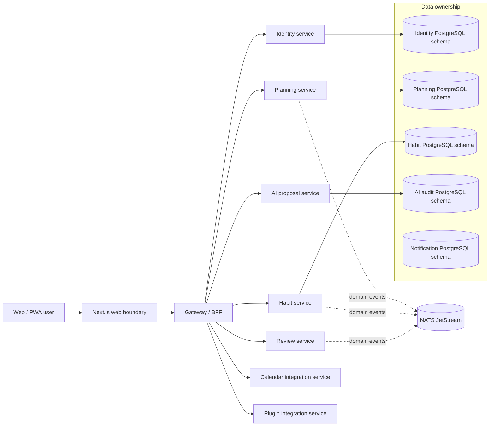
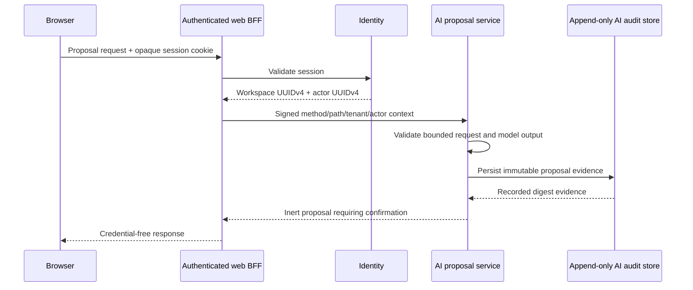
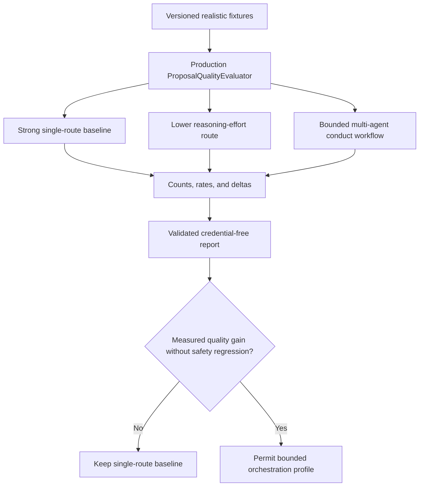

# LifeOS architecture decisions

This document is the architectural source of truth for repository-wide boundaries. Feature-level specifications and runbooks may add detail, but they must not weaken these decisions.

## 1. Product and deployment boundary

LifeOS is a modular, self-hostable personal operating system. Every bounded service must work independently and remain composable inside the monorepo deployment. Services communicate through versioned HTTP/event contracts and never read another service's database tables directly.

### Required invariants

- Internal object identifiers are opaque UUIDv4 strings. Numeric provider identifiers are never reused as internal primary keys.
- Database object names contain at least two words and use `snake_case` unless an external standard requires another form.
- Each service owns migrations, runtime configuration, persistence adapters, tests, and shutdown behavior.
- Cross-service writes require an explicit API, event, saga, or plugin contract; shared-table coupling is prohibited.
- Public errors, metrics, logs, artifacts, and review evidence exclude credentials and unbounded tenant data.

## 2. AI proposal safety boundary

AI output is an inert proposal, not an execution command. The AI service can generate, persist, retrieve, and record explicit decisions about proposals, but it has no planning mutation repository or generic command bus.

The signed private context uses one active HMAC key and at most one previous verification-only key. Key identifiers, method, path, workspace, actor, and issuance time are integrity protected. Browser credentials and provider keys never reach the AI service.

## 3. Test-time compute and live conformance

The deterministic proposal evaluator is authoritative for proposal validity, operation conformance, grounding, benign utility, forbidden-text leakage, and prompt-injection resistance. Live provider execution is governance evidence and is not a pull-request availability gate.

### Compute-allocation rules

- A strong single-model route is always measured first.
- Reasoning effort, workflow stage, decomposition, recursion depth, role, and access topology are explicit test cells rather than hidden defaults.
- Deeper orchestration is justified by measured fixture-level quality or heterogeneous capability coverage, not by agent count.
- Latency and token use are recorded for capacity review but are not the optimization objective.
- Unsupported capabilities remain explicit unavailable cells; tests never fabricate an ablation result.

The hourly live workflow pins `ContextualWisdomLab/contextual-orchestrator` to an exact reviewed commit, installs hash-locked dependencies, seeds only `NVIDIA_NIM_API_KEY` through the encrypted credential bootstrap, executes the pinned checkout on loopback, and retains no prompts, responses, hidden reasoning, credentials, or raw traces.

## 4. Mathematical and psychometric modules

LifeOS currently contains no psychometric computation service. Any future mathematical or psychometric module must follow these additional decisions before it can be treated as production-capable:

- the numerical kernel is implemented in Rust;
- CPU parallelism minimizes context switching and GPU acceleration is available behind a deterministic capability boundary;
- true-parameter recovery, bias, coverage, and RMSE are tested on realistic simulations;
- multilevel and multiple-membership structures are modeled to avoid atomistic inference;
- temporal change, repeated measurement, drift, and state evolution are explicit model dimensions;
- numerical reproducibility, precision, seed control, convergence diagnostics, and fallback behavior are documented;
- statistical assumptions and estimands are cited in APA 7 style.

## 5. Automation and merge safety

Pull requests follow one loop: inspect every review and check, fix root causes, rerun the exact head, resolve addressed threads, and merge only after all required evidence passes. Administrative bypasses are prohibited.

Scheduled model-assisted automation uses `NVIDIA_NIM_API_KEY`; `COPILOT_GITHUB_TOKEN` is prohibited. Existing dedicated review-agent credentials are not repurposed. Deterministic audit and merge eligibility remain independently enforceable even when a model provider is unavailable.

## 6. Documentation hierarchy

1. `AGENTS.md` — repository-wide agent and merge rules.
2. `ARCHITECTURE.md` — durable architectural decisions and diagrams.
3. `CLAUDE.md` — Claude-compatible operational handoff that defers to `AGENTS.md`.
4. `docs/superpowers/specs/` — approved feature designs.
5. `docs/superpowers/plans/` — implementation sequences.
6. `docs/operations/` — operator runbooks and SLOs.
7. `docs/research/` — standards and research rationale with APA 7 references.
8. `CHANGELOG.md` — user-visible unreleased and released changes.

A behavior or boundary change is incomplete until the relevant level is updated and executable tests prove the claim.
