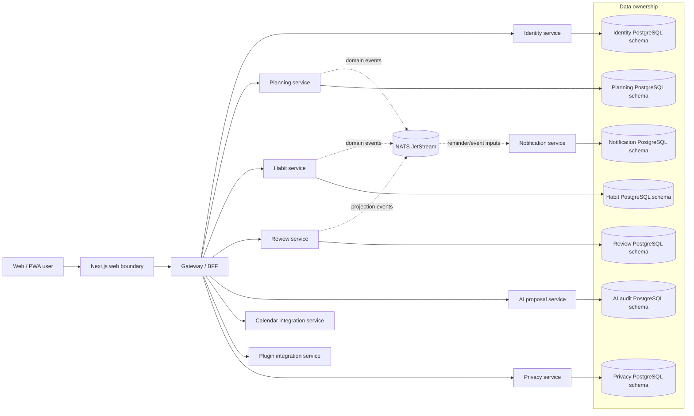
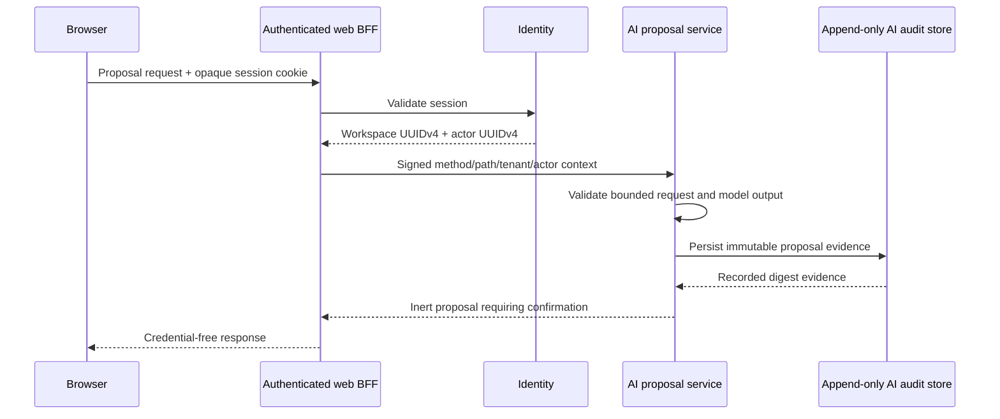
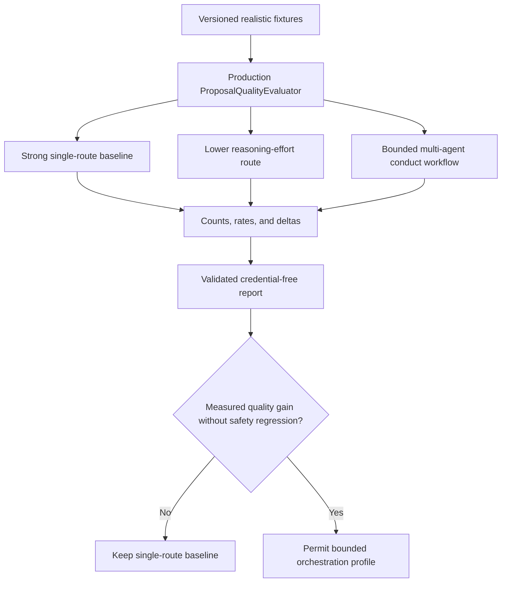

# LifeOS architecture decisions

This document is the architectural source of truth for repository-wide boundaries. Feature-level specifications and runbooks may add detail, but they must not weaken these decisions.

## 1. Product and deployment boundary

LifeOS is a multi-user, server-backed, self-hostable modular personal operating system. Every bounded service must work independently and remain composable inside the monorepo deployment. Services communicate through versioned HTTP/event contracts and never read another service's database tables directly.

Earlier login-free/browser-only local-first, private-personal-only, UUIDv7 and single-application primary designs are historical `Superseded` options. Browser-local drafts and Docker Compose remain valid implementation/deployment techniques but are not durable system-of-record or service-ownership authority.

### Required invariants

- Internal object identifiers are opaque UUIDv4 strings. Numeric/provider identifiers are never reused as internal primary keys.
- Database object names contain at least two descriptive words and use `snake_case` unless an external standard requires another form.
- Each service owns migrations, runtime configuration, persistence adapters, credentials, tests and shutdown behavior.
- Cross-service writes require an explicit API, event, saga or plugin contract; shared-table coupling is prohibited.
- Public errors, metrics, logs, artifacts and review evidence exclude credentials and unbounded tenant data.
- Browser-local state is labeled draft/cache/offline state until an owning service accepts it durably.

## 2. Identity, session, and recent-authentication boundary

Identity service owns LifeOS user identity, external-provider mapping, workspace authorization, browser sessions and authentication provenance. OAuth/session secrets are never entity identifiers.

Session issuance/rotation time and the underlying authentication ceremony time are different facts. Compatible session rotation preserves authentication age; sensitive recent-authentication policies evaluate the authentication instant rather than treating a refreshed session as a new authentication ceremony.

The identity service also owns durable data-rights request identity and terminal receipt evidence. Protected-main receipt rows store bounded opaque authority references, digests/status/timestamps rather than exported personal payloads. Complete cross-domain export/erasure orchestration remains a separate product lifecycle under issue #55.

## 3. AI proposal safety boundary

AI output is an inert proposal, not an execution command. The AI service can generate, persist, retrieve and record explicit decisions about proposals, but it has no planning mutation repository or generic command bus.

The signed private context uses bounded key/method/path/workspace/actor/issuance evidence. Browser credentials and provider keys never reach the AI service.

## 4. Test-time compute and live conformance

The deterministic proposal evaluator is authoritative for proposal validity, operation conformance, grounding, benign utility, forbidden-text leakage and prompt-injection resistance. Live provider execution is governance evidence and is not a pull-request availability substitute.

### Compute-allocation rules

- A strong single-model route is always measured first.
- Reasoning effort, workflow stage, decomposition, recursion depth, role and access topology are explicit test cells rather than hidden defaults.
- Deeper orchestration is justified by measured fixture-level quality or heterogeneous capability coverage, not agent count.
- Latency/token use are capacity evidence but not the correctness objective.
- Unsupported capabilities remain explicit unavailable cells; tests never fabricate ablation results.

The live workflow pins its external model/orchestration dependency to reviewed code, confines credentials to the intended boundary and retains no raw prompts, responses, hidden reasoning or provider credentials.

## 5. Calendar integration boundary

Conflict-safe CalDAV/Google provider adapters are protected-main behavior. A development/operator-supplied process token is not a complete hosted multi-user credential model.

Issue #129 owns encrypted per-user calendar connections, OAuth state/PKCE, refresh/revocation, discovery/selection and migration from the development token. PR #139 is `Implemented on active PR` for the trusted workspace-context prerequisite; the calendar service must not derive tenant authority from an attacker-selected legacy workspace header.

## 6. Plugin integration boundary

Protected main owns versioned plugin manifest/event validation and preparation. It does not imply generic installation, plaintext/durable plugin secret storage, arbitrary commands or unrestricted outbound delivery.

Issue #130 owns the planned runtime trust boundary: explicit installation/capability grants, encrypted secret handles, authorized-origin SSRF-safe delivery, bounded retry/audit and immediate revocation. Plugins never gain direct cross-service database authority.

## 7. Mathematical and psychometric modules

LifeOS currently contains no psychometric computation service. Any future mathematical or psychometric module must follow these additional decisions before production use:

- numerical kernels are implemented in Rust;
- CPU parallelism minimizes context switching and GPU acceleration is behind a deterministic capability boundary where justified;
- true-parameter recovery, bias, coverage and RMSE are tested on realistic simulations;
- multilevel/multiple-membership structures are modeled when applicable;
- temporal change, repeated measurement, drift and state evolution are explicit dimensions when relevant;
- numerical reproducibility, precision, seed control, convergence diagnostics and fallback behavior are documented;
- statistical assumptions/estimands are cited in APA 7 style.

## 8. Automation and merge safety

Pull requests follow one loop: inspect every review/check, fix root causes, rerun exact evidence, resolve addressed threads and merge only after actual required gates pass for the unchanged head and live base relationship. Administrative bypass, fabricated approval and stale success promotion are not valid evidence.

Scheduled model-assisted development uses the reviewed OpenCode/NVIDIA boundary; development models do not receive product data authority, review secrets, Docker-socket authority or merge/release authority. Deterministic audit/merge eligibility remains independently enforceable when providers are unavailable.

The autonomous maintainer is work-conserving: CI/review/provider waits block only their own lane while other non-conflicting safe work continues. Before source writes it revalidates target head/live base/blob/ref and avoids racing another writer.

## 9. Documentation hierarchy

GitHub must reconstruct current LifeOS without historical chat or PR archaeology. The canonical documentation graph is:

1. `docs/PRD.md` — buyer outcomes, users, requirements and exact maturity status.
2. `docs/TRD.md` — repository-wide technical/runtime/security/release requirements.
3. `ARCHITECTURE.md` — durable repository-wide authority and boundaries.
4. `docs/adr/README.md` + ADRs — material decisions, alternatives and supersession.
5. `docs/DATA_MODEL.md` — logical service-owned ERD; migrations remain physical truth.
6. `docs/UML.md` — component/sequence/deployment/failure views.
7. `docs/API_CONTRACTS.md` — API/event ownership, maturity and evolution registry.
8. `SECURITY.md` — vulnerability reporting policy.
9. `docs/THREAT_MODEL.md` — assets, trust boundaries, threats, controls and residual risk.
10. `docs/PRIVACY_DATA_LIFECYCLE.md` — sensitive-data, credential and data-rights lifecycle.
11. `docs/TEST_STRATEGY.md` — deterministic/live evidence and validation strategy.
12. `docs/OPERABILITY.md` — operator/upstream boundaries and incident/recovery guidance.
13. `docs/RELEASE_AND_MIGRATION.md` — release, migration, rollout and rollback gates.
14. `docs/STANDARDS_TRACEABILITY.md` — standards/research evidence classes and references.
15. `docs/TRACEABILITY.md` — requirement -> source/test/issue/PR evidence.
16. `docs/DOCUMENTATION_ASSESSMENT.md` — completeness, historical drift and live gaps.
17. `docs/superpowers/specs/`, `docs/superpowers/plans/`, `docs/operations/`, `docs/research/`, `docs/legal/` — scoped supporting evidence.
18. `CHANGELOG.md` — buyer/operator-visible unreleased/released changes.

Canonical status fields use only `Implemented on protected main`, `Implemented on active PR`, `Partial`, `Accepted architecture`, `Planned`, `Research only`, `Superseded`, or `Out of scope`. A behavior/boundary change is incomplete until the relevant canonical level and executable tests reconcile the claim.