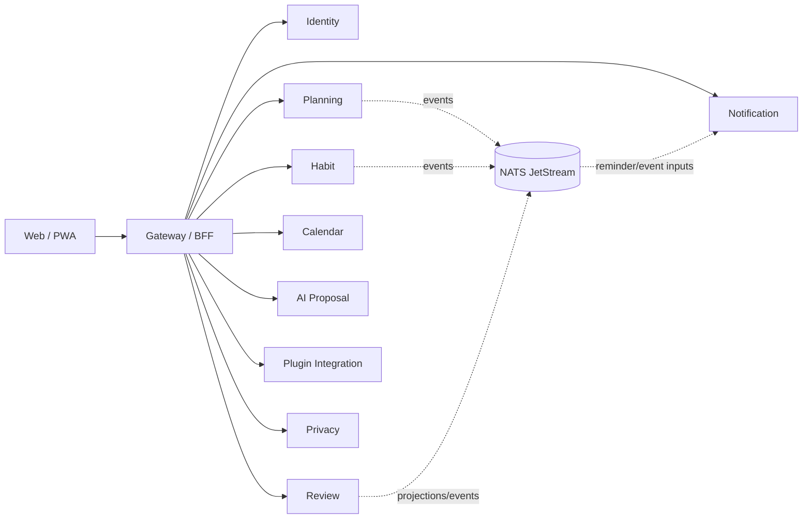

# LifeOS architecture decisions

This document is the architectural source of truth for repository-wide product and service authority. Protected-main source, migrations, tests and live repository policy are executable evidence for shipped behavior. Canonical PRD/TRD/Data Model/UML/Security/Privacy/Operability views add code-current detail without weakening these decisions.

## 1. Product and deployment boundary

LifeOS is a privacy-first, multi-user, server-backed and self-hostable personal operating system. It remains independently usable while composing with other ContextualWisdomLab bounded contexts only through explicit versioned interfaces.

Earlier login-free/browser-only local-first, private-personal-only, UUIDv7 and single-application primary designs are **Superseded**. Browser-local state remains valid as explicit draft/cache/offline state and Docker Compose remains a deployment profile, but neither becomes durable data authority or permission to collapse service ownership.

### Required invariants

- Internal IDs are opaque UUIDv4; provider/native IDs remain explicit external mappings.
- Product-owned DB objects use descriptive multiword `snake_case` unless an external standard mandates otherwise.
- Each service owns persistence, migrations, DB credentials, runtime configuration, tests, observability and shutdown behavior.
- Services never read or mutate another service's tables directly; cross-service relationships use versioned HTTP/event/saga/plugin/MCP contracts.
- Browser-local state is not durable until the owning service confirms persistence.
- Public errors, logs, metrics, retained artifacts and review evidence exclude credentials, hidden reasoning and unnecessary unbounded tenant content.

## 2. Identity, workspace and data-rights authority

Identity owns LifeOS user identity, provider mappings, workspace membership/authorization, sessions, authentication provenance and the durable data-rights request/receipt boundary.

Google/GitHub OAuth transactions are server-owned and replay-resistant. Authentication-ceremony time is distinct from session issuance/rotation; compatible session rotation preserves authentication age so sensitive recent-auth policy cannot be bypassed by refreshing a session.

Protected main includes tenant+requesting-actor scoped request lookup, the authenticated non-cacheable public status resource from PR #146, and export-manifest integrity evidence from PR #149. Export section/whole SHA-256 digests are integrity evidence only, not authorization, confidentiality, provenance or signatures.

Complete cross-domain export/erasure remains **Partial** under #55 because contributor completion, durable reconciliation, protected delivery, retention/legal-hold/backup-expiry and terminal whole-product completion are separate requirements.

## 3. Planning, habits, review and reminders

Planning owns Goals, Projects, Tasks, search and durable Today state. Habit owns recurring definitions/completions. Review owns snapshots/projections without Planning/Habit mutation authority. Notification owns reminder occurrences, claims/fencing, delivery attempts and bounded outcomes.

Durable Today synchronization is protected-main behavior: explicit local-to-workspace save, strong create/update preconditions, idempotency and explicit stale-conflict/reconciliation evidence prevent silent overwrite.

## 4. Calendar integration boundary

Conflict-safe CalDAV/Google sync and signed trusted workspace context are protected main. PR #150 added the service-owned `calendar_integration.calendar_connection_record` persistence foundation scoped simultaneously to workspace and user, with bounded provider/account/calendar metadata, normalized scopes and opaque external credential references. PR #153 added atomic tenant+user-scoped local connection revocation and replay semantics.

PR #155 is **Implemented on protected main** and adds a distinct short-lived signed `life-os.calendar-user.v1` context binding both workspace and requesting-user UUIDv4 identities for user-sensitive hosted operations. It adds authority evidence only, not the public disconnect/runtime composition.

The complete hosted lifecycle remains **Partial** under #129: OAuth state/PKCE, concrete managed secret storage, refresh/provider-side revocation, discovery/selection and migration from development provider configuration are separate gates. Provider IDs/credentials never become LifeOS primary IDs or general login credentials.

## 5. Plugin integration boundary

Protected main owns versioned plugin manifest/event validation and, through PR #151, explicit host-owned installation authority. A validated manifest expresses requested intent; the host grants a bounded tenant-scoped capability subset. Exact replay is permitted only for matching authority evidence, conflicting installation-ID reuse fails, cross-tenant/user existence is not disclosed, and revocation ends active authority while preserving bounded audit evidence.

PR #156 is **Implemented on active PR** for restart-safe plugin installation persistence with application and SQL lookup/revocation authority scoped by installation, workspace and installing user. It does not add secret storage or outbound delivery authority.

Issue #130 remains **Partial** because protected secret handling, authorized-origin SSRF-safe delivery, retry/dead-letter/audit and delivery-time revocation enforcement are not yet the complete protected runtime. Installation authority or persistence does not imply those capabilities exist.

## 6. AI proposal boundary

AI output is untrusted inert proposal data, never an execution command. The AI service may generate/persist/retrieve proposal evidence and append explicit accept/reject decisions, but it has no generic Planning mutation repository or command bus. Deterministic schema, authorization and quality gates remain authoritative when model providers are unavailable.

## 7. Privacy authority

Privacy owns purpose-bound sensitive-access decisions, bounded grants and audit events. Sensitive access binds actor, workspace, resource/resource class, purpose and lifetime. Blanket masking is not the authorization model. Identity owns whole-right request orchestration identity; each bounded service remains authoritative for its own export/erasure contribution.

## 8. External integration identity, secret references and grants

ADR 0011 is authoritative: LifeOS integration records use internal UUIDv4 identity; external provider/plugin identifiers remain bounded metadata; credential material is referenced through opaque secret handles or equivalent least-authority secret-store references; manifests cannot self-authorize capabilities; revocation/replay/conflict semantics fail closed; owning services retain migrations/repositories/API authority.

Protected #150/#151/#153/#155 and active #156 are evidence of this boundary. Their existence does not close parent #129/#130 runtime lifecycles.

## 9. Test-time compute and repository automation

ADR 0012 is authoritative. A strong single-model route is the mandatory comparison baseline before deeper orchestration. Reasoning effort, workflow stage, decomposition, recursion depth, role-specific reasoning effort, model/worker selection, verifier topology and access-list/communication topology are explicit experimental dimensions when the exact reviewed dependency supports them. Unsupported controls remain explicit rather than simulated.

Deeper orchestration is selected only when retained LifeOS evidence demonstrates a material correctness/evidence/capability gain under a documented reasonably comparable budget without unacceptable safety/reliability regression. Latency, provider calls, tokens and cost are measured for capacity/commercial review but are not the sole or primary objective.

Model-backed tests and model-assisted development use reviewed OpenCode or contextual-orchestrator boundaries with GitHub Secret `NVIDIA_NIM_API_KEY`; `COPILOT_GITHUB_TOKEN` is prohibited. Development-model identity receives no product-data authority beyond its bounded input, independent-review authority, branch-protection authority, merge authority or release authority. Retained evidence is credential-free and excludes raw prompts/responses/hidden reasoning. Deterministic authorization, evaluation, CI/security, formal review, merge and release gates remain authoritative when model providers are unavailable or disagree.

## 10. Verification evidence identity and merge safety

Repository evidence identities are distinct:

- `source_head_sha` — exact contributor/source head;
- `pr_base_snapshot_sha` — PR/event base snapshot, historical once base moves;
- `live_base_tip_sha` — independently resolved current base-ref tip;
- `integration_tree_sha` / synthetic merge identity — separately classified integration evidence;
- `workflow_checkout_sha` — exact tree inspected by a job;
- `protected_main_sha` — integrated protected-main evidence;
- `release_source_sha` — protected source bound to released artifacts.

ADR 0010 is authoritative. Exact-source verification and integration compatibility answer different questions. Old PR #147 is **Superseded**. PR #154 is **Implemented on protected main** as merge commit `2c272a404f8f3a74aa5796a1957d4a6ce0fabe8f`: LifeOS source-verification jobs bind to contributor head, AppGuardrail SARIF binds to the analyzed source identity, and the distinct merge-compatibility job reconstructs and verifies an integration tree from the current independently resolved source and live-base identities.

Issue #132 remains open only for residual central reusable scanner classification: central SAST/Security jobs must make the actual checkout/evidence identity auditable and must not relabel synthetic/integration-tree evidence as exact-source evidence. Check names/ruleset strictness are preserved while that taxonomy is made explicit.

Pull requests are processed work-conservingly: inspect current evidence, RCA non-passing gates, make the smallest test-first correction, rerun exact evidence, resolve only addressed findings, and merge only an unchanged head accepted by live repository policy. Waiting on one lane never authorizes stale evidence or repository-wide idle time.

## 11. Mathematical / psychometric future constraint

LifeOS currently contains no psychometric computation service. If future scope introduces mathematical/psychometric computation, production numerical kernels are Rust-first; realistic parameter recovery, uncertainty/coverage, convergence, reproducibility, CPU/GPU parity where applicable, multilevel/multiple-membership structure and temporal/repeated-measurement semantics must be established before product claims. This is a future constraint, not a current capability claim.

## 12. Canonical documentation graph

GitHub must reconstruct LifeOS without chat/old-PR archaeology:

1. `AGENTS.md`
2. `ARCHITECTURE.md`
3. `docs/PRD.md`
4. `docs/TRD.md`
5. `docs/adr/README.md` + ADRs
6. `docs/DATA_MODEL.md`
7. `docs/UML.md`
8. `docs/API_CONTRACTS.md`
9. `SECURITY.md` + `docs/THREAT_MODEL.md`
10. `docs/PRIVACY_DATA_LIFECYCLE.md`
11. `docs/TEST_STRATEGY.md`
12. `docs/OPERABILITY.md`
13. `docs/RELEASE_AND_MIGRATION.md`
14. `docs/STANDARDS_TRACEABILITY.md`
15. `docs/TRACEABILITY.md`
16. `docs/DOCUMENTATION_ASSESSMENT.md`
17. `CLAUDE.md`, `README.md`, `CHANGELOG.md`, scoped specs/plans/runbooks.

Canonical status fields use only `Implemented on protected main`, `Implemented on active PR`, `Partial`, `Accepted architecture`, `Planned`, `Research only`, `Superseded`, or `Out of scope`. File age, presence and historically resolved reviews do not prove semantic currentness. A material authority change is documentation-incomplete until relevant canonical views and executable documentation contracts reconcile it.
