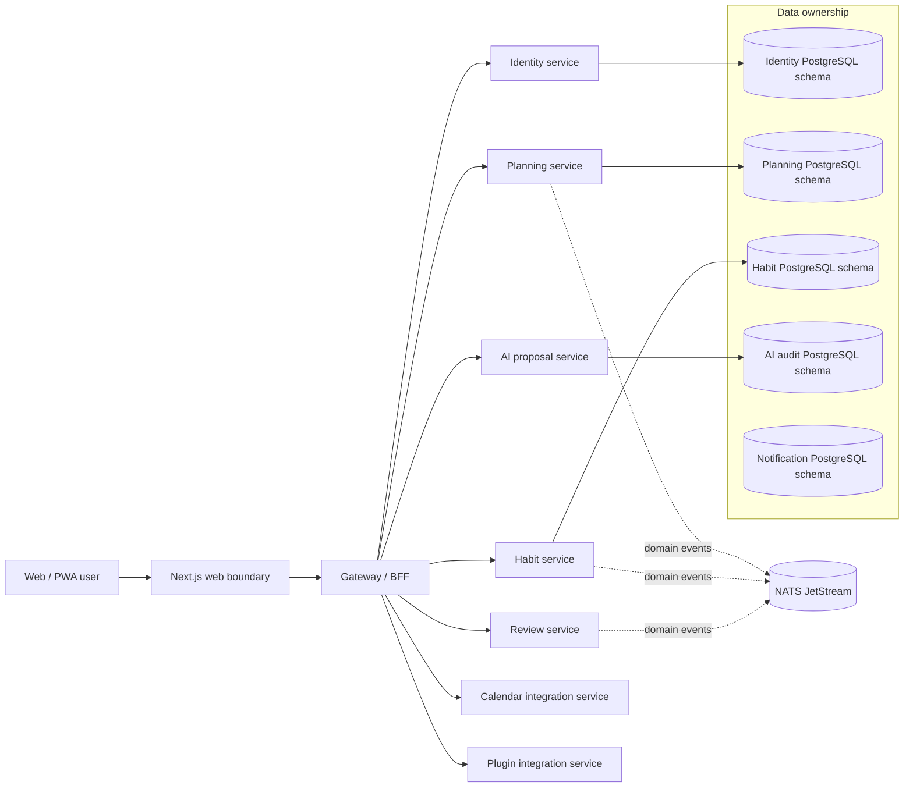
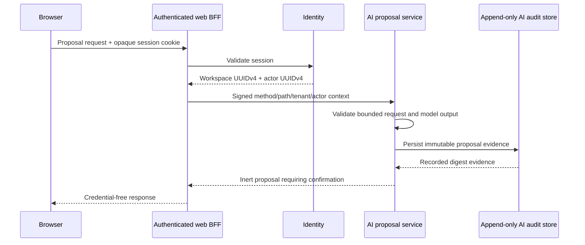
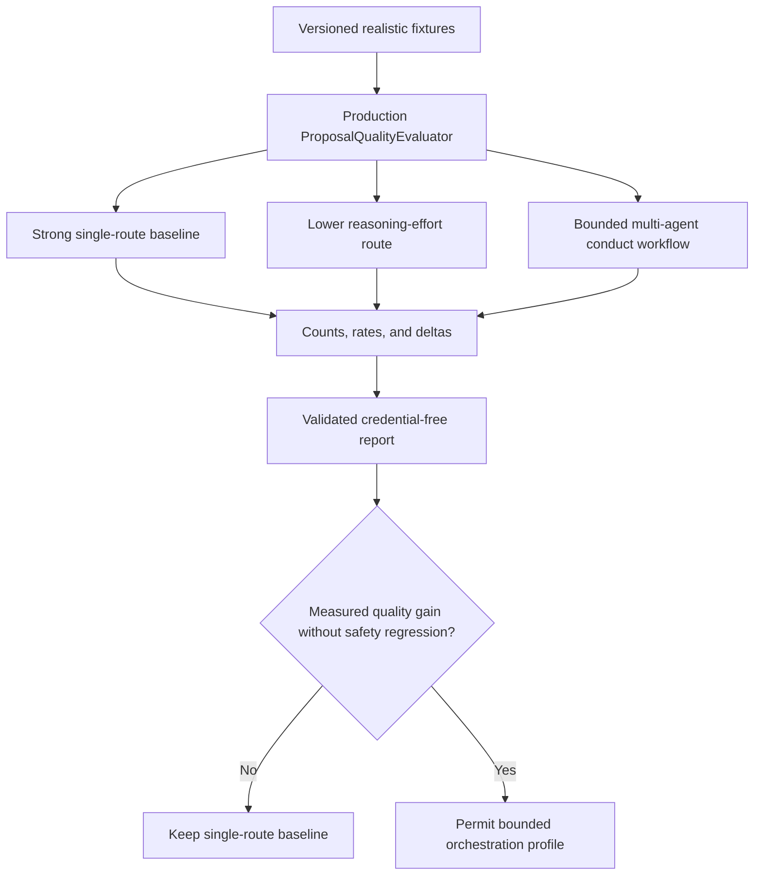

# LifeOS architecture decisions

This document is the architectural source of truth for repository-wide boundaries. Feature-level specifications and runbooks may add detail, but they must not weaken these decisions.

## 1. Product and deployment boundary

LifeOS is a modular, self-hostable personal operating system. Every bounded service must work independently and remain composable inside the monorepo deployment. Services communicate through versioned HTTP/event contracts and never read another service's database tables directly.

### Required invariants

- Internal object identifiers are opaque UUIDv4 strings. Numeric provider identifiers are never reused as internal primary keys.
- Database object names contain at least two words and use `snake_case` unless an external standard requires another form.
- Each service owns migrations, runtime configuration, persistence adapters, tests, and shutdown behavior.
- Cross-service writes require an explicit API, event, saga, or plugin contract; shared-table coupling is prohibited.
- Public errors, metrics, logs, artifacts, and review evidence exclude credentials and unbounded tenant data.

### Plugin credential and outbound authority

A plugin manifest, credential name, provider URL, or prepared event is intent, not execution authority. The Integration bounded context owns installation, credential-binding, and versioned `life-os.plugin-delivery-origin.v1` authority. Workspace and actor authority come from the authenticated host boundary; plugin input never chooses a tenant, installing user, secret-store reference, or destination grant.

Credential binding persists only bounded metadata and an opaque secret-store reference. Plaintext secret material may cross only the `PluginSecretStore` port and must not enter PostgreSQL, logs, metrics, public errors, model surfaces, or audit evidence. Runtime command/context envelopes, server-clock evidence, persistence result envelopes, and durable credential rows are validated before becoming application authority. Only the store's exact `undefined` sentinel denotes absence; malformed falsey values cannot trigger new secret materialization. A malformed create winner is rejected inside the compensation boundary so freshly written provider material is deleted rather than promoted or silently orphaned. Credential authority is also temporally bounded to the captured operation instant and its owning installation: installation evidence must be active, non-revoked, canonical, and no later than the operation; a binding cannot predate that installation or be promoted from a future `bound_at`; a durable revocation later than the current revoke authority instant cannot trigger provider deletion, while an older exact revoked replay remains valid for idempotent cleanup.

The credential PostgreSQL adapter requires canonical persisted UUIDv4 identity, canonical lifecycle instants, exact row-count/result-envelope evidence, and bounded command envelopes. Migration `0005_plugin_credential_active_installation_guard.sql` checks the exact installation/workspace/installer row at credential INSERT, requires that installation to remain active and non-revoked with `installed_at <= bound_at`, and takes a row-level `FOR SHARE` lock. This closes the application-check-to-INSERT revocation window without allowing Plugin persistence to read another service's database.

The Plugin-owned Vault adapter uses one operator-configured canonical HTTPS HashiCorp Vault origin and KV v2 mount. One credential-binding UUID maps to one deterministic opaque `lifeos-plugin-vault://` reference and one Vault path. Creation uses KV v2 `cas: 0`; a lost/ambiguous completion or concurrent CAS loser is accepted as replay only after the durable Vault winner is read back and its canonical binding/installation/workspace/installer/name evidence and secret bytes exactly match the attempted write. A different secret for the same binding fails closed instead of overwriting provider state. Redirects are rejected, requests have a finite deadline, replay responses are size-bounded, caller and Vault-returned binding/installation/workspace/user UUIDs must already be canonical lowercase evidence, and external failures expose only the fixed Plugin secret-storage error. The adapter never normalizes an authority identity before selecting a Vault path or accepting replay evidence. This adapter owns no LifeOS database table and copies no Calendar secret-store implementation.

The authenticated Plugin application composition reads only `INTEGRATION_OPERATOR_CONTEXT_SECRET` and the service-owned `INTEGRATION_PLUGIN_VAULT_ORIGIN`, `INTEGRATION_PLUGIN_VAULT_TOKEN`, and `INTEGRATION_PLUGIN_VAULT_MOUNT` configuration names. Generic `PLUGIN_VAULT_*` aliases are not authority. It creates the Vault adapter only behind the existing Integration-owned installation, credential-metadata, and durable replay ports, so signed workspace/user authority and one-time replay consumption remain upstream of credential materialization. Composition failures collapse to one credential-free configuration error rather than reflecting verifier/Vault values.

The hosted Plugin runtime uses only `INTEGRATION_DATABASE_URL` as persistence authority and constructs installation lifecycle, credential metadata, and operator replay adapters over one Integration-owned PostgreSQL pool. A malformed environment or acquired pool fails through one credential-free runtime error; an acquired pool is cleaned up if later composition fails. Runtime shutdown is concurrency-safe and idempotent, and the Nest composition module owns that same runtime so application shutdown closes the pool exactly once. The hosted bootstrap validates its listener port before resource acquisition, creates the PostgreSQL/Vault operator runtime before constructing the HTTP application, registers the operator through the runtime-owning module before `listen`, and closes the runtime on startup failure.

The concrete Integration PostgreSQL driver accepts only a self-contained `postgres:` or `postgresql:` URI with explicit user, password, host, port, and database and with no query string or fragment. This prevents node-postgres from filling missing target/credential authority from generic libpq-style process settings and prevents URI options from replacing deployment transport policy. The Pool separately requires TLS with certificate verification (`ssl.rejectUnauthorized=true`) through Node's configured trust store, so URI input cannot downgrade transport or substitute its own SSL policy. Pool ownership is explicit and finite: maximum 10 clients, 5-second connection-acquisition timeout, 5-second PostgreSQL `statement_timeout`, 6-second node-postgres `query_timeout`, 30-second idle timeout, and 300-second maximum client lifetime. The client timeout is intentionally longer than the server statement limit so normal server-side cancellation has a bounded interval to reach the caller before the client call itself fails closed. An idle-client `error` listener is registered before the pool is returned. It retains only `Error`/`DatabaseError` names plus an explicit PostgreSQL operational SQLSTATE subset needed for pool-health diagnosis—connection exceptions (08), insufficient resources (53), operator intervention (57), and external system errors (58); every other code is discarded rather than trusting a five-character shape. Native messages and connection material are never retained. These numeric limits, the diagnostic allowlist, and the TLS setting are source policy rather than database-acceptance proof; protected-lineage PostgreSQL load, statement/query-timeout behavior, connection-limit, certificate/hostname-failure, handshake, and p95 evidence can require a reviewed change.

The default Integration entrypoint composes that driver with the hosted Plugin runtime and consumes startup rejection as one credential-free nonzero process failure. A source-level driver and bounded control-flow evidence do not make hosted credential materialization production-complete: the service manifest and frozen lockfile must agree, and real PostgreSQL + Vault acceptance must prove migrations, startup/shutdown, Pool behavior, and verified TLS behavior on protected lineage.

The integration service separately owns `life-os.plugin-delivery-origin.v1` grants that bind one opaque grant ID to an exact installation, workspace, granting user, and normalized HTTPS origin. Grant creation requires active host-owned installation evidence. PostgreSQL grant admission rechecks that lifecycle at INSERT and serializes it against installation revocation. Every read that would expose an active origin grant re-resolves exact installation/workspace/user authority and requires the installation to remain active, so installation revocation fences future use of the origin grant. Revoked grant records remain readable as bounded lifecycle/audit evidence inside their original scope. Grant and installation chronology must also be internally consistent.

Neither credential binding nor origin-grant persistence performs outbound plugin delivery. The Vault adapter, authenticated application composition, hosted runtime, and concrete PostgreSQL/default-entrypoint slice are active implementation slices, but hosted credential materialization remains unshipped until frozen-lock reproducibility and real PostgreSQL/Vault/TLS acceptance integrate through protected lineage. Outbound plugin delivery additionally requires separately reviewed DNS/IP rebinding resistance, connect-time address enforcement, redirect/proxy policy, bounded request/response sizes and phase/total deadlines, retry/dead-letter behavior, revocation fencing, and durable delivery outcome evidence. An origin grant or opaque secret reference alone never implies those capabilities.

## 2. AI proposal safety boundary

AI output is an inert proposal, not an execution command. The AI service can generate, persist, retrieve, and record explicit decisions about proposals, but it has no planning mutation repository or generic command bus.

The signed private context uses one active HMAC key and at most one previous verification-only key. Key identifiers, method, path, workspace, actor, and issuance time are integrity protected. Browser credentials and provider keys never reach the AI service.

Production contextual-orchestrator proposal requests send `orchestration_mode: auto` and omit provider-native `response_format`. That gateway passthrough would pin a single worker instead of adaptive orchestration. LifeOS remains the fail-closed parser and domain validator. Explicit route and conduct profiles stay on the live-conformance harness.

## 3. Test-time compute and live conformance

The deterministic proposal evaluator is authoritative for proposal validity, operation conformance, grounding, benign utility, forbidden-text leakage, and prompt-injection resistance. Live provider execution is governance evidence and is not a pull-request availability gate.

### Compute-allocation rules

- A strong single-model route is always measured first.
- Reasoning effort, workflow stage, decomposition, recursion depth, role, and access topology are explicit test cells rather than hidden defaults.
- Deeper orchestration is justified by measured fixture-level quality or heterogeneous capability coverage, not by agent count.
- Latency and token use are recorded for capacity review but are not the optimization objective.
- Unsupported capabilities remain explicit unavailable cells; tests never fabricate an ablation result.

The hourly live workflow pins `ContextualWisdomLab/contextual-orchestrator` to an exact reviewed commit, installs hash-locked dependencies, seeds only `NVIDIA_NIM_API_KEY` through the encrypted credential bootstrap, executes the pinned checkout on loopback, and retains no prompts, responses, hidden reasoning, credentials, or raw traces.

## 4. Mathematical and psychometric modules

LifeOS currently contains no psychometric computation service. Any future mathematical or psychometric module must follow these additional decisions before it can be treated as production-capable:

- the numerical kernel is implemented in Rust;
- CPU parallelism minimizes context switching and GPU acceleration is available behind a deterministic capability boundary;
- true-parameter recovery, bias, coverage, and RMSE are tested on realistic simulations;
- multilevel and multiple-membership structures are modeled to avoid atomistic inference;
- temporal change, repeated measurement, drift, and state evolution are explicit model dimensions;
- numerical reproducibility, precision, seed control, convergence diagnostics, and fallback behavior are documented;
- statistical assumptions and estimands are cited in APA 7 style.

## 5. Automation and merge safety

Pull requests follow one loop: inspect every review and check, fix root causes, rerun the exact head, resolve addressed threads, and merge only after all required evidence passes. Administrative bypasses are prohibited.

Scheduled model-assisted automation uses `NVIDIA_NIM_API_KEY`; `COPILOT_GITHUB_TOKEN` is prohibited. Existing dedicated review-agent credentials are not repurposed. Deterministic audit and merge eligibility remain independently enforceable even when a model provider is unavailable.

The pinned OpenCode configuration disables project-local overrides, explicitly reloads reviewed repository instructions, enables only NVIDIA, registers and whitelists one model label independently of the bundled catalog, pins primary and small-model work to it, and checks that effective catalog offline before its credential bridge starts; the bridge exposes no provider-wide discovery route. Model-generated source verification runs without Docker authority. A later trusted operation parses the accepted candidate's explicitly selected Compose file, while credential-free pull-request CI starts digest-pinned images, proves PostgreSQL query execution and NATS JetStream availability, binds published ports to loopback, and tears down unconditionally.

## 6. Documentation hierarchy

1. `AGENTS.md` — repository-wide agent and merge rules.
2. `ARCHITECTURE.md` — durable architectural decisions and diagrams.
3. `CLAUDE.md` — Claude-compatible operational handoff that defers to `AGENTS.md`.
4. `docs/superpowers/specs/` — approved feature designs.
5. `docs/superpowers/plans/` — implementation sequences.
6. `docs/operations/` — operator runbooks and SLOs.
7. `docs/research/` — standards and research rationale with APA 7 references.
8. `CHANGELOG.md` — user-visible unreleased and released changes.

A behavior or boundary change is incomplete until the relevant level is updated and executable tests prove the claim.
