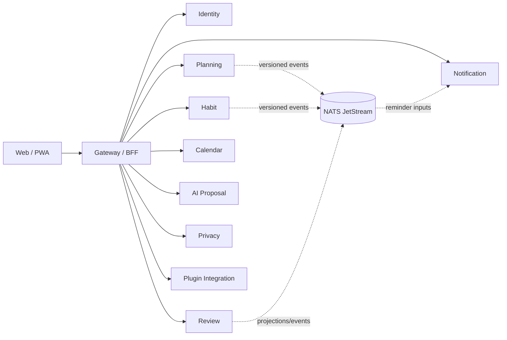

# LifeOS architecture decisions

**Status:** Implemented on active PR

Protected-main `AGENTS.md`, source, migrations, tests, and live repository policy are the executable authority for shipped behavior. This document is the canonical whole-product architecture view. Active pull requests are evidence only until integration.

## 1. Product and deployment boundary

LifeOS is a public, multi-user, server-backed, self-hostable personal operating system. It operates independently and composes with other bounded contexts only through explicit versioned interfaces.

The earlier login-free/browser-only local-first primary design, UUIDv7 internal identifiers, private-personal-only positioning, and single-application durable architecture are **Superseded**. Browser-local state is not durable until the owning service confirms persistence. Offline drafts and Docker Compose remain explicit supported profiles, not alternate sources of durable authority.

### Required invariants

- Internal/public product IDs are opaque UUIDv4; provider IDs are bounded external metadata.
- Product-owned database objects use descriptive multiword `snake_case`.
- Every service owns its persistence, migrations, credentials, runtime composition, tests, observability, and shutdown behavior.
- Services never read or mutate another service's tables directly.
- Cross-service composition uses versioned HTTP, event, saga, plugin, or MCP contracts and never grants SQL authority.
- Public errors, logs, metrics, retained artifacts, and model inputs exclude credentials, hidden reasoning, and unnecessary tenant content.
- AI output is untrusted inert proposal data until an explicit authorized decision; proposal evidence cannot execute its own operations.

## 2. Identity, workspace, and data-rights authority

Identity owns internal user identity, external provider mappings, workspace membership, sessions, authentication provenance, whole-request data-rights identity, and durable aggregate request/receipt evidence. Authentication-ceremony time is distinct from compatible session issuance and rotation.

Protected main includes:

- recent-authentication provenance and policy;
- durable data-rights request and immutable terminal receipt evidence;
- authenticated tenant-and-requesting-user status lookup;
- deterministic contributor export integrity evidence;
- the versioned `life-os.data-rights-contributor.v1` contract from PR #159.

Planning is a protected contributor through PR #179 and its request-bound authenticated transport through PR #194. Habit is a protected contributor through PR #184 and its replay-safe authenticated transport through PR #192. Review contribution is **Implemented on protected main** in PR #195, Notification contribution is **Implemented on active PR** in PR #198, and AI contribution is **Implemented on active PR** in PR #199.

Issue #55 remains **Partial**. Active contributors do not become shipped truth, and even their future integration will not by itself finish Identity-owned data, Calendar, Privacy, Plugin Integration, durable reconciliation, retention/legal-hold/backup-expiry, protected export delivery, or final participant-set completion.

## 3. Planning, Habit, Review, Today, Notification, and first-party journey

Planning owns Goals, Projects, Tasks, search, and the durable Today aggregate. Habit owns recurring definitions and completion evidence. Review owns guided-review persistence/projections without Planning or Habit mutation authority. Notification owns reminder occurrences, claims, delivery attempts, outcomes, and recovery evidence.

Protected main now requires signed tenant authority on Planning through PR #168 and request-bound signatures through PR #188. Habit signed authority is protected through PR #173. Review request-bound signed workspace authority is protected through PR #185.

Gateway Today composition is real protected behavior: PR #186 composes authenticated Planning state and PR #187 composes authenticated Habit state. Issue #163 is completed; the earlier PR #164 fail-closed placeholder removal remains historical safety evidence, not the current end state.

Durable Today synchronization is protected-main behavior. Durable Today uses explicit local-to-workspace acceptance, strong create/update preconditions, idempotency, and stale-conflict reconciliation. No browser draft is presented as durable before server acceptance.

Issue #209 is **Partial** for the complete first-party buyer journey. The current Draft stack starts at PR #214 with an authenticated Goal BFF that keeps Identity-derived workspace authority and exact Planning request signing server-side. Descendants add the remaining BFF prerequisites and buyer-visible workspaces; PR #229 is the durable `/goals` workspace and PR #234 is the current stacked `/review` workspace with persistence-aligned ritual-period uniqueness. These pages consume validated server-authoritative evidence and do not move Planning/Review persistence or workspace authority into the browser.

The active journey remains incomplete until the dependency-ordered Goals → Projects → Tasks → Habits → Review flow has current-head browser E2E and exact repository gates after final restack, Figma/Storybook traceability, normal/loading/empty/error/permission/responsive/interaction states, keyboard/focus/reduced-motion/a11y acceptance, authoritative Review read projections, and KO/EN/JA/ZH/VI/ES/DE/FR translation-ledger/font/text-expansion parity. Active browser work is not protected product truth and does not close #209.

## 4. Calendar integration boundary

Calendar synchronization and user credential lifecycles use different authority contexts.

Protected-main foundations are:

- trusted workspace synchronization context from PR #139;
- workspace-and-user scoped connection persistence from PR #150;
- atomic local revocation from PR #153;
- signed `life-os.calendar-user.v1` workspace-and-user authority from PR #155;
- authenticated local disconnect application/HTTP boundary from PR #157;
- exact returned lookup-evidence validation from PR #176;
- authenticated credential-free connection read lifecycle from PR #189;
- scoped credential materialization port from PR #193;
- authenticated connection creation with secret-first persistence and compensation boundaries from PR #197;
- returned durable create-evidence validation and reverse-order secret compensation from PR #201;
- Calendar-owned AES-256-GCM encrypted self-hosted file credential storage from PR #203, using opaque UUIDv4-backed handles and no plaintext database persistence.

PR #150 added workspace-and-user scoped connection persistence with opaque secret references. PR #153 added atomic local connection revocation; neither grants provider-side credential revocation authority.

The current active Calendar stack advances this boundary without changing shipped truth. PR #216 rejects deployment-wide Google and CalDAV credentials from the hosted multi-user runtime until authenticated user-owned connection evidence and scoped secret materialization are composed. Stacked PR #228 adds five-minute Google OAuth authorization-state/PKCE authority with opaque durable state and secret-store-held verifier material, including hostile consumed-row validation before verifier materialization. Both remain Draft active-PR evidence.

Issue #129 remains **Partial** because protected main still lacks complete hosted Google OAuth callback/token exchange, successful verifier cleanup after exchange, concrete PostgreSQL OAuth-state persistence, refresh fencing, provider-side revoke/delete recovery, calendar discovery/selection, scoped synchronization composition, end-to-end KMS/runtime composition, and retirement of process-global development credentials. PR #203 protects one concrete self-hosted encrypted store; PR #216/#228 do not become protected authority until normal integration. Connection rows store only bounded metadata and opaque secret references; local revocation is not provider credential revocation.

## 5. Plugin integration boundary

A plugin manifest expresses untrusted requested intent. Host-owned authority grants only an explicit bounded tenant/user capability subset.

Protected main includes:

- explicit grant/replay/conflict/revocation authority from PR #151;
- restart-safe PostgreSQL installation persistence from PR #169;
- opaque secret-reference credential binding and compensation from PR #172;
- exact opaque installation evidence validation from PR #175;
- request-bound one-time operator authority and durable replay protection from PR #191;
- fail-closed authenticated operator HTTP composition from PR #196.

The active #130 stack is deeper than protected main and remains explicitly non-shipped. PR #205 defines host-owned exact HTTPS delivery-origin authority. PR #235 adds Integration-owned PostgreSQL grant persistence and active-installation fencing. PR #241 hardens credential authority and concurrent revocation admission. PR #242 adds an operator-configured Vault KV v2 secret-store adapter that keeps provider plaintext and Vault credentials out of durable LifeOS metadata. PR #243 composes authenticated Vault operator authority, PR #244 composes the hosted Integration runtime over one service-owned PostgreSQL pool, and PR #245 adds the concrete PostgreSQL/default-entrypoint runtime. A hosted acceptance run on an exact #245 ancestor exercised real Vault KV v2 plus migrated Integration-owned PostgreSQL across installation, credential creation and exact replay, installation-revocation fencing, runtime restart, credential revocation, and idempotent cleanup; that retained ancestor evidence is not current-head merge authority.

Draft PR #250 is stacked on #245 and composes the existing delivery-origin aggregate/store through exact signed one-time operator grant/read/revoke authority. It deliberately stops before HTTP delivery-origin transport and outbound networking.

Draft PR #251 is stacked exactly on #250 and retains the signed delivery-origin HTTP grant/read/revoke transport at `5641005c5ed0193b6206848f9c4c807050271ef7` without adding outbound HTTPS. Hosted verifier run `34186936889`, job `101937064591`, first proved the exact #250 parent lacks the routes and then proved the pre-repair percent-encoded raw-route/HMAC canonicalization defect. The minimum transport repair compares the server-observed raw method and URL byte-for-byte with each canonical signed plugin-operator route before decoded parameters can reach durable authority. Focused real-HTTP GREEN passed 2 files / 4 tests, Integration typecheck passed, and the complete Integration suite passed 59 files / 376 tests with 5 files / 17 environment-dependent tests skipped. The successful run ordinary-pushed the retained repair and removed only its purpose-complete verifier. This is active-PR evidence only: it is neither protected-main shipped truth nor independent review/security merge authority.

Draft PR #252 proceeds in parallel from #245 and establishes Integration-owned durable delivery-attempt admission without depending on mutable #250/#251 transport. It introduces opaque `life-os.plugin-delivery-attempt.v1` work identity plus service-owned PostgreSQL migration/store, exact idempotency scope, bounded retry budget metadata, and a durable INSERT-time fence requiring both the exact active origin grant and active installation under matching workspace/user authority. The table intentionally stores no origin copy, credential, request payload, response body, or network authorization. Exact review-repair proof head `9e6e88e49e14d0b2d247e747df968e2494697666` completed hosted run `34209314512`, job `102006262067`, GREEN on Ubuntu 24.04/PostgreSQL 16 after replaying the timestamp, PostgreSQL/TLS target, IPv6 loopback and table-contract RED ancestors for their intended reasons. A subsequent repository-boundary review found that SQL result envelopes, durable row getters and stored timestamp conversion could throw native dependency detail before the fixed persistence-evidence boundary. Reality RED `b390f37ed651ce2d9cb74d862fbae02641f3a55f` demonstrates that hostile evidence leak; minimum repair `e9a8b212b24b4914069a48a113d118ff4e4c0a56` snapshots and bounds those evidence reads without changing SQL/schema/admission authority. Exact proof head `ec2353a003c15c9f464b5d5d2454d3593427d768`, run `34213508199`, job `102019765395`, completed GREEN with the focused delivery-attempt suite 24/24, Integration typecheck and the complete Integration suite 403 passed / 3 environment-dependent skipped across 65 files. CHANGELOG descendant `fe51a79c1e19cc7fb14e5296f04b3f91b41bf535` also completed exact run `34213937828` / job `102021136219` GREEN. Current #252 head `9ed7847d3106d9418e1ff6e04e45c1c7d84d0b0d` removes only the purpose-complete hostile-SQL verifier. This remains active-PR evidence, not protected shipped truth.

Draft PR #253 is the direct child of #252 and establishes deterministic Integration-owned delivery-attempt claim/lease authority without adding provider execution or outbound HTTPS. `life-os.plugin-delivery-attempt-claim.v1` returns an opaque UUIDv4 claim token only to the worker while persistence retains only its SHA-256 digest, exact claim start/expiry evidence and the atomic retry-budget transition. Application and repository validation bound a lease to 30–3600 seconds. A durable-bound review found migration `0007_plugin_delivery_attempt_claim_lease.sql` did not yet enforce the same lower/upper bounds: regression `32c02f3ca2ead7617b08d35973d518b25ed4f691`, isolated at reality-RED `400e88163ca9d878806aaee11ef8ca2917ec33dc`, demonstrated real migrated PostgreSQL accepting 29.999-second and 3600.001-second leases. Minimum repair `e25a96d902adc6d6a6422ca4bc114c5bf189f47f` adds the same inclusive 30–3600 second database invariant. Its later hostile-envelope and application-context repairs retain fixed credential-free failure boundaries. Current #253 exact `8252575a510254883cb62c44198cb665daa0d0b5` removes only completed/exploratory verifier work after the retained exact GREEN lineage. This is active-PR evidence only and does not move network authority into LifeOS.

Draft PR #254 is the direct #253 child and adds Integration-owned claim-bound retry/backoff without provider execution or outbound HTTPS. Migration `0008_plugin_delivery_attempt_retry_transition.sql` preserves row-owned retry budgets and finite claim leases while admitting only explicit admission, active-claim, scheduled-retry and terminal-exhaustion shapes. Exact proof head `ca22c71e4f2ec11de6539df79632376d4134f90a`, run `34237354956`, job `102098403313`, completed GREEN on Ubuntu 24.04/PostgreSQL 16 across frozen install, formatting/diff hygiene, Plugin SDK build, focused retry acceptance, real PostgreSQL retry/exhaustion acceptance, Integration typecheck and the complete Integration suite. Current #254 exact `edc79d1291025b8787a9ccf16c39a10df4157023` removes only the purpose verifier and remains Draft/unshipped.

Draft PR #255 is the direct #254 child and owns append-only sanitized retry/exhaustion outcome evidence. Migration `0009_plugin_delivery_attempt_outcome_record.sql` keeps provider payloads, response bodies, credentials, origin URI and network authority out of the ledger. Its retained PostgreSQL lineage repairs missing-table admission, claim binding, direct forged INSERT, and UPDATE/DELETE/TRUNCATE immutability. Current #255 exact `e201b649cdea7d50ee2b856ac98a01d2b6c1368e` removes only its purpose verifier and remains active-PR evidence rather than protected shipped truth.

Draft PR #256 is the direct #255 child and owns Integration-controlled pause/resume/dead-letter transitions plus a source-bound append-only `life-os.plugin-delivery-attempt-control.v1` evidence ledger. Pause cannot steal an active worker claim; resume retains retry identity; dead-letter is admitted only after real durable `attempt_limit` exhaustion and preserves the terminal instant. Direct forged inserts and UPDATE/DELETE/TRUNCATE mutation of accepted control evidence fail closed. Initial real-PostgreSQL durable-control RED `5d50c56ae714b7ca620f3c4b790002bcdf83aa8d` / run `34255006068` / job `102158492416` established the missing lifecycle; repaired exact `a576d3fd85e1f1d0845ed10200d1849b04c8f1b2` / run `34256983815` / job `102165175608` completed GREEN across focused control acceptance, Integration typecheck and the complete Integration suite.

Fresh review found that `control_sequence` could advance while the accepted control timestamp moved backward, producing durable sequence evidence with contradictory chronology. Real PostgreSQL RED `8f25181033b44d89dd08ed965d8d258410629e58` / run `34261784625` / job `102181270911` failed specifically at the backdated-resume regression after environment setup, frozen install, formatting/diff hygiene and Plugin SDK build passed. Forward migration `0011_plugin_delivery_attempt_control_chronology_guard.sql` adds only the missing non-decreasing `NEW.updated_at >= OLD.updated_at` transition invariant. Exact proof `c98734fcf50bfc197141aed6469fcf1e0adffcd6` / run `34261947610` / job `102181894242` completed GREEN across the real chronology regression, Integration typecheck and the complete Integration suite. Current #256 exact `0c6221e1fe32bf6594784219a7bd710ad0c1a993` removes only the purpose-complete chronology verifier.

Issue #130 remains **Partial**. Protected main does not yet contain the Vault/PostgreSQL/delivery-origin/delivery-attempt active stack. #252 establishes durable admission, #253 deterministic finite worker claim/lease, #254 claim-bound bounded retry/backoff, #255 append-only sanitized outcome evidence, and #256 durable pause/resume/dead-letter control evidence with non-decreasing chronology. The next LifeOS-owned execution boundary is a per-attempt revocation fence immediately before execution, followed by operator-visible status, restart/recovery and bounded provider execution. No active LifeOS PR supplies complete host-authorized outbound HTTPS. Outbound authority must come only from an immutable released/versioned canonical egress contract; otherwise the network boundary remains fail closed. Durable origin/delivery/claim/retry/outcome/control identity is not network authorization.

## 6. AI proposal boundary

AI may generate, validate, persist, and retrieve inert proposal evidence and append explicit accept/reject decisions. It has no generic Planning mutation repository or command bus. Deterministic schema, authorization, quality, and release gates remain authoritative when model providers are unavailable or disagree.

PR #199 is **Implemented on active PR** for an AI-owned data-rights contributor. Its active migrations and application code are not protected-main truth.

## 7. Privacy authority

Privacy owns purpose-bound sensitive-access decisions, bounded grants, and audit events. Sensitive access binds actor, workspace, purpose, resource/resource class, lifetime, and audit evidence. Blanket masking is not the authorization model.

Whole-right orchestration remains Identity-owned. Every bounded service remains authoritative for its own export and erasure contribution and cannot claim whole-workspace completion independently.

## 8. External identity, secret references, and grants

ADR 0011 is authoritative:

- LifeOS integration identities are internal UUIDv4 values;
- external provider/plugin identifiers remain bounded metadata;
- credential material is separate from metadata and referenced through opaque least-authority handles;
- manifests never self-authorize capabilities;
- revocation, replay, conflict, compensation, and recovery fail closed;
- owning services retain migrations, repositories, and API authority.

The protected Calendar and Plugin Integration lines above are executable evidence of this decision. Their active successors are evidence only until integration and do not close their parent buyer gaps.

## 9. Model-assisted development and automation

ADR 0012 is authoritative. A strong single-model route is measured before deeper orchestration. Workflow stage, reasoning effort, decomposition, recursion depth, role-specific reasoning effort, worker/model selection, verifier topology, and access/communication topology are explicit experimental dimensions only when supported by the exact reviewed dependency.

Protected main includes PR #200's exact pinned OpenCode executable bootstrap hardening; that historical line does not authorize direct provider selection as the target model-routing architecture. Current active PR #208 routes scheduled model-assisted work through contextual-orchestrator and virtual `orchestrator/free`, while preserving exact OpenCode identity verification. It remains Draft because the required contextual-orchestrator authentication/bootstrap contract and immutable reviewed upstream release are not yet available to LifeOS. LifeOS does not copy mutable upstream source or convert provider credentials into direct model-selection authority.

Model execution has no product-data authority beyond bounded inputs and no independent review, branch-protection, merge, or release authority. Retained evidence excludes credentials, raw prompts/responses, and hidden reasoning. Unsupported gateway capability fails closed and is repaired in the canonical owner rather than bypassed in LifeOS.

## 10. Verification identity and merge safety

ADR 0010 keeps these identities separate:

- `source_head_sha`;
- `pr_base_snapshot_sha`;
- independently resolved `live_base_tip_sha`;
- `integration_tree_sha` or separately classified synthetic merge identity;
- `workflow_checkout_sha`;
- `protected_main_sha`;
- `release_source_sha`.

PR #154 is **Implemented on protected main** for exact-source jobs, independently reconstructed live-base compatibility, and explicit AppGuardrail source attribution. Issue #132 remains **Partial** only for central reusable SAST/Security checkout and evidence taxonomy. A green status for one identity never transfers to another.

Old PR #147 is **Superseded** as verification authority; the protected PR #154 identity model above is the current canonical line.

PR #204 is **Implemented on active PR** for a read-only detector that binds the complete Actions workflow registry to one exact protected-default-branch Git tree and reports active orphan workflow identities. It does not authorize workflow-state mutation and is not passing merge evidence until its exact-head required checks pass.

PR #190 protects exact request-bound integration event authority. PR #191 and PR #196 protect the plugin operator request/replay/HTTP line. These product authorities are independent from merge authority.

## 11. Release and recovery boundary

A release is cut from one exact integrated protected head only after applicable CI, security, review, coverage/docstrings, packaging, SBOM/provenance, reproducibility, compatibility, migrations/rollback, backup/restore/recovery, accessibility/localization, and operational acceptance pass together. No feature PR, documentation PR, or model judgment is release evidence by itself.

Issue #210 remains **Partial**. Draft PR #217 adds a machine-readable exact release-evidence index with fail-closed structural validation, including artifact/checksum/provenance/signature coverage and nightly identity constraints. Stacked Draft #236 adds detached Ed25519 signature verification and a bounded operator CLI. Neither publishes an immutable release, distributes trust roots, completes key rotation/revocation/custody, or transfers ancestor checks into current release authority.

## 12. Mathematical and psychometric future constraint

LifeOS currently has no psychometric computation service. Future product-owned mathematical or psychometric kernels are Rust-first, use low-context-switch CPU multithreading, add parity-verified GPU paths where material, and prove parameter recovery, uncertainty/coverage, convergence, reproducibility, multilevel/multiple-membership structure, and temporal/repeated-measurement semantics before product claims.

## 13. Canonical documentation graph

The canonical line comprises `AGENTS.md`, this root Architecture, PRD, TRD, ADR index/details, UML/C4 views, logical Data Model, API/event/schema contracts, Security, Threat Model, Privacy/Data Lifecycle, Test Strategy, Operability/recovery, Release/Migration/Rollback/provenance, Standards/Research, Traceability, Documentation Assessment, README, CLAUDE, and CHANGELOG.

Canonical maturity uses only `Implemented on protected main`, `Implemented on active PR`, `Partial`, `Accepted architecture`, `Planned`, `Research only`, `Superseded`, and `Out of scope`. File presence and old green checks do not prove semantic currentness.