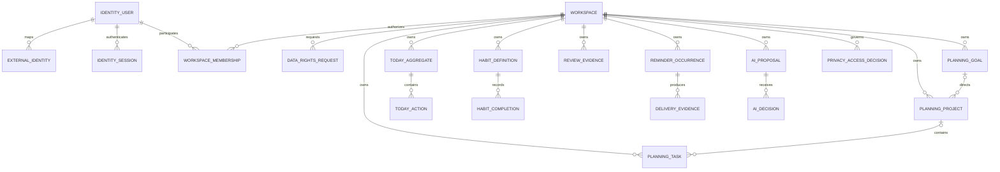
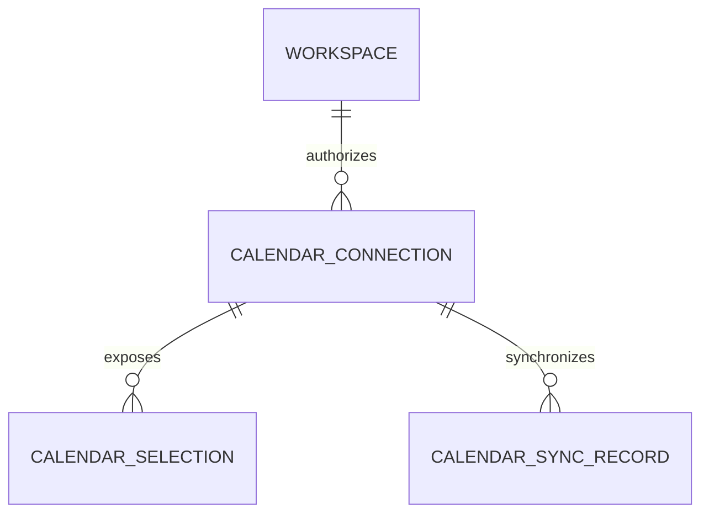
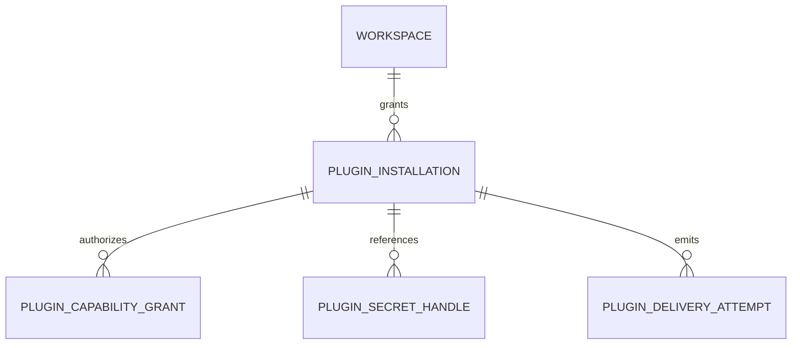

# LifeOS Logical Data Model and ERD

**Status:** Accepted architecture  
**Baseline:** protected `main` at `dcc787f77b708cecda054b47d6f7d7b561575a67`

## 1. Authority

This is a logical cross-service data model. Physical tables, columns, constraints and indexes are authoritative in each owning service's migrations. Cross-service relationships drawn here do **not** authorize SQL joins or mutation across service schemas.

## 2. Ownership map

| Bounded context | Durable authority | Representative evidence |
| --- | --- | --- |
| Identity | users, external identities, sessions, workspace authority, authentication provenance, data-rights request ledger | `apps/identity-service/migrations/` including `0006_data_rights_request_ledger.sql` |
| Planning | goals, projects, tasks, durable Today aggregate | planning migrations including `0003_durable_today_sync.sql` |
| Habit | habit definitions/completions | habit migrations/tests |
| Review | review completion/projection evidence | review migrations/tests |
| Notification | reminder occurrences/claims/delivery evidence | notification migrations/tests |
| AI | proposal/audit/decision evidence | AI proposal-audit migration/tests |
| Privacy | purpose-bound decisions/grants/events | privacy migration/tests |
| Calendar integration | provider synchronization state | provider code/tests; per-user credential persistence remains #129 |
| Plugin integration | validated contract state; future installation/runtime state | runtime persistence remains #130 |

## 3. Logical ERD

## 4. Identity and data rights

Internal IDs are UUIDv4. Provider IDs are explicit mappings only. Identity keeps authentication ceremony time separate from session issuance/rotation.

`identity.data_rights_requests` stores bounded request/receipt identity, digests, state and timestamps, not exported personal payloads. Protected main includes request creation/replay/conflict/immutable terminal receipt semantics and tenant/requester-scoped lookup. Complete cross-domain contributors and delivery remain issue #55.

## 5. Planning and Today

Protected main owns durable goals/projects/tasks plus a workspace/local-date Today aggregate. Today state uses UUIDv4 aggregate/action/revision/idempotency identities and explicit concurrency/replay semantics. Browser-local Today data is not durable until the explicit save succeeds.

## 6. Calendar target model

`CALENDAR_CONNECTION` and encrypted credential persistence are `Partial`/target logical entities for issue #129. Trusted workspace context is already protected-main behavior; do not draw the remaining credential lifecycle as a shipped physical table until migration evidence exists.

## 7. Plugin runtime target model

These are `Planned` logical entities under issue #130, not current protected-main persistence.

## 8. Naming and time

- Product-owned DB objects use descriptive multiword `snake_case` names.
- Persist instants in UTC and retain IANA/local-date semantics where civil time matters.
- Cross-service IDs are logical references, not hidden foreign-key authority.

## 9. Change rule

A material migration updates this logical model only after exact source evidence exists and must reconcile PRD/TRD/Architecture/UML/Threat/Privacy/Operability when authority or buyer behavior changes.