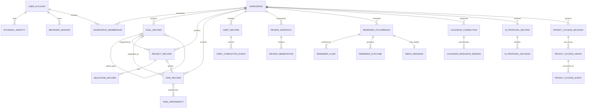

# LifeOS Logical Data Model and ERD

**Baseline:** protected `main` at `5c87a7ec3568a4ce47b25cad843f1bc5be91b294`

## 1. Scope and authority

This is a **logical cross-service model**, not one physical shared database schema. LifeOS services own their persistence independently. Relationships drawn across service boundaries mean application/API/event relationships only; they do **not** authorize cross-service SQL joins, foreign keys, reads, or writes.

Entity labels use:

- **Persisted** — protected-main persistence or migration/repository evidence exists.
- **Logical** — product/domain relationship, but the exact physical table may differ or remain planned.
- **Projection** — derived/read-optimized state; not source-of-truth mutation authority.

Internal IDs use opaque UUIDv4 under the current repository contract.

## 2. Bounded-context ownership

| Bounded context | Logical entities | Persistence status |
| --- | --- | --- |
| Identity | user account, external identity, browser session, workspace, workspace membership | Persisted / partially named by service migrations |
| Planning | goal, project, milestone, task, task dependency, durable Today state/search | Persisted |
| Habit | habit definition, recurrence state, completion event | Persisted |
| Review | daily/weekly review snapshot, review observation | Persisted/projection depending on type |
| Calendar integration | provider connection/sync record/resource binding | Partial; provider adapters implemented, hosted per-user credential lifecycle incomplete |
| Notification | reminder occurrence, worker claim, delivery outcome, inbox message | Persisted |
| AI proposal | proposal evidence, proposal decision event, model provenance | Persisted |
| Privacy access | access decision, access grant, access event | Persisted |
| Plugin integration | plugin manifest/contract/event preparation | Logical/runtime contract; installation and durable plugin secret state are not claimed |
| Audit/operations | correlation/provenance/backup/deployment evidence | Distributed across owning services/artifacts rather than a single shared DB |

## 3. Logical ERD

## 4. Identity and workspace

### `user_account` — logical/persisted

Represents the LifeOS user independent of any provider-specific account identifier.

Minimum logical attributes:

- `user_account_id` — UUIDv4
- display/profile fields owned by identity-service
- lifecycle timestamps/state according to the service implementation

### `external_identity` — logical/persisted

Maps Google/GitHub or another explicitly supported identity provider to `user_account`. Provider identifiers are external metadata and never reused as LifeOS primary keys.

### `browser_session` — persisted

Revocable authenticated session bound to a LifeOS user/workspace authorization context. Secret/token material is represented by digests or protected server-side values according to the identity-service contract, not exposed to downstream services.

### `workspace` / `workspace_membership` — logical/persisted

A workspace is the tenant/data-ownership boundary. A membership binds a user to workspace authority. Personal workspaces are the current primary UX; future team UI does not change the requirement that every domain operation be tenant scoped.

## 5. Planning model

### `goal_record` — persisted

Longer-term objective. May reference a parent goal. Hierarchy must reject invalid/cyclic ownership according to planning-domain rules.

### `project_record` — persisted

Finite coordinated outcome/action set. May support one or more goals at the logical level. Physical representation follows planning-service migrations rather than this ERD.

### `milestone_record` — persisted where current planning model includes it

Project checkpoint. This document does not invent a separate service or database.

### `task_record` — persisted

Actionable planning item. May belong to a project and/or support a goal. Completion and stale-update semantics are defined by planning-service.

### `task_dependency` — logical/persisted where implemented

Directed task relationship. It is a planning-domain relationship and does not imply workflow orchestration authority outside planning-service.

### Durable Today state — partial

Protected main has durable planning objects and a Today action loop, but complete cross-device optimistic-concurrency handling for the whole Today aggregate remains a separately tracked product gap. Browser-local drafts are not equivalent to this durable aggregate.

## 6. Habit and completion model

### `habit_record` — persisted

Recurring behavior definition owned by habit-service.

### `habit_completion_event` — persisted, immutable evidence

Records an accepted completion with workspace/habit/idempotency identity. Current integration tests exercise duplicate/concurrent completion protection and append-only history behavior.

A recurrence-definition edit must not rewrite historical completion evidence.

## 7. Review model

### `review_snapshot` — persisted/projection

Daily/weekly review state derived from authorized planning/habit evidence. Review-service owns the projection and may persist it, but the snapshot is not authorized to rewrite source planning/habit tables.

### `review_observation` — logical/persisted as defined by current review service

Bounded observation recorded during a review ritual.

## 8. Notification model

### `reminder_occurrence` — persisted

One due reminder instance, including tenant/time semantics.

### `reminder_claim` — persisted/ephemeral durable coordination

Expiring/fenced worker authority for one processing attempt. Claims must be recoverable after expiry and must not turn into duplicate delivery authority.

### `reminder_outcome` — persisted immutable evidence

Delivery/defer/failure evidence. Current database tests explicitly exercise immutability behavior.

### `inbox_message` — persisted

Idempotent in-app delivery artifact where the current notification runtime uses it.

## 9. Calendar integration model

### `calendar_connection` — logical/partial

Represents a user/workspace authorization to a provider. The model requires provider identity, scope and lifecycle metadata, but protected-main README explicitly says hosted per-user Google access-token persistence/refresh/revocation remains incomplete.

### `calendar_resource_binding` — logical

Relates a LifeOS scheduling object to a remote calendar resource/ETag/deterministic provider identifier. Exact physical storage must follow the calendar service implementation and must not be invented from this logical model.

## 10. AI proposal model

### `ai_proposal_record` — persisted immutable proposal evidence

Contains bounded proposal content/evidence/provenance and ownership context. Proposal output is inert.

### `ai_proposal_decision` — persisted append-only decision event

Binds explicit accept/reject to exact proposal revision/content digest, actor, workspace, idempotency identity and decision time. A decision event is evidence; it is not a generic command bus.

## 11. Privacy access model

### `privacy_access_decision` — persisted append-only evidence

Records whether a purpose/resource/actor request is authorized/denied under the privacy-service policy.

### `privacy_access_grant` — persisted bounded grant

Represents a signed/time-bounded/single-use authorization where required by the service contract. Deletion/arbitrary mutation is prohibited by current persistence controls.

### `privacy_access_event` — persisted append-only evidence

Records governed use/consumption of access authority. It contains bounded audit facts, not a copy of every sensitive payload.

## 12. Cross-service relationship rules

1. Shared `workspace_id`/`actor_id` values are logical correlation identifiers, not permission to query another service database.
2. Cross-service mutation uses HTTP/event/saga/plugin contracts.
3. A service receiving a shared identifier still validates the authenticated/signed authority relevant to that request.
4. Derived projections may cache foreign-domain identifiers/evidence but cannot become source-of-truth mutation authority.
5. Provider-native IDs remain at provider adapter boundaries.
6. Audit/provenance records store the minimum bounded evidence needed to reconstruct authority/outcome without retaining secrets or unnecessary personal content.

## 13. Version and temporal requirements

Where the domain can lose data under concurrency, records/commands expose an explicit revision, digest, ETag, idempotency key, immutable event ID, or equivalent concurrency identity.

Time fields distinguish:

- event/decision/completion occurrence time when relevant;
- persistence/recording time where needed for audit;
- local calendar date/timezone where reminder/habit behavior depends on a user's civil time.

This document does not prescribe one global bitemporal schema because protected-main transactional services do not currently share such a requirement.

## 14. Physical-model rule

Before adding an entity from this logical ERD to a migration:

- identify the owning bounded service;
- use a descriptive multiword `snake_case` object name;
- define tenant/index/constraint/idempotency semantics;
- add migration and rollback/forward-fix evidence;
- add realistic PostgreSQL integration tests;
- update this document only after physical names and status are verified.
