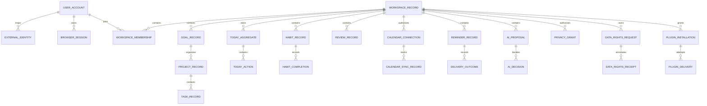

# LifeOS Logical Data Model

**Status:** Implemented on active PR

This document describes service ownership and logical relationships. It does not authorize cross-service SQL joins. Physical schema truth remains in each owning service's migrations.

## Ownership rules

- Each bounded context owns its schema/database role, migrations and credentials.
- Shared opaque UUIDv4 values are logical references, not permission for direct cross-service table access.
- Product-owned database objects use descriptive multiword `snake_case`.
- Conceptual entities below are labeled when they are not persisted on protected main.

## Logical ERD

## Service-owned entities

### Identity service — persisted on protected main

- `user_account`
- `external_identity`
- `browser_session`
- `workspace_record`
- `workspace_membership`
- `data_rights_request` and immutable terminal receipt state as defined by current migrations/repositories

Authentication provenance is retained independently from session rotation so recent-auth policy can be enforced correctly. Protected-main export logic now binds each contributor section to an explicit business record count and deterministic SHA-256 integrity evidence before the whole-export digest is calculated.

### Planning service — persisted on protected main

- `goal_record`
- `project_record`
- `task_record`
- durable Today aggregate/action/revision/idempotency state introduced by PR #127

Planning migrations are authoritative; review/search projections are not mutation authority.

### Habit service — persisted on protected main

- `habit_record`
- `habit_completion`

### Review service

Review snapshots/projections are service-owned. They consume planning/habit evidence without becoming their source of truth.

### Notification service — persisted on protected main

- reminder occurrence/claim records
- immutable delivery outcomes/inbox evidence

### AI proposal service — persisted on protected main

- proposal evidence
- explicit accept/reject decision evidence

### Privacy service — persisted on protected main

- purpose-bound access decisions
- bounded grants
- append-only privacy/audit events

### Calendar integration — connection registry persisted on protected main

Protected main includes sync/provider behavior, trusted signed workspace-context verification, and after PR #150 the first persisted `calendar_connection` foundation. Migration/repository scope binds one connection to workspace and user, stores bounded provider/account/calendar metadata and normalized scopes, and references external credential material through opaque handles. The durable table uses the service-owned `calendar_integration.calendar_connection_record` namespace rather than a generic one-word schema.

The complete hosted lifecycle remains **Partial** under issue #129: authorization callback lifecycle, concrete managed secret storage, refresh/revocation, discovery/selection and migration from development provider configuration remain separate work.

### Plugin integration

Manifest/contract validation exists on protected main. PR #151 is **Implemented on active PR** for an application-level `plugin_installation` authority model that grants an explicit capability subset and preserves replay/conflict/revocation evidence. It does not add durable persistence.

Therefore persisted `plugin_installation`, plugin secret records and `plugin_delivery` attempts remain **Planned** under issue #130 until migrations/repositories and delivery runtime are merged. The logical ERD shows the intended ownership relationship, not physical protected-main tables.

## Data-rights lifecycle

Protected main proves recent-authentication provenance, authenticated ownership binding, durable request/terminal receipt persistence, tenant-scoped request lookup, an authenticated non-cacheable public status projection through PR #146, and per-section export integrity metadata through PR #149. The whole-product export/deletion participant/reconciliation/protected-delivery model remains partial under issue #55.

## Temporal/provenance fields

Where current migrations define them, records retain creation/update/completion/expiry/revision/idempotency/digest evidence. Persist UTC instants and IANA timezone/local-calendar values where civil-time semantics matter. Do not add temporal columns solely to satisfy this diagram.

## Cross-service relationships

Every cross-service relationship is resolved through a versioned HTTP/event/saga/plugin contract. No foreign key or shared table is implied across bounded service ownership.
