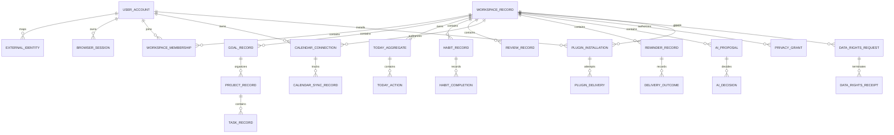

# LifeOS Logical Data Model

**Status:** Implemented on active PR

This document describes service ownership and logical relationships. It does not authorize cross-service SQL joins. Physical schema truth remains in each owning service's migrations.

## Ownership rules

- Each bounded context owns its schema/database role, migrations and credentials.
- Shared opaque UUIDv4 values are logical references, not permission for direct cross-service table access.
- Product-owned database objects use descriptive multiword `snake_case`.
- Conceptual entities below are labeled when they are not persisted on protected main.

## Logical ERD

Logical USER_ACCOUNT relationships to calendar/plugin records represent authority/ownership identifiers, not cross-service foreign keys or direct SQL access.

## Persisted protected-main ownership

### Identity

Identity owns users, external identity mapping, browser sessions, workspace membership/authorization, authentication provenance, durable `data_rights_request`/terminal receipt evidence, authenticated request-status lookup and export-integrity composition. Authentication time remains distinct from session rotation.

### Planning

Planning owns Goals, Projects, Tasks and the durable Today aggregate/action/revision/idempotency model introduced by PR #127. Review/search projections do not gain Planning mutation authority.

### Habit / Review / Notification / AI / Privacy

Habit owns recurrence/completion evidence; Review owns guided review snapshots/projections; Notification owns reminder occurrence/claim/delivery evidence; AI owns proposal/evidence/decision persistence; Privacy owns purpose-bound access decisions, grants and audit events. Logical cross-service references never authorize cross-schema SQL.

### Calendar integration

**Status:** Implemented on protected main

PR #150 added the service-owned `calendar_integration.calendar_connection_record` persistence foundation scoped simultaneously to workspace and user. The row stores bounded provider/account/calendar metadata, normalized scopes and opaque credential references rather than plaintext provider credentials. PR #153 added atomic tenant+user-scoped revocation and durable revoked-state/replay semantics. PR #155 added signed workspace+user request authority without introducing additional persistence.

The complete hosted OAuth/managed-secret/refresh/provider-revocation/discovery/selection lifecycle remains **Partial** under #129.

### Plugin integration

Protected main through PR #151 owns the application-level plugin installation/grant authority: validated manifest intent is separated from explicit host-granted capability subsets, exact replay/conflict semantics are deterministic, cross-tenant/user existence is hidden, and revocation ends active authority while preserving bounded evidence.

#### Durable plugin installation record

**Status:** Implemented on active PR

PR #156 adds the first owning integration-service migration/repository for `plugin_integration.plugin_installation_record`. Its durable logical fields include:

- `installation_id` — opaque UUIDv4 primary installation identity;
- `workspace_id` — authenticated tenant authority;
- `installed_by_user_id` — installing/requesting user authority;
- `plugin_id` and `plugin_contract_version` — bounded plugin metadata;
- `manifest_sha256` — exact validated manifest integrity evidence;
- `granted_capabilities` — explicit bounded host-granted capability set;
- `installation_status`, `installed_at`, `revoked_at` — lifecycle evidence.

Application and repository lookup/revocation paths carry installation + workspace + installing-user authority to the fixed parameterized SQL boundary. Plaintext plugin credentials are not part of this record. The record is not evidence that outbound delivery or a managed secret/KMS lifecycle exists.

Persisted plugin-secret records and `plugin_delivery` attempts therefore remain **Planned/Partial** under #130. The ERD shows those intended relationships as logical targets, not protected-main physical tables.

## Data-rights lifecycle

Protected main includes recent-authentication provenance, durable requests/immutable terminal receipts, tenant+actor scoped status lookup, authenticated non-cacheable status projection (#146), and per-section export integrity evidence (#149). Whole-product contributor orchestration, reconciliation, protected delivery, retention/legal-hold/backup-expiry and terminal completion remain **Partial** under #55.

## Temporal / provenance rules

Use UTC instants plus explicit IANA timezone/local-calendar fields where civil-time behavior matters. Current migrations may retain creation/update/completion/revocation/expiry/revision/idempotency/digest evidence. Do not add fields solely to satisfy a diagram.

## Cross-service relationships

Every cross-service relationship is resolved through a versioned HTTP/event/saga/plugin contract. No foreign key or shared table is implied across bounded service ownership.
