# LifeOS Logical Data Model

**Status:** Implemented on active PR

This document describes logical ownership, cardinality, immutability, and maturity. It never authorizes cross-service SQL. Physical schema truth remains in each owning service's migrations.

## Ownership rules

- Every bounded context owns its database schema/role, migrations, repositories, credentials, transaction boundaries, and recovery behavior.
- Shared UUIDv4 values are logical references, not cross-service foreign keys or table access authority.
- Product-owned database objects use descriptive multiword `snake_case`.
- Provider/plugin identifiers are bounded metadata. Secret references are separate and never become primary identity.
- Browser-local objects are drafts/cache until the owning service accepts them.
- Conceptual or active-PR records are explicitly labeled and are not protected-main persistence claims.

## Logical ERD

```mermaid
erDiagram
    USER_ACCOUNT ||--o{ EXTERNAL_IDENTITY : maps
    USER_ACCOUNT ||--o{ BROWSER_SESSION : owns
    USER_ACCOUNT ||--o{ WORKSPACE_MEMBERSHIP : joins
    WORKSPACE_RECORD ||--o{ WORKSPACE_MEMBERSHIP : contains

    WORKSPACE_RECORD ||--o{ GOAL_RECORD : contains
    GOAL_RECORD ||--o{ PROJECT_RECORD : organizes
    PROJECT_RECORD ||--o{ TASK_RECORD : contains
    WORKSPACE_RECORD ||--o{ TODAY_AGGREGATE : owns
    TODAY_AGGREGATE ||--o{ TODAY_ACTION : contains

    WORKSPACE_RECORD ||--o{ HABIT_RECORD : contains
    HABIT_RECORD ||--o{ HABIT_COMPLETION : records
    WORKSPACE_RECORD ||--o{ REVIEW_RECORD : contains

    WORKSPACE_RECORD ||--o{ CALENDAR_CONNECTION_RECORD : authorizes
    USER_ACCOUNT ||--o{ CALENDAR_CONNECTION_RECORD : owns
    CALENDAR_CONNECTION_RECORD ||--o{ CALENDAR_SYNC_RECORD : tracks

    WORKSPACE_RECORD ||--o{ REMINDER_OCCURRENCE : contains
    REMINDER_OCCURRENCE ||--o{ DELIVERY_OUTCOME : records

    WORKSPACE_RECORD ||--o{ AI_PROPOSAL_RECORD : contains
    AI_PROPOSAL_RECORD ||--o{ AI_DECISION_RECORD : decides

    WORKSPACE_RECORD ||--o{ PRIVACY_ACCESS_DECISION : governs
    PRIVACY_ACCESS_DECISION ||--o{ PRIVACY_ACCESS_GRANT : issues

    WORKSPACE_RECORD ||--o{ DATA_RIGHTS_REQUEST : owns
    DATA_RIGHTS_REQUEST ||--o{ DATA_RIGHTS_RECEIPT : terminates

    WORKSPACE_RECORD ||--o{ PLUGIN_INSTALLATION_RECORD : grants
    USER_ACCOUNT ||--o{ PLUGIN_INSTALLATION_RECORD : installs
    PLUGIN_INSTALLATION_RECORD ||--o{ PLUGIN_CREDENTIAL_BINDING_RECORD : binds
```

Relationships from `USER_ACCOUNT` to Calendar/Plugin records express logical ownership identifiers only. They do not imply cross-schema foreign keys.

## Protected-main persistence

### Identity

Identity owns users, provider mappings, sessions, workspace membership, authentication provenance, `data_rights_request`, immutable terminal receipt evidence, tenant/requesting-user scoped status lookup, and aggregate export-integrity manifests.

Authentication instant and session rotation instant are distinct. Request, idempotency, receipt, and digest evidence are immutable once terminal.

### Planning

Planning owns Goal, Project, Task, search, Today aggregate/action/revision/idempotency state, and its service-owned data-rights erasure receipt. PR #179 protects the contributor; PR #194 protects request-bound authenticated contributor transport.

### Habit

Habit owns recurrence/completion evidence and its service-owned data-rights erasure/replay evidence. PR #184 protects the contributor; PR #192 protects the authenticated one-time transport/replay boundary.

### Review

Review owns guided-review completion/projection records. Request-bound workspace authority is protected through PR #185.

The Review data-rights erasure receipt migration and contributor are **Implemented on active PR** in PR #195. They are not protected-main persistence until integration.

### Notification

Notification owns reminder occurrences, expiring claims, delivery attempts/outcomes, and inbox evidence. Its data-rights erasure migration/receipt/contributor are **Implemented on active PR** in PR #198.

### AI Proposal

AI owns immutable proposal/evidence rows and append-only accept/reject decisions. Its data-rights erasure migration/receipt/contributor and cursor-capable export contract changes are **Implemented on active PR** in PR #199.

### Privacy

Privacy owns purpose-bound access decisions, grants, consumption/fencing, and audit events. Whole-right request identity remains Identity-owned; Privacy retains authority over its own eventual contributor.

### Calendar Integration

**Status:** Implemented on protected main

`calendar_integration.calendar_connection_record` is scoped simultaneously to opaque connection, workspace, and user UUIDv4 identities. It stores bounded provider/account/calendar metadata, normalized scopes, lifecycle timestamps, and opaque access/refresh secret references—not plaintext provider credentials.

Protected-main lifecycle evidence:

- PR #150 creates the owning record;
- PR #153 adds atomic active-to-revoked transition and replay;
- PR #176 validates returned lookup identity exactly;
- PR #189 exposes a credential-free authenticated read projection;
- PR #193 materializes secrets only through validated opaque handles;
- PR #197 composes authenticated secret-first creation and compensation boundaries;
- PR #201 compensates both newly written handles when persistence returns mismatched durable evidence.

Concrete provider/KMS/OAuth state is not invented here and remains **Partial** under #129.

### Plugin Integration

**Status:** Implemented on protected main

`plugin_integration.plugin_installation_record` is protected through PR #169 and retains opaque installation/workspace/installer UUIDv4 identities, bounded plugin/version metadata, exact manifest SHA-256 evidence, normalized explicit grants, lifecycle status, and timestamps. PR #175 requires exact opaque installation identity at application and repository boundaries.

`plugin_integration.plugin_credential_binding_record` is protected through PR #172. It retains only bounded opaque `secret_reference` metadata and binding lifecycle evidence; plaintext credential material remains behind the `PluginSecretStore` port.

Operator request replay evidence is protected through PR #191 and consumed by the fail-closed HTTP composition from PR #196. Delivery attempt/outcome tables are not claimed because the complete runtime is **Partial** under #130.

## Data-rights participant model

| Participant | Persistence owner | Status | Evidence |
| --- | --- | --- | --- |
| Identity coordinator/ledger | Identity | Implemented on protected main | durable request/terminal receipt and status |
| Planning contributor/receipt | Planning | Implemented on protected main | PR #179 and PR #194 |
| Habit contributor/receipt | Habit | Implemented on protected main | PR #184 and PR #192 |
| Review contributor/receipt | Review | Implemented on active PR | PR #195 |
| Notification contributor/receipt | Notification | Implemented on active PR | PR #198 |
| AI contributor/receipt | AI Proposal | Implemented on active PR | PR #199 |
| Remaining owning domains and whole-product reconciliation | Each owner + Identity coordinator | Partial | issue #55 |

No participant row grants Identity direct access to another service's tables. Whole-product completion requires an explicit participant registry and reconciled exact request evidence.

## Cardinality and immutability

- One workspace may contain many planning, habit, review, reminder, proposal, calendar, privacy, and plugin records.
- One Calendar connection belongs to exactly one workspace and one user authority scope.
- One Plugin installation belongs to exactly one workspace and one installing user and may have bounded credential bindings.
- One data-rights request has zero or more contributor sections/receipts and at most one immutable terminal aggregate receipt.
- Proposal decisions, delivery outcomes, terminal data-rights receipts, and immutable audit evidence are append-only or mutation-denying by owning-service contract.
- Mutable lifecycle rows expose explicit state/version/timestamps and deterministic replay/conflict semantics.

## Temporal and provenance rules

Use UTC instants plus explicit IANA timezone/local-calendar fields where civil-time semantics matter. Creation, update, completion, revocation, expiry, revision, idempotency, fencing, digest, and provenance fields exist only when supported by owning migrations. Diagrams never authorize new columns.
