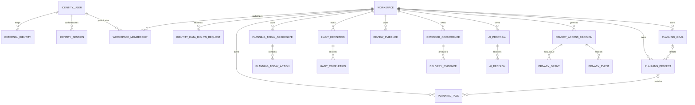
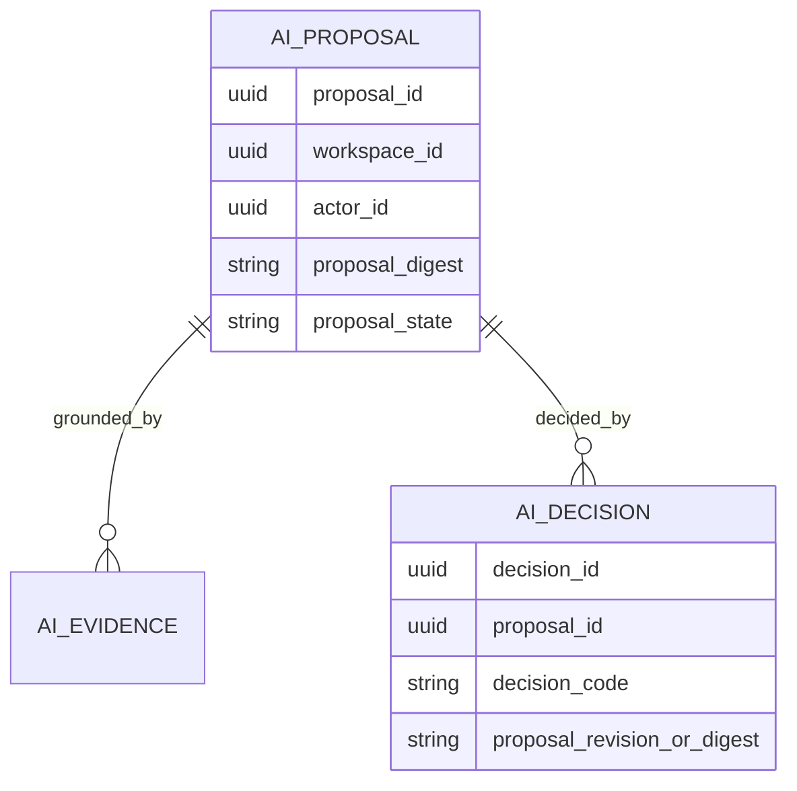
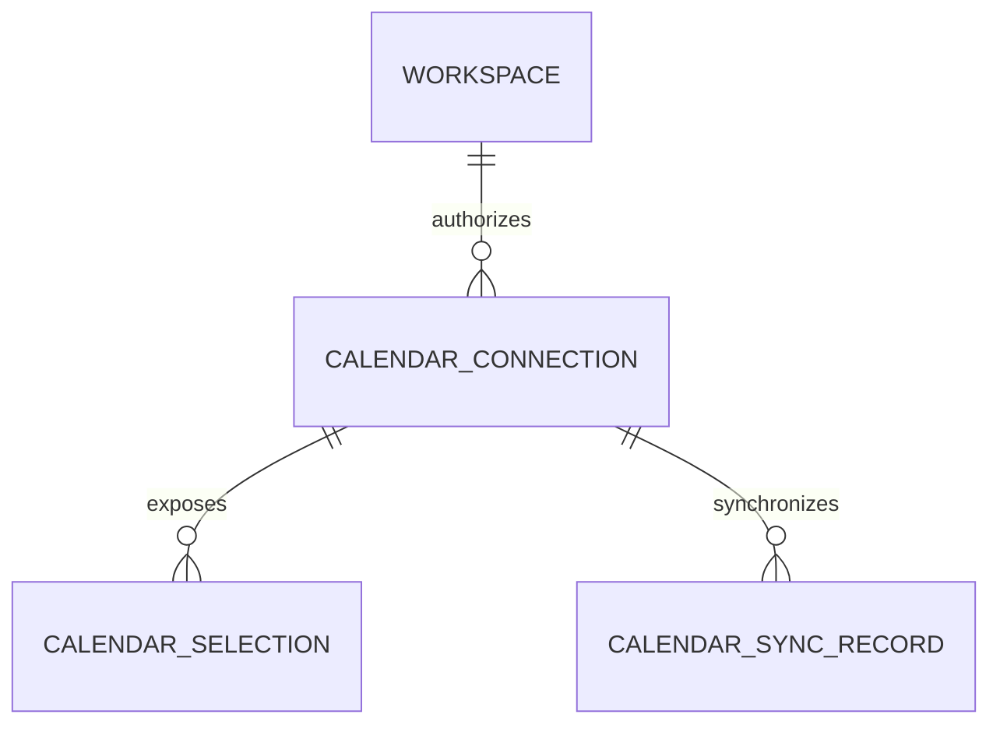
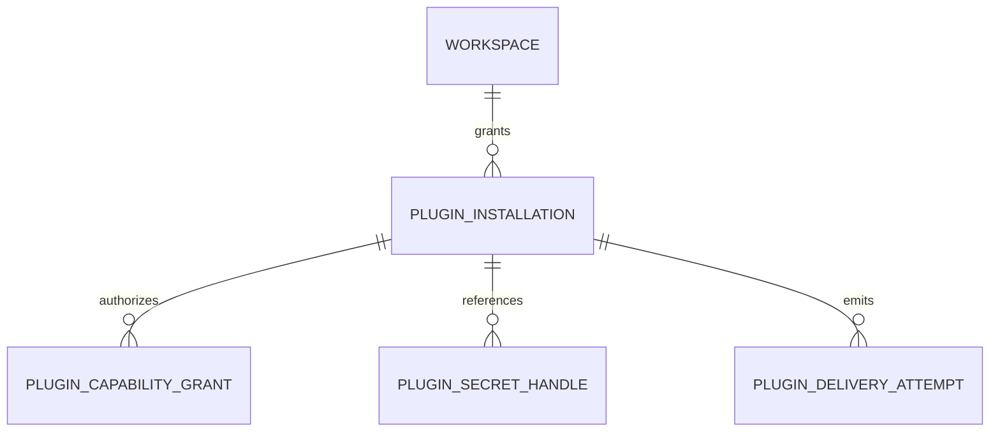

# LifeOS Logical Data Model and ERD

**Status:** Accepted architecture  
**Baseline:** protected `main` at `f4cae6d83eadb00019d2962a650c55c59a3349ae`

## 1. Scope and authority

This document is a **logical cross-service ERD**, not permission to join or mutate tables across bounded contexts. Each service migration directory is authoritative for its physical PostgreSQL objects, columns, constraints and indexes.

Shared UUIDs express logical relationships only. A relationship drawn across services must be resolved through a versioned HTTP/event/saga contract, never an undocumented cross-service SQL join.

## 2. Ownership map

| Bounded context | Durable authority | Representative protected-main migration evidence |
| --- | --- | --- |
| Identity | user, external identity, workspace/session authority, authentication provenance, data-rights request ledger | `apps/identity-service/migrations/` including `0006_data_rights_request_ledger.sql` |
| Planning | goals, projects, tasks, durable Today aggregate and planning-owned state | `apps/planning-service/migrations/0001_initial_planning.sql`, `0003_durable_today_sync.sql` |
| Habit | recurring habit definitions/completions | `apps/habit-service/migrations/0001_recurring_habit_core.sql` |
| Review | guided review completion/projection evidence | `apps/review-service/migrations/0001_guided_review_completions.sql` |
| Notification | reminder inbox/claim/delivery evidence | `apps/notification-service/migrations/0001_durable_reminder_inbox.sql` |
| AI | proposal/audit/decision evidence | `apps/ai-service/migrations/0001_proposal_audit.sql` |
| Privacy | purpose-bound access/grant/event evidence | `apps/privacy-service/migrations/0001_purpose_bound_privacy_access.sql` |
| Calendar integration | provider synchronization/connection state | current provider code; complete per-user credential persistence remains issue #129 |
| Plugin integration | contract-validation state and future installation/runtime state | installation/secret/delivery persistence is planned under issue #130 |

## 3. Protected-main logical ERD

Names in this diagram are logical role names unless written as a schema-qualified physical table.



## 4. Identity and workspace

### Protected-main physical anchors

- `identity.users`
- `identity.workspaces`
- session/external-identity tables owned by identity migrations
- `identity.data_rights_requests`

The data-rights request ledger intentionally retains bounded opaque authority references, request/receipt digests, state and timestamps instead of personal export payloads. Completed terminal receipt evidence is immutable under the protected-main contract.

Authentication age and session issuance/rotation are separate semantics. Session rotation must not manufacture a newer authentication ceremony.

## 5. Planning

Protected main owns the durable goals/projects/tasks foundation and, after PR #127, the durable Today aggregate. The logical hierarchy is:

```text
workspace
  -> goal
      -> project
          -> task
  -> today aggregate (workspace + local date)
      -> bounded priority/scheduled actions
```

The Today persistence contract uses UUIDv4 aggregate/action/revision/idempotency identities, explicit create/update preconditions, deterministic transaction-scoped locking, replay-safe exact outcomes and bounded stale-write conflicts. Browser-local state is not represented as durable until the explicit save path succeeds.

A task may be associated directly with a goal where the implementation contract permits it, but planning service remains the single mutation authority.

## 6. Habit and review

Habit definitions and completion evidence belong to habit service. Review evidence belongs to review service and is a projection/observation boundary; it does not become planning mutation authority.

Logical cross-service references may share `workspace_id`, goal/project/task identifiers or evidence identifiers, but the owning service validates those references through its contract rather than foreign-keying into another service schema.

## 7. Notification

Notification service owns reminder occurrences, claim/fencing state, delivery identity and terminal outcome evidence. A producer event may reference a planning/habit object by opaque identifier; that does not grant notification service SQL authority over the source table.

## 8. AI proposal/audit



Model output remains inert. No relation in this logical ERD grants AI direct planning-table mutation authority.

## 9. Privacy and data rights

Purpose-bound privacy access and whole-tenant data rights are related but distinct boundaries:

- privacy service decides bounded sensitive-access purpose/grants/events;
- identity owns the cross-domain export/erasure request identity and durable receipt ledger;
- domain contributors own their own export/erasure participation;
- complete orchestration across all contributors, delivery, legal-hold/retention and reconciliation remains `Partial` under issue #55.

## 10. Calendar connections

The complete hosted model is:



`CALENDAR_CONNECTION`/credential persistence is a target logical model for issue #129 and must not be represented as a protected-main physical table until merged migration evidence exists. PR #139 implements only the trusted workspace-context prerequisite.

## 11. Plugin runtime target model



These are `Planned` logical entities under issue #130. They are not current physical persistence.

## 12. Identifier and naming rules

- Internal durable identifiers are UUIDv4.
- Provider IDs are explicit external metadata/mappings.
- Product-owned database object names use at least two descriptive `snake_case` words.
- Cross-service relationships do not create implicit shared-table authority.
- Timestamps use UTC instants plus explicit timezone/local-date fields where civil-time behavior matters.

## 13. Change rule

When a migration adds/removes/renames a material persisted entity:

1. update the owning-service migration and tests;
2. update this logical model only after exact source evidence exists;
3. update PRD/TRD/ADR/UML if authority or buyer behavior changes;
4. mark active-PR entities separately from protected-main entities until integration.