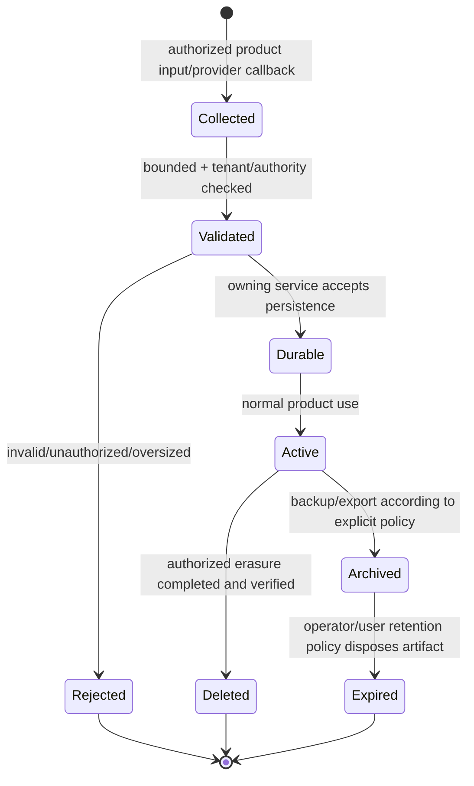
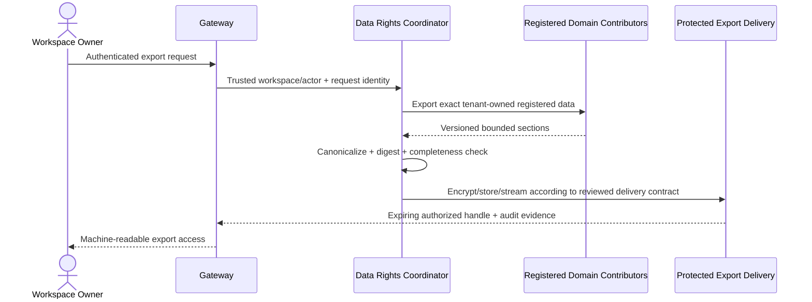

# LifeOS Privacy and Data Lifecycle Contract

**Baseline:** protected `main` at `876850018a17323900844e79845ba395b7bf6a9a`

## 1. Scope

This document describes the **software data lifecycle and authority model**. `docs/legal/privacy.md` describes upstream-project privacy practices, not every deployment. Independent deployment operators determine their own legal basis, notice, retention schedule, subprocessors, residency, incident process, and regulatory obligations.

LifeOS may contain sensitive goals, career, health, relationship, habit, calendar, review and AI-context data. The software therefore treats privacy as an access/lifecycle architecture problem, not a global masking toggle.

## 2. Data classes

| Class | Examples | Default handling |
| --- | --- | --- |
| Identity/authentication | internal user/workspace IDs, external identity mapping, sessions | identity-owned, minimum necessary, no provider credentials downstream |
| Personal planning | goals, projects, tasks, Today drafts/state | planning-owned, tenant-scoped, user-authorized |
| Behavioral history | habit completion, review evidence, notification outcomes | owning-service persistence; immutable/append-only where defined |
| Integration credentials | calendar access/refresh tokens, provider account identity | secret/encrypted lifecycle; current hosted per-user calendar lifecycle is Partial; tracking issue #129 |
| AI proposal evidence | proposal content/digest, explicit decisions, provider/model provenance | inert/auditable, bounded; no raw hidden reasoning/credential retention |
| Privileged privacy evidence | purpose decisions, grants, access events | privacy-owned, content-minimized, append-only where defined |
| Operational metadata | correlation IDs, latency/counts/errors | bounded labels/content; avoid personal text/secrets |
| Backup/export artifacts | logical database backups, future user export archives | private, integrity-verified, explicit access/expiry/retention controls |
| Public project data | GitHub commits/issues/reviews/synthetic fixtures | upstream-project privacy notice; never use real user/customer sensitive data as fixtures |

## 3. Lifecycle states

A browser-local draft is not `Durable` merely because it exists on a device. An AI proposal is not an authorized planning mutation merely because the user viewed it.

## 4. Collection minimization

- Collect only fields required by the owning product contract.
- Do not turn external provider payloads into internal durable records wholesale; map validated required fields.
- Provider-native IDs remain external mappings, not internal primary keys.
- Public/open-source fixtures are synthetic and must not resemble live credentials or unnecessary personal records.
- Model prompts/context are bounded to the selected operation rather than arbitrary account history.

## 5. Tenant and purpose authority

### Ordinary product data

Owning services derive workspace/actor authority from authenticated/signed context and scope every persistent query/mutation to that authority.

### Privileged sensitive access

Where unmasked/sensitive data access requires privilege beyond ordinary user ownership, privacy-service evaluates actor, workspace/resource, purpose, operation and lifetime, persists a decision, and may issue a bounded/single-use grant. Expired/reused/wrong-purpose/wrong-resource grants fail closed.

Redaction/masking is applied when disclosure is unnecessary; it is not a substitute for authorization.

## 6. Credentials and cryptographic material

Credentials are never ordinary domain JSON.

- OAuth/calendar/model/GitHub/review-agent credentials remain in their owning secret boundary.
- Browser session cookies are not forwarded to downstream model/domain providers.
- Model providers do not receive GitHub/review-agent credentials.
- Public logs/errors/artifacts do not contain tokens, cookies, authorization headers, private keys or raw provider error bodies.
- Hosted per-user calendar credentials require encrypted durable storage, refresh/revocation and provider-selection evidence before LifeOS claims the capability complete; tracking issue #129.
- Signing/encryption key rotation follows explicit active/overlap/retirement rules where implemented.

## 7. Data retention

The upstream repository does **not** prescribe one universal runtime retention period because independent deployments differ in legal/operational requirements.

Software requirements:

- every retention-sensitive artifact has an identifiable owner and purpose;
- public CI/model artifacts use bounded retention configured by repository policy;
- backups/exports require operator/user retention and disposal policy;
- privileged access audit evidence is retained independently from unnecessary sensitive payload;
- an operator can determine which service/artifact owns a record that must be retained or erased;
- a legal hold, where supported, blocks destructive erasure explicitly rather than silently retaining data after claiming deletion.

A fixed retention number must not be added to canonical docs unless code/operator policy and legal basis support that number.

## 8. Export lifecycle

**Status:** Partial
**Tracking:** issue `#55`.

The identity-owned data-rights core can deterministically coordinate contributor exports and produce digest evidence. Complete customer-facing export requires all required domain contributors and delivery/storage lifecycle.

Target flow:

No export is called complete if a required registered domain is missing or a section silently fails.

## 9. Erasure lifecycle

**Status:** Partial
**Tracking:** issue `#55`.

Current data-rights core supports preflight, deterministic contributor order, fail-closed execution, verification and bounded receipt semantics with test contributors. Complete productization requires concrete domain adapters, durable request/receipt/reconciliation, authenticated recent-owner confirmation, retention/legal-hold/backup-expiry evidence and operator-visible stuck-request recovery.

Target invariants:

- exact workspace owner/recent-auth authority;
- explicit destructive confirmation;
- canonical registered participant set;
- all participants preflight before destructive commit begins;
- exact request/idempotency identity;
- partial completion is never reported as full deletion;
- remaining partial state is observable/reconcilable;
- legal hold/retention blockers are explicit;
- backup copies are governed by documented expiry/recovery policy rather than falsely claimed erased immediately if immutable retention requires otherwise.

## 10. Backups

Protected-main logical backup/restore is an operator recovery capability, not a user export API.

- Archives are private and checksum verified.
- Restore refuses a corrupted archive or unsafe non-empty target.
- Upstream does not claim automatic encrypted off-site storage, scheduling, retention or PITR.
- Operators must reconcile backup retention with deletion/hold policy for their deployment.

## 11. Logs, metrics and diagnostics

Allowed operational evidence should prefer:

- opaque correlation/request/job IDs;
- bounded status/reason code;
- service/operation classification;
- duration/count/capacity measures;
- non-secret exact revision/digest where needed for debugging.

Avoid:

- goal/task/habit/review text;
- calendar event content;
- raw OAuth/provider/model response bodies;
- cookies/tokens/authorization headers;
- raw prompts/responses/hidden reasoning;
- database DSNs/passwords/private keys;
- unbounded stack traces in public responses/artifacts.

## 12. AI data lifecycle

- Bounded user context enters the AI proposal boundary only for the selected operation.
- Model output is untrusted and validated.
- Proposal evidence is persisted before it is returned where the audit contract requires it.
- Explicit accept/reject decisions are append-only/replay-safe evidence.
- A proposal does not become planning state automatically.
- Live conformance artifacts contain bounded metrics/provenance, not raw prompts/responses/secrets/hidden reasoning.

## 13. Integration-provider lifecycle

Provider state is isolated by provider/account/connection and user/workspace authority. Disconnect/revocation must make a connection unusable according to the provider contract. A process-global token used for a bounded development adapter is not acceptable evidence of a hosted multi-user credential product.

## 14. Data-rights acceptance gate

Upgrade `PRD-PRIV-004` from `Partial` only when exact protected-main evidence proves:

- complete domain registry/coverage;
- authenticated owner/recent-auth boundary;
- durable request/export/deletion receipts;
- retry/reconciliation and partial-failure visibility;
- legal-hold/retention/backup-expiry behavior;
- protected export delivery, expiry and download audit;
- tenant isolation/replay/concurrency/restart tests;
- exact-head security/review/release gates.

## 15. Operator extension

Deployment operators must document and validate their actual:

- purposes/legal bases;
- retention schedules and legal holds;
- encryption/KMS/key rotation;
- data residency/transfers/subprocessors;
- access-control/admin/support processes;
- backup/PITR/expiry;
- data subject/user request process;
- breach/incident response.

Upstream architecture enables these controls but does not certify an independent deployment automatically.
