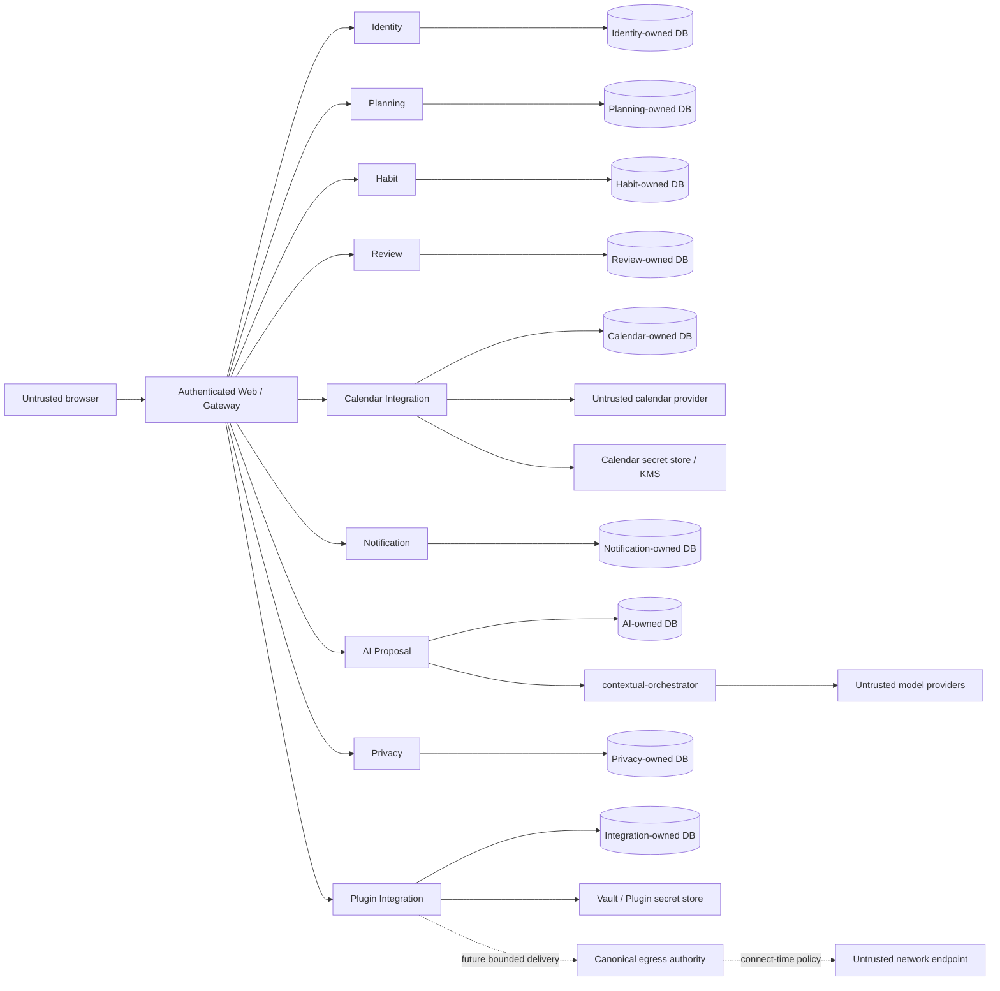

# LifeOS Threat Model

**Status:** Implemented on active PR

Protected-main source and tests are the current control evidence. Active PR controls remain non-shipped until integration.

## Assets

- tenant-owned Planning, Habit, Review, Calendar, Notification, AI, Privacy, and Plugin data;
- account, workspace membership, sessions, and authentication-age provenance;
- provider credentials, secret references, signing/MAC keys, PKCE verifier material, Vault/KMS authority, and gateway authentication material;
- AI proposals, evidence, and explicit decisions;
- data-rights requests, contributor exports/receipts, aggregate terminal evidence, and protected artifacts;
- plugin installations, grants, credential bindings, delivery-origin grants, operator replay evidence, and future delivery outcomes;
- database migrations, backups, release artifacts, SBOM/provenance/signatures, CI/SARIF/status evidence, and operator recovery records.

## Trust boundaries

Co-location on one PostgreSQL cluster never creates shared-table authority. Every service owns its schema/role/migrations and cannot borrow another service's credentials. A stored URL/origin is identity evidence only; it is not resolved-network authority.

## Threats and controls

| Threat | Boundary | Primary controls | Status |
| --- | --- | --- | --- |
| Tenant/workspace/actor injection | Browser -> services | authenticated session or exact signed context; reject client-selected authority | Implemented on protected main |
| Method/path replay of signed context | Gateway -> services | exact method/path/version/issuance binding; one-time evidence where destructive | Implemented on protected main |
| Cross-service database privilege confusion | Service -> PostgreSQL | service-owned roles/schemas/migrations; no cross-table access | Implemented on protected main |
| OAuth state/redirect confusion | Identity -> provider | bounded transaction, state, provider, redirect/origin validation | Implemented on protected main |
| Calendar workspace/user substitution | Gateway -> Calendar | `life-os.calendar-user.v1`, exact returned evidence validation | Implemented on protected main |
| Hosted process-global Calendar credential substitution | Runtime -> Calendar | active #216 rejects deployment-wide Google/CalDAV credentials as user authority | Implemented on active PR |
| Calendar OAuth state/PKCE replay or verifier disclosure | Browser/provider -> Calendar/secret store | active #228 exact workspace/user/provider/redirect binding, expiry/one-time state, opaque verifier handle, consumed-row revalidation before materialization | Implemented on active PR |
| Orphaned calendar credential material | Calendar -> secret store/repository | secret-first persistence, reverse-order compensation, no caller-visible handles | Implemented on protected main |
| Calendar credential theft/replay | Calendar -> provider/KMS | opaque references, encrypted self-hosted store #203; hosted callback/token/refresh/provider-cleanup lifecycle remains incomplete | Partial |
| Stale multi-device overwrite | Web -> Planning | strong preconditions, versioning, ordered locks, explicit reconciliation | Implemented on protected main |
| First-party browser durable-state fabrication | Browser -> BFF/services | server-derived workspace authority, exact signed downstream request, strict returned evidence, stale/duplicate rejection | Implemented on active PR |
| Review/Habit/Planning authority replay | Gateway/contributor -> owner | exact request-bound signatures and atomic destructive replay guards | Implemented on protected main |
| Reminder duplicate delivery | Notification worker | fenced/expiring claims, idempotency, immutable outcomes | Implemented on protected main |
| AI prompt injection or silent mutation | Model -> AI/product | untrusted inert proposal, deterministic validation, explicit decision, no mutation bus | Implemented on protected main |
| Model credential/provider-routing escalation | LifeOS -> contextual-orchestrator/model | active #208 routes through virtual `orchestrator/free`; provider credentials remain owner-side bootstrap material; immutable owner release/authentication remains required | Partial |
| Sensitive-data overexposure | Privacy/public/CI | tenant/purpose/resource/lifetime grants; bounded credential-free evidence | Implemented on protected main |
| Data-rights participant omission/false completion | Identity -> contributors | explicit versioned registry, owner verification, immutable aggregate receipt | Partial |
| Data-rights cross-tenant export/erase | Identity/contributor -> owner DB | exact workspace/actor/request binding, owner SQL only, deterministic evidence | Partial |
| Plugin manifest self-escalation | Manifest -> host | explicit host grant subset; manifest is intent only | Implemented on protected main |
| Plugin credential leakage | Host -> Vault/DB/public view | plaintext only at Vault/secret-store port; durable rows retain opaque references; compensation/revocation fencing | Implemented on active PR |
| Plugin installation/revocation TOCTOU | Integration app -> repository/Vault | active stack revalidates installation authority around credential/origin admission and fails closed on revoked/mismatched durable evidence | Implemented on active PR |
| Plugin operator replay/identity substitution | Operator -> integration | exact one-time signed request, durable atomic replay evidence, fail-closed HTTP | Implemented on protected main |
| Delivery-origin signature confusion | Operator -> Integration | active #250 exact canonical lowercase UUIDv4 delivery-origin paths and POST/GET/POST methods; cross-route signatures rejected | Implemented on active PR |
| Stored delivery origin promoted to network authority | Integration -> egress | explicit separation of durable origin identity from connect-time DNS/IP/redirect/proxy authority | Partial |
| Plugin SSRF/DNS rebinding/outbound abuse | Integration/egress -> network | immutable released/versioned egress authority, connect-time address checks, rebinding controls, redirect/proxy/size/time limits | Partial |
| Dependency lifecycle-script escalation | Package install -> runner | exact pinned package and narrow build allowlist | Implemented on protected main |
| CI evidence identity confusion | GitHub workflows | explicit source/base/integration/checkout/protected/release identities | Partial |
| Temporary verification workflow becomes permanent/self-modifying authority | GitHub workflow -> branch | purpose-bounded writer, exact changed-file denominator, ordinary descendant self-retirement only after proof; no force push/gate mutation | Partial |
| Backup corruption or unsafe restore | Operator -> storage | integrity manifest, safe-target refusal, readiness verification | Implemented on protected main |
| Release provenance/signature mismatch | GitHub -> artifacts/deployment | active #217 structural index + #236 detached verification; exact protected release source/immutable publication/trust lifecycle still required | Partial |

## Protected authority milestones

- PR #168 and PR #188 protect Planning tenant and request binding.
- PR #173 protects Habit tenant authority.
- PR #185 protects Review request-bound authority.
- PR #190 protects integration event request binding.
- PR #191 and PR #196 protect plugin operator one-time authority and HTTP composition.
- PR #157, PR #176, PR #189, PR #193, PR #197, PR #201 and PR #203 protect Calendar disconnect, returned evidence, read, materialization, create/compensation and self-hosted encrypted storage.
- PR #159 protects the contributor contract; PR #179/PR #194 protect Planning contribution/transport; PR #184/PR #192 protect Habit contribution/transport; PR #195 protects Review contribution.
- PR #200 protects the exact reviewed OpenCode bootstrap surface only; it is not direct-provider routing authority.

These milestones narrow but do not erase parent-gap threats.

## Calendar abuse cases

- forged workspace/user/connection UUIDs fail before secret materialization or SQL;
- returned connection rows whose identity differs from the exact lookup fail closed;
- connection reads omit secret handles and plaintext material;
- local disconnect cannot be interpreted as provider revoke success;
- secret-first create failure compensates newly written handles without returning them;
- PR #201 protects compensation when persistence returns invalid durable evidence;
- active #216 cannot silently fall back to deployment-global hosted provider credentials;
- active #228 state is bounded to one exact ceremony and keeps PKCE verifier plaintext outside durable Calendar metadata;
- an expired/replayed/corrupt OAuth state cannot become callback/token authority;
- hosted token exchange, refresh fencing, successful verifier cleanup, provider revoke/delete and scoped sync remain explicit #129 gaps.

## Data-rights abuse cases

- forged request/workspace/user/contributor UUIDs fail before SQL;
- cross-workspace or cross-requesting-user status lookup returns no existence signal;
- duplicate, corrupt, ambiguous, or malformed persisted rows fail closed;
- session rotation cannot reset recent-authentication age;
- a contributor cannot read or delete another service's tables;
- exact destructive replay returns bounded existing evidence; conflicting reuse fails;
- unknown, unavailable, or omitted contributors prevent terminal whole-product success;
- export digests are not treated as authorization, confidentiality, or signer identity;
- Review PR #195 is protected; Notification PR #198 and AI PR #199 remain active evidence until integration.

## First-party UI abuse cases

- browser-provided workspace IDs, cookies, or durable object identities do not become downstream service authority;
- stale overlapping reads cannot replace a newer projection or newly accepted durable record;
- malformed/duplicate/non-canonical server evidence fails closed instead of being rendered as durable truth;
- error/conflict paths preserve prior safe durable evidence rather than fabricating success;
- material UI cannot be declared complete without current-head normal/loading/empty/error/permission/responsive/interaction and keyboard/a11y evidence;
- locale fallback cannot silently change resource identity or collapse the DB-versioned screen-key translation ledger into ontology labels.

## Plugin abuse cases

- a manifest requesting undeclared or ungranted capabilities cannot self-escalate;
- cross-workspace/installer/installation/binding/grant identifiers fail closed;
- mismatched returned installation, credential or origin evidence cannot become authority;
- exact credential replay cannot rematerialize or overwrite a secret;
- revocation ends durable authority before external cleanup and retries never restore it;
- Vault provider plaintext and Vault credentials do not enter LifeOS durable metadata or public evidence;
- operator authority is bound to exact request path/method and one-time evidence;
- active #250 delivery-origin grant/read/revoke signatures are not credential signatures and aliases/case variants/wrong methods fail closed;
- no operator route grants arbitrary SQL, filesystem, subprocess, tool, or network access;
- no durable origin grant is treated as approval for a later resolved IP, redirect, proxy route, or rebinding result;
- outbound URLs remain untrusted until the separate canonical egress/network slice exists under #130.

## AI and development-model controls

AI proposals remain inert and auditable. Model content cannot authorize product mutation. Live-provider availability cannot fabricate deterministic merge success.

A strong single-route baseline precedes deeper orchestration. Protected #200 is bootstrap hardening only. Active #208 preserves exact OpenCode identity while routing model calls through contextual-orchestrator and virtual `orchestrator/free`; LifeOS does not choose direct providers or copy mutable owner source. The lane fails closed while the owner authentication/bootstrap contract and immutable release are unavailable. Raw prompts/responses, hidden reasoning and credentials are not retained as public evidence.

## Verification and supply-chain controls

PR #154 separates exact contributor-source evidence from independently reconstructed live-base compatibility. Issue #132 remains **Partial** because central reusable scanner checkout/SARIF/status taxonomy is not yet fully machine-auditable.

Pending, queued, skipped, cancelled, absent, neutral, stale, predecessor, status-only, synthetic-only, model-only, and rate-limited evidence is non-passing. Package lifecycle scripts remain denied except for an exact reviewed need; PR #200 is **Implemented on protected main** for the pinned OpenCode package only.

Temporary proof workflows are verification mechanisms, not product authority. Their failure is root-caused as code/config/runtime evidence; they may self-retire only after the intended exact proof succeeds and only by deleting their own purpose-complete workflow through an ordinary descendant. A successful ancestor proof does not silently become unrelated current-head merge authority.

## Failure and recovery

Dependency outages return sanitized unavailable evidence and never false durable success. Partial external cleanup retains exact retry identity without restoring revoked authority. Corrupt durable evidence triggers fail-closed classification. Restore/migration/release claims require integrity, compatibility, rollback/recovery, and exact source/provenance evidence appropriate to the changed state.

## Review triggers

Update this threat model whenever a service gains persistence, credential, network, destructive, model, or release authority; a provider or contract version changes; a parent gap closes; an active PR integrates; required verification identity semantics change; or a recovery path can create orphaned external material.
