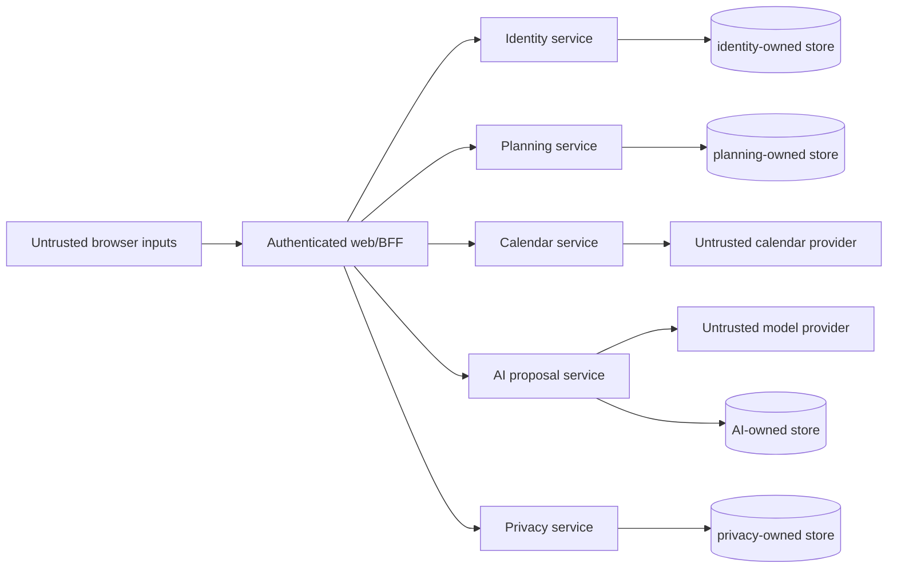

# LifeOS Threat Model

**Status:** Implemented on active PR

## Assets

- tenant-owned planning/habit/review/calendar data;
- account/session/authentication provenance;
- provider credentials and signing keys;
- AI proposal/evidence/decision records;
- privacy grants and data-rights receipts;
- backup/release artifacts and CI evidence.

## Trust boundaries

Co-location on one PostgreSQL cluster does not create shared-table authority. Each service owns its role/schema/migrations.

## Threats and controls

| Threat | Boundary | Primary controls | Current state |
| --- | --- | --- | --- |
| Tenant/workspace injection | browser -> services | authenticated/signed context; reject legacy/client ownership | Implemented on protected main |
| Cross-service DB privilege confusion | service -> PostgreSQL | service-owned credentials/schema/migrations; no cross-service table access | Implemented on protected main |
| OAuth state/redirect confusion | identity/provider | bounded transaction, state and redirect validation | Implemented on protected main |
| Calendar workspace spoofing | web/calendar | signed workspace/method/path/issuance context | Implemented on protected main |
| Calendar token theft/replay | calendar/provider | per-user encrypted lifecycle, refresh/revocation, PKCE/state | Partial — #129 |
| Stale multi-device overwrite | web/planning | strong preconditions, revisions, explicit conflict reconciliation | Implemented on protected main |
| Replay/duplicate side effects | mutable domains | idempotency keys, immutable outcomes, fencing where applicable | Implemented on protected main |
| AI prompt injection / silent mutation | model/AI | model output as untrusted inert proposal; deterministic validation; explicit decision | Implemented on protected main |
| Sensitive-data overexposure | privacy/public surfaces | purpose/resource/lifetime grants; bounded logs/errors/artifacts | Implemented on protected main |
| Data-rights false completion | identity/domain participants | durable request identity; immutable receipt; explicit participant/reconciliation contract | Partial — #55 |
| Plugin self-escalation/SSRF/secret leak | plugin integration | explicit grants, encrypted handles, authorized origins, rebinding/redirect/size/time controls | Planned — #130 |
| CI evidence identity confusion | GitHub workflow | explicit source-head vs merge-tree/live-base evidence classes | Partial — #132 |
| Backup corruption/unsafe restore | operator/backup | checksums, validation, non-empty target refusal | Implemented on protected main |

## AI-specific controls

AI proposals remain inert and auditable. Browser credentials and provider secrets are not model inputs. Live-provider availability cannot fabricate deterministic merge success. Deeper orchestration is permitted only after measured quality/control evidence over a strong single-route baseline.

## Data-rights abuse cases

- forged request/workspace/user UUIDs fail before SQL;
- cross-workspace or cross-requesting-user status lookup returns no existence signal;
- duplicate/corrupt persisted request rows fail closed;
- session rotation does not reset authentication age;
- whole-product erasure is not claimed until every required domain is reconciled.

## Failure and recovery

Dependency outage returns sanitized unavailable evidence and never false durable success. Partial durable workflows retain replay/reconciliation identity. Restore/migration/release claims require explicit evidence appropriate to the changed state.

## Review triggers

Update this threat model when a service gains new persistence/credential/network authority, a new external provider is introduced, the plugin runtime becomes executable, data-rights orchestration changes, or required verification evidence classes change.