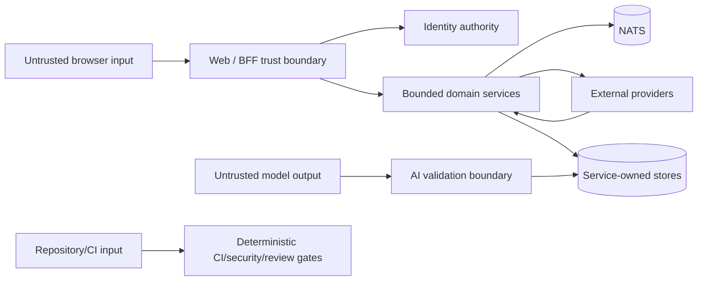

# LifeOS Threat Model

**Status:** Accepted architecture  
**Baseline:** protected `main` at `f4cae6d83eadb00019d2962a650c55c59a3349ae`

`SECURITY.md` governs vulnerability reporting. This document models architecture assets, trust boundaries, threats, controls and residual risk.

## 1. Assets

- user/workspace identity and authorization context;
- goals, projects, tasks, habits, reviews and Today state;
- OAuth/calendar/plugin/model credentials;
- purpose-bound privacy grants and access evidence;
- AI proposal/decision evidence;
- data-rights requests and immutable receipts;
- service signing keys and database credentials;
- backup archives and checksums;
- deployment/release/provenance evidence.

## 2. Trust boundaries

No external/browser/model/event input is trusted merely because transport succeeded.

## 3. Major threats and controls

| Threat | Example | Primary controls | Residual concern |
| --- | --- | --- | --- |
| Tenant spoofing | Client supplies another workspace ID | Server-derived/signed identity context, tenant-scoped queries, cross-tenant tests | Any boundary still trusting legacy client ownership must be removed; calendar PR #139 addresses one such boundary. |
| Session-age confusion | Rotate session to appear freshly authenticated | Preserve authentication instant across rotation; recent-auth policy | Provider reauthentication semantics must remain explicit. |
| IDOR / identifier substitution | Guess opaque object ID from another tenant | UUIDv4 + tenant-derived authorization | UUID opacity is not authorization; every query still scopes tenant. |
| SQL injection | User input alters query structure | Fixed SQL + parameterization | Dynamic schema/admin tooling requires separate review. |
| Cross-service privilege confusion | One service reads/writes another schema | Service-owned DSN/role/migrations; contract/event-only composition | Shared physical PostgreSQL can be misconfigured by operators. |
| Replay / duplicate mutation | Retry causes duplicate completion/provider write | Idempotency identities, deterministic provider IDs, immutable receipts | External providers may have weaker primitives. |
| Lost update | Stale device overwrites Today plan | Strong revisions/preconditions, deterministic transaction-scoped locks, fresh post-lock checks | Other future offline-edit domains need the same explicit conflict contract. |
| In-flight UI overwrite | Older save response erases newer local Today edit | Browser state ownership and post-save merge/preservation tests | Future offline/background sync paths need equivalent proofs. |
| Credential disclosure | Token enters logs/model/artifacts | Secret boundaries, redaction-by-design, credential-free errors/artifacts | Operator debug tooling can still leak if misconfigured. |
| Calendar cross-user substitution | Client selects victim workspace/calendar | Trusted server context, connection-scoped selection; issue #129 | Full encrypted credential lifecycle remains incomplete. |
| SSRF through plugin delivery | Plugin URL targets metadata/private network | Planned origin grant + DNS/IP/rebinding/redirect controls under #130 | Runtime not yet shipped. |
| Prompt injection | Page/issue/model text attempts to change authority | Treat untrusted text as data; deterministic validators/policy | Novel injection may still affect proposal quality, so high-risk actions remain outside model authority. |
| AI silent mutation | Model directly changes planning records | Inert proposal, no planning mutation repository, explicit decision | Consumer code must not later bypass the proposal boundary. |
| Data-rights false completion | Some domain not exported/erased but receipt says done | Required contributor registry, durable request ledger, completion only after all contributors | Whole orchestration remains partial under #55. |
| Receipt tampering | Completed erasure receipt changed after source deletion | Immutable terminal receipt guard and digests | Retention duration/legal basis is operator/product policy work. |
| Backup corruption | Restore accepts damaged dump | Checksum/integrity verification and unsafe-target refusal | Logical backups do not provide PITR. |
| Supply-chain drift | Mutable action/dependency/provider code changes | Immutable pins/lockfiles/SBOM/provenance gates where configured | External registries/providers remain dependencies. |
| Synthetic-merge evidence confusion | CI success on merge ref called exact-head success | Explicit exact-head provenance work; issue #132 | Required workflows still need full classification/migration. |

## 4. Identity boundary

Identity service is authoritative for user/workspace/session meaning. Provider-native IDs are mappings, not LifeOS primary keys. Authentication age is preserved independently from session rotation.

Recent-authentication-sensitive operations reject stale, malformed, future or incompatible provenance instead of assuming that possession of any valid session is sufficient.

## 5. Service-owned database boundary

Each bounded service owns its migrations and credentials. Even if services share one PostgreSQL cluster:

- roles/schemas remain separated;
- direct cross-service joins/writes are prohibited;
- a compromised service credential should not automatically grant another service's tables;
- cross-service consistency uses APIs/events/sagas and explicit reconciliation.

## 6. Today planning boundary

**Status:** Implemented on protected main

The protected Today aggregate rejects client ownership injection, bounds text/schedule state, uses workspace/date-scoped deterministic locking, exact idempotency semantics and opaque revisions, and surfaces stale-write conflicts rather than silently overwriting newer state. Browser-local drafts are uploaded only through an explicit user action and remain locally authoritative for edits made after a request begins.

## 7. AI trust boundary

Model output is untrusted structured data. Model/provider success cannot authorize a product mutation. The deterministic product boundary validates schema, operation conformance, tenant scope, evidence grounding and explicit user decision semantics.

Model processes never receive GitHub merge authority, review-agent secrets, browser cookies or Docker-socket authority through the intended repository-development design.

## 8. Calendar trust boundary

Protected main has conflict-safe provider adapters, but the hosted credential lifecycle is incomplete. Issue #129 owns encrypted per-user connection credentials, OAuth state/PKCE, refresh/revocation and calendar selection. PR #139 is active evidence for replacing legacy client-selected workspace authority with a short-lived signed context.

## 9. Plugin trust boundary

Protected main validates plugin contracts but does not grant arbitrary runtime authority. Issue #130 requires explicit installation/capability grants, encrypted secret handles, origin-scoped SSRF-safe outbound delivery, bounded retries/audit and immediate revocation. Direct database access and arbitrary command execution remain non-goals.

## 10. Data-rights trust boundary

Protected main provides recent-authentication policy and a durable request/receipt ledger. Complete export/erasure must still fail closed when any required contributor is missing, unprepared, failed or unreconciled. A durable request row is not proof that every domain has completed the right.

## 11. Availability and exhaustion

Untrusted input is bounded by size, count, timeout and retry limits where applicable. Dependency/provider outage must produce explicit bounded failure and preserve unrelated product functionality when isolation permits it. Queues/retries cannot become infinite work amplifiers.

## 12. Residual risks requiring continuing work

- #55 complete data-rights contributor/reconciliation/delivery lifecycle;
- #129/#139 hosted calendar identity/credential boundary;
- #130 plugin runtime SSRF/secret/capability boundary;
- #132 exact source-head vs merge-tree verification attribution;
- operator-owned secret manager/database/network/backup retention configuration;
- first stable release provenance and integrated recovery evidence.

The former #121 Today synchronization gap is closed completed and is no longer a residual buyer gap at this baseline.

## 13. Threat-model update rule

Any change to authentication, tenant authority, service persistence ownership, provider credentials, AI mutation authority, plugin networking, export/erasure, backup/recovery or release trust requires a threat-model update plus executable regression evidence.