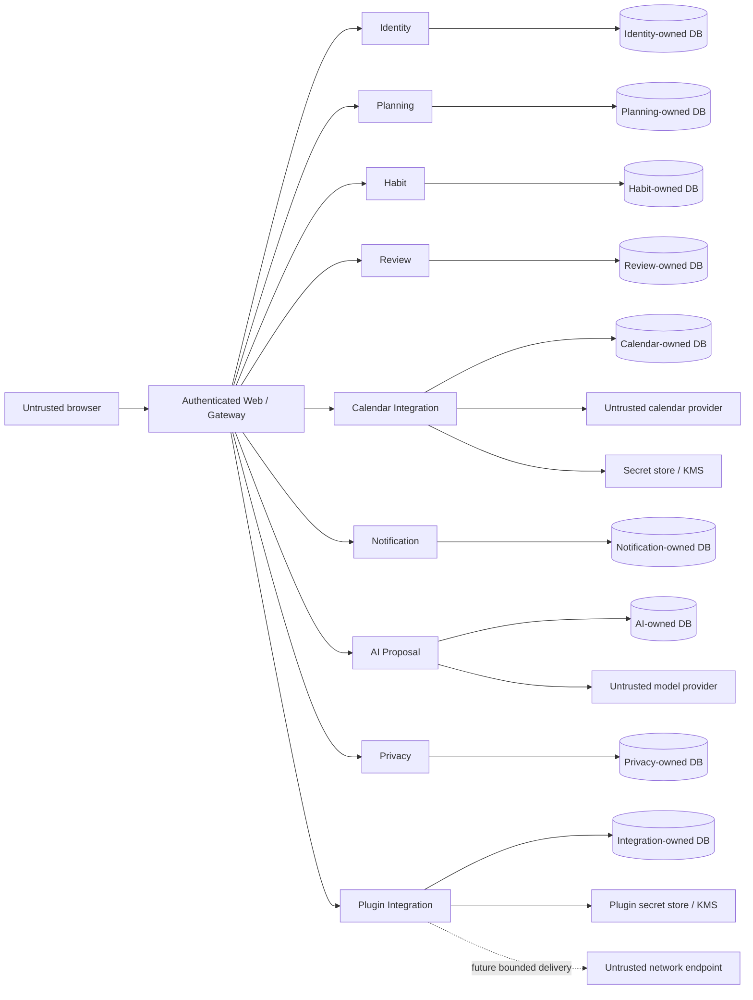

# LifeOS Threat Model

**Status:** Implemented on active PR

Protected-main source and tests are the current control evidence. Active PR controls remain non-shipped until integration.

## Assets

- tenant-owned Planning, Habit, Review, Calendar, Notification, AI, Privacy, and Plugin data;
- account, workspace membership, sessions, and authentication-age provenance;
- provider credentials, secret references, signing/MAC keys, and KMS authority;
- AI proposals, evidence, and explicit decisions;
- data-rights requests, contributor exports/receipts, aggregate terminal evidence, and protected artifacts;
- plugin installations, grants, credential bindings, operator replay evidence, and future delivery outcomes;
- database migrations, backups, release artifacts, SBOM/provenance, CI/SARIF/status evidence, and operator recovery records.

## Trust boundaries

Co-location on one PostgreSQL cluster never creates shared-table authority. Every service owns its schema/role/migrations and cannot borrow another service's credentials.

## Threats and controls

| Threat | Boundary | Primary controls | Status |
| --- | --- | --- | --- |
| Tenant/workspace/actor injection | Browser -> services | authenticated session or exact signed context; reject client-selected authority | Implemented on protected main |
| Method/path replay of signed context | Gateway -> services | exact method/path/version/issuance binding; one-time evidence where destructive | Implemented on protected main |
| Cross-service database privilege confusion | Service -> PostgreSQL | service-owned roles/schemas/migrations; no cross-table access | Implemented on protected main |
| OAuth state/redirect confusion | Identity -> provider | bounded transaction, state, provider, redirect/origin validation | Implemented on protected main |
| Calendar workspace/user substitution | Gateway -> Calendar | `life-os.calendar-user.v1`, exact returned evidence validation | Implemented on protected main |
| Orphaned calendar credential material | Calendar -> secret store/repository | secret-first persistence, reverse-order compensation, no caller-visible handles | Implemented on protected main |
| Calendar credential theft/replay | Calendar -> provider/KMS | opaque references, materialization port, concrete KMS/OAuth/refresh/revoke lifecycle | Partial |
| Stale multi-device overwrite | Web -> Planning | strong preconditions, versioning, ordered locks, explicit reconciliation | Implemented on protected main |
| Review/Habit/Planning authority replay | Gateway/contributor -> owner | exact request-bound signatures and atomic destructive replay guards | Implemented on protected main |
| Reminder duplicate delivery | Notification worker | fenced/expiring claims, idempotency, immutable outcomes | Implemented on protected main |
| AI prompt injection or silent mutation | Model -> AI/product | untrusted inert proposal, deterministic validation, explicit decision, no mutation bus | Implemented on protected main |
| Sensitive-data overexposure | Privacy/public/CI | tenant/purpose/resource/lifetime grants; bounded credential-free evidence | Implemented on protected main |
| Data-rights participant omission/false completion | Identity -> contributors | explicit versioned registry, owner verification, immutable aggregate receipt | Partial |
| Data-rights cross-tenant export/erase | Identity/contributor -> owner DB | exact workspace/actor/request binding, owner SQL only, deterministic evidence | Partial |
| Plugin manifest self-escalation | Manifest -> host | explicit host grant subset; manifest is intent only | Implemented on protected main |
| Plugin credential leakage | Host -> secret store/DB/public view | plaintext only at secret-store port; opaque binding record; compensation | Implemented on protected main |
| Plugin operator replay/identity substitution | Operator -> integration | exact one-time signed request, durable atomic replay evidence, fail-closed HTTP | Implemented on protected main |
| Plugin SSRF/DNS rebinding/outbound abuse | Integration -> network | separately host-authorized origins, address validation/pinning, redirect/proxy/size/time limits | Partial |
| Model credential or agent authority escalation | GitHub/model boundary | `NVIDIA_NIM_API_KEY` scoped to reviewed bridge; no review/merge/release authority | Accepted architecture |
| Dependency lifecycle-script escalation | Package install -> runner | exact pinned package and narrow build allowlist | Implemented on protected main |
| CI evidence identity confusion | GitHub workflows | explicit source/base/integration/checkout/protected/release identities | Partial |
| Backup corruption or unsafe restore | Operator -> storage | integrity manifest, safe-target refusal, readiness verification | Implemented on protected main |
| Release provenance mismatch | GitHub -> artifacts/deployment | exact protected source, SBOM/provenance/reproducibility and publish verification | Partial |

## Protected authority milestones

- PR #168 and PR #188 protect Planning tenant and request binding.
- PR #173 protects Habit tenant authority.
- PR #185 protects Review request-bound authority.
- PR #190 protects integration event request binding.
- PR #191 and PR #196 protect plugin operator one-time authority and HTTP composition.
- PR #157, PR #176, PR #189, PR #193, and PR #197 protect Calendar disconnect, returned evidence, read, materialization, and create boundaries.
- PR #159 protects the contributor contract; PR #179/PR #194 protect Planning contribution/transport; PR #184/PR #192 protect Habit contribution/transport.

These milestones narrow but do not erase parent-gap threats.

## Calendar abuse cases

- forged workspace/user/connection UUIDs fail before secret materialization or SQL;
- returned connection rows whose identity differs from the exact lookup fail closed;
- connection reads omit secret handles and plaintext material;
- local disconnect cannot be interpreted as provider revoke success;
- secret-first create failure compensates newly written handles without returning them;
- PR #201 protects compensation when persistence returns invalid durable evidence;
- unavailable concrete KMS/OAuth/refresh/provider cleanup remains explicit under #129.

## Data-rights abuse cases

- forged request/workspace/user/contributor UUIDs fail before SQL;
- cross-workspace or cross-requesting-user status lookup returns no existence signal;
- duplicate, corrupt, ambiguous, or malformed persisted rows fail closed;
- session rotation cannot reset recent-authentication age;
- a contributor cannot read or delete another service's tables;
- exact destructive replay returns bounded existing evidence; conflicting reuse fails;
- unknown, unavailable, or omitted contributors prevent terminal whole-product success;
- export digests are not treated as authorization, confidentiality, or signer identity;
- Review PR #195, Notification PR #198, and AI PR #199 are active-PR evidence only.

## Plugin abuse cases

- a manifest requesting undeclared or ungranted capabilities cannot self-escalate;
- cross-workspace/installer/installation/binding identifiers fail closed;
- mismatched returned installation or binding evidence cannot become authority;
- exact credential replay cannot rematerialize or overwrite a secret;
- revocation ends durable authority before external cleanup and retries never restore it;
- operator authority is bound to exact request path/method and one-time evidence;
- no operator route grants arbitrary SQL, filesystem, subprocess, tool, or network access;
- outbound URLs remain untrusted until the separate #130 authority/runtime exists.

## AI and development-model controls

AI proposals remain inert and auditable. Model content cannot authorize product mutation. Live-provider availability cannot fabricate deterministic merge success.

A strong single-route baseline precedes deeper orchestration. Conducted workflows are selected only from retained repository-specific quality/safety evidence under documented comparable budgets. `NVIDIA_NIM_API_KEY` is scoped to the reviewed model-call bridge; raw prompts/responses and hidden reasoning are not retained as public evidence. Protected PR #200 is bootstrap hardening, not model authority.

## Verification and supply-chain controls

PR #154 separates exact contributor-source evidence from independently reconstructed live-base compatibility. Issue #132 remains **Partial** because central reusable scanner checkout/SARIF/status taxonomy is not yet fully machine-auditable.

Pending, queued, skipped, cancelled, absent, neutral, stale, predecessor, status-only, synthetic-only, model-only, and rate-limited evidence is non-passing. Package lifecycle scripts remain denied except for an exact reviewed need; PR #200 is **Implemented on protected main** for the pinned OpenCode package only.

## Failure and recovery

Dependency outages return sanitized unavailable evidence and never false durable success. Partial external cleanup retains exact retry identity without restoring revoked authority. Corrupt durable evidence triggers fail-closed classification. Restore/migration/release claims require integrity, compatibility, rollback/recovery, and exact source/provenance evidence appropriate to the changed state.

## Review triggers

Update this threat model whenever a service gains persistence, credential, network, destructive, model, or release authority; a provider or contract version changes; a parent gap closes; an active PR integrates; required verification identity semantics change; or a recovery path can create orphaned external material.
