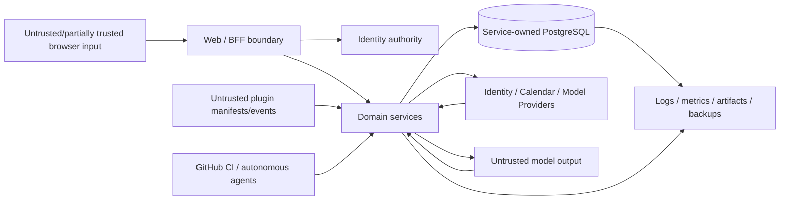

# LifeOS Threat Model

**Baseline:** protected `main` at `5c87a7ec3568a4ce47b25cad843f1bc5be91b294`  
**Scope:** upstream LifeOS software and documented reference deployment boundaries. Independent operators must extend this model for their infrastructure, providers, geography and legal obligations.

`SECURITY.md` defines vulnerability reporting and safe harbor. This file defines architecture threats and controls.

## 1. Security objectives

1. A user cannot read or mutate another workspace's data without explicit authorized membership/purpose.
2. Provider/browser/model credentials never cross into unrelated service, model, log, artifact or public-error boundaries.
3. Untrusted model/provider/plugin/calendar/browser input cannot become authority merely by being parsed.
4. Replay, stale state and concurrent workers do not create duplicate or unauthorized side effects.
5. AI proposals remain inert and auditable.
6. Privileged sensitive-data access is purpose/resource/actor bounded and auditable.
7. Backups, migrations, deployments and automation cannot silently bypass protected source/review/tenant boundaries.
8. A compromised or unavailable optional provider degrades only the capability that needs it where practical.

## 2. Assets

- user identity and workspace membership;
- goals, projects, tasks, habits, reviews and personal text;
- browser sessions and OAuth/provider credentials;
- calendar integration credentials/resource identifiers;
- notification delivery state/idempotency data;
- AI proposal/evidence/decision history;
- privacy access decisions/grants/events;
- database credentials and encryption/signing keys;
- source code, CI credentials, review evidence, releases and provenance;
- backups and deployment artifacts;
- correlation/operational metadata that may become sensitive when joined.

## 3. Trust boundaries

No arrow implies unconditional trust. Each boundary revalidates the fields it depends on.

## 4. Threat catalogue

### TM-001: OAuth callback/login substitution

**Threat:** attacker forges/replays state, substitutes provider identity, abuses redirect handling or links an identity to the wrong LifeOS user.

**Controls:** fixed provider/redirect contracts, bounded callback parsing, state/session verification, explicit external-identity mapping, provider IDs not used as internal authorization IDs, secure session cookies/revocation, provider-specific regression tests.

**Residual risk:** provider compromise/misconfiguration is operator/external-provider dependent.

### TM-002: Tenant/workspace scope injection

**Threat:** client submits another `workspace_id`/actor header or manipulates a path to access cross-tenant data.

**Controls:** derive authority from session/signed private context, tenant-scoped SQL, UUID validation, cross-tenant negative tests, no cross-service direct DB access.

**Residual risk:** a missing scope predicate in new repository code remains a critical review target.

### TM-003: Session replay/fixation/theft

**Threat:** stolen/replayed browser session accesses personal data.

**Controls:** secure HttpOnly/SameSite cookie/session handling, rotation/revocation/lifetime checks, no browser credential forwarding to domain/model services, bounded public errors.

### TM-004: Signed service-context replay/confusion

**Threat:** signed context for one actor/method/path is replayed against another operation.

**Controls:** bind workspace, actor, exact method/path, key identifier and issuance/lifetime; bounded active/previous key overlap; reject retired/unknown key IDs; tests for method/path replay.

### TM-005: SQL injection / unsafe persistence decoding

**Threat:** external text or identifiers alter SQL structure or malformed database rows become trusted objects.

**Controls:** static/parameterized SQL, bounded validators at persistence adapters, strict UUID/timestamp/enumeration parsing, credential-free failures.

### TM-006: Stale/lost update

**Threat:** multi-device or asynchronous stale state overwrites newer durable state.

**Controls:** ETag/revision/digest/idempotency semantics where implemented, stale async response ownership checks, explicit local-draft/durable distinction. Complete durable Today aggregate conflict resolution remains a high-priority product gap.

### TM-007: Duplicate side effects / replay

**Threat:** retries or concurrent workers create duplicate habit completion, notification delivery, calendar events or AI decisions.

**Controls:** idempotency keys/digests, database uniqueness/transaction serialization, expiring claims/fencing, deterministic calendar identifiers/preconditions, proposal revision/digest-bound decisions.

### TM-008: Calendar/provider SSRF or credential leakage

**Threat:** malicious provider URL/redirect/body sends tokens to untrusted hosts or causes unbounded fetch/response buffering.

**Controls:** fixed/validated provider origins, bounded redirects/response sizes/timeouts, provider-specific credential scoping, sanitized failures, deterministic resource/ETag handling. Future generic webhook/plugin delivery requires its own SSRF model.

### TM-009: Model prompt injection / data exfiltration

**Threat:** untrusted planning context instructs a model to leak secrets, mutate state or fabricate authority.

**Controls:** model receives bounded context and no browser/GitHub/review-agent credentials, output is structured untrusted data, deterministic validation, proposal is inert, retained artifacts exclude raw prompt/response/hidden reasoning/credential material, prompt-injection fixtures.

### TM-010: Model/provider unavailability or fabricated evaluation

**Threat:** CI/product claims success when live provider is missing, rate-limited or returns malformed output.

**Controls:** deterministic validators/gates are authoritative; live conformance returns sanitized unavailable/failure evidence; null metrics are not fabricated; exact provider result shape is bounded.

### TM-011: Plugin manifest/event injection

**Threat:** plugin manifest/event creates arbitrary commands, cross-tenant access, secrets or network activity.

**Controls:** versioned SDK/schema validation, bounded tenant-scoped event preparation, no direct DB access, no current generic installation/secret/outbound-delivery authority. Future delivery requires signed grants, SSRF control and audit.

### TM-012: Sensitive-data overexposure

**Threat:** broad operator/service access exposes personal goals, health, relationship or AI context beyond purpose.

**Controls:** purpose-bound privacy decisions/grants/events, least privilege, tenant scope, encryption/secret manager boundary, content-minimized logs/metrics/errors, time-bounded/single-use grants where required.

### TM-013: Privacy grant replay/expiry race

**Threat:** a consumed/expired/wrong-purpose grant is reused.

**Controls:** signed grant context, exact expiry semantics, atomic consumption, immutable decision/event evidence, concurrent winner tests, rollback when consumption cannot persist.

### TM-014: Log/metric/artifact data leakage

**Threat:** raw personal text, credentials, stack traces, prompts/model output or provider bodies enter retained public artifacts.

**Controls:** bounded structured errors, sanitized CI/model evidence, metrics dimension restrictions, no raw prompt/response retention in live conformance, synthetic fixtures in public repository.

### TM-015: Malicious or corrupted backup/restore

**Threat:** corrupted/tampered archive, restore into wrong/non-empty target, hidden destructive overwrite.

**Controls:** checksum verification, selected custom-format archive, empty-target refusal, real restore integration tests, private metadata/evidence, explicit statement that logical dumps are not PITR.

### TM-016: Deployment privilege or rollback failure

**Threat:** deployment applies unreviewed mutable image/config or rollback claim does not restore workload state.

**Controls:** digest-pinned images/reference renderer, protected production environment, server-side dry run/diff, capture existing deployment/revision, verify rollback/deletion result, least-privilege workload/network defaults.

### TM-017: CI/autonomous-agent supply-chain compromise

**Threat:** mutable action/dependency, broad token, encoded patch or model output writes unsafe code/workflow, or automation bypasses review.

**Controls:** exact-head/base/blob guards, immutable action/dependency pins where required, least privilege, separate model/review credentials, AppGuardrail/Semgrep/GHAS/review gates, no fabricated approval, temporary repair scaffolding removed when obsolete, bounded autonomous writer lease.

### TM-018: Concurrency between repository writers

**Threat:** two agents overwrite/race the same PR branch based on stale evidence.

**Controls:** writer lease, pre-write refetch, freeze only conflicting target, no force-push/admin bypass, exact-head verification after writes.

## 5. Privacy misuse cases

- An operator searches personal text without a valid support/security/legal purpose.
- An AI feature receives more user history than needed for the selected proposal.
- Calendar/plugin provider tokens are reused for unrelated providers/tasks.
- An exported artifact contains internal audit/credential material.
- A support/debug log retains personal action text indefinitely.

Mitigations must combine purpose, resource/tenant scope, bounded retention, encryption, explicit export contracts and immutable access evidence. Redaction alone is insufficient.

## 6. Availability and resource exhaustion

Threats include oversized HTTP/model/provider payloads, slow subprocess/network calls, worker claim leakage, high-cardinality telemetry, repeated invalid OAuth/provider requests and expensive live-model orchestration.

Controls include size/count/time bounds, abort/timeout semantics, bounded worker concurrency, fatigue/rate policies, no unbounded telemetry labels and provider-unavailable degradation.

## 7. Security acceptance evidence

A security-sensitive change is not complete until applicable evidence exists:

- realistic exploit/regression test;
- tenant-negative test;
- malformed/oversized input test;
- replay/concurrency test;
- exact permission/credential boundary verification;
- AppGuardrail/Semgrep/GHAS/current-head security checks;
- no unresolved valid security review thread;
- migration/rollback/incident evidence for persistence/deployment changes.

## 8. Out-of-scope / operator extension

This upstream threat model does not prove security of an independent operator's:

- cloud account/IAM;
- cluster/control plane;
- DNS/TLS/ingress/WAF;
- managed database/NATS;
- secret manager/KMS;
- employee/admin devices;
- identity/calendar/model provider tenant configuration;
- data-retention/legal process;
- SOC 2/CSAP/ISO certification.

Operators must extend and validate these boundaries for their deployment.
