# LifeOS UML and Interaction Views

**Status:** Implemented on active PR

These diagrams describe current protected-main behavior unless a section is explicitly labeled `Implemented on active PR`, `Partial`, `Planned`, or another canonical status.

## Bounded-context topology

**Status:** Implemented on protected main

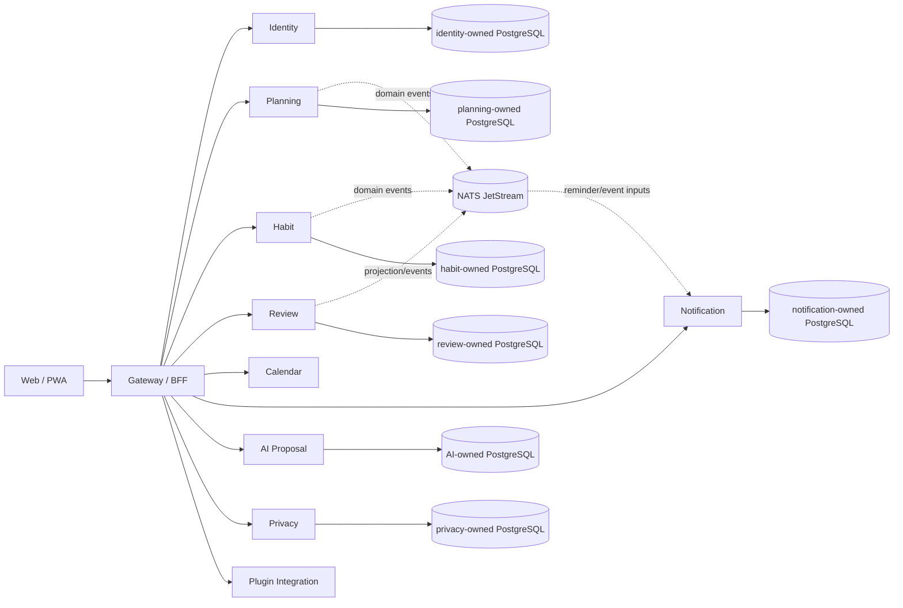

Physical co-location does not grant cross-service table authority.

## Login and workspace sequence

**Status:** Implemented on protected main

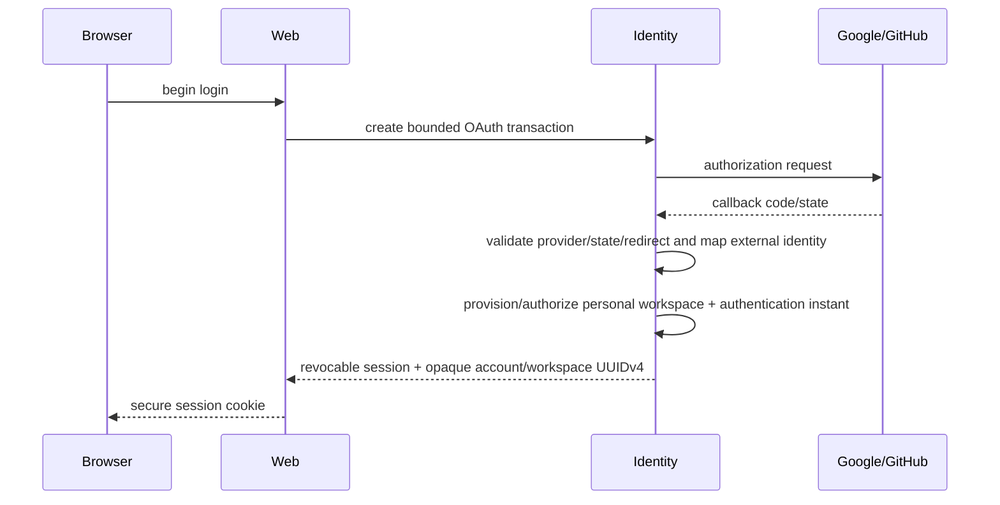

Session rotation does not manufacture a new authentication ceremony.

## Goal / Project / Task / Today lifecycle

**Status:** Implemented on protected main

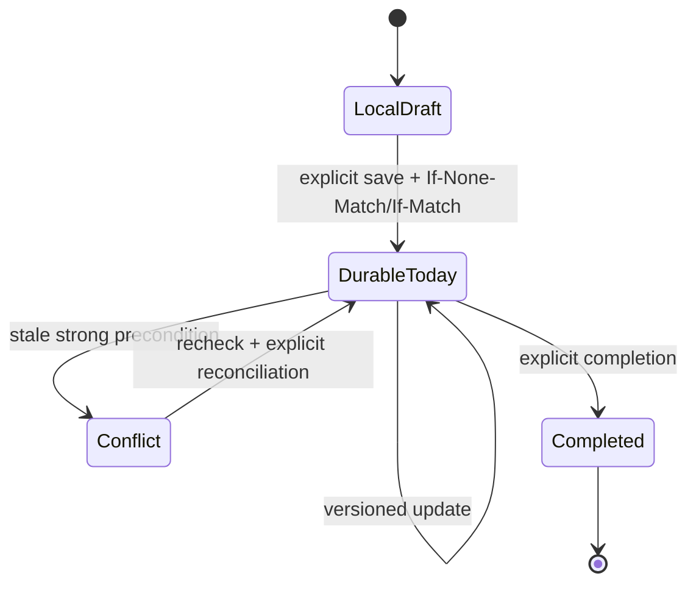

The durable Today aggregate, local-to-workspace migration, replay protection and stale reconciliation are implemented on protected main through PR #127.

## Review flow

**Status:** Implemented on protected main

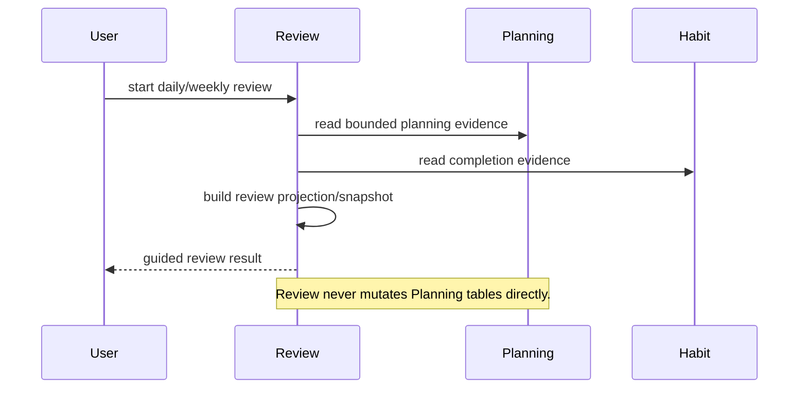

## Calendar synchronization

**Status:** Implemented on protected main

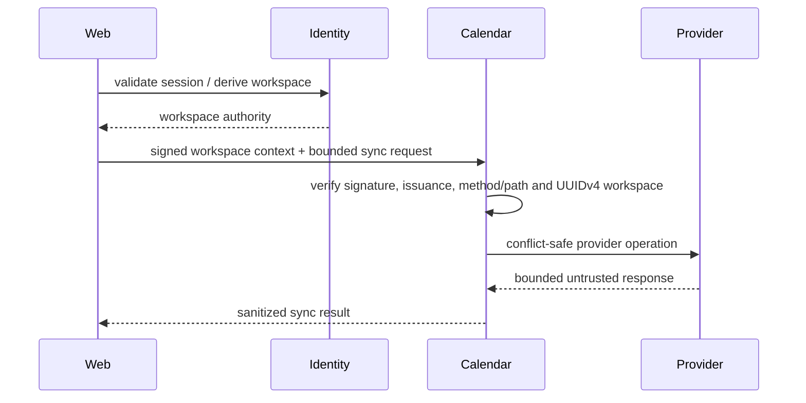

Per-user encrypted credential persistence/refresh/revocation and calendar selection are **Partial** and tracked by issue #129.

## AI proposal / evidence / decision

**Status:** Implemented on protected main

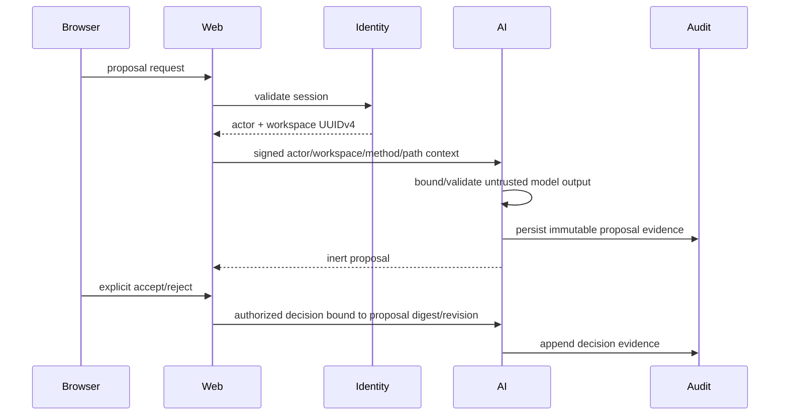

## Data-rights durable foundation

**Status:** Implemented on protected main

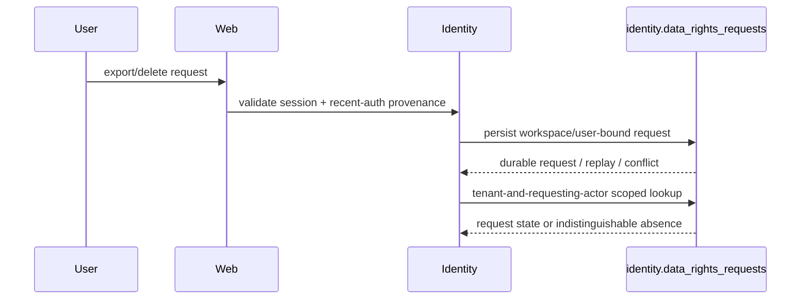

Recent-auth provenance, ownership binding, durable request/terminal receipt and tenant-scoped status lookup are protected-main behavior through #134/#136/#137/#138/#144.

## Authenticated data-rights status resource

**Status:** Implemented on active PR

**Evidence:** PR #146.

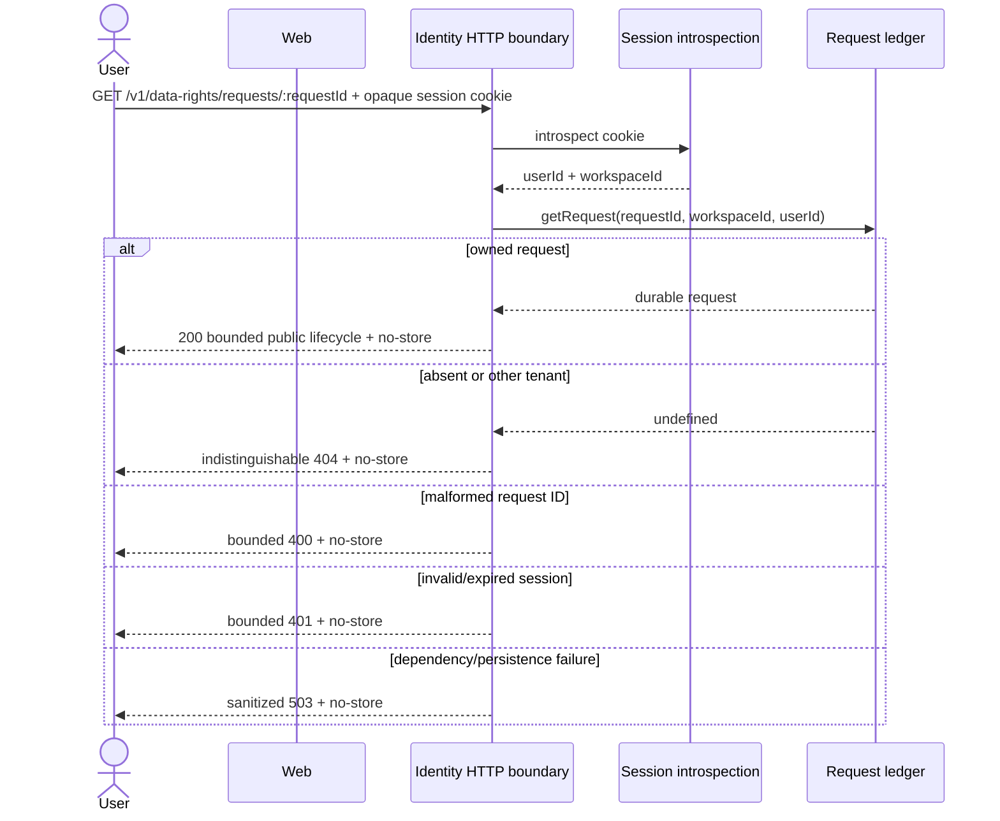

The public projection excludes workspace/user IDs, idempotency keys and request/receipt digests. Complete contributor orchestration, reconciliation, retention/legal-hold and protected export delivery remain **Partial** under issue #55.

## Purpose-bound sensitive-data access

**Status:** Implemented on protected main

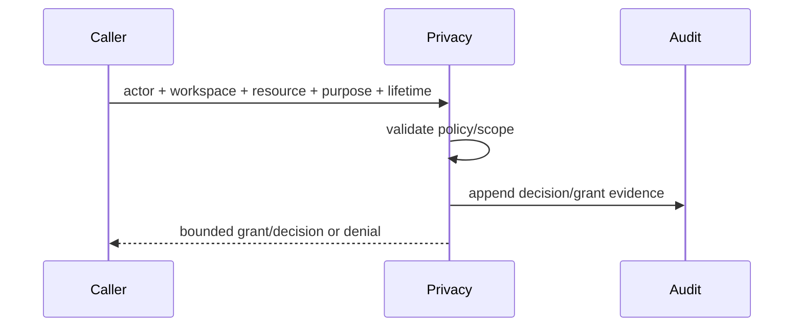

## Backup / restore

**Status:** Implemented on protected main

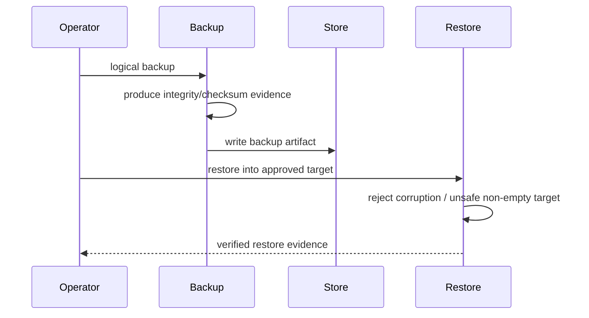

## Deployment topology

**Status:** Implemented on protected main

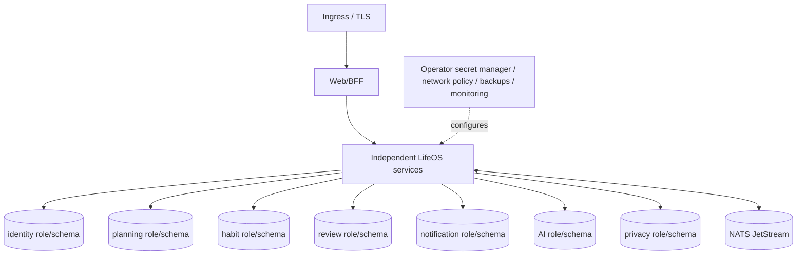

The nodes represent separate service-owned database authority even when an operator co-locates them on one PostgreSQL cluster.

## Verification evidence identity

**Status:** Implemented on active PR

**Evidence:** ADR 0010 and PR #147.

The exact **source head** and a GitHub **synthetic merge** tree are different evidence subjects. The PR base snapshot is also distinct from the current live base tip.

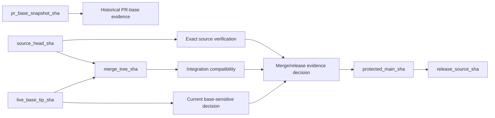

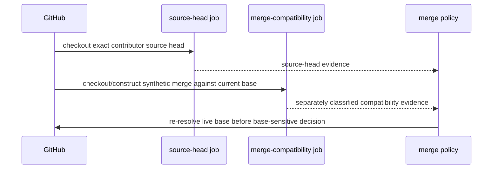

No green status is silently transferred across these identities. Issue #132 remains open until the active implementation is integrated and residual required-workflow attribution is reconciled.

## Degraded modes

**Status:** Accepted architecture

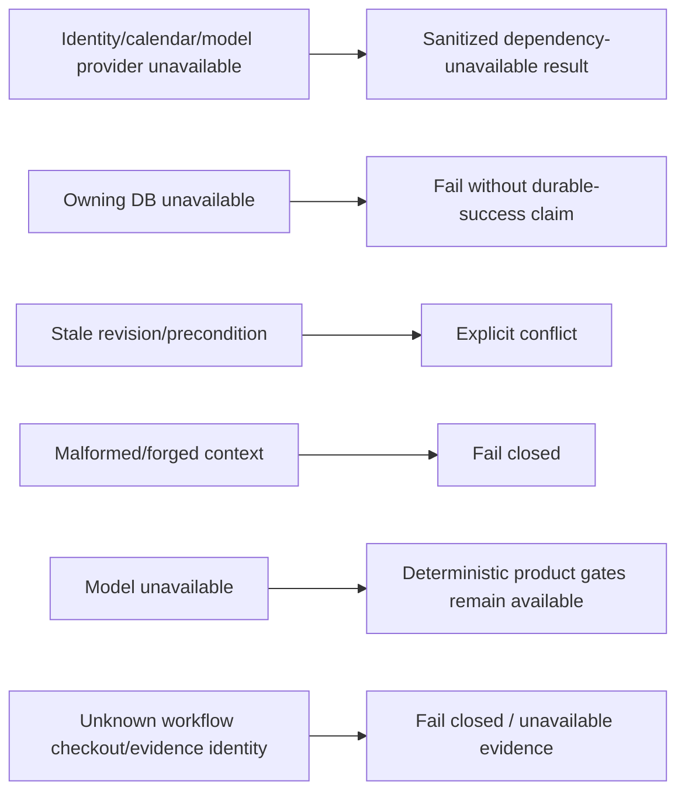
