# LifeOS UML, C4, Authority, and Recovery Views

**Status:** Implemented on active PR

Protected-main behavior is labeled explicitly. Active-PR diagrams describe reviewed branch scope only and are not shipped truth.

## C4 bounded-context topology

**Status:** Implemented on protected main

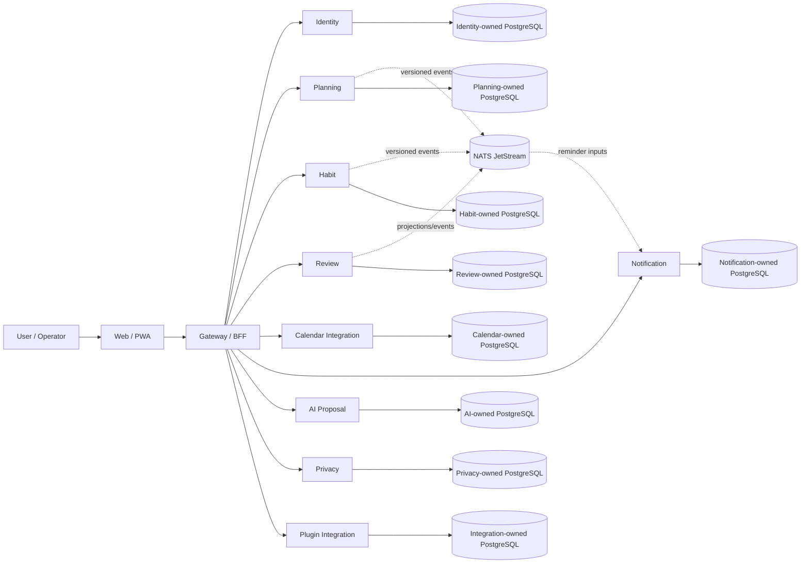

No arrow authorizes cross-service SQL. Every service retains migrations, credentials, transactions, backup semantics, observability, and recovery ownership.

## Identity and workspace authority

**Status:** Implemented on protected main

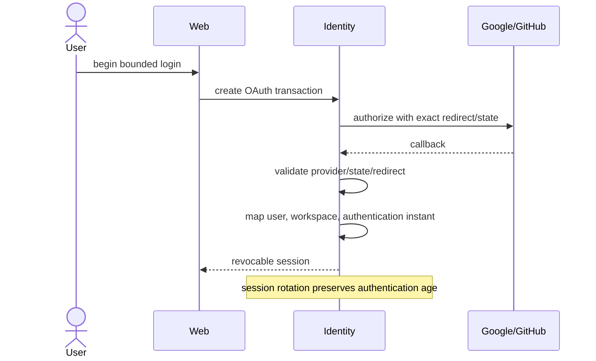

## Planning, Habit, Review, Today, and first-party journey

### Protected authority

**Status:** Implemented on protected main

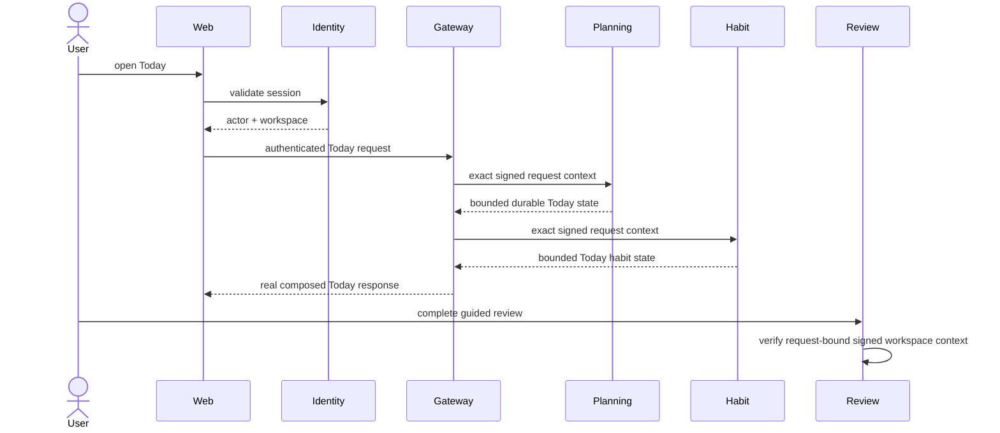

PR #168 and PR #188 protect Planning authority; PR #173 protects Habit authority; PR #185 protects Review authority; PR #186 and PR #187 protect real Planning/Habit Gateway composition. Issue #163 is completed.

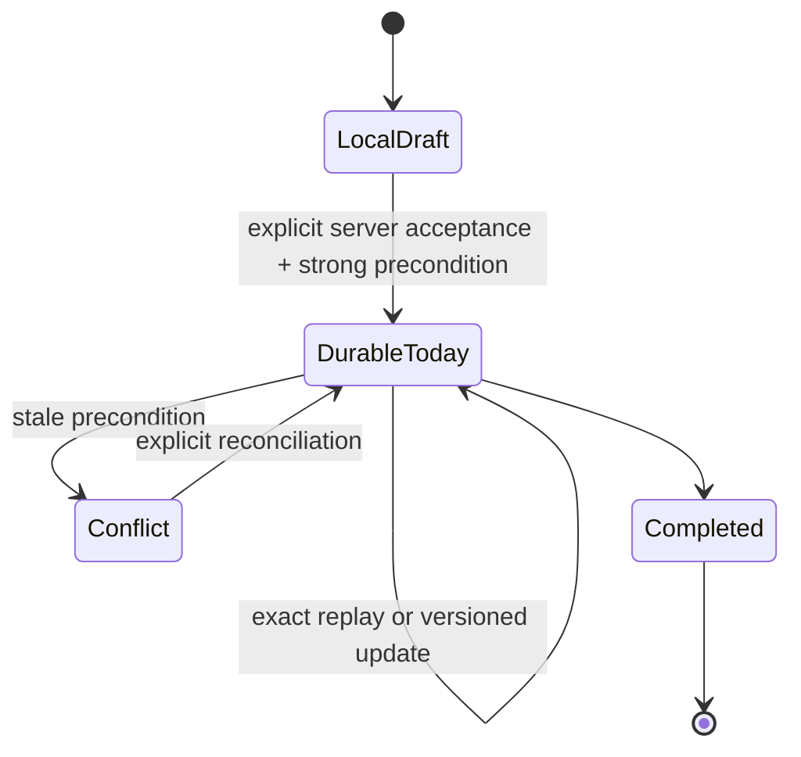

### Active first-party buyer journey

**Status:** Partial

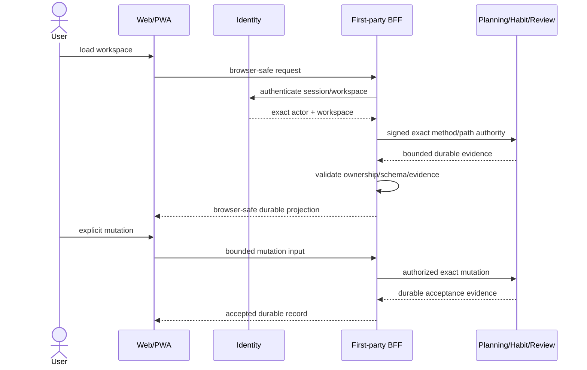

Issue #209 is the complete Goals → Projects → Tasks → Habits → Review journey. PR #214 starts the active line with the authenticated Goal BFF; PR #229 adds the durable Goals workspace; stacked PR #234 is the current Weekly Review workspace. Browser state never creates workspace authority or durable identity. Completion still requires the full dependency stack, final current-head E2E, Figma/Storybook traceability, normal/loading/empty/error/permission/responsive/interaction states, keyboard/focus/reduced-motion/a11y, authoritative Review read projections, and KO/EN/JA/ZH/VI/ES/DE/FR parity.

## Calendar connection and credential lifecycle

### Protected-main lifecycle

**Status:** Implemented on protected main

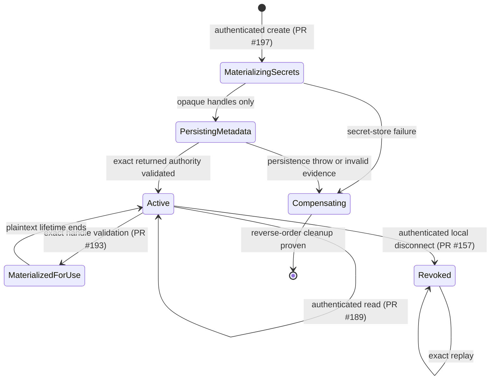

PR #150 protects connection metadata, PR #153 protects atomic local revocation, PR #155 protects `life-os.calendar-user.v1`, PR #176 protects exact lookup evidence, PR #189 protects bounded read, PR #193 protects materialization, PR #197 protects authenticated creation, PR #201 protects returned-evidence compensation, and PR #203 protects the Calendar-owned encrypted self-hosted secret-store profile.

### Active hosted OAuth authority

**Status:** Partial

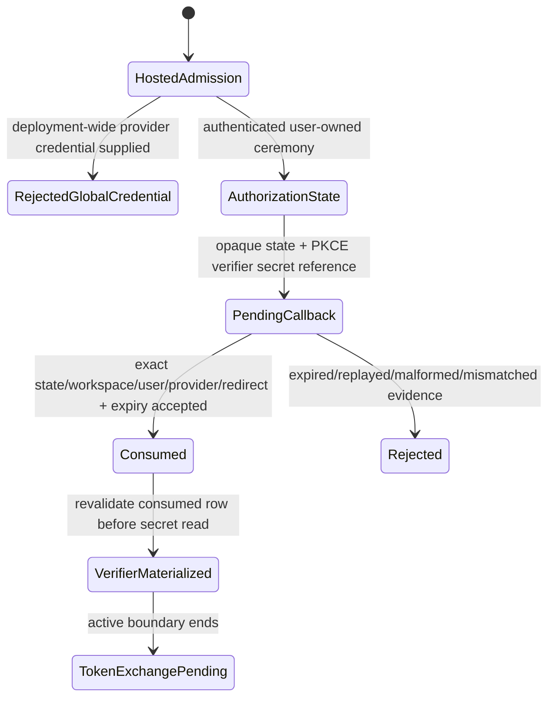

Active PR #216 provides the fail-closed hosted admission boundary. Stacked PR #228 provides five-minute OAuth state/PKCE authority with verifier plaintext outside durable metadata. `TokenExchangePending` is deliberately not implemented by this stack: hosted callback/token exchange, successful verifier cleanup, concrete PostgreSQL OAuth-state runtime, refresh fencing, provider revoke/delete recovery, discovery/selection and scoped synchronization remain **Partial** under #129.

## Data-rights orchestration and contributor authority

### Protected contributor contract

**Status:** Partial

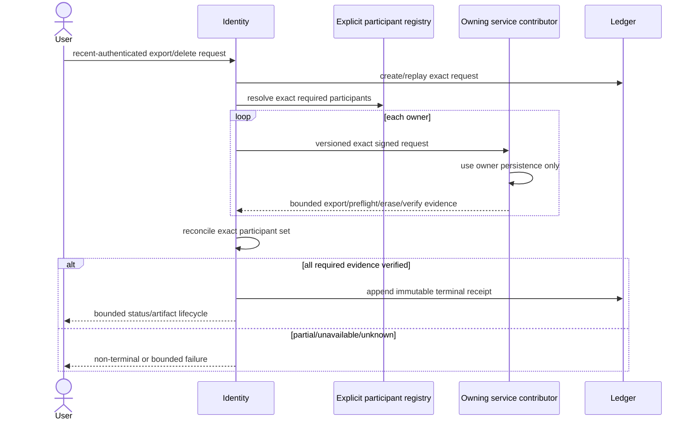

PR #159 protects the shared contract. Planning is protected through PR #179 and PR #194. Habit is protected through PR #184 and PR #192. Review is protected through PR #195. Notification PR #198 and AI PR #199 are **Implemented on active PR**. Issue #55 remains **Partial**.

### Contributor maturity

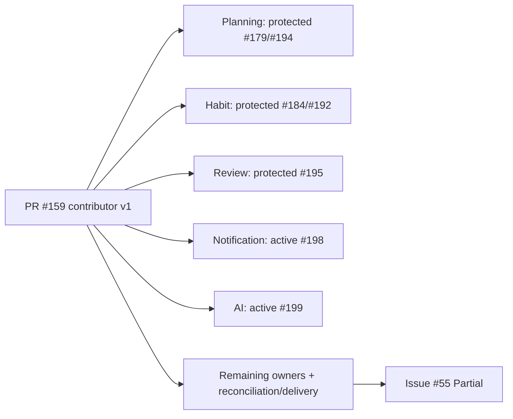

## Plugin installation, credential, delivery-origin, and operator authority

**Status:** Partial

### Protected foundation

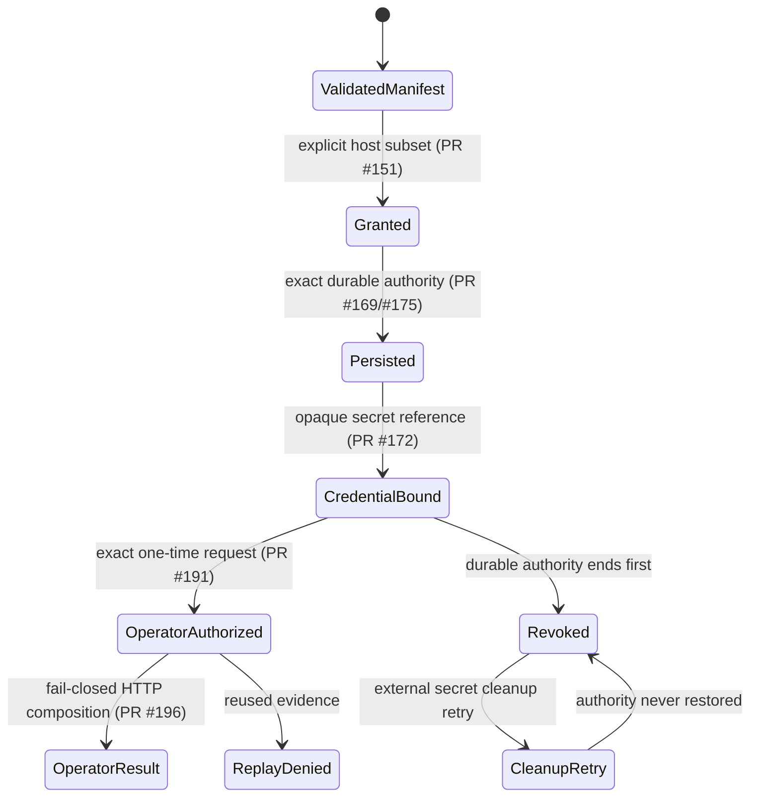

### Active #130 persistence and operator stack

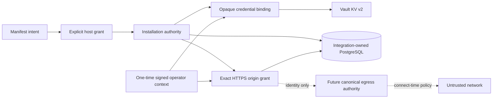

Active #205 establishes the origin aggregate; #235 adds PostgreSQL grant persistence and installation fencing; #241 strengthens credential/revocation authority; #242 adds the Vault KV v2 secret store; #243/#244 compose Vault and one Integration-owned PostgreSQL pool; #245 supplies the concrete hosted/default-entrypoint runtime; #250 adds exact signed grant/read/revoke application authority for delivery origins.

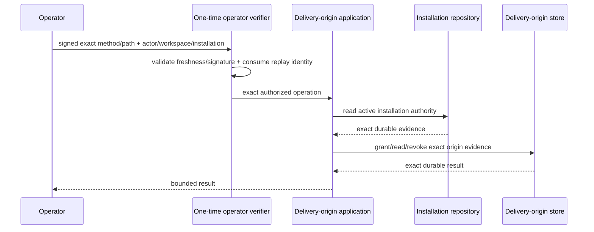

#250 deliberately stops here. No public delivery-origin HTTP transport or outbound HTTPS is implied. #130 remains **Partial** until immutable released/versioned canonical egress authority enforces connect-time DNS/IP/rebinding, redirect/proxy and bounded time/response policy and LifeOS persists delivery attempts/outcomes with retry/dead-letter, revocation fencing and operator recovery.

## AI proposal and explicit decision

**Status:** Implemented on protected main

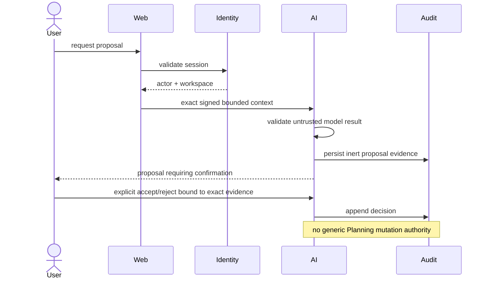

## Model-assisted development and repository authority

**Status:** Partial

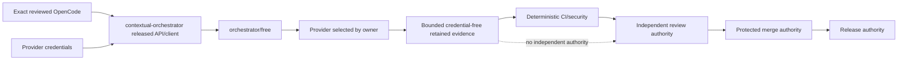

Protected #200 covers only the exact OpenCode bootstrap allowlist. Active #208 is the target routing line: exact OpenCode identity plus contextual-orchestrator/`orchestrator/free`, with provider credentials/model selection remaining owner-side. It fails closed pending a repaired authentication/bootstrap owner contract, immutable reviewed owner release, and exact released consumer acceptance. Mutable owner source or direct-provider fallback is not authorized.

## Verification evidence authority

**Status:** Implemented on protected main

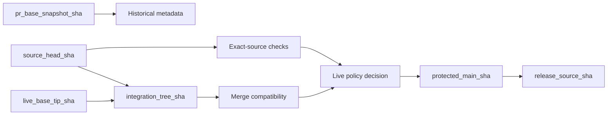

PR #154 protects exact-source/live-base separation. Issue #132 remains **Partial** for central reusable scanner checkout/attribution taxonomy. A green result never transfers across evidence identities.

## Release-evidence authority

**Status:** Partial

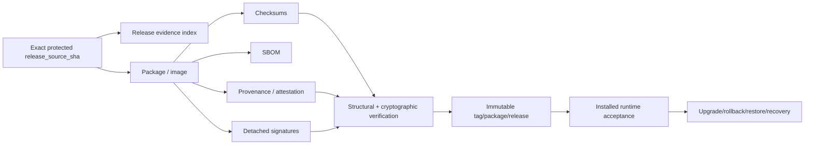

Active Draft #217 provides structural index validation and #236 adds detached Ed25519 verification/operator tooling. The diagram's `Publish`, trust-root/key lifecycle, installed acceptance and recovery nodes remain **Partial** under #210 until proved on one unchanged protected release source.

## Deployment and recovery

**Status:** Implemented on protected main

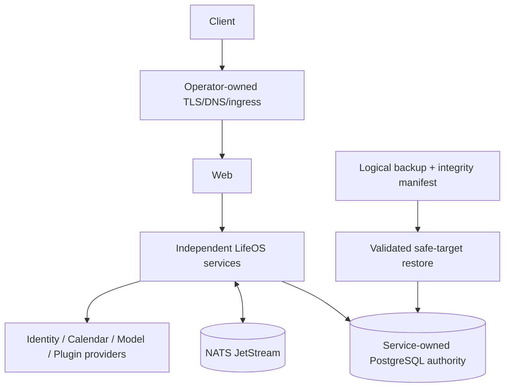

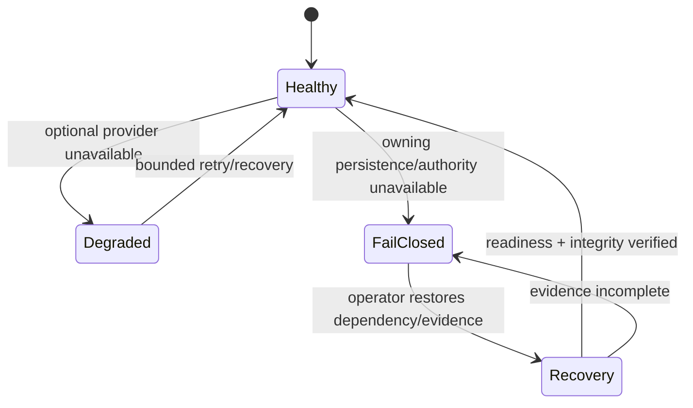

Logical backup/restore does not claim PITR. External provider cleanup/recovery and release rollback preserve explicit partial-state evidence rather than fabricate success.

## Degraded-mode matrix

| Failure | Required behavior | Status |
| --- | --- | --- |
| Identity/calendar/model provider unavailable | bounded dependency failure; unrelated domains remain usable where safe | Accepted architecture |
| Owning PostgreSQL unavailable | durable mutation fails closed; local draft remains visibly non-durable | Implemented on protected main |
| Vault/secret store unavailable | credential/origin-dependent operation fails closed; no plaintext persistence fallback | Implemented on active PR |
| NATS unavailable | no fabricated delivery success; replay/recovery evidence remains | Implemented on protected main |
| Stale write | explicit conflict/revision evidence, never silent overwrite | Implemented on protected main |
| Malformed/forged service context | fail closed without reflecting identifiers or secrets | Implemented on protected main |
| Unknown/stale verification identity | non-passing evidence, never promoted success | Implemented on protected main |
| Partial external secret/provider cleanup | retain retry identity without restoring revoked authority | Partial |
| Missing canonical egress authority | plugin outbound delivery remains unavailable rather than treating stored origin as network authorization | Partial |
| Missing immutable contextual-orchestrator release/authentication contract | model-assisted lane fails closed; no direct-provider bypass | Partial |
| Release evidence mismatch or missing trust/recovery evidence | no immutable release promotion | Partial |
