# LifeOS UML and Interaction Views

**Status:** Implemented on active PR

These diagrams describe current protected-main behavior unless a section is explicitly labeled `Implemented on active PR`, `Partial`, `Planned`, or another canonical status.

## Bounded-context topology

**Status:** Implemented on protected main

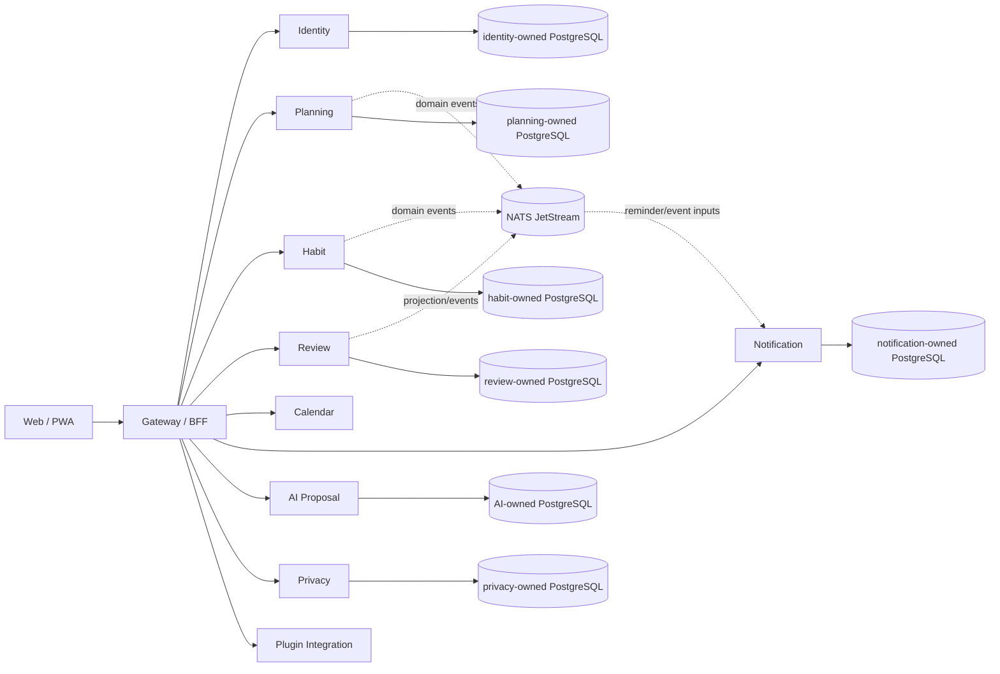

Physical co-location does not grant cross-service table authority.

## Login and workspace sequence

**Status:** Implemented on protected main

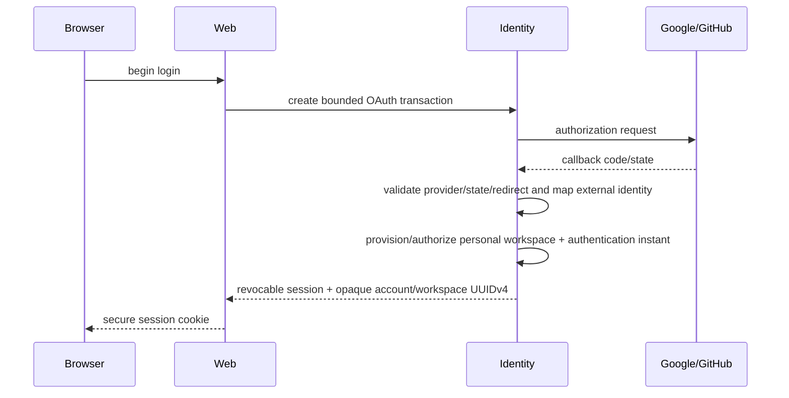

Session rotation does not manufacture a new authentication ceremony.

## Goal / Project / Task / Today lifecycle

**Status:** Implemented on protected main

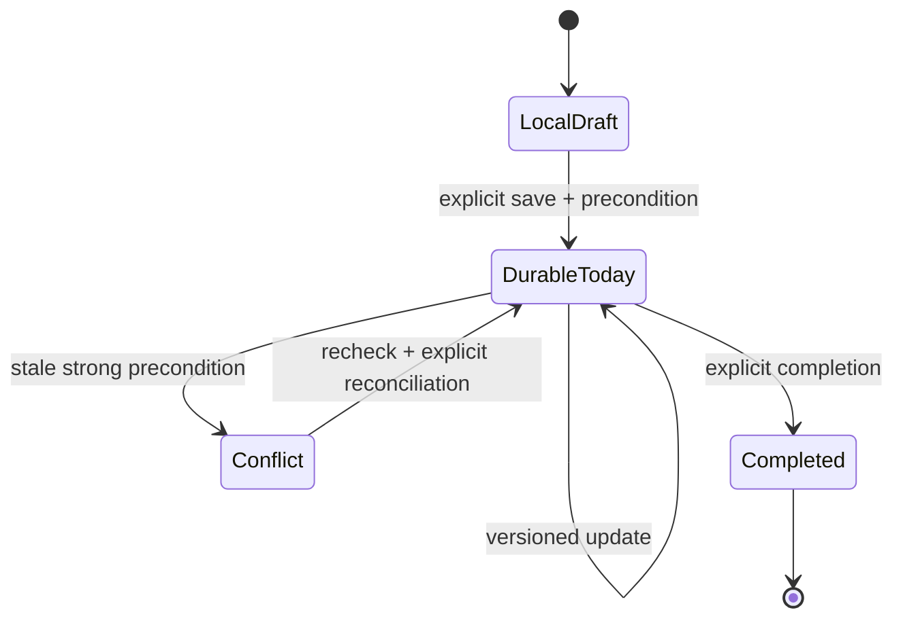

The durable Today aggregate, local-to-workspace migration, replay protection and stale reconciliation are implemented on protected main through PR #127.

## Review flow

**Status:** Implemented on protected main

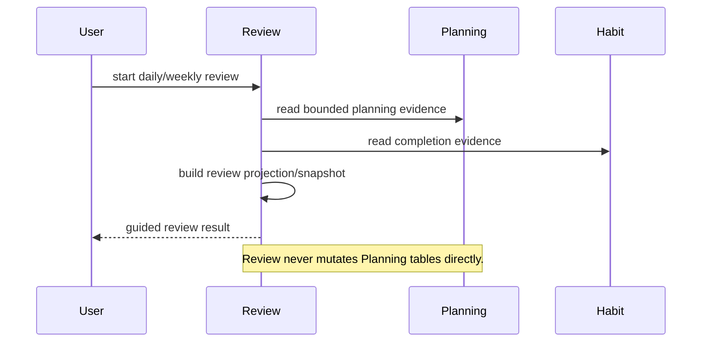

## Calendar synchronization

**Status:** Implemented on protected main

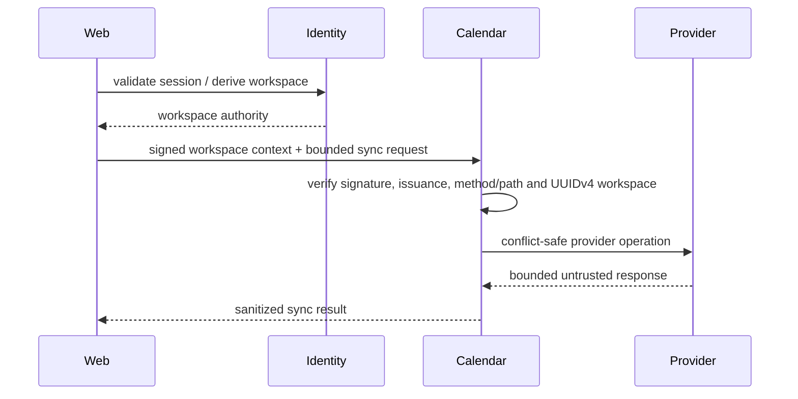

## Calendar connection registry foundation

**Status:** Implemented on protected main

**Evidence:** PR #150 merged as `1623df364925f84920c07c112f1ae96777277d20`; full hosted credential lifecycle remains `Partial` under issue #129.

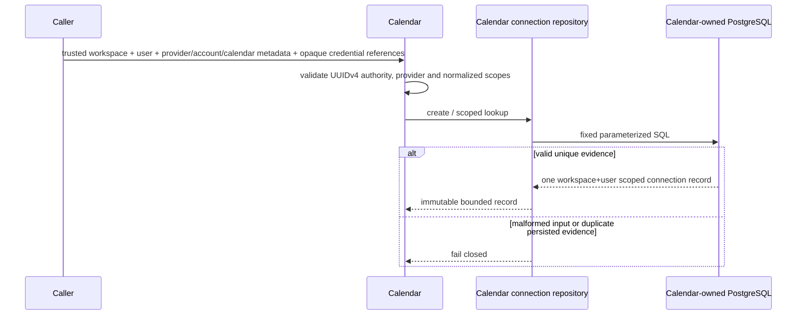

The protected migration/repository is a persistence foundation only; OAuth callback state, managed secret storage, refresh/revocation and discovery/selection remain separate issue #129 work.

## AI proposal / evidence / decision

**Status:** Implemented on protected main

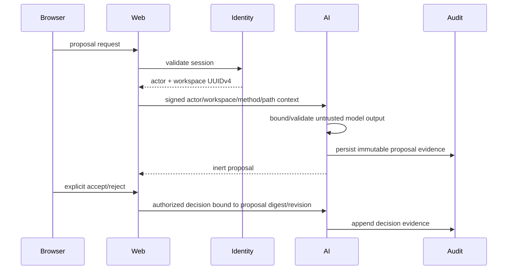

## Data-rights request and status lifecycle

**Status:** Implemented on protected main

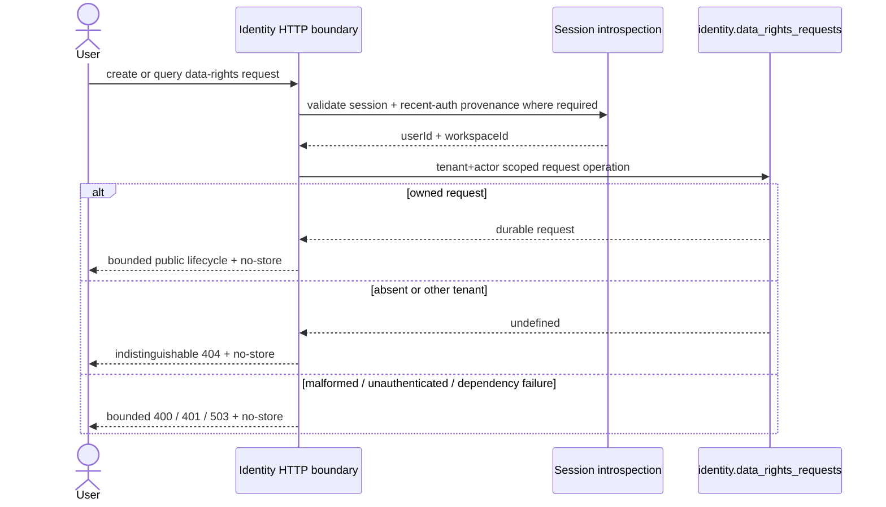

PR #146 is protected-main evidence for the authenticated public status resource. Complete cross-domain export/deletion remains `Partial` under issue #55.

## Tenant export integrity flow

**Status:** Implemented on protected main

**Evidence:** PR #149.

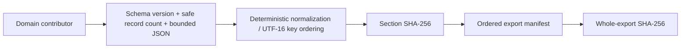

Integrity digests do not grant access authority, confidentiality, provenance or signature identity.

## Purpose-bound sensitive-data access

**Status:** Implemented on protected main

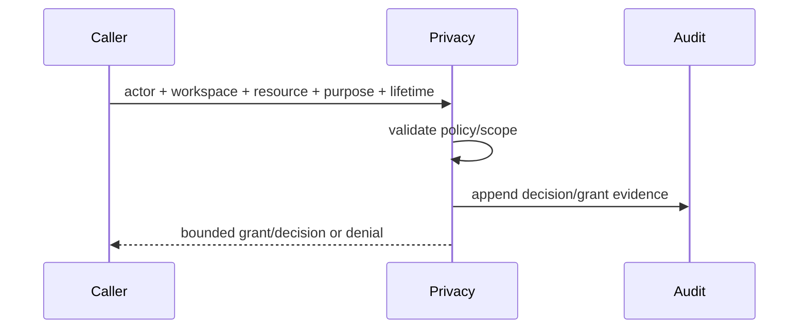

## Plugin installation authority

**Status:** Implemented on active PR

**Evidence:** PR #151; full runtime remains incomplete under issue #130.

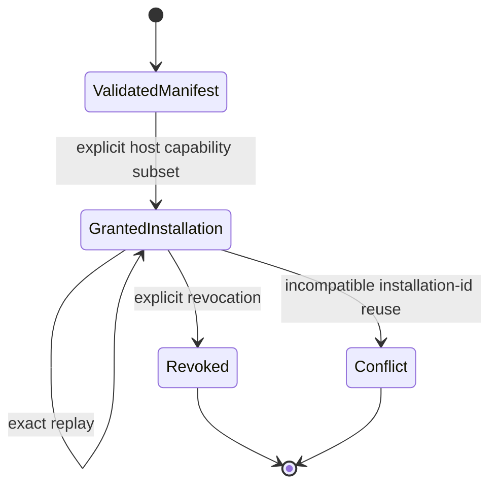

A manifest requests capabilities but does not grant them. This active application authority does not imply durable plugin-secret or outbound-delivery persistence exists.

## Backup / restore and deployment

**Status:** Implemented on protected main

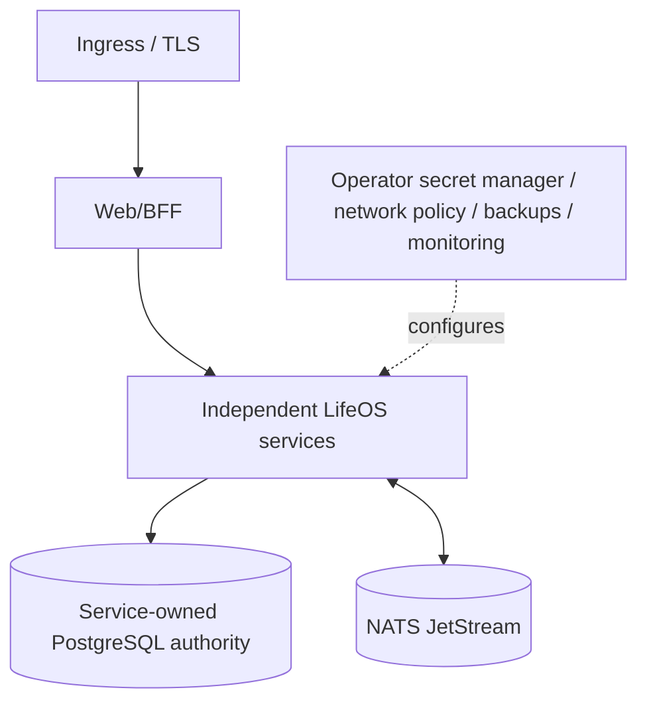

Logical backup/restore verifies integrity and unsafe-target refusal; it does not claim PITR or managed infrastructure ownership.

## Verification evidence identity

**Status:** Implemented on active PR

**Evidence:** ADR 0010 and PR #147.

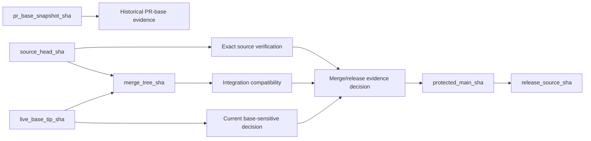

No green status is silently transferred across evidence identities. Issue #132 remains open until PR #147 integrates and residual required-workflow attribution is reconciled.

## Degraded modes

**Status:** Accepted architecture

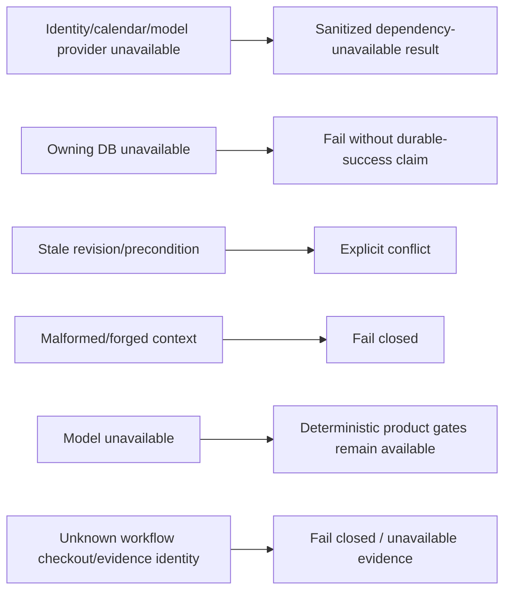
