# LifeOS UML, C4, Authority, and Recovery Views

**Status:** Implemented on active PR

Protected-main behavior is labeled explicitly. Active-PR diagrams describe reviewed branch scope only and are not shipped truth.

## C4 bounded-context topology

**Status:** Implemented on protected main

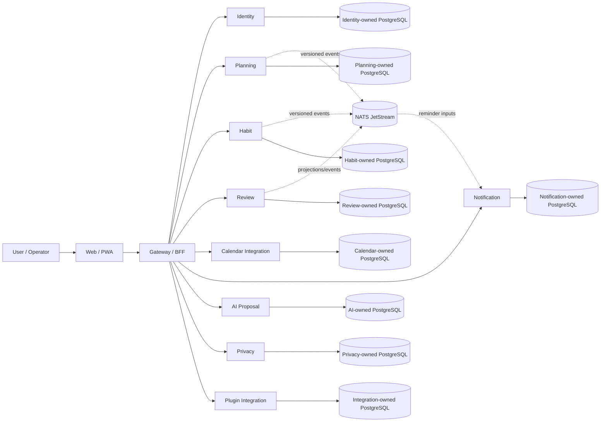

No arrow authorizes cross-service SQL. Every service retains migrations, credentials, transactions, backup semantics, observability, and recovery ownership.

## Identity and workspace authority

**Status:** Implemented on protected main

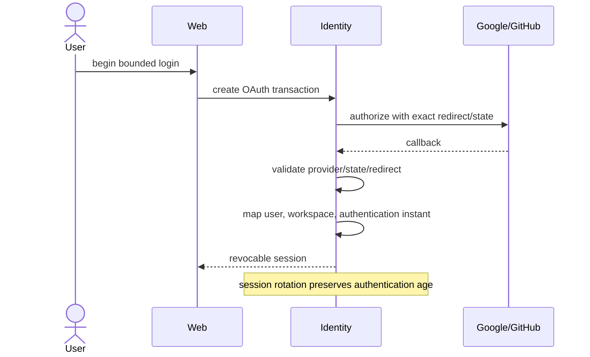

## Planning, Habit, Review, and Today authority

**Status:** Implemented on protected main

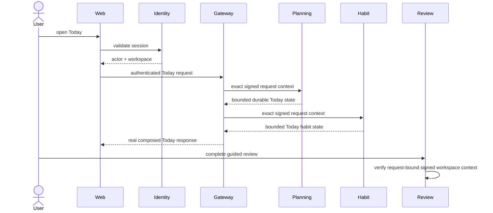

PR #168 and PR #188 protect Planning authority; PR #173 protects Habit authority; PR #185 protects Review authority; PR #186 and PR #187 protect real Planning/Habit Gateway composition. Issue #163 is completed.

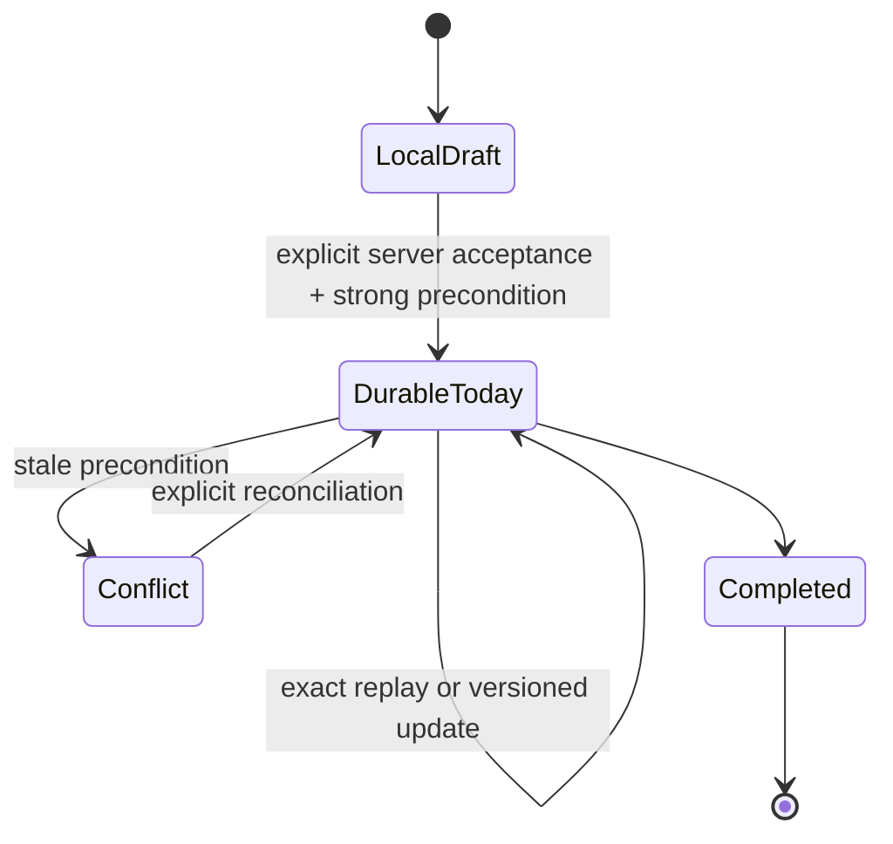

## Calendar connection and credential lifecycle

### Protected-main lifecycle

**Status:** Implemented on protected main

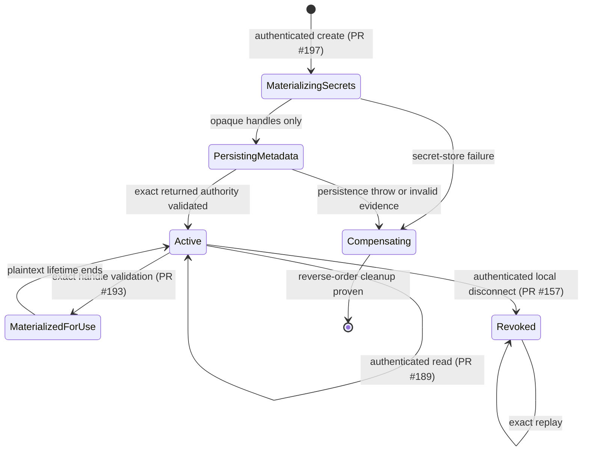

PR #150 protects connection metadata, PR #153 protects atomic local revocation, PR #155 protects `life-os.calendar-user.v1`, PR #176 protects exact lookup evidence, PR #189 protects bounded read, PR #193 protects materialization, and PR #197 protects authenticated creation.

### Protected compensation hardening

**Status:** Implemented on protected main

```mermaid
sequenceDiagram
    participant Caller
    participant Create as Calendar create application
    participant SecretStore
    participant Repository
    Caller->>Create: signed workspace+user authority + bounded credentials
    Create->>SecretStore: store access material
    SecretStore-->>Create: opaque access handle
    Create->>SecretStore: store refresh material
    SecretStore-->>Create: opaque refresh handle
    Create->>Repository: persist metadata + exact handles
    Repository-->>Create: mismatched durable evidence
    Create->>SecretStore: delete refresh handle
    Create->>SecretStore: delete access handle
    Create-->>Caller: bounded dependency failure
```

This PR #201 flow is protected-main evidence. Complete KMS/OAuth/refresh/provider cleanup/discovery/selection/scoped sync remains **Partial** under #129.

## Data-rights orchestration and contributor authority

### Protected contributor contract

**Status:** Partial

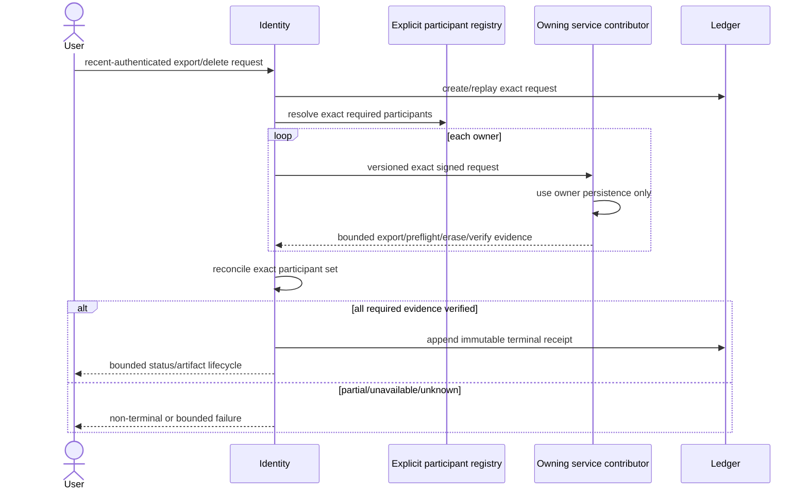

PR #159 protects the shared contract. Planning is protected through PR #179 and PR #194. Habit is protected through PR #184 and PR #192. Review PR #195, Notification PR #198, and AI PR #199 are **Implemented on active PR**. Issue #55 remains **Partial**.

### Contributor maturity

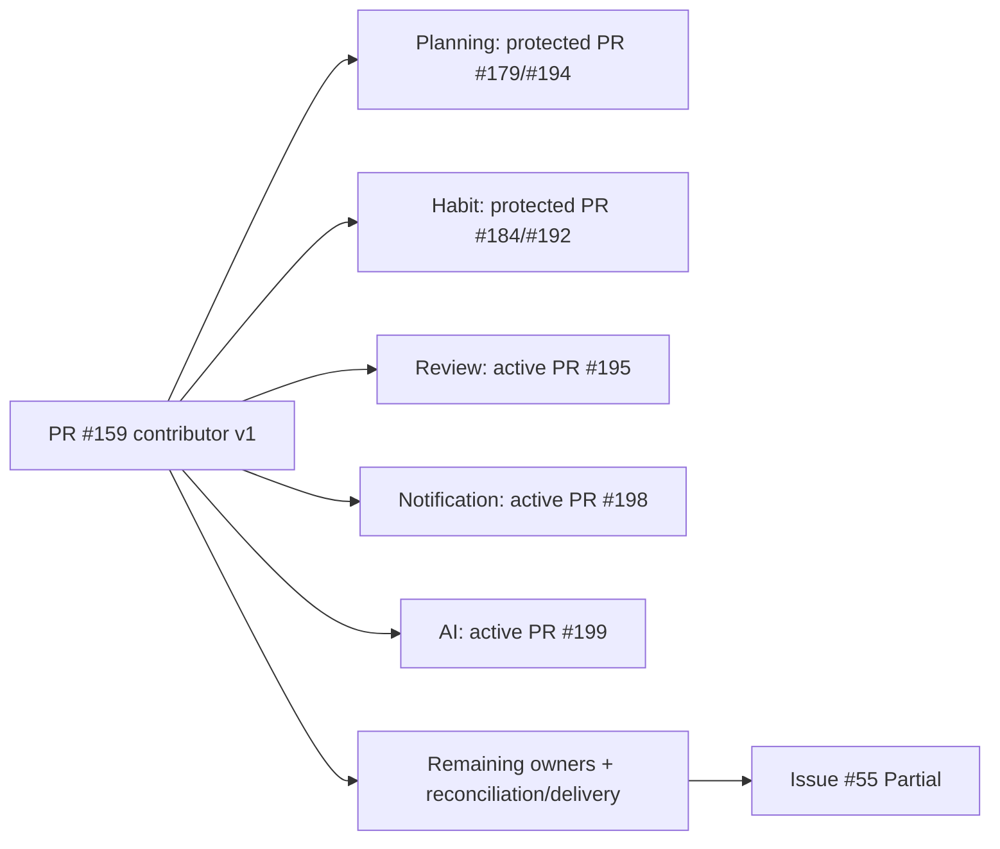

## Plugin installation, credential, and operator authority

**Status:** Partial

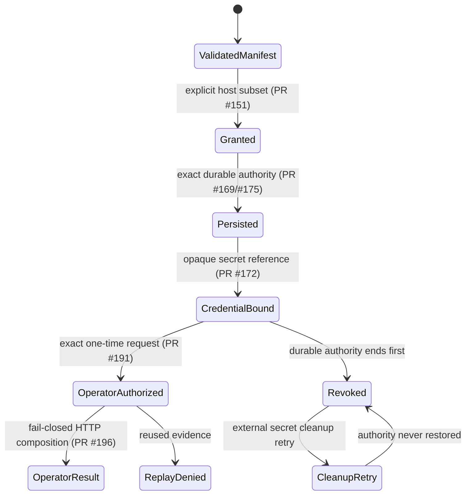

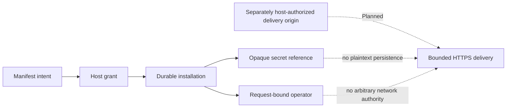

Concrete KMS, authorized-origin registry, SSRF/DNS-rebinding-safe delivery, outcomes, retry/dead-letter, and operator recovery remain **Partial** under #130.

## AI proposal and explicit decision

**Status:** Implemented on protected main

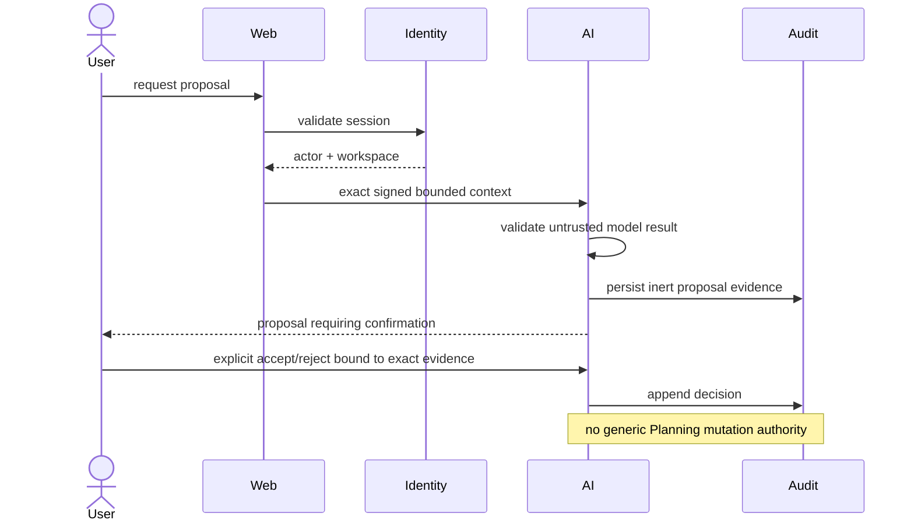

## Model-assisted evaluation and repository authority

**Status:** Accepted architecture

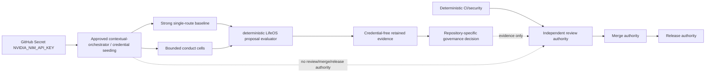

Supported controls may include workflow stage, reasoning effort, decomposition, recursion depth, role-specific reasoning effort, worker/model choice, verifier topology, and access/communication topology. Unsupported controls remain explicit. PR #200 is **Implemented on protected main** only for restoring the exact pinned OpenCode postinstall boundary.

## Verification evidence authority

**Status:** Implemented on protected main

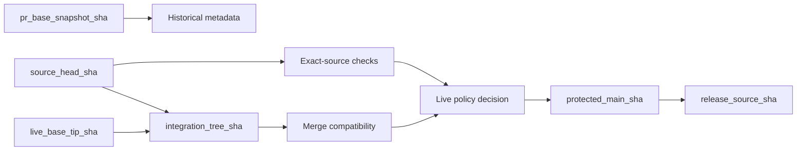

PR #154 protects exact-source/live-base separation. Issue #132 remains **Partial** for central reusable scanner checkout/attribution taxonomy. A green result never transfers across evidence identities.

## Deployment and recovery

**Status:** Implemented on protected main

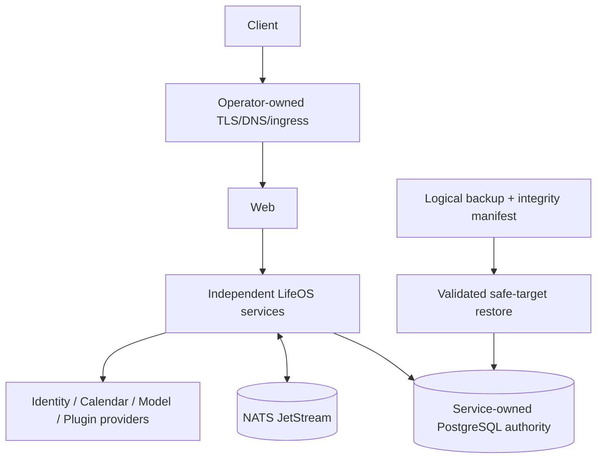

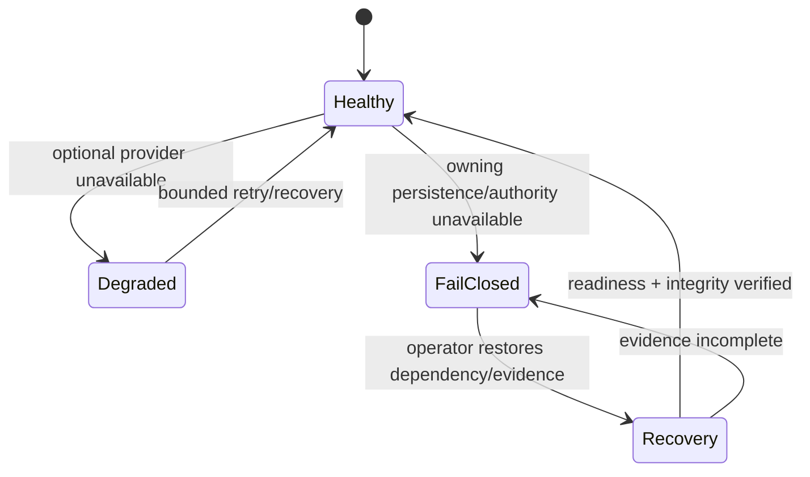

Logical backup/restore does not claim PITR. External provider cleanup/recovery and release rollback preserve explicit partial-state evidence rather than fabricate success.

## Degraded-mode matrix

| Failure | Required behavior | Status |
| --- | --- | --- |
| Identity/calendar/model provider unavailable | Bounded dependency failure; unrelated domains remain usable where safe | Accepted architecture |
| Owning PostgreSQL unavailable | Durable mutation fails closed; local draft remains visibly non-durable | Implemented on protected main |
| NATS unavailable | No fabricated delivery success; replay/recovery evidence remains | Implemented on protected main |
| Stale write | Explicit conflict/revision evidence, never silent overwrite | Implemented on protected main |
| Malformed/forged service context | Fail closed without reflecting identifiers or secrets | Implemented on protected main |
| Unknown/stale verification identity | Non-passing evidence, never promoted success | Implemented on protected main |
| Partial external secret/provider cleanup | Retain retry identity without restoring revoked authority | Partial |
