# LifeOS UML and Interaction Views

**Status:** Implemented on active PR

Sections are protected-main behavior unless explicitly labeled otherwise.

## Bounded-context topology

**Status:** Implemented on protected main

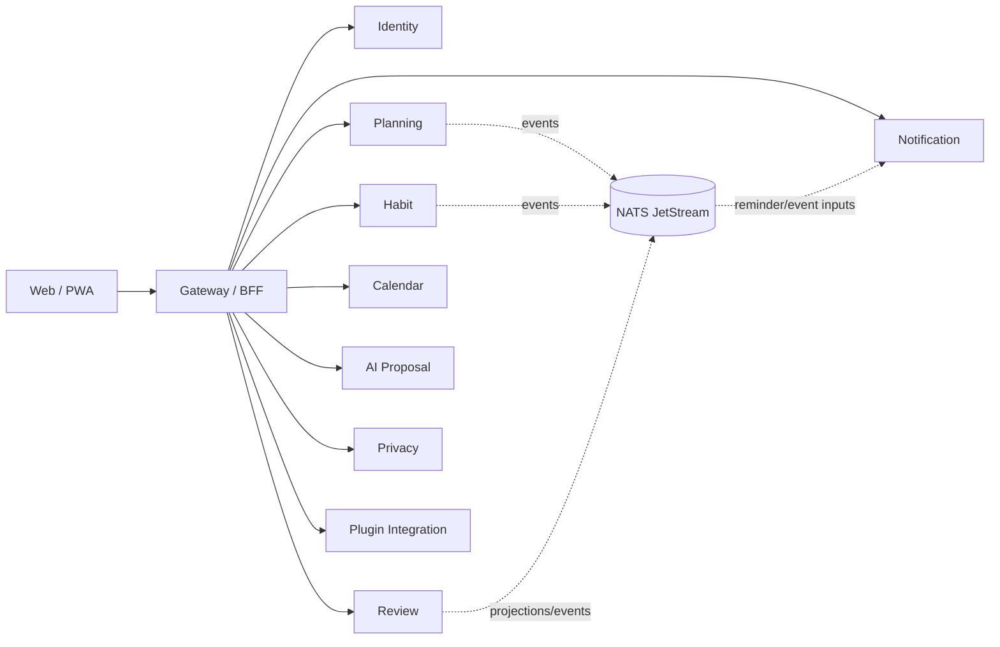

Every bounded context retains its own persistence/migration/credential authority.

## Login / workspace authority

**Status:** Implemented on protected main

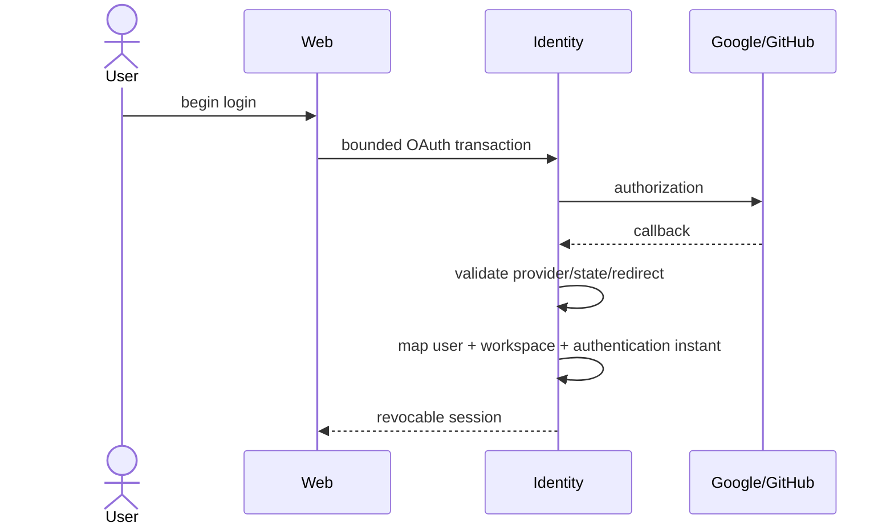

Session rotation does not manufacture a new authentication ceremony.

## Goal / Project / Task / Habit / Today / Review

**Status:** Implemented on protected main

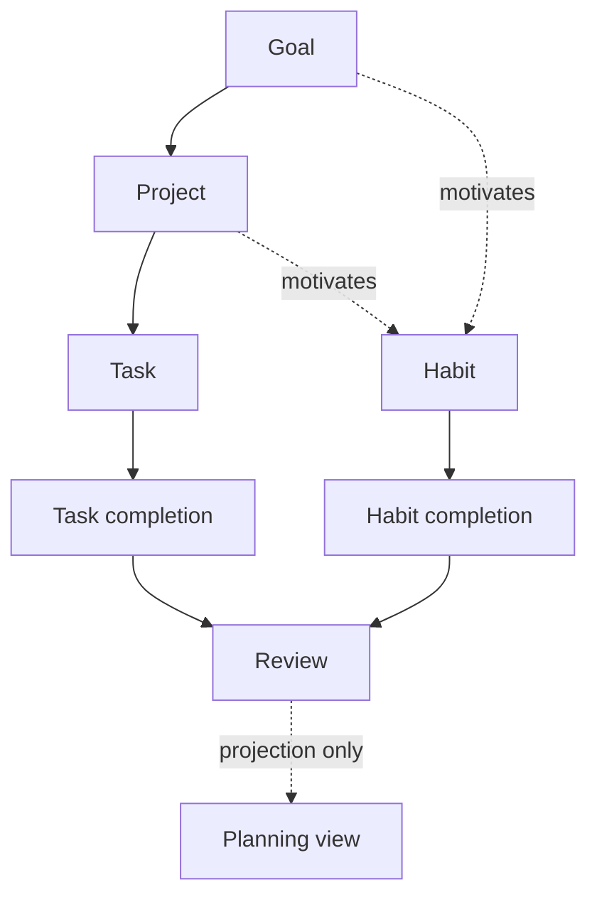

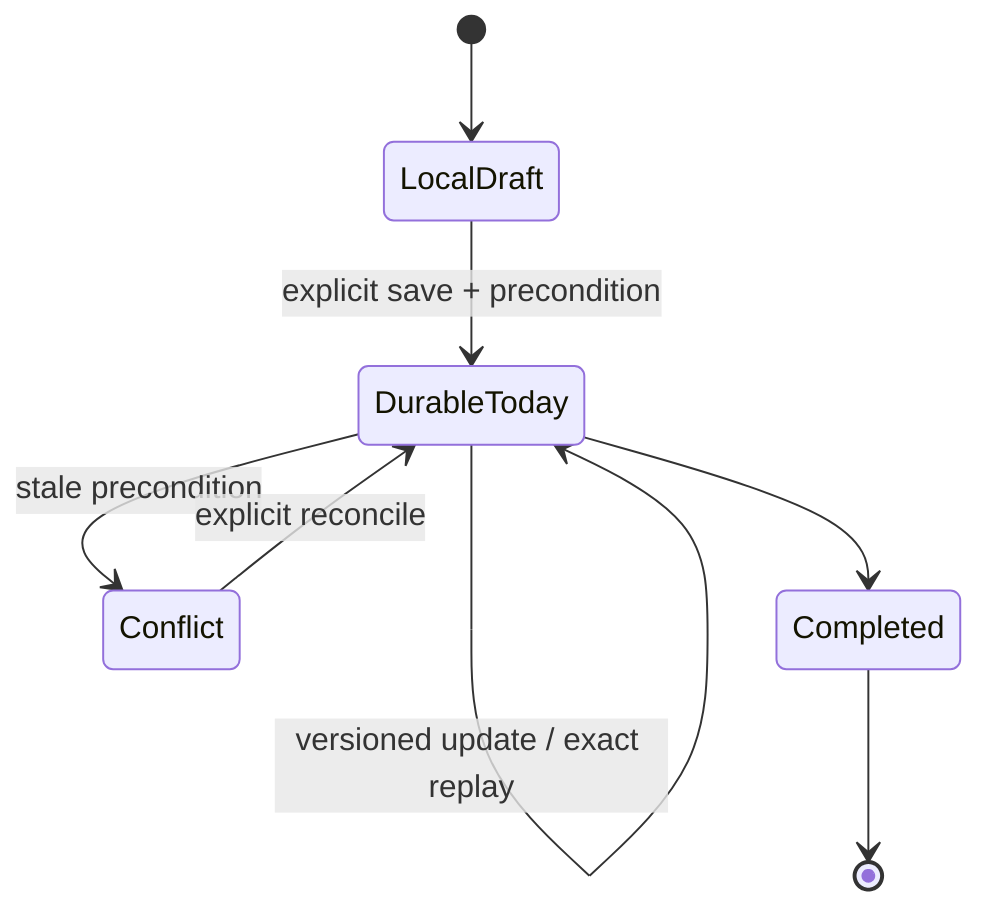

## Calendar sync and connection lifecycle

### Workspace-only sync context

**Status:** Implemented on protected main

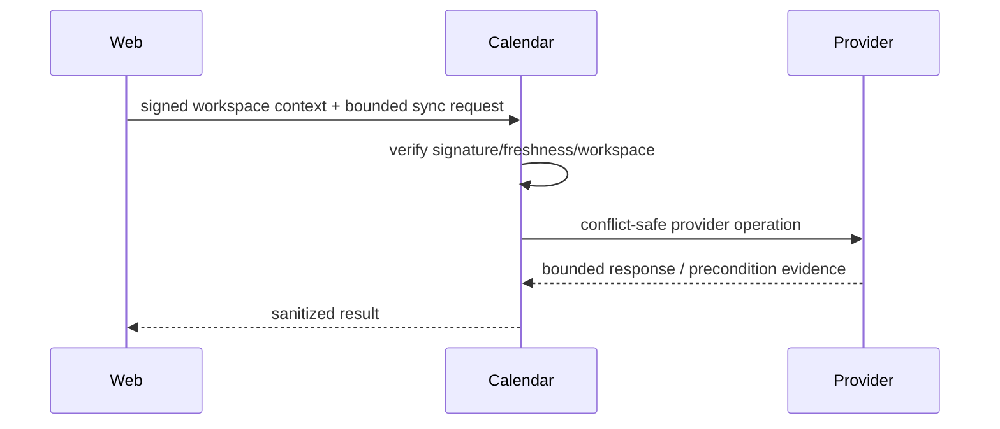

### Connection persistence and local revocation

**Status:** Implemented on protected main

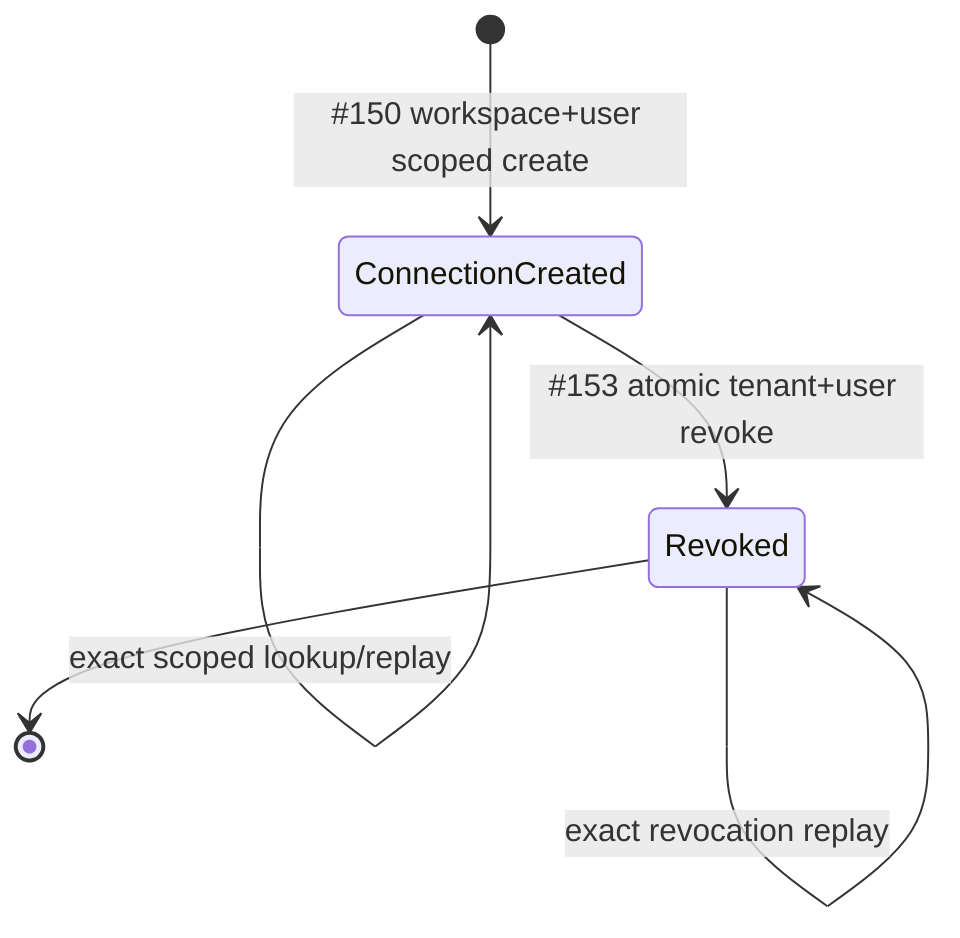

Connection metadata carries opaque secret references. Local revocation does not imply provider-side OAuth revocation.

### User-aware hosted authority

**Status:** Implemented on active PR

**Evidence:** PR #155.

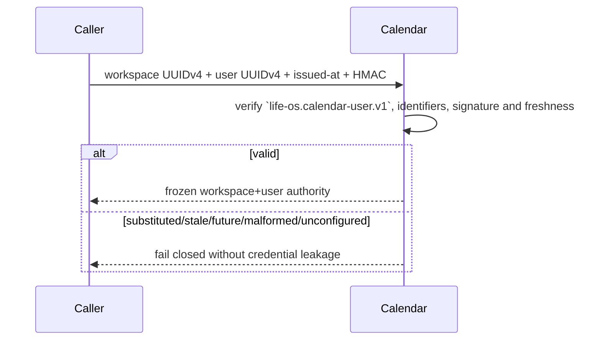

Public disconnect, managed-secret operations, OAuth PKCE/refresh/provider revoke/discovery remain later #129 work.

## AI proposal / decision

**Status:** Implemented on protected main

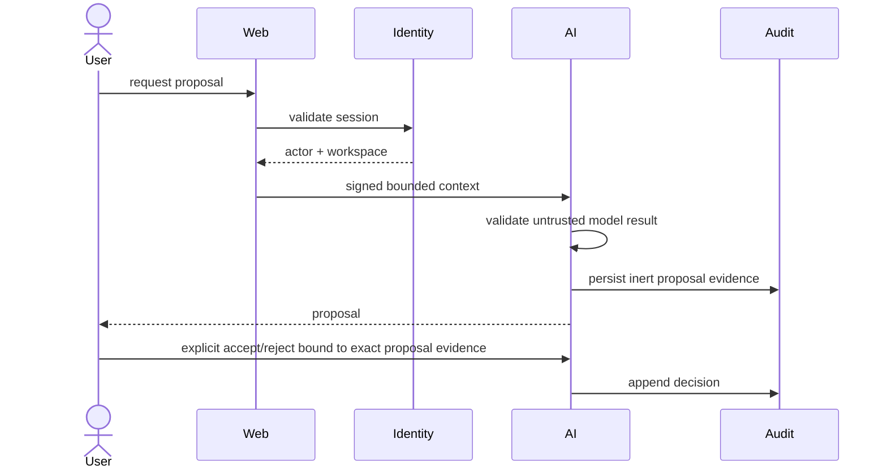

## Data-rights lifecycle

### Request / status

**Status:** Implemented on protected main

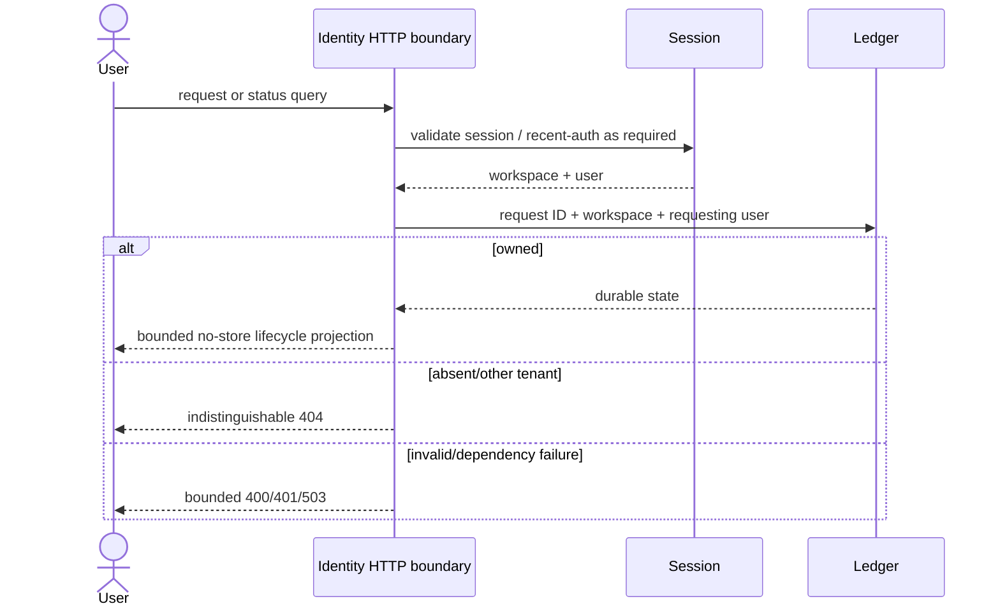

### Export integrity

**Status:** Implemented on protected main

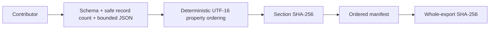

Complete cross-domain orchestration/delivery remains **Partial** under #55.

## Purpose-bound sensitive access

**Status:** Implemented on protected main

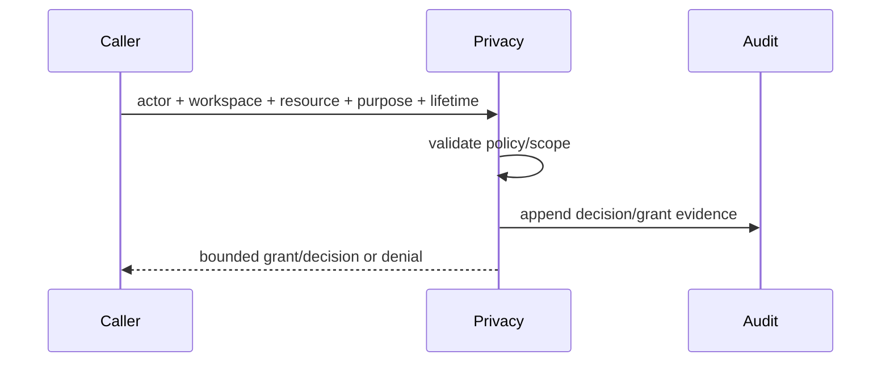

## Plugin installation authority

**Status:** Implemented on protected main

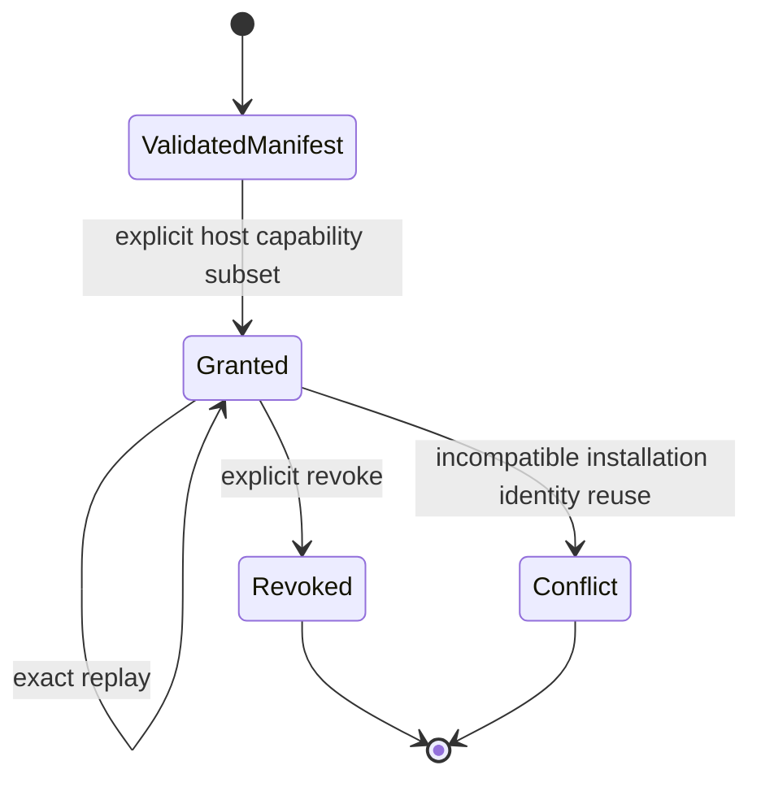

PR #151 protects this authority. Durable plugin-secret persistence/outbound delivery remain **Partial** under #130.

## Backup / deployment

**Status:** Implemented on protected main

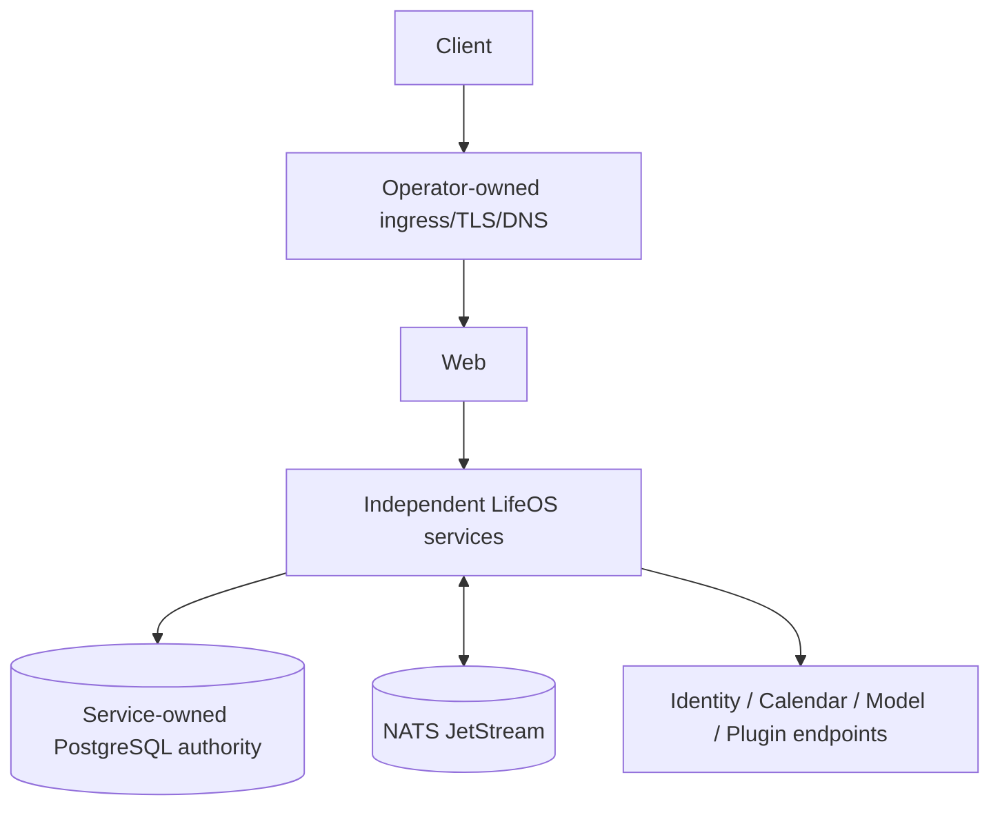

Logical backup/restore verifies integrity and safe targets; it does not claim PITR or managed surrounding infrastructure.

## Verification evidence state

**Status:** Implemented on active PR

**Evidence:** ADR 0010 and clean successor PR #154; #147 is Superseded.

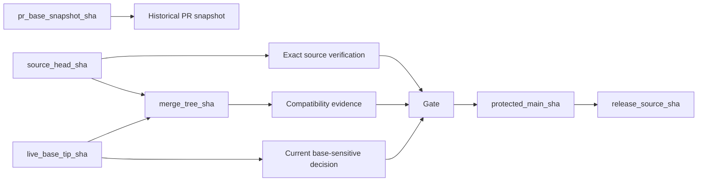

No green result transfers authority across identities. PR #154 additionally requires the checked synthetic merge parents to match fresh current source and current live base evidence.

## Degraded modes

**Status:** Accepted architecture

| Failure | Required behavior |
| --- | --- |
| Identity/calendar/model provider unavailable | Bounded dependency failure; unrelated product domains remain usable where safe |
| Owning PostgreSQL unavailable | Durable mutation fails closed; browser draft is not mislabeled durable |
| NATS unavailable | No fabricated delivery success; replay/recovery semantics apply |
| Stale write | Explicit conflict/revision evidence, never silent overwrite |
| Malformed/forged internal context | Fail closed without reflecting secrets or untrusted identifiers |
| Unknown/stale verification identity | Evidence unavailable/non-passing rather than promoted success |
