# LifeOS UML and Interaction Views

**Status:** Accepted architecture  
**Baseline:** protected `main` at `2cd8c766d2c8358936eac1f92e44c8e9f99f1fea`

These Mermaid views describe component authority, buyer journeys and failure boundaries. `Implemented on active PR` views are intentionally labeled and do not become protected-main evidence before merge.

## 1. Bounded-context topology

**Status:** Implemented on protected main

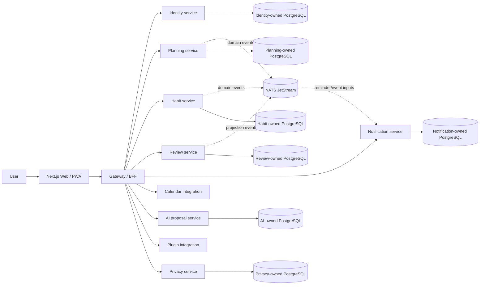

Physical co-location does not create cross-service table authority.

## 2. Login and workspace context

**Status:** Implemented on protected main

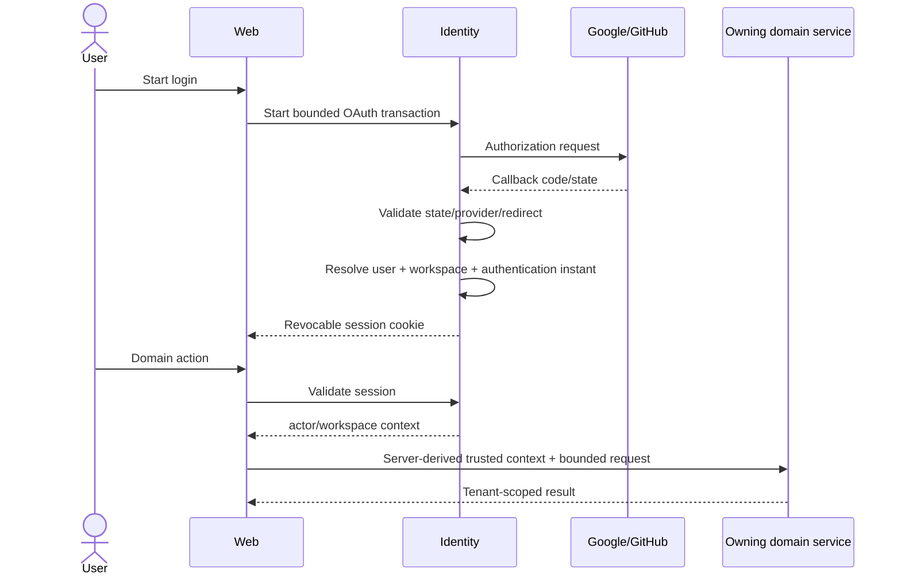

Session rotation may change session issuance but preserves authentication age unless a new authentication ceremony occurs.

## 3. Goal -> Project -> Task / Habit lifecycle

**Status:** Implemented on protected main

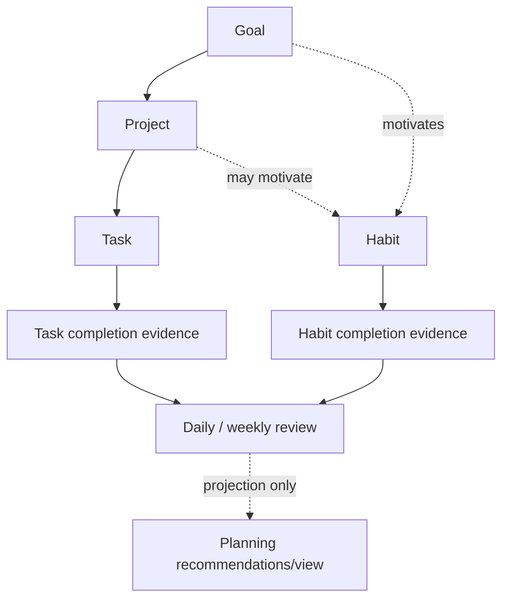

Review is evidence/projection; it does not silently rewrite planning state.

## 4. Today durable synchronization

**Status:** Implemented on active PR

**Evidence:** PR #127, issue #121.

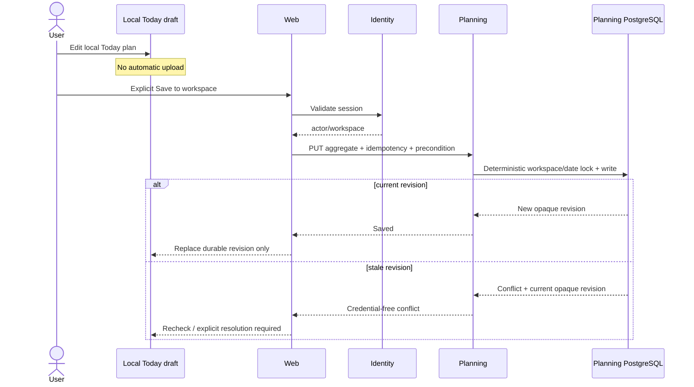

This view is not protected-main behavior until PR #127 merges.

## 5. Reminder flow

**Status:** Implemented on protected main

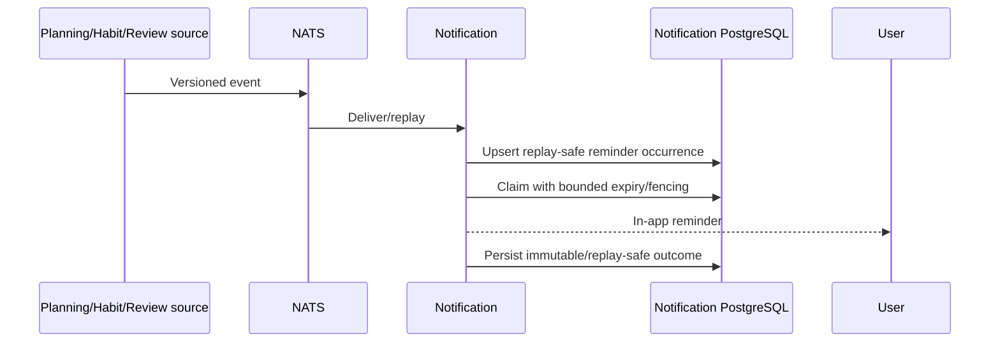

## 6. Calendar synchronization and hosted credential path

### Existing sync adapters

**Status:** Implemented on protected main

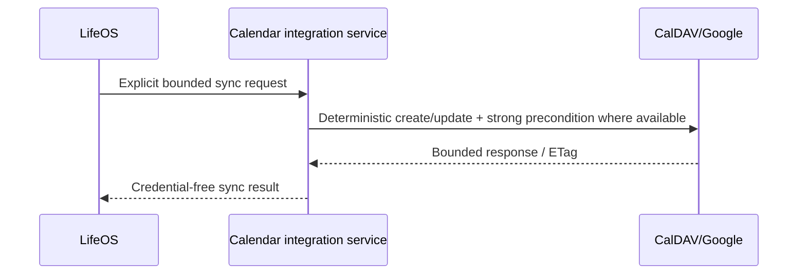

### Trusted workspace prerequisite

**Status:** Implemented on active PR

**Evidence:** PR #139, issue #129.

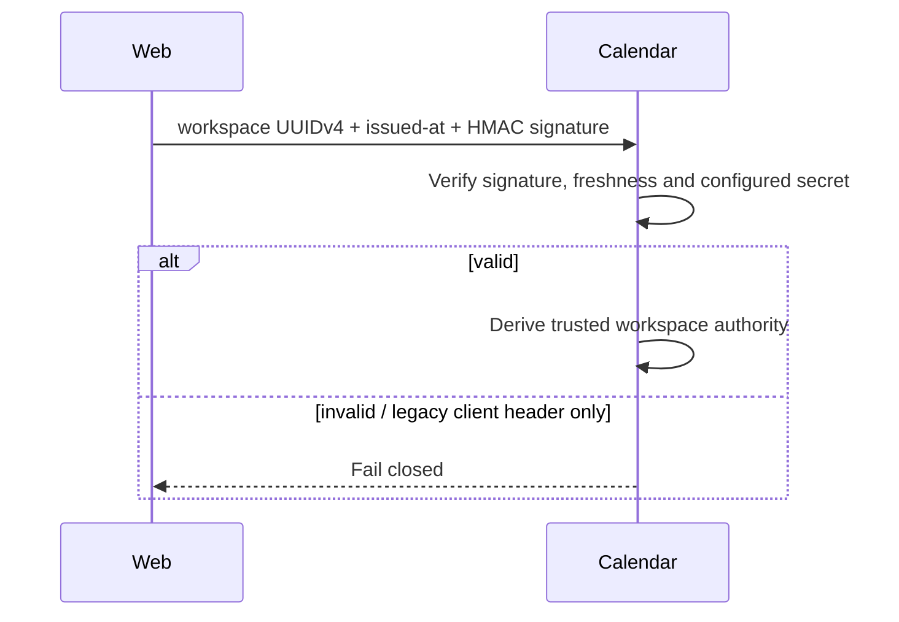

Encrypted per-user credential persistence, OAuth state/PKCE, refresh/revocation and calendar selection remain `Partial` under issue #129.

## 7. AI proposal evidence and decision

**Status:** Implemented on protected main

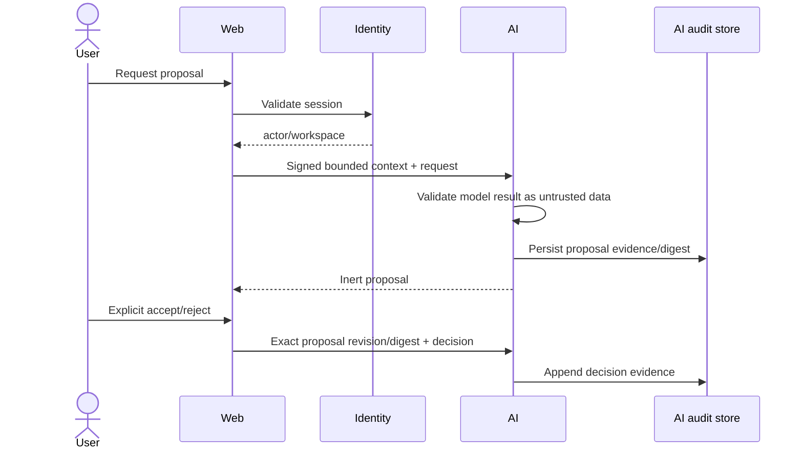

No arrow grants AI direct planning-table mutation authority.

## 8. Purpose-bound sensitive-data access

**Status:** Implemented on protected main

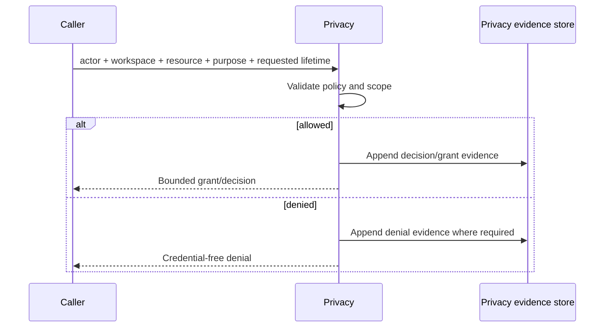

## 9. Data-rights export/erasure lifecycle

### Protected-main foundation

**Status:** Implemented on protected main

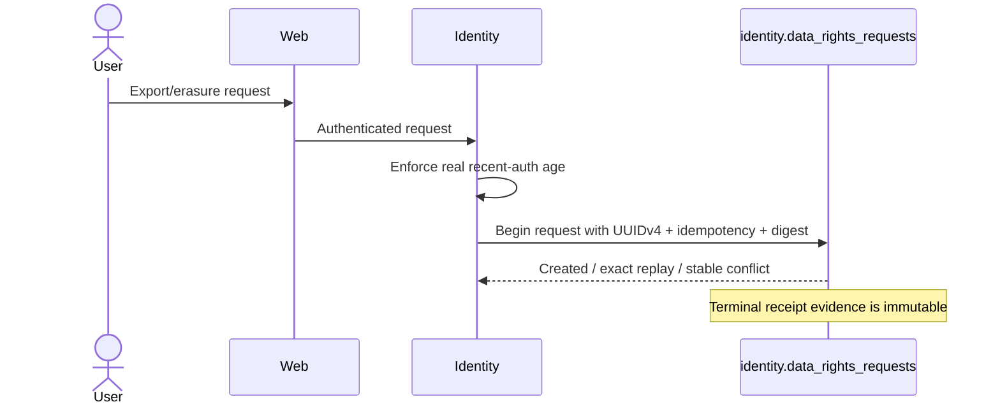

### Whole-domain completion

**Status:** Partial

**Tracking:** issue #55.

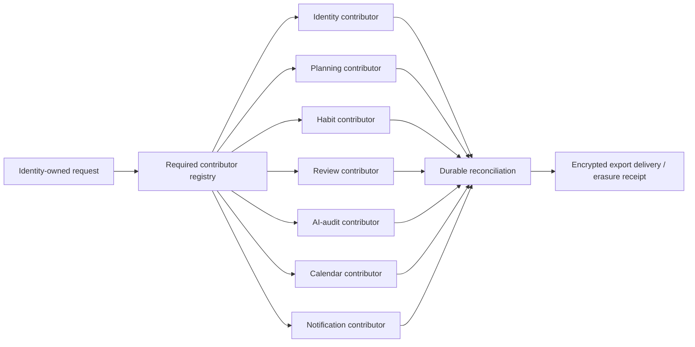

Contributor adapters, complete durable reconciliation, protected archive delivery, legal-hold/retention and operator stuck-request recovery remain incomplete.

## 10. Plugin runtime target

**Status:** Planned

**Tracking:** issue #130.

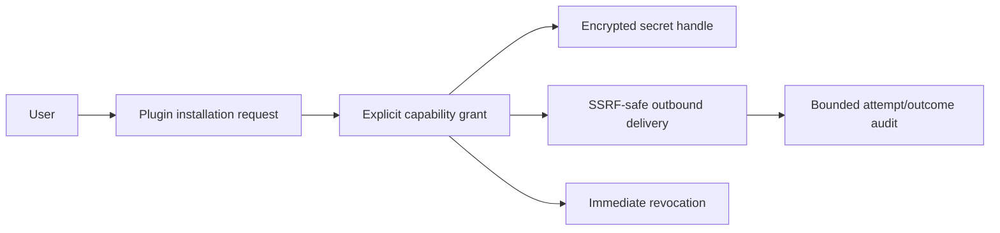

The current protected-main plugin surface validates/prepares contracts; it does not imply this runtime exists.

## 11. Backup and restore

**Status:** Implemented on protected main

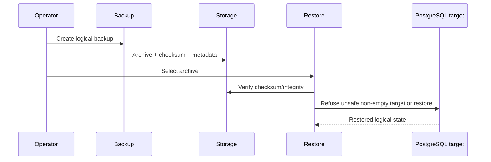

Logical backup does not claim PITR.

## 12. Deployment topology

**Status:** Implemented on protected main

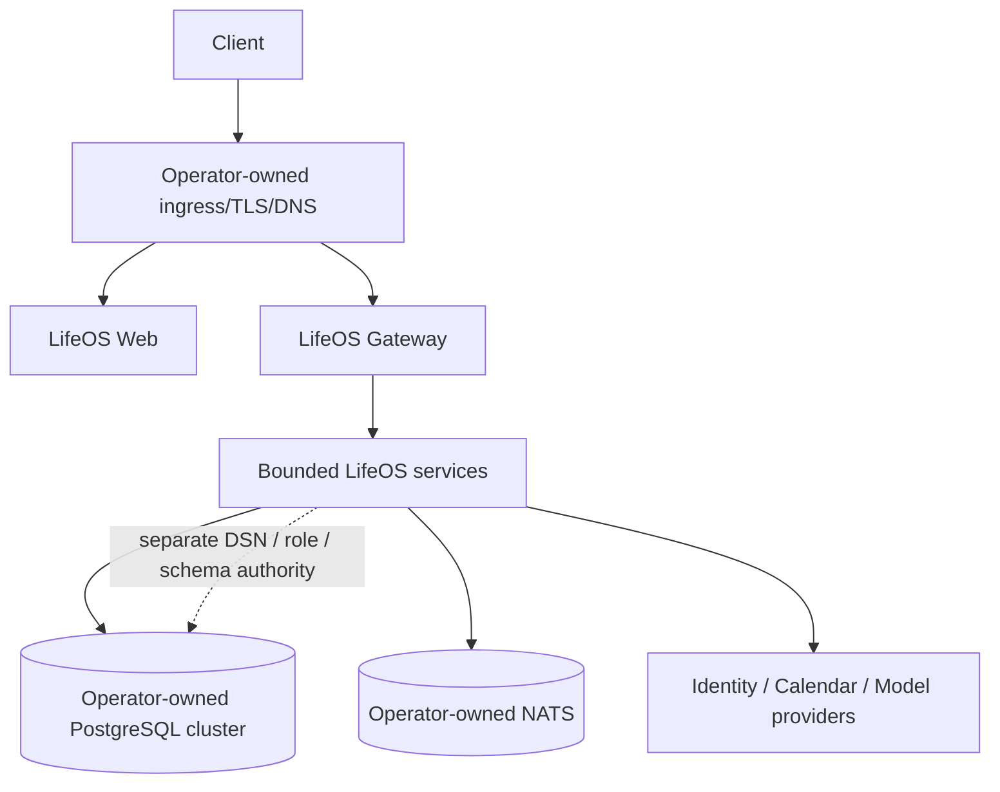

The Kubernetes reference does not provision the cluster, PostgreSQL, NATS, DNS/TLS, registry or secret manager.

## 13. Degraded modes

| Failure | Required behavior |
| --- | --- |
| Identity provider unavailable | Existing valid sessions may continue according to session policy; new provider login/link degrades explicitly. |
| Model provider unavailable | Deterministic product behavior remains; proposal/live-conformance path reports bounded unavailability. |
| Calendar provider unavailable | Planning remains usable; sync reports bounded dependency failure without destructive retry. |
| NATS unavailable | Services fail/degrade according to their event durability contract; no fabricated delivery success. |
| PostgreSQL unavailable | Owning durable operation fails closed; browser draft must not be mislabeled as durable. |
| Stale write | Return conflict/revision evidence rather than silently overwrite. |

## 14. Diagram maintenance rule

Every diagram must label protected-main, active-PR, partial or planned behavior. When a service/data/API authority changes, update the owning source/test first and reconcile this file before the change is considered documentation-complete.