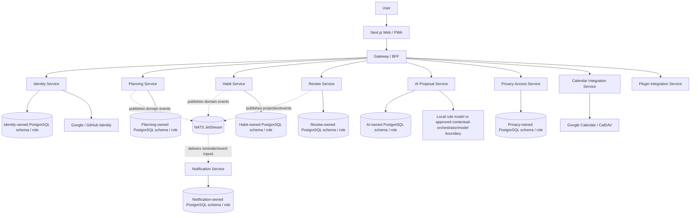
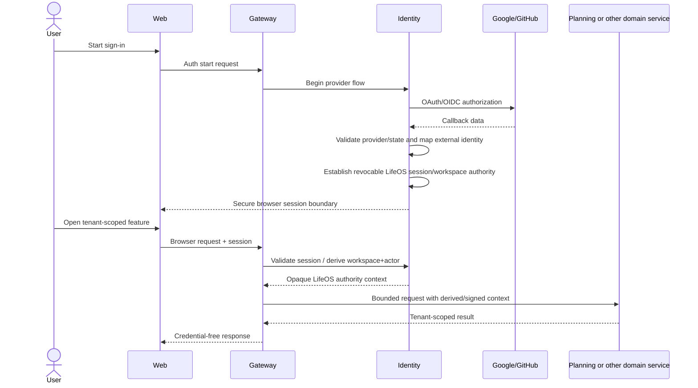
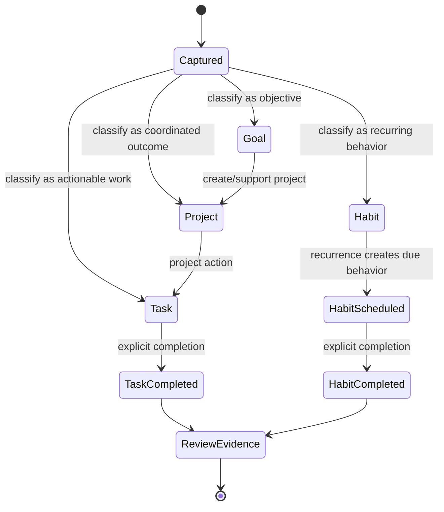
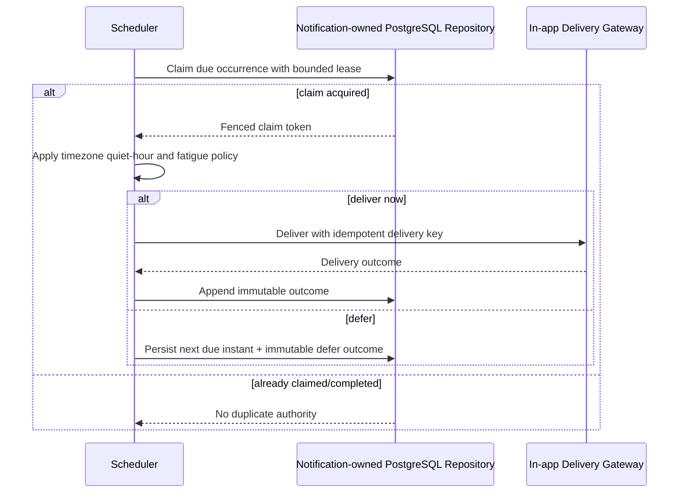
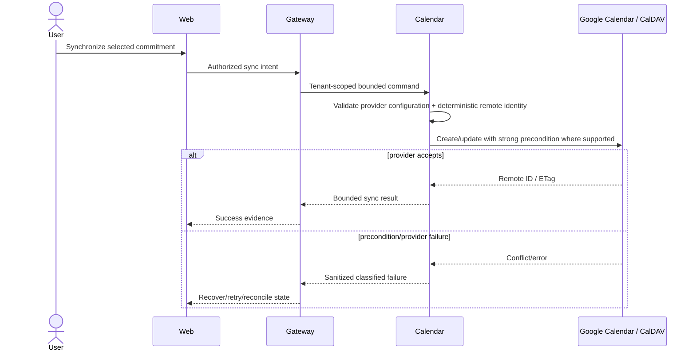
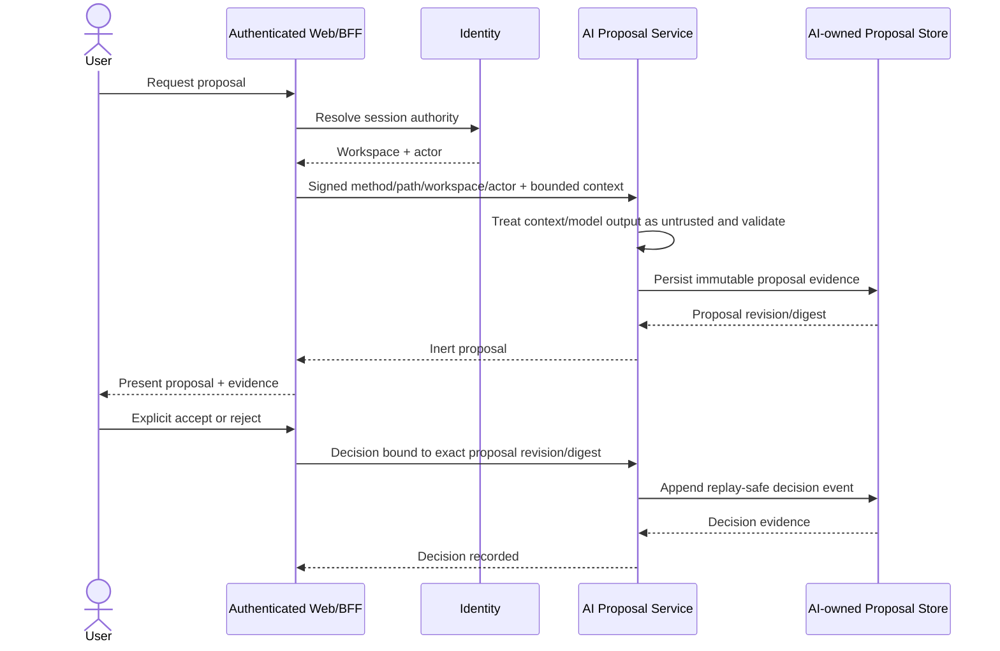
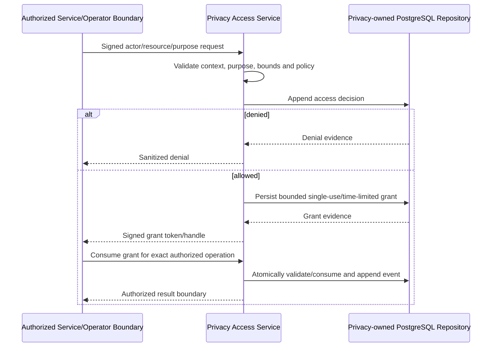
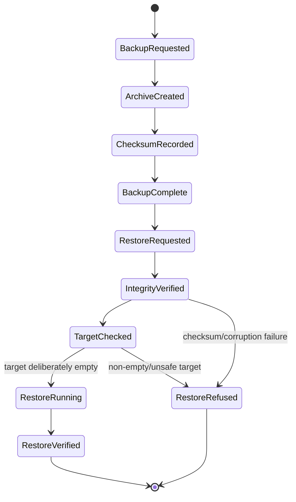
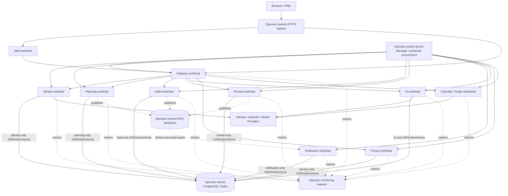
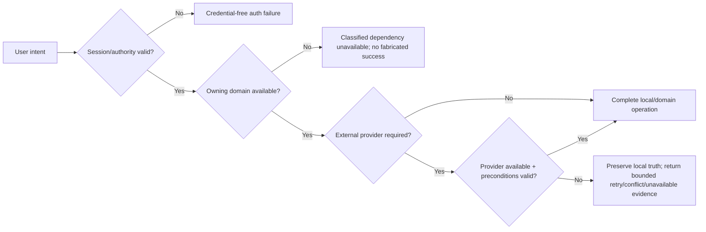

# LifeOS UML and Interaction Views

**Baseline:** protected `main` at `876850018a17323900844e79845ba395b7bf6a9a`

These diagrams are architecture documentation, not proof that every target path is fully implemented. Sections explicitly state current status. Service names and authority boundaries must remain synchronized with protected-main code and current active-PR evidence.

## 1. Component / bounded-context view

**Status:** Implemented on protected main

The bounded contexts and service-owned persistence ports shown here exist on protected main. Some external-credential and complete buyer journeys remain partial and are called out in the scoped sections below.



Each database edge above represents only the owning service's persistence port. Co-location on one PostgreSQL cluster does not imply shared credentials, cross-service table access, or foreign-key authority.

## 2. Login and workspace authorization sequence

**Status:** Implemented on protected main

Identity OAuth/session behavior is implemented. Exact personal-workspace provisioning details follow current identity protected-main source and tests rather than this diagram alone.



Provider credentials and browser cookies do not become arbitrary downstream-service inputs.

## 3. Goal → Project → Task and Habit lifecycle

**Status:** Implemented on protected main

Goal/project/task and recurring-habit persistence are implemented. This is a logical domain flow; physical relationships follow planning/habit service implementations. Milestones/task dependencies from historical planning are not shown as protected-main persisted states; see `docs/DATA_MODEL.md`.



Review evidence does not directly rewrite planning/habit source-of-truth records.

## 4. Today planning and stale-state boundary

**Status:** Implemented on active PR

Protected main already has the Today action loop and local-draft/durable-record distinction. PR #127 implements the complete bounded durable Today aggregate, explicit local-to-durable synchronization, optimistic concurrency, idempotency and conflict/recheck browser journey for issue #121. This sequence must not be treated as protected-main evidence until that exact PR head merges.

```mermaid
sequenceDiagram
    actor User
    participant Browser as Web/PWA
    participant Gateway
    participant Planning

    User->>Browser: Capture / select Today priorities
    Browser->>Browser: Maintain explicitly labeled local draft state
    Browser->>Gateway: Check current durable Today state
    Gateway->>Planning: Tenant-scoped GET / durable aggregate lookup
    Planning-->>Gateway: Durable aggregate + strong revision evidence
    Gateway-->>Browser: Current durable evidence
    Browser->>Browser: Discard stale async response if ownership/query/navigation changed
    User->>Browser: Explicit save/load/reconcile action
    Browser->>Gateway: Mutation + If-Match/If-None-Match + idempotency evidence
    Gateway->>Planning: Authorized write derived from session workspace
    alt preconditions current
        Planning-->>Gateway: Accepted durable revision
        Gateway-->>Browser: Confirm durable state
    else stale/conflicting
        Planning-->>Gateway: Credential-free conflict/current revision evidence
        Gateway-->>Browser: Recheck and reconcile explicitly; no silent overwrite
    end
```

Issue #121 remains open until the reviewed implementation is protected-main evidence and its acceptance gates are complete.

## 5. Reminder delivery sequence

**Status:** Implemented on protected main

This sequence describes durable PostgreSQL reminder scheduling and in-app delivery behavior.



## 6. Calendar synchronization sequence

**Status:** Implemented on protected main

CalDAV/Google provider adapters are implemented. Hosted per-user Google credential persistence, refresh, revocation and provider/calendar selection remain `Partial` under issue #129.



## 7. AI proposal and explicit decision sequence

**Status:** Implemented on protected main

Proposal generation, persistence, evidence and decision history are implemented. This diagram does not imply automatic planning mutation.



The AI service is not a generic planning command bus.

## 8. Purpose-bound privacy access sequence

**Status:** Implemented on protected main

The privacy-service authorization/grant/evidence core is implemented. Complete user-facing export/deletion orchestration remains `Partial` under issue #55.



No other bounded service is permitted to use this `Store`; other services interact with the privacy service through its reviewed API/context boundary.

## 9. Backup and restore state flow

**Status:** Implemented on protected main

The verified logical dump/restore tier is implemented. PITR is not claimed.



## 10. Deployment topology

**Status:** Implemented on protected main

Compose and Kubernetes provider-neutral reference artifacts exist. Cluster, DB/NATS managed services, ingress/TLS/DNS, registry pipeline and secret manager remain operator-owned; `reference` describes scope rather than a separate implementation status.



A shared physical PostgreSQL cluster is only a deployment co-location choice: every service uses its own authorized DSN/role/schema boundary and may not traverse into another service's tables.

## 11. Failure and degraded-mode view



A calendar/model/provider outage does not authorize LifeOS to fabricate successful synchronization, proposal quality, or external side effects.
