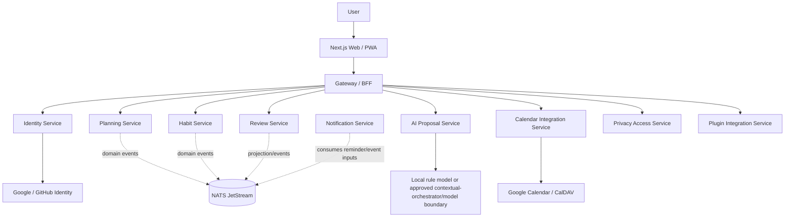
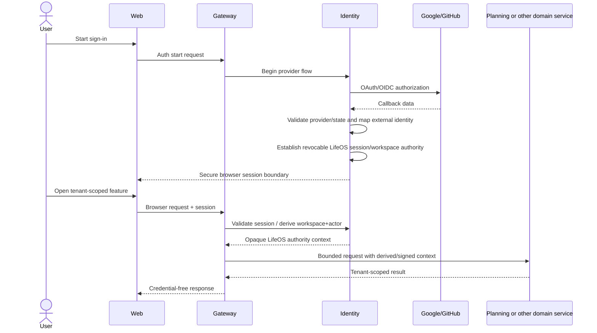
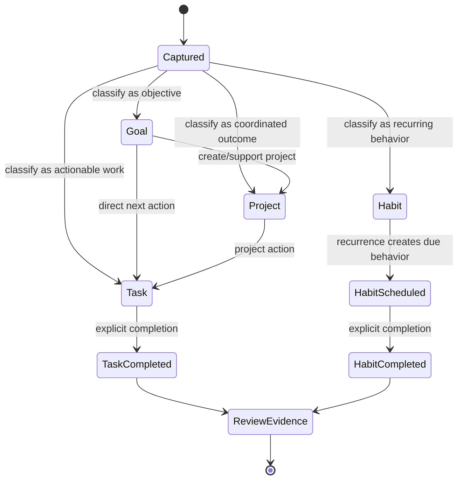
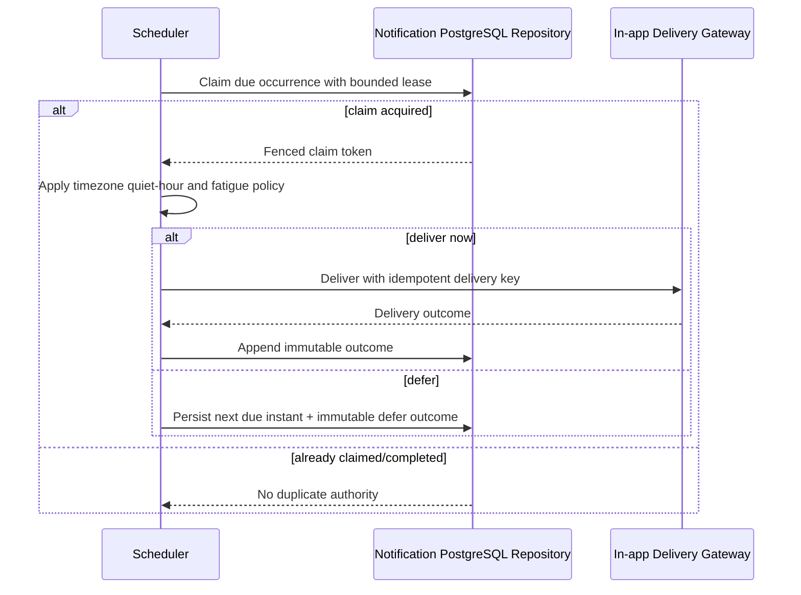
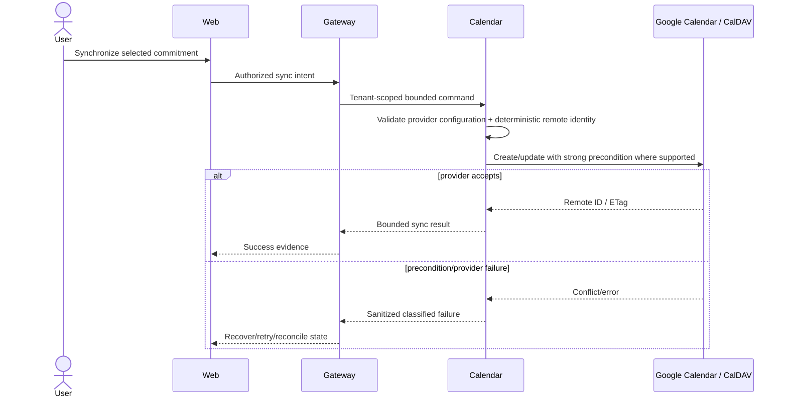
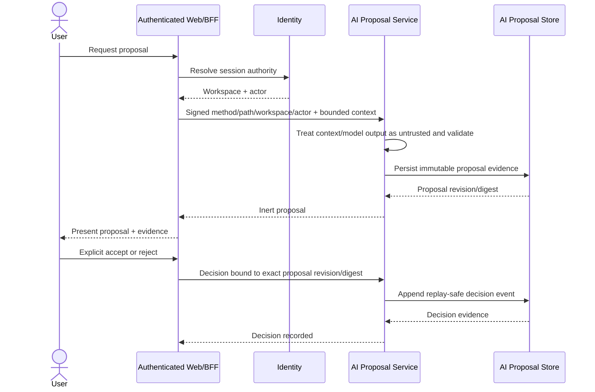
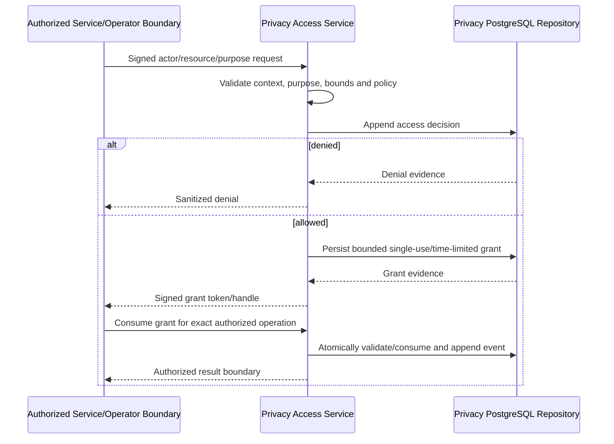
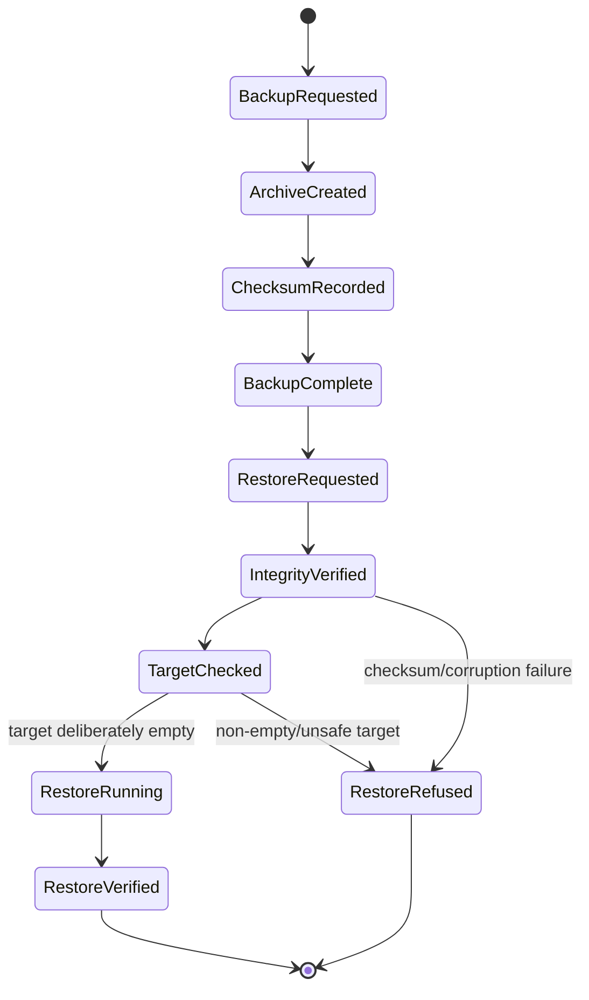
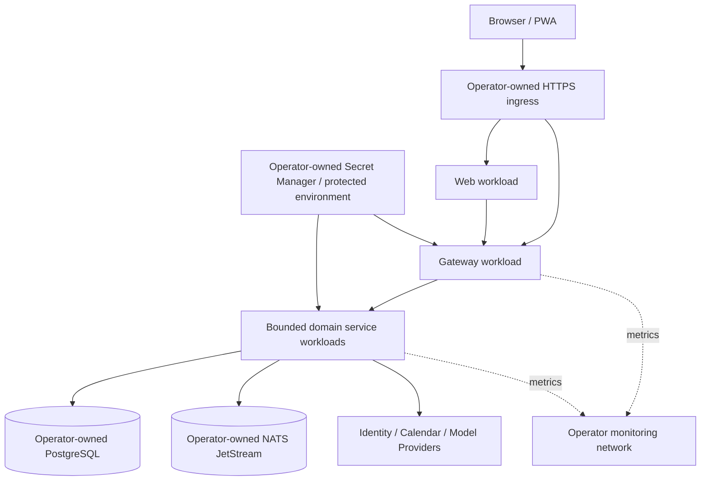
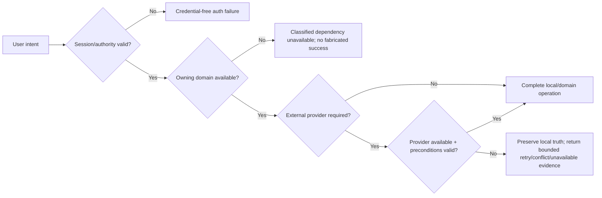

# LifeOS UML and Interaction Views

**Baseline:** protected `main` at `5c87a7ec3568a4ce47b25cad843f1bc5be91b294`

These diagrams are architecture documentation, not proof that every target path is fully implemented. Sections explicitly state current status. Service names and authority boundaries must remain synchronized with protected-main code.

## 1. Component / bounded-context view

**Status:** Implemented on protected main, with some external-credential/product journeys partial.



Every service owns its persistence. No arrow in this diagram authorizes direct cross-service SQL access.

## 2. Login and workspace authorization sequence

**Status:** Identity OAuth/session behavior implemented; exact personal-workspace provisioning details follow identity protected-main source.



Provider credentials and browser cookies do not become arbitrary downstream-service inputs.

## 3. Goal → Project → Task and Habit lifecycle

**Status:** Goal/project/task and recurring-habit persistence are implemented. This is a logical domain flow; physical relationships follow planning/habit service implementations.



Review evidence does not directly rewrite planning/habit source-of-truth records.

## 4. Today planning and stale-state boundary

**Status:** Today action loop and local-draft/durable-record distinction are implemented. Full multi-device optimistic-concurrency synchronization of a complete durable Today aggregate is partial.

```mermaid
sequenceDiagram
    actor User
    participant Browser as Web/PWA
    participant Gateway
    participant Planning

    User->>Browser: Capture / select Today priorities
    Browser->>Browser: Maintain explicitly labeled local draft state
    Browser->>Gateway: Search or durable planning request
    Gateway->>Planning: Tenant-scoped request
    Planning-->>Gateway: Durable goals/projects/tasks + revision evidence where available
    Gateway-->>Browser: Current durable evidence
    Browser->>Browser: Discard stale async response if ownership/query/navigation changed
    User->>Browser: Explicit durable mutation
    Browser->>Gateway: Mutation + concurrency/idempotency evidence
    Gateway->>Planning: Authorized write
    alt preconditions current
        Planning-->>Gateway: Accepted durable revision
        Gateway-->>Browser: Confirm durable state
    else stale/conflicting
        Planning-->>Gateway: Credential-free conflict/current revision evidence
        Gateway-->>Browser: Reconcile explicitly; no silent overwrite
    end
```

The final full-aggregate concurrency contract is a product gap until current protected-main code proves it end-to-end.

## 5. Reminder delivery sequence

**Status:** Implemented on protected main for durable PostgreSQL reminder scheduling/in-app delivery behavior.



## 6. Calendar synchronization sequence

**Status:** CalDAV/Google provider adapters implemented; hosted per-user Google token persistence/refresh/revocation is partial.



## 7. AI proposal and explicit decision sequence

**Status:** Implemented on protected main for proposal generation/persistence/evidence/decision history. This diagram does not imply automatic planning mutation.



The AI service is not a generic planning command bus.

## 8. Purpose-bound privacy access sequence

**Status:** Implemented on protected main for privacy-service authorization/grant/evidence core; user-facing data-rights UX may remain partial.



## 9. Backup and restore state flow

**Status:** Implemented logical dump/restore tier; PITR is not claimed.



## 10. Deployment topology

**Status:** Compose and Kubernetes reference artifacts exist. Cluster, DB/NATS managed services, ingress/TLS/DNS, registry pipeline and secret manager remain operator-owned.



## 11. Failure and degraded-mode view



A calendar/model/provider outage does not authorize LifeOS to fabricate successful synchronization, proposal quality, or external side effects.
