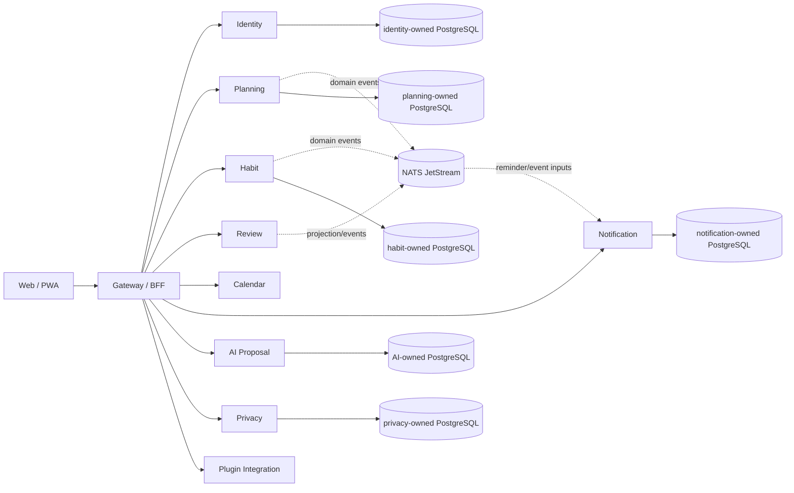
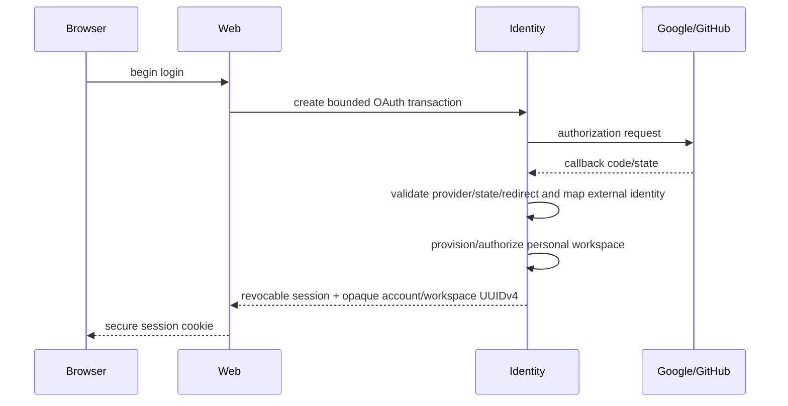
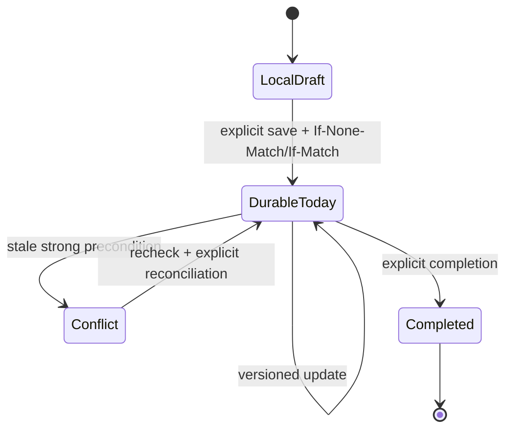
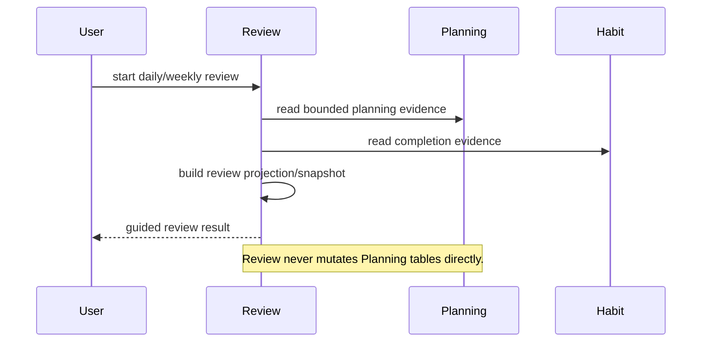
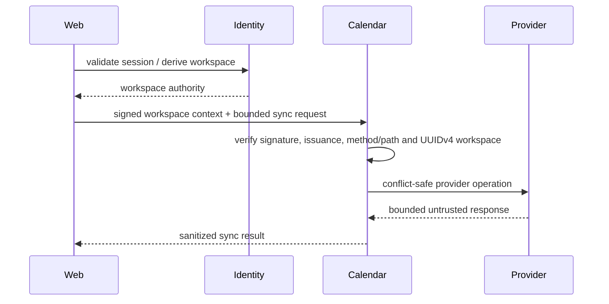
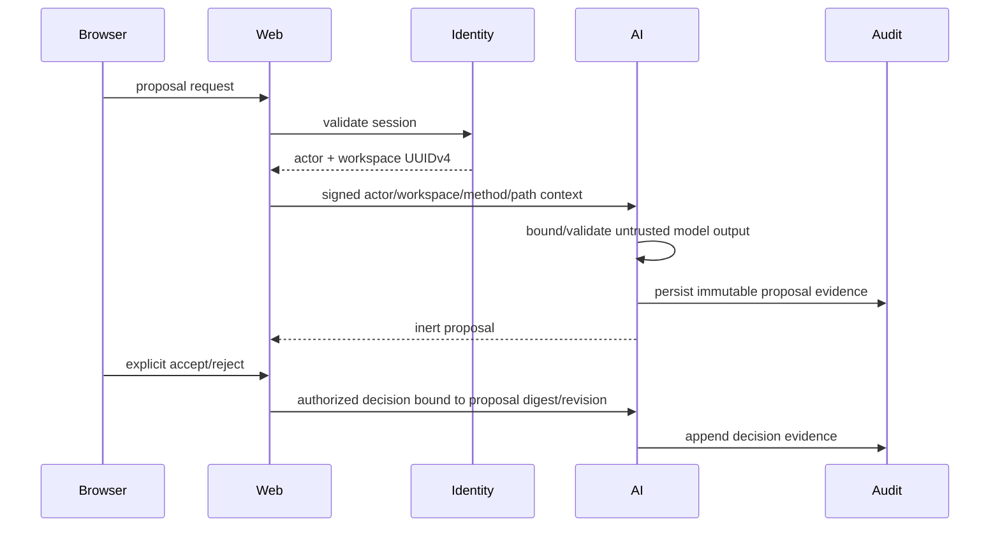
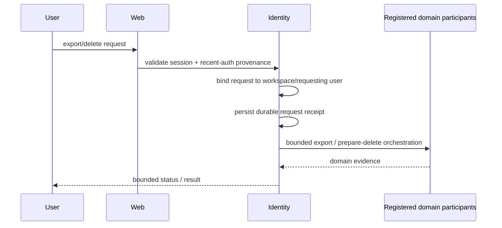
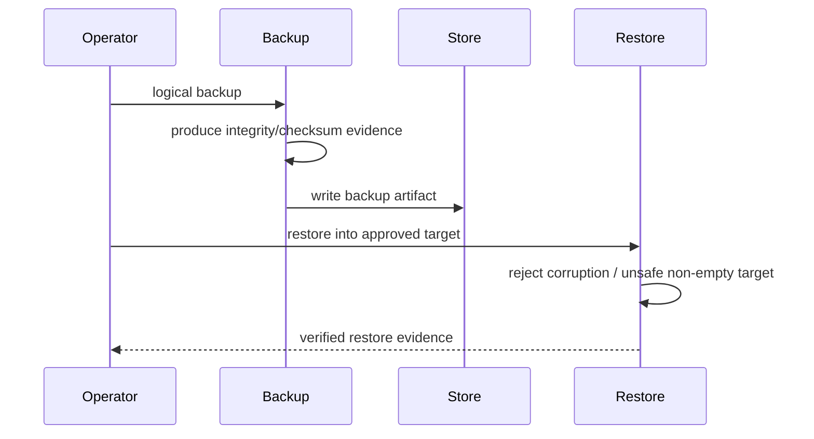
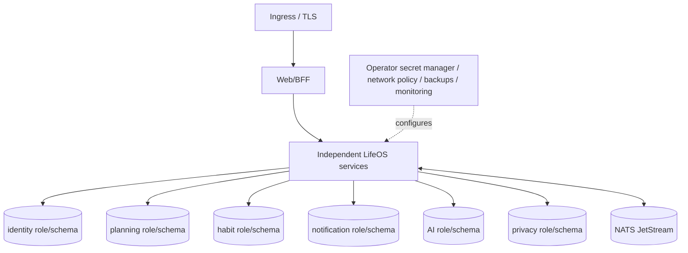
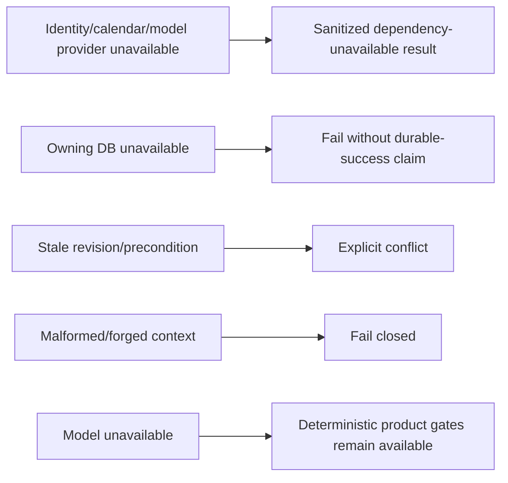

# LifeOS UML and Interaction Views

**Status:** Implemented on active PR

These diagrams describe current protected-main behavior unless a node is explicitly marked `Partial` or `Planned`.

## Bounded-context topology

## Login and workspace sequence

## Goal / Project / Task / Today lifecycle

The durable Today aggregate, local-to-workspace migration, replay protection and stale reconciliation are implemented on protected main through PR #127.

## Review flow

## Calendar synchronization

Per-user encrypted credential persistence/refresh/revocation and calendar selection are **Partial** and tracked by issue #129.

## AI proposal / evidence / decision

## Data-rights sequence

Recent-auth provenance, ownership binding, durable request/terminal receipt and tenant-scoped status lookup are protected-main behavior. Complete domain participation, durable reconciliation, retention/legal-hold and protected archive delivery remain **Partial** under issue #55.

## Backup / restore

## Deployment topology

The nodes represent separate service-owned database authority even when an operator co-locates them on one PostgreSQL cluster.

## Degraded modes

