# LifeOS UML and Interaction Views

**Status:** Accepted architecture  
**Baseline:** protected `main` at `dcc787f77b708cecda054b47d6f7d7b561575a67`

Every view labels maturity. An active PR or planned target is never represented as protected-main behavior.

## 1. Bounded-context topology

**Status:** Implemented on protected main

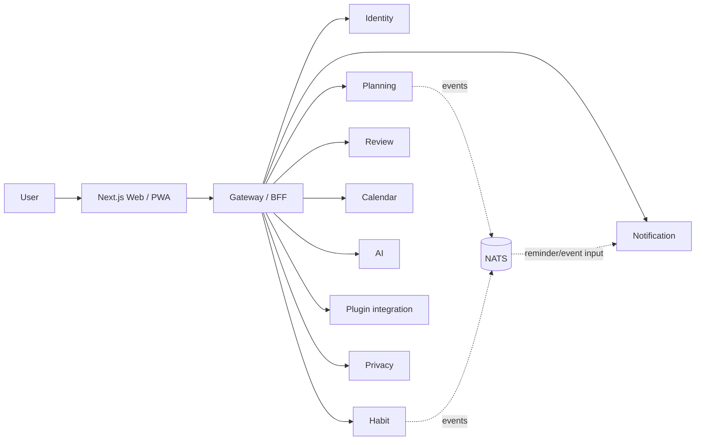

Each service owns persistence/migrations/credentials even when an operator uses one physical PostgreSQL cluster.

## 2. Login and workspace authority

**Status:** Implemented on protected main

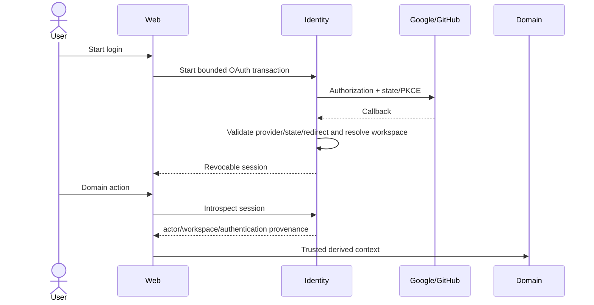

## 3. Goal -> Project -> Task / Habit -> Review

**Status:** Implemented on protected main

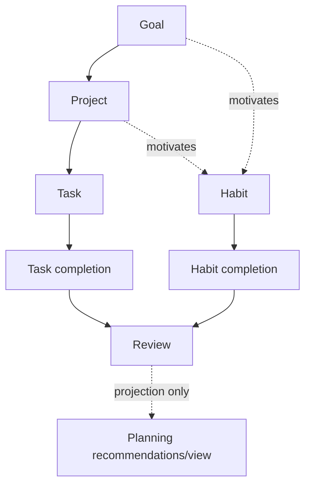

Review does not silently rewrite planning state.

## 4. Durable Today synchronization

**Status:** Implemented on protected main

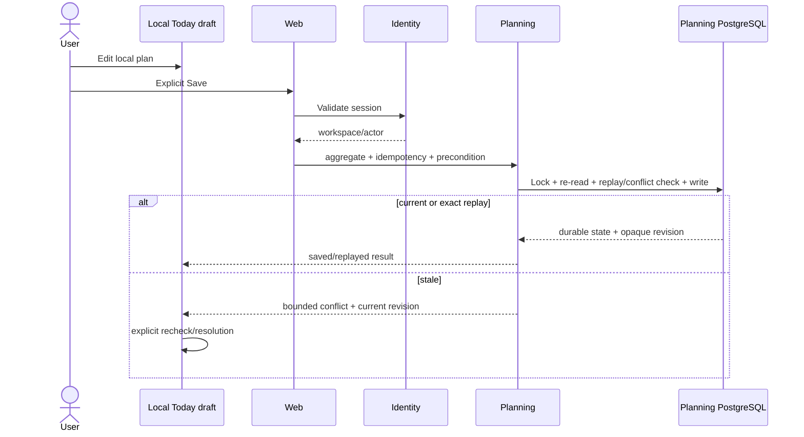

Issue #121 is closed completed.

## 5. Reminder flow

**Status:** Implemented on protected main

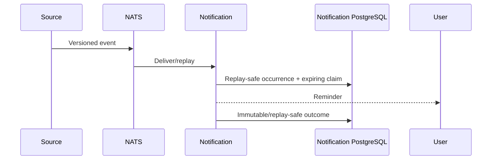

## 6. Calendar trusted context and provider sync

**Status:** Implemented on protected main

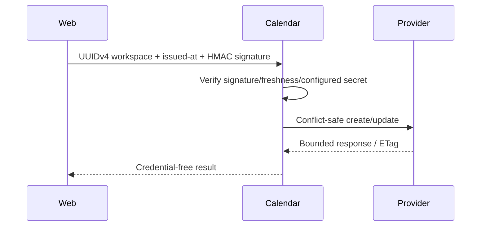

Legacy client-selected workspace authority is rejected after PR #139. Full hosted per-user credential lifecycle remains `Partial` under #129.

## 7. AI proposal and decision

**Status:** Implemented on protected main

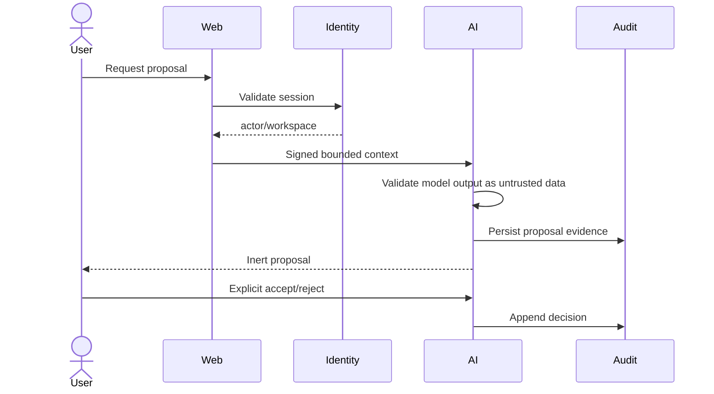

## 8. Purpose-bound sensitive access

**Status:** Implemented on protected main

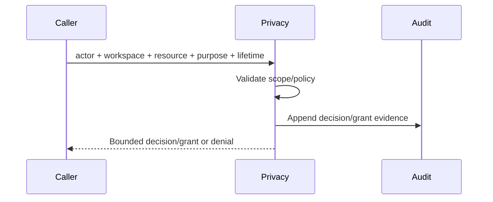

## 9. Data-rights request/status and whole-right completion

### Durable identity foundation

**Status:** Implemented on protected main

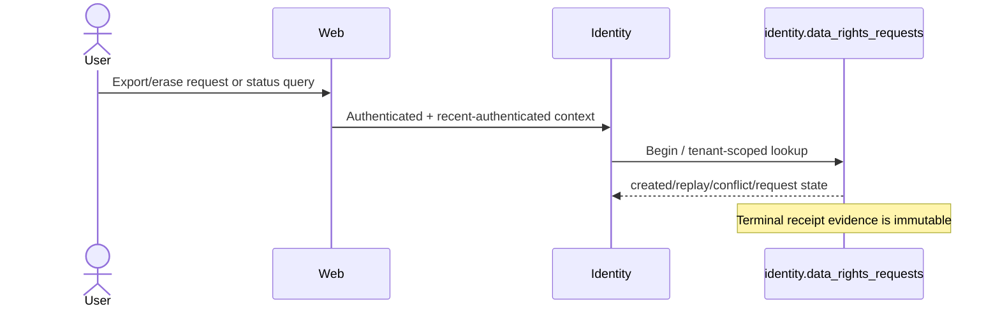

### Cross-domain completion

**Status:** Partial

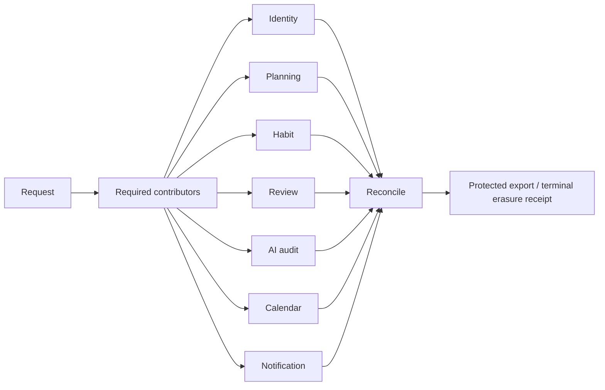

Issue #55 owns the incomplete contributor/reconciliation/delivery/retention lifecycle.

## 10. Plugin runtime target

**Status:** Planned

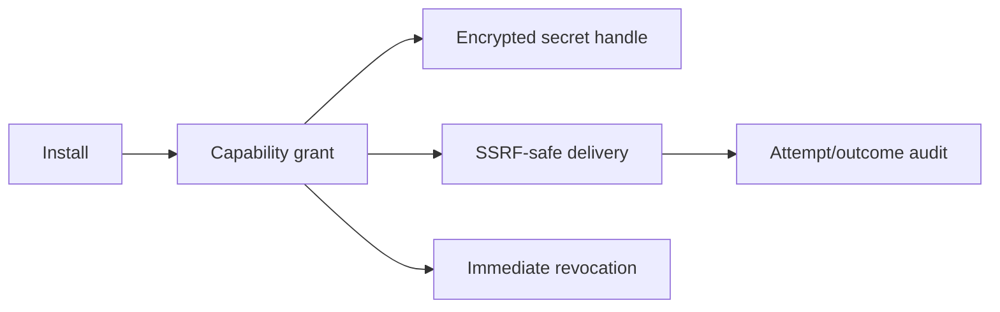

Issue #130 owns this runtime; current protected main is validation/preparation only.

## 11. Backup and deployment

**Status:** Implemented on protected main

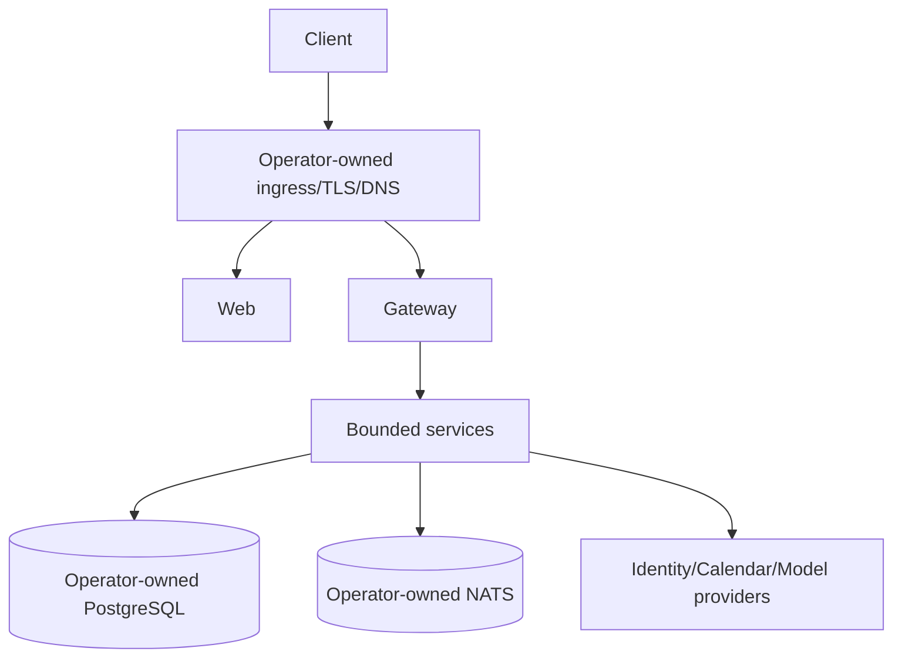

Logical backup/restore verifies archive integrity and safe targets; it does not claim PITR. The Kubernetes reference does not provision surrounding platform dependencies.

## 12. Degraded modes

| Failure | Required behavior |
| --- | --- |
| Identity provider unavailable | Existing valid sessions may continue according to session policy; new login degrades explicitly. |
| Model provider unavailable | Core product remains; model path returns bounded unavailability. |
| Calendar provider unavailable | Planning remains usable; sync fails without destructive retry. |
| NATS unavailable | No fabricated delivery success; replay semantics apply after recovery. |
| PostgreSQL unavailable | Durable mutation fails closed; browser draft is not mislabeled durable. |
| Stale write | Return conflict/revision evidence, never silent overwrite. |

## 13. Diagram update rule

When source/migration/API authority changes, update the corresponding protected-main/Partial/Planned status and executable tests before documentation is considered current.