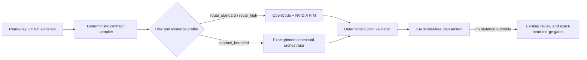

# ADR 0001: Governed OpenCode maintenance on NVIDIA NIM

- **Status:** Accepted
- **Date:** 2026-08-07
- **Decision owners:** ContextualWisdomLab maintainers
- **Tracking issue:** #119

## Context

LifeOS already has deterministic commercial-readiness evidence and an exact-head merge drain. A model-assisted hourly loop can improve diagnosis and buyer-gap selection, but granting a stochastic model repository-write or merge authority would collapse separation of duties, weaken independent review, and expose the repository to prompt injection from source, issues, reviews, logs, or model output.

The maintenance path must remain compatible with the independently deployable LifeOS services, the organization-level `.github` governance repository, `naruon`, and optional `contextual-orchestrator` composition. It must use `NVIDIA_NIM_API_KEY`, never `COPILOT_GITHUB_TOKEN`, and must not change the credentials or behavior of existing human, CodeRabbit, GitHub Advanced Security, or AppGuardrail review agents.

## Decision

LifeOS adopts a **plan-only OpenCode maintenance agent** behind a deterministic contract compiler and output validator.

1. A read-only evidence job collects bounded PR, check, review-state, and capability facts.
2. `@life-os/maintenance-agent` compiles those facts into `life-os.maintenance-contract.v1`, selects a bounded compute profile, and signs the canonical contract with SHA-256.
3. OpenCode runs with NVIDIA NIM and a project agent that can read repository files but can edit only `.maintenance-output/maintenance-plan.json`. Bash, task delegation, web access, external directories, interactive questions, source edits, commits, pushes, PR creation, review resolution, merges, releases, and protection changes are denied.
4. OpenCode receives no GitHub mutation credential. The provider step receives only `NVIDIA_API_KEY`, mapped from the repository secret `NVIDIA_NIM_API_KEY`.
5. The deterministic validator rejects unknown fields, contract-digest mismatch, unbounded recursion or decomposition, paths outside the contract allowlist, secret-shaped values, hidden-reasoning markers, raw logs, and prohibited operations.
6. Existing deterministic GitHub checks and the exact-head commercial-readiness drain remain the sole merge authority.
7. `conduct_bounded` may use an exact-reviewed contextual-orchestrator adapter. If that adapter is unavailable, the run records `orchestrator_unavailable`; it never silently downgrades a high-risk task.

## Alternatives considered

### Give OpenCode a write-capable GitHub token

Rejected. This would allow issue, branch, commit, PR, review, or merge mutation from a prompt-injectable model context and would violate least privilege and separation of duties.

### Keep the hourly loop entirely deterministic

Rejected as the only mechanism. Deterministic evidence remains authoritative, but it cannot provide contextual diagnosis or compare plausible bounded remediation paths as effectively as a constrained model planner.

### Use one unbounded model prompt for every task

Rejected. Fugu, Conductor, TRINITY, and strong-single-agent evidence support treating orchestration depth and role topology as measured test-time-compute choices rather than a universal default. LifeOS therefore keeps a strong direct route as the baseline and selects deeper orchestration only for predefined high-risk evidence classes.

## Security, privacy, CSAP, and SOC 2 implications

- **Least privilege:** model execution has no write-capable GitHub scope and checkout credentials are not persisted.
- **Change management:** source changes, review resolution, and merge remain independently verified and attributable through existing PR controls.
- **Auditability:** exact repository SHA, contract digest, compute profile, validation result, workflow run, and artifact retention are recorded.
- **PII treatment:** this workflow does not mask operational data and then attempt to reconstruct it. Instead, it applies purpose limitation and data minimization: only normalized identifiers, check names, finding classes, capability IDs, and path prefixes enter the model contract. When operational PII is genuinely required elsewhere, LifeOS uses encryption, tenant authorization, access logging, bounded retention, and controlled disclosure rather than destructive blanket masking.
- **Provider isolation:** raw prompts, model responses, hidden reasoning, credentials, stack traces, and raw review prose are not retained as artifacts.
- **Availability:** model or provider failure cannot block deterministic repository checks or fabricate a recommendation.

## Consequences

### Positive

- Buyers receive a reproducible and vendor-portable maintenance decision boundary.
- The scheduler can allocate more compute to security-sensitive work without granting the model more authority.
- The package can be reused by other ContextualWisdomLab repositories without importing LifeOS application services or databases.
- Existing review-agent credentials and exact-head merge semantics remain unchanged.

### Negative

- The initial slice produces plans rather than autonomous source patches.
- High-risk work can return `orchestrator_unavailable` until an exact-reviewed adapter is configured.
- The deterministic contract and validator require maintenance when evidence schemas evolve.

## Verification

The decision is enforced by workflow-contract tests, OpenCode permission-contract tests, realistic fixture tests, exact 100% statement/branch/function/line coverage for the maintenance package, reviewer-integrity fingerprint checks, and the repository's normal CI, AppGuardrail, Semgrep, Security Scan, Commercial Readiness, and CodeRabbit gates.

## References

See `docs/research/2026-08-07-opencode-nim-maintenance-standards.md` and `docs/superpowers/specs/2026-08-07-opencode-nim-maintenance-loop-design.md` for current standards, publication status, limitations, and APA 7 references.
