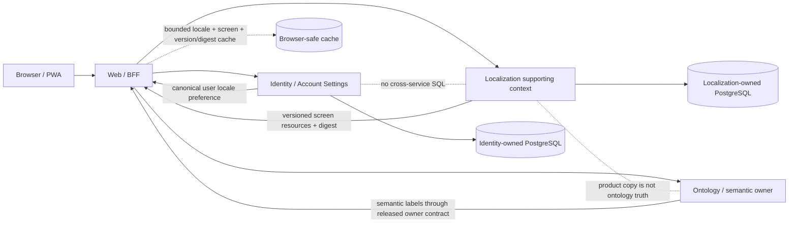

# ADR 0006: Localization resource ledger ownership

- Status: Proposed
- Date: 2026-09-22
- Owners: Localization supporting bounded context; Identity / Account Settings for user preference only
- Related buyer gap: #308
- Related contract PR: #309

## Problem

LifeOS currently renders product strings from browser-bundled KO/EN catalogs and keeps the selected locale in browser storage. That bootstrap is useful, but it cannot establish durable cross-device preference, reviewed eight-locale publication, exact resource-version provenance, or deterministic cache rollover without making the browser an accidental system of record.

The first shared contract in #309 introduces a tenant-neutral `life-os.localization-resource.v1` surface. Before any database or service implementation follows, the repository needs one canonical owner boundary for translation-resource truth and a context map that prevents three tempting but incorrect couplings: putting translation persistence behind Web because Web renders strings, putting arbitrary translation entries in Identity because Identity owns account preference, or folding product copy into the ontology-label ledger.

## Constraints

- Product locales are the explicit allowlist `ko`, `en`, `ja`, `zh`, `vi`, `es`, `de`, `fr`. These are application-level canonical locale identifiers and a deliberately small subset of BCP 47 language tags; request handling must not silently widen the product contract by accepting arbitrary tags.
- Translation resources and user locale preference are separate identities with independent lifecycle and persistence authority.
- Translation entries are product/UI copy keyed by stable `ScreenKey` and `MessageKey`; ontology/concept labels remain under their semantic owner.
- Published resource versions are immutable. Correction or supersession creates another version rather than mutating historical published evidence.
- A declared-complete screen is publishable only when every required locale/message-key pair for that screen is present and reviewed.
- The translation owner uses service-owned PostgreSQL migrations, runtime credentials and repositories. Web and Identity do not query that schema directly.
- Web may keep a bounded screen-key cache, but cache identity must include the exact locale plus published version/digest. Browser storage is not durable translation or account authority.
- Identity may persist authenticated user locale preference, but browser input cannot nominate user/workspace identity and Identity does not become the translation-resource catalog.
- Anonymous preference may remain local until an explicit authenticated attachment/consent boundary exists.
- Locale/resource failures are explicit. Hard-coded English or a stale cached version cannot be counted as successful eight-locale publication.
- The current contract-only slice does not authorize a new service, database or public deployment claim until persistence/API/migration acceptance exists.

## Alternatives considered

### A. Web owns translation persistence

Rejected. Rendering responsibility is not domain ownership. This would make a presentation boundary own durable product-copy truth and credentials, encourage browser/server cache state to become canonical, and weaken service-owned persistence.

### B. Identity owns both account preference and translation resources

Rejected. Identity has legitimate ownership of durable authenticated locale preference, but translation publication/review/versioning has a different ubiquitous language and lifecycle. Co-locating it for convenience would enlarge Identity into a content-management authority unrelated to authentication/account state.

### C. Ontology/concept label owner also owns product UI translation

Rejected. Semantic labels and product copy can overlap linguistically but have different identity, publication and change semantics. Joining them would make UI copy changes mutate semantic truth or make ontology releases carry product-screen completeness requirements.

### D. A Localization supporting bounded context owns translation-resource versions; Identity owns preference; Web consumes released resources through an ACL/cache

Selected. Localization owns `LocaleCode`, `ScreenKey`, `MessageKey`, `TranslationResourceVersion`, `TranslationEntry`, `TranslationResourceDigest`, review/publication state and completeness invariants. Identity owns only authenticated user locale preference. Web consumes the public/released Localization contract and may materialize bounded browser-safe resources keyed by exact version/digest. Ontology labels remain outside this context.

## Decision

Adopt alternative D.

The `life-os.localization-resource.v1` package contract is the shared-kernel/ACL boundary, not the database model. It stays tenant-neutral: workspace/user authority is not part of base translation-resource identity. A future Localization service owns normalized PostgreSQL persistence and publication transactions. Its API returns exact published resource-version and digest evidence for a requested canonical locale/screen; it does not infer authenticated actor identity from browser-supplied values.

Identity / Account Settings owns durable locale preference behind authenticated account authority and exposes a narrow preference read/mutation contract. It may reference one canonical `LocaleCode` value but does not read or write the Localization database. Web resolves account preference through Identity, fetches the matching screen resource through the Localization boundary, and caches only bounded materialized resources whose key includes locale + screen + exact resource version/digest.

### Proposed context map

The dashed browser cache is a materialized consumer view, not an owning repository. There is no Localization-to-Identity database relationship; composition occurs only through versioned service/contracts at Web/BFF or another explicitly reviewed application boundary.

## Domain model and invariants

- `LocaleCode`: one of the eight canonical LifeOS locale identifiers. Persisted authority is already canonical; whitespace/case aliases are not normalized after persistence.
- `ScreenKey`: stable product-screen identity, independent of translated value.
- `MessageKey`: stable copy identity within a screen, independent of translated value.
- `TranslationResourceVersion`: immutable publication identity. Draft/review state can advance before publication; published rows/version membership are not edited in place.
- `TranslationEntry`: locale + screen + message key + value plus review/publication evidence owned by Localization.
- `TranslationResourceDigest`: deterministic SHA-256 evidence over the exact published resource set in deterministic key order.
- Completeness invariant: a screen version cannot become published/complete unless every declared required key exists in all eight locales and satisfies review policy.
- Cache invariant: version N bytes can never satisfy a request for version N+1 merely because locale/screen keys match.
- Fallback invariant: fallback is explicit and deterministic. A fallback response carries evidence that it is fallback; it is never represented as completeness of the requested locale/version.

## Data and transaction boundary

A production implementation should use 3NF tables that separate immutable resource versions, entries and review/publication evidence rather than storing one mutable locale JSON blob as authority. Publication should be idempotent and use a minimal transaction that validates the declared screen/key set and computes/binds the deterministic digest before changing publication state. Read paths may use a version-bound materialized/read model if profiling proves it useful, but that read model cannot replace the normalized owner tables or permit cross-service SQL.

Exact table/API shapes remain intentionally undecided until RED evidence and migration design are reviewed. This ADR does not pre-accept an implementation merely because it matches this decomposition.

## Standards and research traceability

BCP 47 / RFC 5646 defines the language-tag framework and distinguishes syntactic well-formedness from semantic validity. LifeOS intentionally exposes only a fixed product allowlist today; broad BCP 47 acceptance would be a separate contract revision rather than an implicit parser behavior.

Unicode CLDR/UTS #35 is the authoritative locale-data ecosystem for language/locale data such as formatting conventions. As of 2026-09-23, Unicode's releases/downloads index still lists **CLDR 48.2 (2026-03-17)** as the latest stable CLDR release, while the CLDR 48 release notes also record a **48.2.1 JSON maintenance update (2026-07-08)** for TZDB 2026c compatibility. **CLDR 49 Alpha** was published for integration testing on 2026-09-04 and is not treated as stable publication authority. LifeOS translation entries are product copy, not a replacement for CLDR locale data. Future date/number/plural formatting should consume platform/ICU/CLDR semantics rather than duplicating them in this ledger.

## Evidence

- Issue #308 records the buyer-visible gap, required eight-locale ledger, durable preference boundary, screen-key cache contract and the requirement for a Proposed owner ADR/Context Map before production persistence.
- Contract RED: `Verify Localization Resource Contract` run `35674900056` on `350389b986c9d8afe7b0a04ee7e6ded9ee86b83a` reached Contracts typecheck and failed because the Localization public owner contract did not exist.
- Minimum shared-contract repair: `0faeb743ecdddbbfb4e61ab905920577de87500d` defines the tenant-neutral resource types and exports them through `@life-os/contracts`.
- Exact contract proof: run `35685897428` completed success on `0faeb743ecdddbbfb4e61ab905920577de87500d`.
- Workflow-free descendant before this ADR repair: `5a22fc51e5f5827130a75db33788be7f1a49f26b` retires the purpose-only verifier without changing contract semantics.

The contract GREEN proves only the shared TypeScript boundary. It does not prove PostgreSQL persistence, publication completeness, user-preference durability, Web cache rollover, eight-locale copy quality, UI accessibility or p95 behavior.

## Risks and follow-up

A new supporting context increases deployment and operational surface. The implementation must justify that cost with explicit service-owned persistence, bounded APIs, migrations, backup/recovery and operability evidence rather than creating a thin service that merely fronts static files. If profiling later shows that a dedicated process is unnecessary, the bounded context may still be deployed as a module within an existing host only if persistence credentials, migrations, repository ownership and API/ACL boundaries remain explicit; that deployment choice requires a follow-up ADR update before acceptance.

The next RED should cover real persistence/publication semantics, not replace them with an in-memory fake: immutable versioning, eight-locale completeness, deterministic digest/order, idempotent publish, stale-cache rejection, and durable Identity preference across sessions/devices. Material UI then needs locale-specific CJK/font fallback, text expansion, truncation/overflow, keyboard/focus/a11y and responsive E2E evidence before #308 can be closed.

This ADR remains **Proposed** until the selected ownership is embodied in service-owned migrations/API/repositories and their real PostgreSQL/recovery tests. It must not become Accepted merely because the shared contract compiles.

## References

Phillips, A., & Davis, M. (Eds.). (2009). *Tags for identifying languages (BCP 47, RFC 5646).* RFC Editor. https://www.rfc-editor.org/rfc/rfc5646

Unicode Consortium. (2026). *Unicode Locale Data Markup Language (LDML), Version 48.2 (Unicode Technical Standard #35).* https://www.unicode.org/reports/tr35/

Unicode Consortium. (2026, March 17). *Common Locale Data Repository 48.2.* https://cldr.unicode.org/index/downloads

Unicode Consortium. (2026, July 8). *CLDR 48.2.1 changes.* https://cldr.unicode.org/downloads/cldr-48

Unicode Consortium. (2026, September 4). *Unicode CLDR 49 Alpha available for testing.* https://blog.unicode.org/2026/09/unicode-cldr-49-alpha-available-for.html
