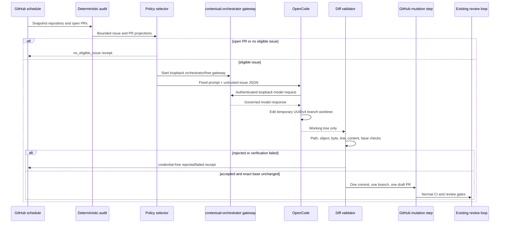

# OpenCode commercial development loop runbook

## Purpose

The `OpenCode Commercial Development` workflow may implement one explicitly eligible LifeOS buyer-gap issue each hour. It does not merge, deploy, release, modify repository settings, or bypass the existing review loop. The deterministic Commercial Readiness workflow remains the authoritative audit and exact-head merge path.

## Enablement prerequisites

1. Make at least one contextual-orchestrator governed provider credential available to the gateway bootstrap: `BYTEZ_API_KEY`, `NVIDIA_NIM_API_KEY`, `NVIDIA_NIM_API_KEY_SUB`, `OPENROUTER_API_KEY`, or `OPENAI_API_KEY`. Provider credentials belong to the gateway process only; they are never injected into `opencode_model`.
2. Keep the model route fixed to `contextual_orchestrator_gateway/orchestrator/free`. LifeOS does not choose a provider, provider group, or paid fallback. The contextual-orchestrator release owns provider discovery and route resolution.
3. Consume contextual-orchestrator only from an immutable reviewed release identity. A protected-branch commit is not release authority. If the required gateway-auth bootstrap is not present in an immutable release, the workflow remains blocked rather than repinning to mutable upstream source.
4. Keep `product/opencode-commercial-development-policy.json` under normal pull-request review.
5. Add an issue title to `eligible_issue_titles` only through a reviewed pull request after confirming the issue fits the initial non-destructive write boundary.
6. Verify the exact OpenCode package and `pnpm-lock.yaml` pin after every OpenCode update.

The workflow is functionally disabled when no governed provider credential is available: it emits a credential-free `provider_credential_missing` receipt and performs no remote branch mutation.

## Hourly sequence



## Credentials and trust boundaries

### Contextual-orchestrator gateway credentials

Provider credentials are mapped only into the `Start contextual-orchestrator free gateway` step. The sidecar runs as the separate `opencode_gateway` system user and owns provider discovery and upstream authentication. `opencode_model` receives no BYTEZ, NVIDIA NIM, OpenRouter, or OpenAI provider credential. It is configured only for the loopback `contextual_orchestrator_gateway/orchestrator/free` route and authenticates to that local boundary with a per-run random gateway token.

During model execution, UID-based `iptables` rules reject other IPv4 and all IPv6 egress from `opencode_model`, permitting only the configured loopback gateway port. The gateway port is validated as decimal input and normalized before arithmetic so leading-zero values cannot acquire Bash octal semantics. The workflow terminates the gateway before repository verification and removes the model and gateway processes, firewall rules, private homes, configuration, prompt material, and private sidecar workspace in the `always()` cleanup path.

OpenCode catalog refresh and project-local configuration discovery are disabled. The private configuration explicitly reloads the reviewed workspace `AGENTS.md` and `CLAUDE.md`, enables only `contextual_orchestrator_gateway`, registers and whitelists only `orchestrator/free`, and pins primary and small-model work to that route. Provider/model discovery remains contextual-orchestrator authority rather than a LifeOS-local provider catalog.

Provider credentials must never appear in:

- Git configuration;
- issue or pull-request bodies;
- retained receipts or artifacts;
- model prompts or source files;
- the OpenCode/model process;
- repository tests or scripts as literal secret values;
- test logs;
- the `@life-os/commercial-development-agent` process;
- the GitHub mutation step;
- the existing review-agent credential scheme.

A suspected credential disclosure requires immediate rotation of the affected provider credential, cancellation of active runs, deletion of unreferenced automation branches, and review of workflow logs and draft pull requests. Raw gateway/provider diagnostics are not release evidence and must not be copied into retained Actions output.

### GitHub credential

The checkout disables persisted credentials. OpenCode receives no `GITHUB_TOKEN` or `GH_TOKEN`. A later deterministic step receives `github.token` only after the diff, repository tests, and exact base SHA pass. That step may create one commit, push one same-repository UUIDv4 branch, and open one draft pull request. It cannot merge or release.

### Docker authority and runtime proof

The isolated `opencode_model` account runs format, lint, typecheck, test, and build commands but never receives Docker-group membership or Docker-socket access. A separate trusted step passes the accepted candidate's exact `compose.yaml` through `--file` and runs only `docker compose config --quiet`; `--project-directory` supplies its path-resolution base. The resulting draft pull request then enters normal credential-free CI, which starts digest-pinned PostgreSQL and NATS images with `docker compose up --wait`, executes PostgreSQL `SELECT 1`, validates the NATS JetStream `/jsz` response shape, prints only a bounded timestamped log tail on failure, and tears down containers and volumes on every exit. Compose publishes its development ports on loopback only.

## Policy changes

Changes to allowed paths, issue titles, limits, model profiles, credentials, permissions, or mutation authority are security-sensitive architecture changes. They require:

- updated design and plan;
- realistic prompt-injection and policy tests;
- AppGuardrail, Semgrep, Security Scan, Commercial Readiness, CodeRabbit, and human review;
- exact-head success before merge.

The agent is prohibited from modifying its own workflow or policy in the initial slice.

## Receipts

The retained artifact contains only `receipt.json` using schema:

```text
life-os.opencode-commercial-development-receipt.v1
```

Retention is seven days. The receipt records counts, stable classifications, exact base SHA, external GitHub references, UUIDv4 run/branch identity, OpenCode version, model route, and deterministic validation outcomes. It excludes source paths, source diff, issue body, prompt, model output, hidden reasoning, credentials, provider bodies, raw gateway logs, and stack traces.

## Failure handling

| Reason code                   | Operator interpretation                                                         | Remote mutation                                                |
| ----------------------------- | ------------------------------------------------------------------------------- | -------------------------------------------------------------- |
| `no_eligible_issue`           | Open PRs remain or no allowlisted issue is available                            | None                                                           |
| `provider_credential_missing` | No contextual-orchestrator governed provider credential is available            | None                                                           |
| `provider_unavailable`        | contextual-orchestrator route or OpenCode run failed                            | None                                                           |
| `opencode_unavailable`        | Exact OpenCode CLI cannot execute                                               | None                                                           |
| `invalid_configuration`       | Policy, route, sidecar, or workflow configuration is invalid                    | None                                                           |
| `prompt_rejected`             | Prompt exceeds or violates the fixed contract                                   | None                                                           |
| `diff_rejected`               | Working-tree output violates path, object, size, content, or no-change policy   | None                                                           |
| `base_changed`                | `main` advanced after the run began                                             | None                                                           |
| `verification_failed`         | Repository tests, build, or trusted Compose parsing failed                      | None                                                           |
| `draft_pull_request_failed`   | A validated commit could not become a draft PR                                  | Possible unreferenced automation branch; reconcile immediately |
| `completed`                   | One draft PR was created; normal review is still required                       | One branch and one draft PR                                    |

The receipt composer emits `invalid_configuration` when the explicit gateway/catalog preflight does not succeed. The contract reserves `opencode_unavailable` and `prompt_rejected` for future deterministic classifications that the current workflow does not emit.

## Branch reconciliation

Automation branches use:

```text
automation/opencode-commercial-<uuidv4>
```

An automation branch may be deleted when all conditions hold:

- no open or closed pull request references it;
- it is not the current head of an active workflow;
- the deterministic receipt does not report a pending draft-PR operation;
- an operator has verified that no unique reviewed work would be lost.

Never force-push an automation branch. If `main` advances, abandon the branch and rerun from the new exact base rather than silently rebasing model output.

## OpenCode update procedure

1. Create a feature branch.
2. Resolve the current official `opencode-ai` version once.
3. Add it with an exact version and update `pnpm-lock.yaml`.
4. Verify the reviewed CLI identity with `packages/commercial-development-agent/src/verify-opencode-identity.mjs`, which spawns the installed binary without `NODE_OPTIONS`, requires the exact `opencode --version` pin, reads `--pure` from the combined stdout and stderr of `opencode --help`, and verifies the reviewed `opencode run --help` command contract inside the verifier boundary.
5. Run package and workflow-contract tests, including contextual-orchestrator route/secret scoping, sidecar bootstrap behavior, the offline one-route catalog preflight, and Compose authority separation.
6. Inspect the lockfile and transitive dependency change.
7. Remove any temporary write-capable bootstrap workflow.
8. Obtain normal exact-head security and review evidence.

Never use a floating version, mutable installer script, or `curl | sh` in the persistent workflow.

## Central `.github` migration

The organization-central `.github` repository may later host a reusable wrapper that performs common checkout, OpenCode installation, secret scoping, and receipt upload. LifeOS must continue to own:

- issue-selection policy;
- product prompt policy;
- allowed/prohibited paths;
- realistic fixtures;
- receipt validation;
- package tests;
- branch and merge policy.

A central migration must pin the reusable workflow by exact commit SHA and preserve the existing review-agent credentials unchanged.

## Disablement

To stop model-assisted development immediately without affecting deterministic audit or merge behavior:

1. remove or rotate the governed provider credentials available to the contextual-orchestrator gateway; or
2. remove every title from the eligible backlog through a reviewed policy change; or
3. disable the `OpenCode Commercial Development` workflow in GitHub Actions.

Do not disable the independent Commercial Readiness workflow when responding to a model-provider incident.
