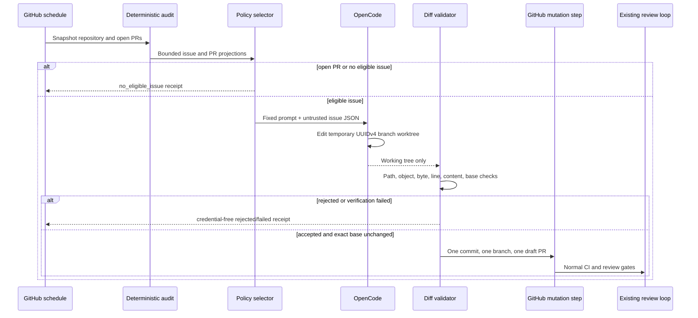

# OpenCode commercial development loop runbook

## Purpose

The `OpenCode Commercial Development` workflow may implement one explicitly eligible LifeOS buyer-gap issue each hour. It does not merge, deploy, release, modify repository settings, or bypass the existing review loop. The deterministic Commercial Readiness workflow remains the authoritative audit and exact-head merge path.

## Enablement prerequisites

1. Store the NVIDIA provider credential as the repository secret `NVIDIA_NIM_API_KEY`.
2. Optionally configure repository variable `OPENCODE_NVIDIA_MODEL` with one NVIDIA NIM chat model identifier. When the value omits the provider prefix, the workflow prefixes `nvidia/`.
3. Keep `product/opencode-commercial-development-policy.json` under normal pull-request review.
4. Add an issue title to `eligible_issue_titles` only through a reviewed pull request after confirming the issue fits the initial non-destructive write boundary.
5. Verify the exact OpenCode package and `pnpm-lock.yaml` pin after every OpenCode update.

The workflow is disabled functionally when the NVIDIA secret is absent: it emits a credential-free `provider_credential_missing` receipt and performs no remote branch mutation.

## Hourly sequence



## Credentials and trust boundaries

### NVIDIA credential

`NVIDIA_NIM_API_KEY` is present in exactly one workflow step. That step starts a loopback HTTP bridge as the separate system user `opencode_bridge`; only that bridge receives the credential and forwards bounded requests to NVIDIA NIM. OpenCode runs as `opencode_model` with `NVIDIA_API_KEY=local-loopback-placeholder` and a provider base URL pointing to the bridge.

During model execution, UID-based `iptables` rules reject other IPv4 and all IPv6 egress from `opencode_model`, permitting only the configured loopback bridge port. The workflow terminates the bridge before repository verification and removes the model and bridge processes, firewall rules, private homes, configuration, prompt, bridge code, and log in the `always()` cleanup step.

The credential must never appear in:

- Git configuration;
- issue or pull-request bodies;
- retained receipts or artifacts;
- model prompts or source files;
- the OpenCode/model process;
- repository tests or scripts;
- test logs;
- the `@life-os/commercial-development-agent` process;
- the GitHub mutation step;
- the existing review-agent credential scheme.

A suspected credential disclosure requires immediate secret rotation, cancellation of active runs, deletion of unreferenced automation branches, and review of workflow logs and draft pull requests. Do not retain or upload the raw OpenCode log while investigating. Treat `opencode_bridge`, rather than the OpenCode/model process, as the credential-bearing process during exposure analysis.

### GitHub credential

The checkout disables persisted credentials. OpenCode receives no `GITHUB_TOKEN` or `GH_TOKEN`. A later deterministic step receives `github.token` only after the diff, repository tests, and exact base SHA pass. That step may create one commit, push one same-repository UUIDv4 branch, and open one draft pull request. It cannot merge or release.

## Policy changes

Changes to allowed paths, issue titles, limits, model profiles, credentials, permissions, or mutation authority are security-sensitive architecture changes. They require:

- updated design and plan;
- realistic prompt-injection and policy tests;
- AppGuardrail, Semgrep, Security Scan, Commercial Readiness, CodeRabbit, and human review;
- exact-head success before merge.

The agent is prohibited from modifying its own workflow or policy in the initial slice.

## Receipts

The retained artifact contains only `receipt.json` using schema:

```text
life-os.opencode-commercial-development-receipt.v1
```

Retention is seven days. The receipt records counts, stable classifications, exact base SHA, external GitHub references, UUIDv4 run/branch identity, OpenCode version, model label, and deterministic validation outcomes. It excludes source paths, source diff, issue body, prompt, model output, hidden reasoning, credentials, provider bodies, raw logs, and stack traces.

## Failure handling

| Reason code                   | Operator interpretation                                                       | Remote mutation                                                |
| ----------------------------- | ----------------------------------------------------------------------------- | -------------------------------------------------------------- |
| `no_eligible_issue`           | Open PRs remain or no allowlisted issue is available                          | None                                                           |
| `provider_credential_missing` | NVIDIA secret is absent                                                       | None                                                           |
| `provider_unavailable`        | Provider or OpenCode run failed                                               | None                                                           |
| `opencode_unavailable`        | Exact OpenCode CLI cannot execute                                             | None                                                           |
| `invalid_configuration`       | Policy, model, or workflow configuration is invalid                           | None                                                           |
| `prompt_rejected`             | Prompt exceeds or violates the fixed contract                                 | None                                                           |
| `diff_rejected`               | Working-tree output violates path, object, size, content, or no-change policy | None                                                           |
| `base_changed`                | `main` advanced after the run began                                           | None                                                           |
| `verification_failed`         | Repository tests or build failed                                              | None                                                           |
| `draft_pull_request_failed`   | A validated commit could not become a draft PR                                | Possible unreferenced automation branch; reconcile immediately |
| `completed`                   | One draft PR was created; normal review is still required                     | One branch and one draft PR                                    |

The receipt contract reserves `opencode_unavailable`, `invalid_configuration`, and `prompt_rejected`; the current workflow receipt composer does not emit those codes.

## Branch reconciliation

Automation branches use:

```text
automation/opencode-commercial-<uuidv4>
```

An automation branch may be deleted when all conditions hold:

- no open or closed pull request references it;
- it is not the current head of an active workflow;
- the deterministic receipt does not report a pending draft-PR operation;
- an operator has verified that no unique reviewed work would be lost.

Never force-push an automation branch. If `main` advances, abandon the branch and rerun from the new exact base rather than silently rebasing model output.

## OpenCode update procedure

1. Create a feature branch.
2. Resolve the current official `opencode-ai` version once.
3. Add it with an exact version and update `pnpm-lock.yaml`.
4. Verify `opencode --version` and `opencode run --help`.
5. Run package and workflow-contract tests.
6. Inspect the lockfile and transitive dependency change.
7. Remove the temporary write-capable bootstrap workflow.
8. Obtain normal exact-head security and review evidence.

Never use a floating version, mutable installer script, or `curl | sh` in the persistent workflow.

## Central `.github` migration

The organization-central `.github` repository may later host a reusable wrapper that performs common checkout, OpenCode installation, secret scoping, and receipt upload. LifeOS must continue to own:

- issue-selection policy;
- product prompt policy;
- allowed/prohibited paths;
- realistic fixtures;
- receipt validation;
- package tests;
- branch and merge policy.

A central migration must pin the reusable workflow by exact commit SHA and preserve the existing review-agent credentials unchanged.

## Disablement

To stop model-assisted development immediately without affecting deterministic audit or merge behavior:

1. remove or rotate `NVIDIA_NIM_API_KEY`; or
2. remove every title from the eligible backlog through a reviewed policy change; or
3. disable the `OpenCode Commercial Development` workflow in GitHub Actions.

Do not disable the independent Commercial Readiness workflow when responding to a model-provider incident.
