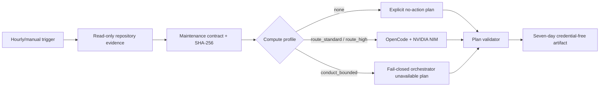

# NVIDIA OpenCode maintenance runbook

## Purpose

The `NVIDIA OpenCode Maintenance Plan` workflow runs hourly at minute 37 UTC and may also be dispatched manually from the reviewed default branch. It compiles deterministic LifeOS repository evidence into one immutable maintenance contract, then uses the plan-only OpenCode agent only when the contract selects a direct NVIDIA route.

This initial release does **not** edit source, create pull requests, merge, tag, release, alter repository settings, or change independent review-agent credentials.

## Required configuration

### Secret

- `NVIDIA_NIM_API_KEY`: dedicated NVIDIA NIM provider credential.

The workflow maps this secret to `NVIDIA_API_KEY` only in the credential preflight and OpenCode execution steps. `COPILOT_GITHUB_TOKEN` is prohibited. Existing review-agent secrets and external CodeRabbit configuration are outside this workflow's authority.

### Fixed model and agent

- Model: `nvidia/nvidia/llama-3.3-nemotron-super-49b-v1.5`
- Agent: `.opencode/agents/maintenance-planner.md`
- OpenCode GitHub Action: exact commit recorded in the workflow

A source review is required before changing the model, action commit, agent permissions, schedule, or contract schema.

## Execution flow

The `conduct_bounded` cell intentionally fails closed in this slice. High-risk security, credential, migration, workflow-permission, tenant-boundary, or destructive-operation work must not silently fall back to an unconstrained direct model. A follow-up reviewed slice may activate an exact-pinned contextual-orchestrator path.

## Artifacts

The workflow retains only:

- `maintenance-contract.json`;
- `maintenance-plan.json`;
- `maintenance-plan.md`.

Retention is seven days. The artifact excludes raw issue or review prose, prompts, model responses, hidden reasoning, source patches, credentials, bearer values, stack traces, raw logs, and provider bodies.

## Interpreting results

### `inspect_pr`

One open PR has failed checks or unresolved review evidence. The plan lists verification and diagnosis steps but cannot modify or merge the PR.

### `recommend_gap`

No open PR requires attention and the commercial-readiness audit found a buyer-visible capability gap. The plan recommends one bounded slice within allowed evidence paths.

### `wait`

An open PR exists but deterministic evidence does not authorize additional model work.

### `complete`

No open PR or unresolved evidence-backed buyer gap remains.

### Stable failure reason codes

- `provider_unavailable`: NVIDIA/OpenCode could not produce a valid plan.
- `orchestrator_unavailable`: high-risk work requires the not-yet-enabled reviewed orchestrator path.
- `permission_required`: a required permission is absent and may not be inferred.
- `external_decision_required`: repository policy cannot determine the product decision.
- `no_action_required`: deterministic evidence authorizes no model work.

## Failure response

1. Confirm the workflow loaded from the default branch and the exact source SHA appears in the contract.
2. Inspect deterministic `prepare` job failures before considering the model provider.
3. For `missing NVIDIA_NIM_API_KEY`, configure the dedicated secret; do not substitute a Copilot or review-agent token.
4. For `invalid_repository_evidence`, rerun the deterministic commercial-readiness workflow and inspect schema/version drift.
5. For `invalid_model_output`, keep the artifact private and fix the agent prompt or validator; do not bypass validation.
6. For `orchestrator_unavailable`, leave the high-risk plan unexecuted until the reviewed contextual-orchestrator follow-up is merged.
7. Never grant contents or pull-request write permissions merely to make plan generation succeed.

## Rollback

Disable the workflow by reverting `.github/workflows/opencode-nim-maintenance.yml`. No product database, migration, user data, branch rule, PR, release, or external deployment must be rolled back. Existing deterministic commercial-readiness audit and exact-head merge drain remain independent.

## Security review checklist

- workflow and all actions pinned to immutable commits;
- default-branch-only execution;
- top-level and model job `contents: read`;
- no `contents: write`, `pull-requests: write`, or `issues: write`;
- no `COPILOT_GITHUB_TOKEN` reference;
- no change to `.github/workflows/appguardrail.yml` or review-agent secret names;
- contract generated before provider credential exposure;
- agent denies bash, tasks, external directories, web access, and all source edits;
- exact output path and schemas validated;
- temporary model files removed before artifact upload;
- maintenance-agent statement, branch, function, and line coverage remains 100%.
