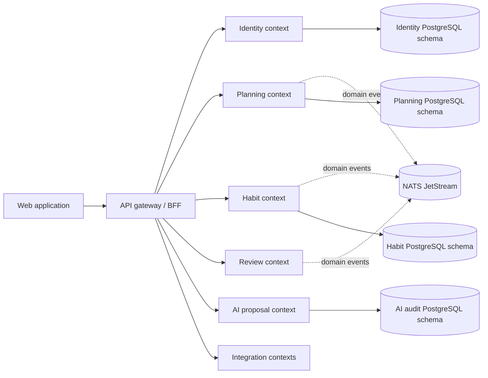
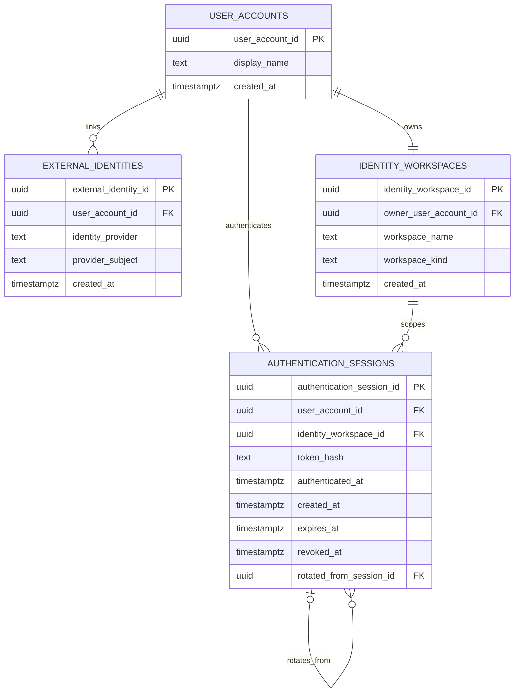

# LifeOS product and technical gap baseline

This document records the current buyer-facing product boundary, technical contracts, evidence, and unresolved gaps. `AGENTS.md`, `ARCHITECTURE.md`, approved specifications, and executable tests remain authoritative when a conflict exists.

## Buyer PRD baseline

LifeOS is a modular, self-hostable personal operating system that brings identity, planning, habits, review, integrations, notifications, and inert AI proposals into one composable workspace. The buyer-visible promise is trustworthy personal-work management without silent cross-tenant mutation, credential leakage, or hidden provider coupling.

Primary outcomes:

- sign in through supported external identity providers and obtain one durable personal workspace;
- capture, plan, search, complete, and review work inside an authenticated workspace boundary;
- connect integrations without allowing provider credentials or client-selected tenant identifiers to become durable authority;
- receive bounded notifications and retain explicit audit evidence;
- use AI only for validated inert proposals until a separately authorized execution capability exists.

## TRD and bounded-context map

Each service owns its database schema, migrations, persistence adapters, runtime configuration, tests, and shutdown behavior. Cross-context writes require versioned HTTP, event, saga, plugin, or MCP contracts; direct cross-service table access is prohibited.

## DDD ubiquitous language

### Identity bounded context

Aggregates and entities: `User`, `ExternalIdentity`, `Session`, `UserPreference`, and the provisioned personal-workspace relationship.

Current persistence vocabulary after migration `0007_identity_database_semantic_names.sql`:

- `user_accounts.user_account_id`
- `external_identities.external_identity_id`
- `external_identities.user_account_id`
- `external_identities.identity_provider`
- `identity_workspaces.identity_workspace_id`
- `identity_workspaces.owner_user_account_id`
- `identity_workspaces.workspace_name`
- `identity_workspaces.workspace_kind`
- `authentication_sessions.authentication_session_id`
- `authentication_sessions.user_account_id`
- `authentication_sessions.identity_workspace_id`
- `authentication_sessions.rotated_from_session_id`
- `oauth_transactions.oauth_transaction_id`
- `oauth_transactions.identity_provider`

Invariants:

- internal identifiers remain opaque UUIDv4 strings;
- external provider identifiers never become internal primary keys;
- one personal workspace is provisioned per owner under the current MVP constraint;
- session records remain bound to a valid user-account/workspace ownership pair;
- OAuth verifier and nonce material remains encrypted at rest;
- public/domain TypeScript shapes remain stable across the database-only semantic rename through repository adapters.

### Workspace bounded context

Entities and value concepts: `Workspace`, `WorkspaceMember`, `Role`, workspace ownership, and future team-workspace membership. The MVP exposes a personal workspace while preserving a future team-workspace model.

### Planning bounded context

Aggregates and entities: `Goal`, `Project`, `Milestone`, `Task`, `TaskDependency`, and `Tag`. Planning search and mutation must use authenticated workspace authority rather than bare client-selected tenancy headers.

### Habit bounded context

Aggregates and entities: `Habit`, `RecurrenceRule`, `HabitOccurrence`, and `HabitCompletion`. Historical occurrences remain independent from later recurrence-rule edits.

### Review bounded context

Entities: `DailyPlan`, `DailyPriority`, `WeeklyReview`, and `ReviewObservation`.

### Audit and data-rights boundary

Entities: `AuditEvent`, `DataExportJob`, `AccountDeletionJob`, and durable data-rights request evidence. Terminal audit receipts may intentionally outlive erased source identity/workspace rows where documented retention semantics require it.

### AI proposal bounded context

AI output is an inert proposal. Domain validation, audit persistence, explicit accept/reject decisions, and credential-free error handling are authoritative. There is no generic mutation bus from model output into planning state.

## Identity ERD after semantic naming migration

The rename preserves the existing normalized relationships: identity-provider bindings remain separate from user accounts, workspace ownership remains separately constrained, and session authentication state remains a dependent record rather than duplicated account state. No new UPSERT path, hot partition, or cross-service read/write coupling is introduced.

## Organization naming-contract status

Repository policy requires organization-owned database objects to use semantically specific multiword `snake_case` names. The Identity persistence layer previously violated that rule through authoritative objects such as `identity.users`, `identity.workspaces`, `identity.sessions`, and bare columns `id`, `name`, `provider`, and `kind`.

The canonical repair branch `fix/identity-database-semantic-names` establishes a forward migration, updates runtime SQL and current integration fixtures, and preserves the existing TypeScript/public contract at repository adapter boundaries. Historical migration fixtures keep legacy spellings only where they deliberately exercise the pre-migration schema.

Naming checks must continue to distinguish genuinely underspecified organization-owned single-word names from valid multiword `snake_case`, camelCase, and PascalCase vocabulary and from externally mandated protocol/vendor names.

## Security, test, and operability baseline

- Identity persistence and service-context identifiers are opaque UUIDv4 values.
- OAuth verifier/nonce material is encrypted at rest; session tokens are persisted as hashes rather than raw tokens.
- Tenant/workspace authority is derived from authenticated context rather than arbitrary browser-selected ownership values.
- The semantic database migration is transactional and uses a five-second local lock timeout because PostgreSQL rename operations can require strong locks.
- The naming migration performs metadata renames only: row payloads, normalized dependencies, foreign-key ownership, and partition strategy do not change.
- A real-PostgreSQL migration regression seeds the legacy schema, applies the new migration, validates preserved relationships, and asserts removal of generic authoritative table/column names.
- Repository unit and integration tests assert current semantic SQL readers/writers; required CI remains authoritative for exact-head merge readiness.

## UI evidence baseline

The identity naming repair does not alter UI rendering, Storybook stories, Figma artifacts, screenshots, keyboard behavior, or accessible-name contracts. UI accessibility evidence remains governed by the existing WCAG 2.2 AA target and buyer-facing browser journeys. No new visual evidence is claimed for this persistence-only change.

## Current gaps and causal blockers

| Gap | Owning boundary | Status / evidence |
| --- | --- | --- |
| Identity PostgreSQL schema contains generic organization-owned names | Identity persistence | Repair implemented on `fix/identity-database-semantic-names`; fresh exact-head CI/review required before merge. |
| Coordinated old-schema/new-schema deployment | Identity operations | Documented in `docs/doctoring/identity-database-semantic-names.md`; old and new binaries must not dual-write across migration `0007`. |
| Repository-wide naming audit beyond the Identity slice | Repository + organization sweep | Open; continue prioritizing public/persisted and cross-repository contracts by reuse boundary and blast radius. |
| Product capability gaps outside this persistence repair | Product/service owners | Continue from current issues, PRD/specifications, commercial-readiness evidence, and buyer-visible workflow failures after required PR work drains. |

## Exact-head evidence protocol

Do not transfer green evidence from a predecessor commit. Before merge, re-fetch the pull-request head, current reviews and unresolved threads, branch/ruleset requirements, and every required workflow. Any failing job must be diagnosed from its current logs and repaired at the causal owner. Merge is permitted only through ordinary protection after independent non-author approval is current for the last push.

## Research and standards traceability

The existing opaque-UUID invariant aligns with RFC 9562. Migration-operability decisions follow current PostgreSQL documentation on transactional DDL and locking behavior. Accessibility remains targeted to WCAG 2.2 AA as specified by the approved product design.

### References

Davis, K., Peabody, B., & Leach, P. (2024). *Universally unique IDentifiers (UUIDs) (RFC 9562).* RFC Editor. https://www.rfc-editor.org/rfc/rfc9562

PostgreSQL Global Development Group. (2026). *PostgreSQL 18 documentation: ALTER INDEX.* https://www.postgresql.org/docs/18/sql-alterindex.html

PostgreSQL Global Development Group. (2026). *PostgreSQL 18 documentation: Explicit locking.* https://www.postgresql.org/docs/18/explicit-locking.html

World Wide Web Consortium. (2023). *Web Content Accessibility Guidelines (WCAG) 2.2.* https://www.w3.org/TR/WCAG22/
