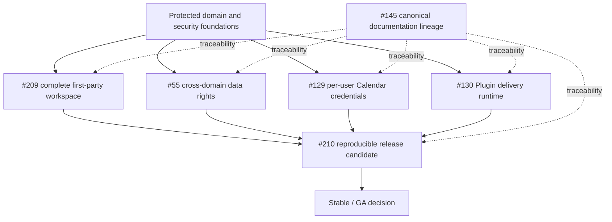

# LifeOS product and technical gap baseline

**Baseline date:** 2026-08-20 (KST)  
**Protected-main evidence commit:** `f8559bf31dc098bdd58473747805a229bf860cc7`  
**Document status:** Evidence baseline; not a substitute for the canonical PRD, TRD, Architecture, ADRs, or release evidence  
**Primary tracking issue:** [#21 LifeOS commercial readiness](https://github.com/ContextualWisdomLab/life-os/issues/21)

## 1. Executive decision

LifeOS is **not yet a complete commercial product**.

The repository has a materially stronger foundation than a typical prototype:

- domain-oriented Planning, Habit, Review, Identity, Calendar, Plugin, Notification, and AI boundaries;
- PostgreSQL persistence, signed service contexts, bounded request/response handling, tenant-aware repositories, and immutable or replay-safe evidence where required;
- a responsive Today experience, quick capture/search, explicit local-to-workspace synchronization, Korean/English catalogs, PWA scaffolding, deployment references, backup tooling, security gates, and an hourly commercial-readiness loop;
- explicit separation between user-authored state and inert AI proposals.

The decisive remaining problem is product coherence. The repository's defining design promises a Goal → Project → Task/Habit → Today → Review operating loop, but protected `main` exposes only Today, onboarding, and offline first-party pages. The onboarding “direction” is not persisted as a Goal; it becomes a browser-local Today action. A buyer therefore cannot yet use the main product proposition from the first-party UI even though many backend capabilities exist.

The second decisive problem is release evidence. Source, workflow, operations, and deployment-reference artifacts are present, but there is no independently reproducible release candidate that proves install, upgrade, recovery, exact buyer journeys, supply-chain evidence, and operational readiness from immutable release artifacts.

Accordingly, the highest-priority buyer-visible gaps are:

1. [#209 — complete the authenticated Goal → Project → Task → Habit → Review workspace](https://github.com/ContextualWisdomLab/life-os/issues/209);
2. [#210 — deliver a reproducible release candidate with buyer-verifiable evidence](https://github.com/ContextualWisdomLab/life-os/issues/210);
3. [#55 — complete tenant export/deletion orchestration](https://github.com/ContextualWisdomLab/life-os/issues/55);
4. [#129 — complete per-user Calendar credential lifecycle](https://github.com/ContextualWisdomLab/life-os/issues/129);
5. [#130 — complete Plugin installation, secret, and delivery runtime](https://github.com/ContextualWisdomLab/life-os/issues/130).

These gaps are now represented separately from configured capability maturity in `product/buyer-gaps.json`. A capability can have implementation and tests while a downstream buyer journey remains incomplete.

## 2. Evidence method

This baseline uses four evidence classes.

| Class | Meaning | Examples |
|---|---|---|
| Protected implementation | Code or contract on the protected `main` commit | services, migrations, BFF routes, web routes |
| Executable evidence | Tests, CI contracts, integration fixtures, recovery scripts | PostgreSQL integration tests, browser E2E, policy tests |
| Active PR evidence | Unmerged code at one exact PR head | current open PRs in §6 |
| Planned/documented | A design, issue, runbook, or proposal without protected implementation proof | canonical docs PR, product-gap issue |

Rules:

- File existence is not equivalent to a successful buyer journey.
- An active PR is not a shipped capability.
- A historical check does not transfer to a changed head.
- `mergeable: true` is not equivalent to required checks, reviews, and threads being complete.
- Documentation can describe and trace a gap but cannot close it.
- Release evidence must exercise immutable release artifacts rather than a mutable source checkout.
- Inferences are labeled as such and are not promoted to authoritative facts.

## 3. Product promise versus protected-main experience

### 3.1 Promised first-party product

The approved design source at `docs/superpowers/specs/2026-08-02-life-os-design.md` defines:

- primary navigation: Today, Goals, Projects, Tasks, Habits, Review, Settings;
- one personal workspace per new user;
- hierarchical Goals, linked Projects, Milestones, Tasks, Habits and recurrence;
- daily and weekly planning;
- completion history and progress;
- JSON import/export;
- responsive installable PWA;
- explicit, auditable AI proposals that require acceptance.

The core workflow is:

```text
sign in
→ personal workspace
→ capture an item
→ classify it
→ connect it to a larger objective
→ act through Today
→ complete work
→ review progress
```

### 3.2 Protected-main first-party surface

The current `apps/web/app` route tree exposes:

```text
/
/onboarding
/offline
/api/planning/search
/api/planning/today/{date}
/api/ai/proposals
/api/ai/proposals/{proposalId}
/api/ai/proposals/{proposalId}/decisions
```

It does not expose first-party routes for:

```text
/goals
/projects
/tasks
/habits
/review
/settings
```

The root page renders `TodayClient`. The current navigation is a set of in-page anchors for Today, Backlog, and Completed rather than the designed product navigation.

The onboarding flow asks for a direction and a next action, but protected code stores only a browser-local Today action and an onboarding-completion marker. It explicitly states that no account or workspace synchronization occurs. The direction is not persisted as a Goal and is not connected to a Project.

The Today synchronization panel is deliberately privacy-preserving: it performs no request on mount and requires explicit user action to inspect or replace workspace state. This is a sound boundary, but the durable object is one date-scoped Today aggregate, not the complete Goal/Project/Task/Habit/Review workspace.

### 3.3 Buyer-journey assessment

| Journey step | Protected-main status | Evidence judgment |
|---|---|---|
| Google/GitHub OAuth contracts | Implemented foundation | Still requires exact hosted identity lifecycle and release-artifact journey evidence |
| Personal workspace provisioning | Implemented foundation | Needs first-party end-to-end release proof |
| Anonymous/local first plan | Implemented | Browser-local only |
| Durable Today synchronization | Implemented bounded slice | Explicit check/save/load and optimistic revision boundary |
| Durable Goal creation through first-party UI | Missing | P0 blocker |
| Goal hierarchy and progress explanation | Missing UI | P0 blocker |
| Project/milestone workspace | Missing UI | P0 blocker |
| Task inbox/classification and relationship editing | Partial | Quick capture/search exists; complete entity workspace absent |
| Habit workspace and historical adherence | Domain foundation exists | First-party journey absent |
| Weekly review workspace | Domain foundation exists | First-party journey absent |
| Settings/account/integration/data-rights surfaces | Missing coherent UI | P0/P1, depends on #55/#129/#130 |
| Complete data export/deletion | Partial | #55 open |
| Per-user Calendar OAuth/KMS lifecycle | Partial | #129 open |
| Plugin secrets and SSRF-safe outbound runtime | Partial | #130 open |
| Reproducible release from immutable artifacts | Missing complete evidence | #210 open |

## 4. Protected strengths that should not be reimplemented

The following are foundations to preserve and consume through contracts rather than copy into a new UI or service.

### 4.1 Planning and Today

- Planning owns Goals, Projects, Milestones, Tasks, search, and date-scoped Today persistence.
- Same-origin web BFF routes use authenticated server context rather than trusting browser-selected workspace IDs.
- Today reads and writes use bounded JSON, strong opaque revisions, explicit `If-Match`/`If-None-Match`, idempotency keys, and credential-free conflicts.
- Local drafts are not uploaded automatically.

### 4.2 Habits and reviews

- Habit definitions are separated from generated occurrences and completion history.
- Review is intended as a projection/decision surface, not a second source of truth for Planning or Habit records.
- Future UI must retain this ownership boundary.

### 4.3 AI proposals

- Production proposal transport now requests adaptive contextual-orchestrator `auto` mode.
- Provider/model routing, workflow depth, fallback, and quality-cost decisions remain in contextual-orchestrator.
- LifeOS retains strict local parsing and domain validation.
- Proposed operations remain inert until an explicit user decision.
- Browser credentials are not forwarded to AI service.

### 4.4 Security and privacy

- Signed workspace/service contexts and bounded identity propagation are established patterns.
- Cross-service direct SQL is prohibited.
- Sensitive payloads are not intended for operational metrics or public problems.
- Data-rights contributors remain service-owned rather than giving Identity direct persistence access.
- Calendar and Plugin work correctly treat a manifest or client-selected destination as intent, not authority.

### 4.5 Operations

- Backup/restore scripts, Kubernetes reference manifests, deployment renderer, SLO documents, security gates, and commercial-readiness automation exist.
- The deployment documentation correctly states which external infrastructure is not provisioned.
- These are release inputs; they do not alone constitute a release.

## 5. Canonical product and technical gaps

### 5.1 P0 — Complete first-party workspace (#209)

**Buyer pain:** A buyer cannot use the defining LifeOS loop without APIs or backend knowledge.

**Required vertical:**

```text
authenticated user
→ durable Goal
→ linked Project and Milestone
→ Task and optional Habit
→ Today priority/time block
→ completion
→ Weekly Review
→ progress and next action
```

**Required surfaces:** Goals, Projects, Tasks, Habits, Review, Settings.

**Design requirements:** Figma interaction contract, Figma File ID in an ADR, Storybook inventory, design-token expansion, accessible and localized states, exact-value tables for progress and reports.

**Do not:** move domain ownership into Next.js, silently upload local drafts, or treat UI presence as closing #55/#129/#130.

### 5.2 P0 — Complete data portability and deletion (#55)

**Buyer pain:** A privacy-sensitive product cannot claim user-owned data while export/deletion remains incomplete across service participants, artifacts, retention, backup expiry, and operator delivery.

**Required:**

- all owning services contribute bounded export/preflight/erase/verify evidence;
- participant inventory and reconciliation;
- explicit legal hold/retention outcomes;
- durable job state and protected artifact delivery;
- deletion propagation to searchable/derived projections without corrupting authoritative audit evidence;
- backup-expiry and restoration semantics;
- account UI that shows request, blockers, progress, completion, and recovery actions.

Active PRs #198 and #199 advance Notification and AI participation but cannot close the cross-domain journey by themselves.

### 5.3 P0 — Complete per-user Calendar credentials (#129)

**Buyer pain:** A multi-user hosted deployment cannot rely on one operator-supplied Google access token.

**Required:**

- per-user connection consent and account/calendar discovery;
- encrypted KMS-backed credential handles;
- refresh, rotation, revocation, disconnect, and provider cleanup;
- least-privilege scopes and purpose-bound access;
- deterministic sync, idempotency, stale-precondition recovery, bounded retries, and explicit conflict UX;
- provider-neutral adapter contracts and independently testable CalDAV/Google behavior;
- no credential, calendar title, or private event body in logs/metrics/errors.

### 5.4 P0 — Complete Plugin runtime delivery (#130)

**Buyer pain:** A plugin manifest and installation record are not useful until a host can safely bind secrets and deliver bounded events.

**Required:**

- host-authorized installation and delivery-origin grants;
- encrypted secret handles and rotation/revocation;
- exact HTTPS origin authority;
- DNS resolution and connect-time public-address enforcement;
- redirect, proxy, method, content-type, byte, and timeout policy;
- signed delivery, replay protection, retry/dead-letter, operator recovery, and observable outcomes;
- customer UI for install, scopes, destination, secret status, delivery history, suspension, and revocation.

PR #205 is an authority slice only and explicitly does not perform outbound HTTP.

### 5.5 P0 — Reproducible release candidate (#210)

**Buyer pain:** A source repository cannot be procured or operated as a product without immutable, installable, recoverable release evidence.

**Required:**

- signed SemVer tag and dated CHANGELOG release;
- digest-pinned OCI images and migration artifacts;
- SPDX 3.0.1 SBOM, SLSA v1.2 provenance, checksums, signatures, vulnerability evidence;
- one-command supported Compose profile and tested Kubernetes interfaces;
- clean install, upgrade, failed-rollout recovery, encrypted backup/restore, measured RPO/RTO;
- exact release-artifact buyer journeys, not source-checkout-only tests;
- SLO, capacity, monitoring, incident, deprecation, and support evidence;
- SOC 2/CSAP readiness mapping without claiming certification.

### 5.6 P1 — Team workspace and sharing

The domain model already anticipates WorkspaceMember and roles, but the initial first-party UI exercises only personal workspace ownership.

A later bounded vertical should add invitation, membership lifecycle, owner/admin/member/viewer authorization, shared Goal/Project visibility, audit, and revocation. Real-time collaborative editing remains separate and should not be pulled into the P0 personal-workspace release.

### 5.7 P1 — Personal analytics without atomistic fallacy

Future analytics should not imply that an isolated person's completion rate explains performance without context. Preserve at least:

- person and multiple workspace/project membership;
- task/habit type and difficulty/context;
- calendar availability and observation time;
- versioned recurrence and goal structure;
- missingness and confidence;
- longitudinal within-person and between-person distinctions.

AI summaries must distinguish observation, inference, and recommendation and must not diagnose health or psychological conditions.

## 6. Current pull-request inventory

Snapshot taken on 2026-08-20 against protected main `f8559bf31dc098bdd58473747805a229bf860cc7`.

| PR | Exact head at inspection | API state | Product relevance | Required disposition |
|---|---|---|---|---|
| [#145](https://github.com/ContextualWisdomLab/life-os/pull/145) canonical product architecture | `be31387b700471f0fcff7bbbfd7eac05a62cd3e9` | Draft; `mergeable: false`; 114 commits; 42 files | Owns the canonical PRD/TRD/Architecture/ADR/documentation reconciliation | Rebase or replace through one canonical lineage; do not infer product completion from it |
| [#198](https://github.com/ContextualWisdomLab/life-os/pull/198) Notification data-rights contributor | `5ba029dea755050ff84066a62f98a1f443e19160` | Open; non-draft; `mergeable: true` at inspection | Advances #55 for Notification-owned data | Revalidate exact head against current main, reviews, unresolved threads, and required checks before merge |
| [#199](https://github.com/ContextualWisdomLab/life-os/pull/199) AI data-rights contributor | `ae78023924f59fdb03ef3e88918bc8a09dc94e31` | Open; non-draft; `mergeable: true` at inspection | Advances #55 for AI-owned proposals/decisions | Revalidate exact head; do not treat as cross-domain completion |
| [#205](https://github.com/ContextualWisdomLab/life-os/pull/205) Plugin delivery-origin authority | `24e363bf4432de4f7ee8d486285f56064d6c4581` | Open; non-draft; `mergeable: true` at inspection | Advances #130 authority boundary only | Merge only after exact-head checks/reviews; continue with KMS and SSRF-safe delivery slices |
| [#208](https://github.com/ContextualWisdomLab/life-os/pull/208) OpenCode identity verification | `ff4821fb41eda8347c19257328de7badac94062c` | Open; non-draft; `mergeable: true`; CodeRabbit status success at inspection | Restores commercial-development loop reliability | Required workflows and exact-head review remain authoritative; no product-gap closure follows |

PR [#206](https://github.com/ContextualWisdomLab/life-os/pull/206) was closed during this assessment as superseded by merged PR [#207](https://github.com/ContextualWisdomLab/life-os/pull/207). Current `main` and #206 had identical production-adapter and focused-test blobs, while #207 is the protected-main integration.

### PR governance observations

- `mergeable: true` is a GitHub merge-base signal, not proof of review readiness.
- Large long-lived branches (#145, #198, #199) increase base-drift and reviewer burden; future work should be stacked into bounded contract/implementation/vertical slices.
- Active PR descriptions correctly state that their slices do not close parent product gaps. Preserve that discipline.
- Current open PRs predominantly harden privacy, plugin authority, and automation. None implements the missing first-party Goal/Project/Task/Habit/Review workspace.

## 7. Gap dependency graph



## 8. Recommended execution sequence

### Wave 0 — Drain and stabilize current PRs

1. Merge or repair #208 after exact-head workflows and reviews.
2. Rebase and validate #198, #199, and #205 one at a time; do not combine their ownership boundaries.
3. Resolve #145 by rebasing/reconstructing a single canonical documentation branch from current main rather than accumulating further stale commits.
4. Keep the commercial-readiness issue synchronized with the expanded buyer-gap registry.

### Wave 1 — Product vertical

1. Figma brief, File ID, user stories, storyboard, wireframes, component inventory, state machine, and API-contract delta for #209.
2. Storybook/design-token foundation.
3. Authenticated product shell and durable onboarding.
4. Goal and Project workspaces.
5. Task/Inbox and Habit workspaces.
6. Review and Settings workspaces.
7. Exact end-to-end journey, accessibility, localization, mobile, offline degradation, and second-device conflict evidence.

### Wave 2 — Trust and integration closure

1. Finish #55 participant inventory, orchestration, artifact delivery, retention/legal hold, and backup-expiry behavior.
2. Finish #129 credential lifecycle and provider-scoped Calendar UX.
3. Finish #130 KMS secret lifecycle and SSRF-safe delivery/runtime recovery.
4. Connect all three to Settings without moving domain truth into the web application.

### Wave 3 — Release candidate

1. Freeze release contract and compatibility matrix.
2. Build and sign immutable artifacts.
3. Install/upgrade/recovery rehearsals.
4. Exact release-artifact buyer journeys.
5. Security, accessibility, operations, support, procurement, and provenance evidence.
6. Publish an RC; evaluate stable/GA only when every P0 canonical buyer gap is closed with exact evidence.

## 9. Definition of complete

LifeOS is complete enough for a first stable release only when all conditions below are simultaneously true.

### Product

- A new user can use the first-party UI to create and connect Goal, Project, Task, Habit, Today, and Review records.
- The same authoritative state is usable on a second device with deterministic conflicts.
- Local anonymous state attaches only through explicit consent.
- Settings exposes identity/session, integration, notification, export/deletion, and account lifecycle controls.
- Korean and English core journeys have equivalent semantics.
- Phone, tablet, desktop, keyboard, screen reader, reduced motion, and offline degradation are tested.

### Data and privacy

- Every domain owner participates in export/deletion or supplies an explicit reviewed exclusion.
- Export is complete, versioned, documented, bounded, and re-importable where promised.
- Deletion covers authoritative and derived data according to a documented retention/legal-hold policy.
- Backup expiry and restoration behavior are explicit.
- PII is available to authorized workflows under purpose-bound access rather than being indiscriminately masked or broadcast.

### Security

- OWASP ASVS 5.0.0 requirements applicable to the product are mapped to implementation and test evidence.
- NIST SP 800-63-4 identity, authenticator, session, and federation decisions are traceable.
- Cross-tenant access attempts fail at all enforcement layers.
- Secrets are handles outside trusted secret stores, not plaintext domain fields.
- Plugin and Calendar egress is origin-, address-, method-, byte-, time-, and redirect-bounded.
- AI/browser/document inputs remain untrusted data and cannot change tool policy.

### Quality

- Owned production statement, branch, function, and line coverage: 100%.
- Public API/docstring coverage: 100%.
- Real PostgreSQL, event replay, browser, security, recovery, and release-artifact tests pass.
- Capability maturity and buyer-gap exhaustion remain separate metrics.
- No skipped/ignored test is silently counted as pass.

### Operations and release

- Reproducible signed release artifacts, SBOM, provenance, checksums, and vulnerability evidence exist.
- Supported clean install and upgrade paths work from release artifacts.
- Failed rollout and destructive recovery rehearsals meet published RPO/RTO.
- SLOs, alerts, runbooks, capacity limits, support, disclosure, and deprecation policies exist.
- No stable/GA claim depends only on source files or documentation.

## 10. Commercial-readiness evidence correction

The current capability manifest can report all configured capabilities at target because many probes assert that an implementation, workflow, or test file exists. This is useful for detecting regression of repository evidence but it is not a buyer-journey score.

The repository already corrected the most serious semantic defect by introducing `product/buyer-gaps.json`. This baseline expands that registry with #209 and #210.

Use the two dimensions as follows:

```text
Configured capability evidence
= Are the repository-owned probes present at their target maturity?

Canonical buyer gaps
= Are known buyer-visible journeys and commercial obligations still incomplete?
```

Neither dimension replaces real release evidence.

## 11. Standards and research traceability

| Source | LifeOS application |
|---|---|
| ISO/IEC 25010:2023 | Product quality characteristics and buyer/release acceptance model |
| WCAG 2.2 / ISO/IEC 40500:2025 | First-party web/PWA accessibility target |
| NIST SP 800-63-4 suite | Identity, authentication, session, and federation lifecycle |
| OWASP ASVS 5.0.0 | Web/API security verification baseline |
| SLSA v1.2 | Source/build provenance and supply-chain maturity claims |
| SPDX 3.0.1 | Release SBOM exchange |
| Locke & Latham (2002) | Specific goals, feedback, difficulty/commitment guardrails |
| Gollwitzer (1999) | Cue/context-based action planning |
| Lally et al. (2010) | Context-dependent, variable habit formation and non-catastrophic missed opportunities |

The complete APA 7th reference inventory for this baseline is in `docs/doctoring/REFERENCES.md`.

## 12. Known uncertainty and non-claims

- This assessment did not treat queued, historical, or inaccessible workflow state as success.
- `mergeable: true` does not establish that an exact head has required reviews and all workflow/check results.
- The baseline does not certify SOC 2, CSAP, OWASP ASVS, SLSA, WCAG, ISO, or any external standard.
- No market valuation is asserted. A high-value acquisition case requires external evidence of activation, retention, willingness to pay, supportability, security assurance, and differentiated data/workflow advantage in addition to engineering completion.
- Personal analytics and AI coaching require separate validity, calibration, fairness, privacy, and consequence evidence before consequential use.

## 13. Maintenance rule

Update this file whenever any of the following changes:

- a canonical buyer gap is opened, superseded, or closed;
- a protected-main capability materially changes;
- a release candidate is cut;
- product responsibility moves to another repository;
- the canonical PRD/TRD/Architecture lineage changes;
- a standard version used for acceptance changes;
- an open PR listed here is merged, closed, or replaced.

The hourly commercial-readiness loop may update machine-readable evidence, but it must not automatically rewrite architectural judgment or close a buyer gap merely because a file or test name appears.