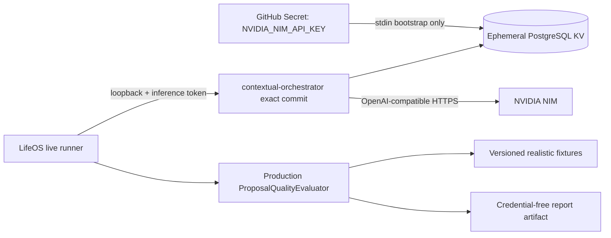

# NVIDIA NIM live proposal conformance design

Issue: #116  
Capability: `ai.auditable-proposals`

## Product outcome

LifeOS operators can produce reproducible, credential-free evidence showing whether one strong routed NVIDIA NIM model is sufficient for the current proposal suite or whether a bounded contextual-orchestrator workflow provides measurable quality gains. Live-provider availability remains separate from deterministic pull-request merge gates.

## Decision summary

The live harness uses the independently deployable `ContextualWisdomLab/contextual-orchestrator` service as an ephemeral evaluation dependency. The workflow pins one exact orchestrator commit, verifies the checkout identity, seeds `NVIDIA_NIM_API_KEY` through the orchestrator KV bootstrap seam, and gives LifeOS only a loopback orchestrator URL plus a dedicated inference token.

The production `ProposalQualityEvaluator`, fixture suite, and `ProposalService` validation boundary remain authoritative. The live harness does not implement a second scoring algorithm and cannot execute a proposal.

A high-effort single-agent route is the comparison baseline. Additional cells measure a lower-effort route and a bounded conducted workflow. Cells that require an orchestrator feature absent from the pinned commit remain explicit `unsupported_by_pinned_orchestrator` results rather than being simulated or silently omitted.

## Architecture



The provider key is bound only to the credential-seeding step. Later steps receive the PostgreSQL KV bootstrap connection and passphrase, but not the provider key. The orchestrator resolves the provider key from the encrypted registry at request time. LifeOS application code never receives the provider key.

## Evaluation profiles

| Profile                    | Orchestration                             | Structured output                    | Reasoning effort | Availability on pinned main                                                                   |
| -------------------------- | ----------------------------------------- | ------------------------------------ | ---------------- | --------------------------------------------------------------------------------------------- |
| `route_low`                | exact single route                        | JSON Schema                          | `low`            | available                                                                                     |
| `route_high`               | exact single route                        | JSON Schema                          | `high`           | available; comparison baseline                                                                |
| `conduct_template`         | thinker → worker → verifier → synthesizer | JSON-only prompt + LifeOS validation | provider default | available                                                                                     |
| `conduct_generated`        | generated task graph and access lists     | JSON-only prompt + LifeOS validation | role-sensitive   | explicit unsupported cell until the pinned orchestrator exposes safe per-run policy selection |
| `conduct_without_verifier` | conducted workflow without verifier       | JSON-only prompt + LifeOS validation | role-sensitive   | explicit unsupported cell until the pinned orchestrator exposes safe per-run policy selection |

The route cells deliberately use the full-shape OpenAI-compatible structured-output transport so NVIDIA reasoning-effort projection is exercised. The conduct cell omits `response_format`, because the pinned orchestrator correctly sends full-shape requests through its single-agent passthrough rather than pretending it can merge provider-native structured responses across agents. This difference is recorded as a confound; the report is conformance evidence, not a causal paper claim.

The workflow records whether the configured model pool is homogeneous or heterogeneous from explicit model identifiers. It never infers model capability from a model name. A pool with fewer than two distinct model identifiers cannot claim heterogeneous-agent evidence.

## Contextual-orchestrator pin

Initial exact commit:

```text
6841b71935e0b7cb98fb52bcb4709cc5100c8d87
```

The workflow rejects a different checkout SHA before installing or sending provider traffic. A future pin update is a reviewed source change. Draft or mutable branch names are not accepted as evidence.

The pinned commit already provides:

- OpenAI-compatible chat completions;
- explicit `route`, `conduct`, and `auto` modes;
- a fixed thinker/worker/verifier/synthesizer workflow;
- generated workflow support inside the library;
- per-step access lists;
- trace redaction;
- KV-only provider credential resolution;
- HTTPS provider allowlisting, retries, circuit breaking, usage evidence, and budget controls.

Adaptive per-role reasoning control exists in contextual-orchestrator PR #99 but is not part of the pinned integrated main commit. LifeOS records that capability as unavailable instead of importing an unmerged stacked branch.

## Request and response boundary

The live model sends only:

- one fixed inert-proposal system instruction;
- one validated fixture request serialized as untrusted user data;
- model `contextual-orchestrator`;
- exact orchestration profile fields;
- `temperature: 0`;
- streaming disabled;
- no tools or functions;
- optional JSON Schema only for single-route reasoning ablations;
- trace inclusion for metadata-only conducted evidence.

The response reader enforces a fixed byte limit and fatal UTF-8 decoding. The only proposal content accepted is `choices[0].message.content`, decoded as one JSON object and then independently validated by `ProposalService` through `ProposalQualityEvaluator`.

The retained report never includes prompts, proposal text, operation descriptions, rationale, provider response bodies, trace outputs, hidden reasoning, bearer tokens, provider credentials, PostgreSQL credentials, or stack traces.

## Sanitized orchestration evidence

For each fixture call, the harness may retain only:

- profile identifier;
- resulting orchestration mode;
- workflow depth;
- role counts;
- contributing-step count;
- verifier presence and bounded verdict classification;
- access-edge count and maximum fan-in;
- distinct agent count;
- plan-source classification;
- provider-reported prompt, completion, total, and reasoning token counts when present;
- elapsed milliseconds;
- credential-free failure class.

Numeric workflow step identifiers and raw access lists are not retained. The artifact uses profile and fixture string identifiers; integer values are measurements, not object identifiers.

## Report contract

```text
life-os.ai-proposal-live-conformance.v1
```

Top-level fields:

- `schema`
- `status`
- `lifeOsCommitSha`
- `contextualOrchestratorCommitSha`
- `suiteVersion`
- `evaluatedAt`
- `providerOriginLabel`
- `modelInventoryDigest`
- `modelCount`
- `profiles`
- `baselineProfileId`
- `limitations`

Each available profile contains the exact immutable `ProposalQualityReport`, sanitized orchestration aggregates, provider usage totals, and metric deltas from `route_high`. Unsupported or unavailable cells contain only a stable failure classification and no fabricated rates.

Commit SHAs are exactly 40 lowercase hexadecimal characters. Model inventory is represented by a SHA-256 digest and count; model identifiers are not written into the retained artifact.

## Failure classifications

- `missing_provider_credential`
- `missing_model_inventory`
- `invalid_configuration`
- `orchestrator_unavailable`
- `provider_unavailable`
- `unsupported_by_pinned_orchestrator`
- `insufficient_model_inventory`
- `evaluation_failed`

Missing secrets, missing inventory, provider throttling, and stochastic model failures produce explicit evidence and do not masquerade as quality success. A malformed workflow, unsafe artifact, broken deterministic test, invalid pin, or invalid report schema fails the workflow.

## Test-time compute decision rule

1. `route_high` is always the strong single-agent baseline.
2. `route_low` quantifies the within-model reasoning-effort delta.
3. `conduct_template` is recommended only when it improves at least one primary quality rate without reducing prompt-injection resistance or operation conformance.
4. A heterogeneous claim requires at least two distinct configured model identifiers and at least two distinct contributing agent identifiers in observed traces.
5. Unsupported generated, recursive, or role-sensitive profiles remain unavailable until a reviewed contextual-orchestrator commit exposes those controls through a bounded contract.
6. Latency and token use are recorded for capacity and cost review but are not the optimization objective of this quality-first slice.

## Workflow schedule and budgets

The workflow is dispatched manually and evaluated hourly at minute 47. Live execution requires repository variable `AI_NIM_LIVE_CONFORMANCE_ENABLED=true`, a non-empty `NVIDIA_NIM_API_KEY` secret, and one to four comma-separated model identifiers in `NVIDIA_NIM_CHAT_MODELS` or the manual input.

The initial available matrix makes at most 21 LifeOS fixture requests: seven fixtures across two routed cells and one conducted cell. The orchestrator may make multiple provider calls for a conducted request, but its runtime call, output-token, concurrency, timeout, and spend controls remain bounded. Repository-level single-flight concurrency prevents overlapping live runs.

## Security properties

- GitHub token permissions are read-only.
- No `COPILOT_GITHUB_TOKEN` reference is permitted.
- Only the credential-seeding step receives `NVIDIA_NIM_API_KEY`.
- The provider origin is fixed to `https://integrate.api.nvidia.com/v1`.
- Orchestrator egress is allowlisted to `integrate.api.nvidia.com`.
- The LifeOS runner accepts only loopback HTTP origins for this ephemeral harness.
- Redirects are rejected.
- Raw orchestrator logs are never uploaded.
- Only the final validated credential-free report is retained.
- The PostgreSQL service is disposable and its credential registry disappears with the job.

## MSA boundary

LifeOS and contextual-orchestrator remain independently deployable. The live harness composes their public contracts without vendoring orchestrator source into LifeOS. The exact external commit is checked out only inside the evaluation job. Normal LifeOS build, test, runtime, and release paths do not require Python, contextual-orchestrator, PostgreSQL credential storage, or NVIDIA availability.

## Quality gates

- complete unit coverage for every new AI-service production line and branch;
- workflow-contract tests for schedule, permissions, immutable pins, secret scoping, no Copilot token, and artifact retention;
- redaction and bounded-response regressions;
- baseline and delta arithmetic tests;
- missing-secret, missing-inventory, unsupported-feature, provider-failure, and invalid-report tests;
- repository formatting, lint, type checking, tests, build, Compose, AppGuardrail, Semgrep, Security Scan, Commercial Readiness, CodeRabbit, and human/security review.

## Research basis and limitations

Fugu presents one API that dynamically chooses direct solution or a coordinated expert team. Conductor learns natural-language communication topologies and targeted instructions, including recursive self-selection for dynamic test-time scaling. TRINITY assigns Thinker, Worker, and Verifier roles over multiple turns with a lightweight evolved coordinator. These sources support measuring topology, delegation, verification, recursion, and access patterns rather than assuming that more agents are automatically better.

A 2026 strong-single-agent study reports that a multi-turn single agent can match homogeneous multi-agent workflows in several settings, with KV-cache efficiency advantages. LifeOS therefore treats single-agent routing as the mandatory baseline and accepts deeper orchestration only on measured evidence. This repository-specific seven-fixture suite is too small to establish general model superiority, fairness, or production reliability. Live results are dated evidence for one provider inventory, one suite version, and one pair of exact repository commits.

## References

Nielsen, S., Cetin, E., Schwendeman, P., Sun, Q., Xu, J., & Tang, Y. (2025). _Learning to orchestrate agents in natural language with the Conductor_ [Preprint]. arXiv. https://doi.org/10.48550/arXiv.2512.04388

NVIDIA Corporation. (2026). _API reference—NVIDIA NIM for large language models_. https://docs.nvidia.com/nim/large-language-models/latest/api-reference.html

Sakana AI. (2026, June 22). _Sakana Fugu: One model to command them all_. https://sakana.ai/fugu-release/

Xu, J., Koesdwiady, A., Bei, S., Han, Y., Huang, B., Wang, D., Chen, Y., Wang, Z., Wang, P., Li, P., & Ding, Y. (2026). _Rethinking the value of multi-agent workflow: A strong single agent baseline_ [Preprint]. arXiv. https://doi.org/10.48550/arXiv.2601.12307

Xu, J., Sun, Q., Schwendeman, P., Nielsen, S., Cetin, E., & Tang, Y. (2025). _TRINITY: An evolved LLM coordinator_ [Preprint]. arXiv. https://doi.org/10.48550/arXiv.2512.04695
