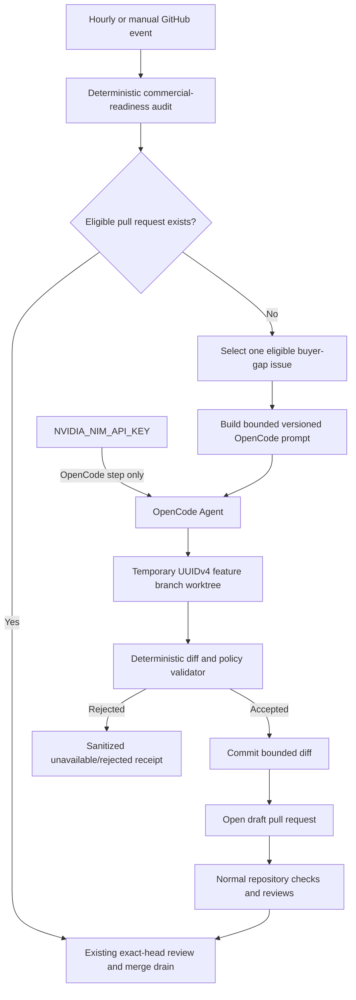

# NVIDIA-backed OpenCode commercial development loop design

**Date:** 2026-08-07  
**Status:** Approved for the initial bounded automation slice  
**Tracking issue:** #118  
**Capabilities:** `automation.commercial-readiness-loop`, `quality.ai-audit-assurance`

## Product outcome

LifeOS can continue buyer-visible product development on an hourly cadence after the deterministic commercial-readiness audit has drained eligible pull requests. A separately identifiable OpenCode Agent may implement one bounded issue on a same-repository feature branch and open a draft pull request, but it cannot push to `main`, merge, alter repository security, modify secrets, publish a release, or claim success without the existing deterministic checks and review loop.

The deterministic commercial-readiness audit and exact-head merge drain remain authoritative. Model availability or OpenCode failure cannot disable, weaken, or replace those gates.

## Decision summary

The repository adds an independently testable `@life-os/commercial-development-agent` package and an hourly/manual GitHub Actions workflow.

The package performs deterministic work that must not be delegated to a model:

- validate the repository, issue, branch, prompt, and run identifiers;
- select one explicitly eligible issue from bounded GitHub evidence;
- assemble a versioned prompt containing repository policy and the selected issue;
- validate the resulting working-tree diff against path, file-count, byte, line, and prohibited-content limits;
- reject workflow, secret, branch-protection, release, destructive, or credential-surface changes;
- produce a credential-free execution receipt;
- keep internal run, branch, and receipt identifiers as UUIDv4 strings.

OpenCode performs only the bounded implementation step inside the checked-out feature branch. The workflow commits the validated diff and opens a draft pull request. Existing CI, AppGuardrail, Semgrep, Security Scan, Commercial Readiness, human review, CodeRabbit, and exact-head merge policy decide whether that pull request may merge.

## Architecture



The model step never receives the GitHub token. GitHub mutation occurs only in later deterministic steps after diff validation. The NVIDIA credential is scoped only to the OpenCode process and is not forwarded to tests, scripts, comments, artifacts, or pull-request bodies.

## Central `.github` and modular MSA integration

The LifeOS package is repository-local and independently executable. Its inputs and outputs form a versioned contract so the organization-central `.github` repository can later host a reusable workflow without moving LifeOS product policy into a shared repository.

```text
central .github reusable workflow
  -> calls repository-local commercial-development-agent CLI
  -> supplies bounded GitHub event metadata
  -> supplies NVIDIA_NIM_API_KEY only to OpenCode invocation
  -> receives a sanitized receipt

LifeOS repository
  -> owns issue-selection policy
  -> owns allowed/prohibited path policy
  -> owns product capability evidence
  -> owns tests, checks, and merge policy
```

The existing review-agent credential scheme is untouched. The development agent has a distinct workflow name, concurrency group, prompt schema, receipt schema, and credential scope.

## Eligible work contract

The initial slice may implement only an open same-repository issue that satisfies all conditions:

- issue body is bounded and contains no control characters;
- issue is not a pull request;
- issue is not the living commercial-readiness issue;
- issue does not request credential, secret, billing, branch-protection, repository visibility, release, destructive data, or external-account changes;
- issue is explicitly selected by the deterministic selector from the configured allowlist or product backlog;
- no open pull request already references the issue;
- the issue describes one reviewable buyer-visible outcome and an explicit validation gate.

When no issue is eligible, the workflow emits a sanitized `no_eligible_issue` receipt and makes no repository change. Autonomous gap discovery is deferred until a separately reviewed structured issue-proposal contract can be validated without allowing model text to become executable policy.

## Branch and pull-request contract

- Internal run identifier: UUIDv4.
- Branch: `automation/opencode-commercial-<uuidv4>`.
- Base: exact `main` SHA captured before model execution.
- Pull request: draft, same repository, base `main`.
- One run creates at most one branch, one commit, and one draft pull request.
- Direct pushes to `main`, force pushes, tags, releases, deployments, environment changes, and administrative merges are prohibited.
- A changed base SHA before push causes a fail-closed receipt; the run never silently rebases model output.

## Diff policy

The default initial policy allows product implementation and documentation under:

- `apps/`
- `packages/`
- `docs/`
- `product/`
- `README.md`
- `ARCHITECTURE.md`
- `CHANGELOG.md`

It rejects changes under:

- `.github/`
- `.git/`
- `.env*`
- `infra/`
- `SECURITY.md`
- `CODEOWNERS`
- dependency lockfiles and package-manager configuration
- generated coverage, build, artifact, cache, or credential paths

It also rejects symlinks, submodules, binary files, files exceeding the configured byte cap, secret-shaped text, `COPILOT_GITHUB_TOKEN`, direct GitHub-token persistence, destructive shell/database commands, branch-protection modification, release/tag commands, and administrative merge flags.

Initial hard limits:

| Limit | Value |
| --- | ---: |
| Changed files | 24 |
| Total changed bytes | 131,072 |
| Added and deleted lines | 3,000 |
| Prompt bytes | 32,768 |
| Issue-body bytes | 16,384 |
| OpenCode wall time | 90 minutes |
| Workflow wall time | 120 minutes |
| OpenCode runs per workflow | 1 |
| Concurrent workflows | 1 |

## OpenCode provider boundary

The workflow installs one exact OpenCode package version recorded in `pnpm-lock.yaml` and verifies `opencode --version` before use. It does not use an unpinned installer script, mutable action tag, or floating package version.

The OpenCode process receives:

- `NVIDIA_API_KEY`, mapped only for the process from `secrets.NVIDIA_NIM_API_KEY`;
- one explicit NVIDIA provider/model identifier;
- a private temporary OpenCode configuration;
- the bounded prompt;
- a working directory on the temporary UUIDv4 branch.

The process does not receive `GITHUB_TOKEN`, `GH_TOKEN`, `COPILOT_GITHUB_TOKEN`, browser credentials, review-agent secrets, deployment credentials, or unrelated repository secrets. Provider absence or outage produces `provider_unavailable`; it does not make the deterministic audit or merge drain fail.

## Test-time compute policy

A strong single-model OpenCode route is the mandatory baseline. The initial implementation profile uses one model and one bounded run. The package reserves explicit versioned fields for:

- reasoning effort;
- workflow stages;
- planner, worker, verifier, and synthesizer roles;
- decomposition count;
- recursive depth;
- access-list topology;
- homogeneous or heterogeneous model inventory;
- fixture-level quality and safety outcomes.

A future contextual-orchestrator profile may be enabled only after the same issue fixtures show a measurable improvement without policy, prompt-injection, or validation regressions. Unsupported profiles remain explicit unavailable cells. Latency and token usage are measured for capacity review but do not determine the quality-first routing decision.

## Prompt contract

The prompt is generated from a fixed template and contains:

- schema and run UUIDv4;
- exact base SHA;
- repository name;
- selected issue URL, title, and bounded body;
- allowed and prohibited paths;
- mandatory tests and documentation;
- explicit instruction not to commit, push, open a pull request, use secrets, change workflows, or bypass checks;
- instruction to leave the working tree unchanged when requirements cannot be met safely;
- instruction to avoid private chain-of-thought and place only source changes in the worktree.

Untrusted issue text is delimited as data and cannot override policy. Prompt-injection fixtures verify that issue text asking for secrets, workflow changes, administrative merges, or policy bypass remains inert.

## Receipt contract

```text
life-os.opencode-commercial-development-receipt.v1
```

The JSON receipt may contain only:

- schema;
- UUIDv4 run identifier;
- repository and exact base SHA;
- selected issue number and URL as external GitHub references;
- status and stable reason code;
- OpenCode version and opaque model label;
- changed file, byte, addition, and deletion counts;
- branch UUIDv4 suffix and draft pull-request URL when created;
- start and completion timestamps;
- deterministic validation outcomes.

It excludes prompts, issue body, source diff, model output, hidden reasoning, credentials, provider bodies, stack traces, GitHub tokens, and private repository data. Retention is bounded to seven days.

## Failure classifications

- `no_eligible_issue`
- `provider_credential_missing`
- `provider_unavailable`
- `opencode_unavailable`
- `invalid_configuration`
- `prompt_rejected`
- `diff_rejected`
- `base_changed`
- `verification_failed`
- `draft_pull_request_failed`
- `completed`

Every error is credential-free and bounded. A failed model run leaves no remote branch unless a fully validated commit has already been pushed; reconciliation deletes an unreferenced automation branch when possible.

## GitHub security properties

- Every external action is pinned by full commit SHA.
- Default permissions are empty; jobs receive only the permissions they require.
- The model step has no GitHub write credential.
- The mutation step may write contents and draft pull requests but cannot merge.
- Single-flight concurrency prevents overlapping hourly development runs.
- The workflow never uses `pull_request_target`.
- Fork code never runs with secrets.
- Shell input is passed through files or environment variables after deterministic validation, not interpolated from issue text.
- Temporary files use mode `0600` and are deleted in an `always()` cleanup step.
- The existing commercial-readiness drain remains the only scheduled merge path and continues exact-head, same-repository, successful-check, resolved-review, and no-bypass enforcement.

## Realistic verification

Deterministic tests cover:

- safe and unsafe issue selection;
- Korean and English issue text;
- prompt-injection attempts embedded in issue bodies;
- UUIDv4 run and branch identifiers;
- branch/base drift;
- path traversal, symlinks, submodules, binary files, oversized diffs, generated output, and dependency churn;
- secret-shaped text and prohibited token names;
- workflow, branch-protection, release, deployment, and destructive-operation attempts;
- a realistic buyer-gap fixture that produces a bounded application/test/documentation diff;
- provider missing/outage behavior;
- exact package/action pins and workflow permission separation;
- draft-only pull-request creation;
- credential-free receipt serialization;
- route-versus-orchestration ablation arithmetic without live-provider dependence.

## Deferred scope

- model-generated issue discovery;
- cross-repository changes;
- automatic dependency updates;
- workflow, infrastructure, migration, secret, billing, deployment, or release modifications;
- automatic non-draft pull requests;
- direct or administrative merge;
- destructive data operations;
- production access to user data;
- self-modification of policy or agent permissions;
- contextual-orchestrator execution until its profile contract is independently implemented and measured.

## Research and standards basis

OpenCode provides a non-interactive agent interface and provider configuration, but LifeOS independently constrains its authority and treats its output as untrusted source material (Anomaly, 2026). GitHub recommends least-privilege tokens, immutable action references, protected branches, and careful handling of untrusted workflow input; these controls determine the workflow boundary (GitHub, 2026a, 2026b). NVIDIA NIM exposes OpenAI-compatible hosted inference authenticated by API key; the key remains scoped to the provider process (NVIDIA Corporation, 2026).

NIST AI RMF and the Generative AI Profile support governed measurement, traceability, human oversight, and risk controls rather than unbounded autonomous action (National Institute of Standards and Technology, 2023, 2024). OWASP's LLM guidance motivates treating issue text and model output as prompt-injection and excessive-agency risks (OWASP Foundation, 2025).

Fugu reports dynamic selection between direct and coordinated expert solutions (Sakana AI, 2026). Conductor reports learned communication topologies and recursive test-time scaling (Nielsen et al., 2026). TRINITY reports role-specialized multi-turn coordination (Xu et al., 2026a). A strong-single-agent study reports that a multi-turn single agent can match homogeneous multi-agent workflows in several evaluated settings (Xu et al., 2026b). LifeOS therefore requires the single-model route baseline and admits deeper orchestration only on measured repository-specific evidence.

## References

Anomaly. (2026). *OpenCode documentation*. https://opencode.ai/docs/

GitHub. (2026a). *Security hardening for GitHub Actions*. https://docs.github.com/en/actions/security-for-github-actions/security-guides/security-hardening-for-github-actions

GitHub. (2026b). *Reuse workflows*. https://docs.github.com/en/actions/using-workflows/reusing-workflows

National Institute of Standards and Technology. (2023). *Artificial intelligence risk management framework (AI RMF 1.0)* (NIST AI 100-1). https://doi.org/10.6028/NIST.AI.100-1

National Institute of Standards and Technology. (2024). *Artificial intelligence risk management framework: Generative artificial intelligence profile* (NIST AI 600-1). https://doi.org/10.6028/NIST.AI.600-1

Nielsen, S., Cetin, E., Schwendeman, P., Sun, Q., Xu, J., & Tang, Y. (2026). *Learning to orchestrate agents in natural language with the Conductor* [Conference paper]. International Conference on Learning Representations. https://openreview.net/pdf?id=4a133f1e2ca67ceaedb45c3a123cc8125c694ff5

NVIDIA Corporation. (2026). *API reference—NVIDIA NIM for large language models*. https://docs.nvidia.com/nim/large-language-models/latest/api-reference.html

OWASP Foundation. (2025). *OWASP Top 10 for large language model applications 2025*. https://genai.owasp.org/llm-top-10/

Sakana AI. (2026, June 22). *Sakana Fugu: One model to command them all*. https://sakana.ai/fugu-release/

Xu, J., Sun, Q., Schwendeman, P., Nielsen, S., Cetin, E., & Tang, Y. (2026a). *TRINITY: An evolved LLM coordinator* [Conference paper]. International Conference on Learning Representations. https://doi.org/10.48550/arXiv.2512.04695

Xu, J., Koesdwiady, A., Bei, S., Han, Y., Huang, B., Wang, D., Chen, Y., Wang, Z., Wang, P., Li, P., & Ding, Y. (2026b). *Rethinking the value of multi-agent workflow: A strong single agent baseline* [Preprint]. arXiv. https://doi.org/10.48550/arXiv.2601.12307
