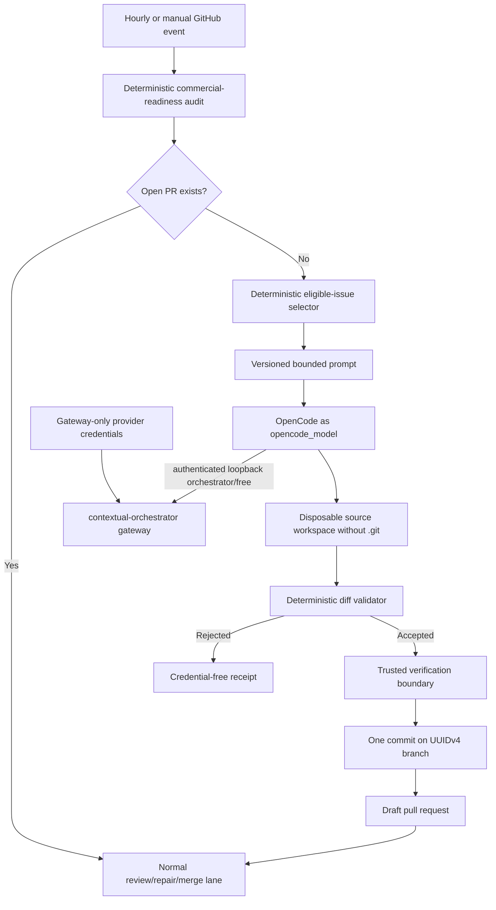

# Contextual-orchestrator OpenCode commercial development loop design

**Date:** 2026-08-07
**Revised:** 2026-09-03
**Status:** Proposed until immutable contextual-orchestrator auth support is released and exact-head acceptance completes
**Tracking issues:** #118, #227
**Capabilities:** `automation.commercial-readiness-loop`, `quality.ai-audit-assurance`

## Product outcome

LifeOS may use OpenCode to implement one explicitly eligible buyer-gap issue on an isolated same-repository branch after deterministic backlog selection. Model-assisted work can create only a draft pull request. It cannot push to `main`, merge, release, alter repository settings, change credentials, or weaken the independent exact-head review loop.

This design supersedes the initial direct-NVIDIA bridge design preserved in repository history. The production route is now the contextual-orchestrator virtual `orchestrator/free` boundary.

## Authority boundaries

`@life-os/commercial-development-agent` owns deterministic LifeOS policy: issue selection, prompt construction, diff limits, prohibited paths and content, receipt validation, branch lease checks, and draft-PR mutation rules. OpenCode owns only source editing inside a disposable workspace.

Contextual-orchestrator owns provider discovery, provider/model selection, fallback policy, and upstream provider credentials. LifeOS does not hard-code a provider, provider group, model, or paid fallback. BYTEZ, NVIDIA NIM, OpenRouter, and OpenAI credentials may be supplied only to the gateway bootstrap step and never to `opencode_model`.

Production consumption of contextual-orchestrator requires an immutable reviewed release. A protected branch commit is not release authority. Until a released version contains the required gateway-auth bootstrap, this feature remains Draft/Proposed and must fail closed rather than repin to mutable upstream source.

## Runtime topology

The model process receives no GitHub credential and no upstream provider credential. It can reach model traffic only through the authenticated IPv4 loopback gateway; IPv6 and other model-phase egress are denied. Provider diagnostics, prompts, responses, hidden reasoning, source diffs, and credentials are excluded from retained artifacts.

## OpenCode identity and configuration

The workflow installs the exact reviewed `opencode-ai@1.18.9` lockfile identity. `verify-opencode-identity.mjs` spawns that binary without `NODE_OPTIONS`, requires exact version equality, detects `--pure` from combined stdout/stderr, and validates the reviewed `run --help` command contract. Workflow contract tests prohibit direct `opencode --version`, `opencode --help`, and `opencode run --help` probes that bypass the verifier.

Project-local configuration discovery, auto-update, sharing, and remote model-catalog refresh are disabled. The private configuration enables only `contextual_orchestrator_gateway`, registers and whitelists `orchestrator/free`, and pins primary and small-model work to that virtual route.

## Timeout and cancellation authority

Reasoning, streaming, and tool calls are not terminated solely because a request or stream has consumed a fixed elapsed duration. OpenCode provider `timeout`/`chunkTimeout` values and a model-level `timeout ... opencode run` wrapper are prohibited. The GitHub job may retain a separate administrative workflow timeout so abandoned infrastructure cannot consume a runner indefinitely. User cancellation, provider termination, model completion, and administrative runner termination remain distinct outcomes.

## Gateway bootstrap and diagnostics

`lifeos_contextual_orchestrator_sidecar.sh` validates and normalizes the configured decimal loopback port before Bash arithmetic, including leading-zero values. It requires at least one governed upstream credential but reports only a generic credential-free missing-provider classification. Raw gateway stdout/stderr is discarded rather than persisted or replayed into Actions logs.

The current unreleased contextual-orchestrator pin does not satisfy the required token-registration path for `--auth-token-key CONTEXTUAL_ORCHESTRATOR_TOKEN`. Acceptance therefore requires upstream owner repair followed by an immutable release and an exact released consumer bump.

## Source and mutation safety

- Run and branch identity use UUIDv4.
- Base is the exact protected `main` SHA captured before model execution.
- One run creates at most one branch, one commit, and one draft PR.
- A changed base, issue lease, open-PR state, or remote branch identity fails closed.
- Force-push, destructive rebase, direct `main` push, tag/release/deployment mutation, administrative merge, and workflow self-modification are prohibited.
- Symlinks, submodules, binary output, oversized files/diffs, dependency-policy changes, secret-shaped text, and prohibited credential surfaces are rejected before materialization.
- Model verification runs without Docker-socket authority. A later trusted step parses the exact accepted Compose file; ordinary credential-free PR CI performs runtime container health checks.

## Test-time compute

A strong single-route baseline remains mandatory. Fugu-, Conductor-, and TRINITY-inspired routing or role specialization may be evaluated only as explicit ablations against the same realistic fixtures. Quality and safety determine whether deeper orchestration is justified. Token and latency measurements support capacity planning but are not themselves termination or quality authority.

## Acceptance

This design may move from Proposed only when all of the following are true:

- contextual-orchestrator publishes an immutable reviewed release containing functional gateway-token bootstrap;
- LifeOS consumes that exact release rather than a mutable branch head;
- authenticated `orchestrator/free` startup and model execution pass realistic execution tests without provider credentials entering `opencode_model`;
- provider-secret scope, decimal-port handling, raw-log exclusion, and no-model-timeout contracts pass;
- package statement, branch, function, line, docstring, and edge-case gates meet repository policy;
- exact-head CI, security, AppGuardrail, OpenCode/Noema/Strix review, thread resolution, and the live approval policy pass without bypass.

## References

The normative and research citations for this design are maintained in `docs/research/2026-08-07-opencode-commercial-development-loop-standards.md`. Operational procedures and failure classifications are maintained in `docs/operations/opencode-commercial-development-loop.md`.
