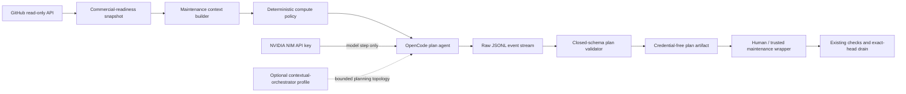

# NVIDIA NIM OpenCode maintenance design

Issue: #119  
Capability: `automation.opencode-maintenance`

## Product outcome

LifeOS operators receive an hourly, reproducible, credential-free maintenance plan that explains which reviewed pull request or buyer-visible issue should be handled next, how much test-time compute is justified, and which exact verification gates must remain authoritative. The model cannot write repository state, submit reviews, change credentials, or merge code.

## Decision summary

The existing deterministic commercial-readiness collector and exact-head drain remain the trusted control plane. A separate scheduled workflow runs OpenCode in its read-only plan agent with NVIDIA NIM as the only model provider. OpenCode receives a bounded repository snapshot and an immutable policy prompt; it returns one versioned JSON maintenance plan. A non-model validator rejects unsafe, malformed, over-broad, or unsupported plans before publishing an artifact.

This slice is deliberately plan-only. It creates no branch, commit, issue, review, workflow dispatch, or merge. Future write automation must consume a validated plan through a separate trusted wrapper and must still pass all human, CodeRabbit, AppGuardrail, Semgrep, Security Scan, CI, Commercial Readiness, and exact-head merge checks.

## Approaches considered

### A. Give an autonomous coding agent a write-capable GitHub token

This is rejected. Repository text and review comments are untrusted input, and a model-driven process with write credentials could convert prompt injection or model error into repository mutation. It would also collapse the existing independent review boundary.

### B. Ask one NVIDIA model for an unstructured recommendation

This is insufficient. Free-form text does not make recursion, decomposition, role assignment, tool access, evidence provenance, or merge restrictions machine-verifiable.

### C. Deterministic inventory plus bounded OpenCode planning — selected

The deterministic collector owns facts. A deterministic policy selects a compute profile. OpenCode analyzes only within a deny-by-default tool boundary and emits a closed JSON plan. A deterministic validator owns publication. Existing GitHub automation remains the only merge authority.

## Architecture



## Trust boundaries

### Trusted inputs

- repository name supplied by GitHub Actions;
- checked-out commit SHA;
- validated commercial-readiness policy;
- deterministic snapshot created through the read-only GitHub token;
- reviewed maintenance policy and prompt stored in the repository;
- explicit repository variable selecting one allowlisted NVIDIA model.

### Untrusted inputs

- pull-request titles and descriptions;
- issue titles and labels;
- review text and check descriptions;
- repository source and documentation content;
- model output and OpenCode JSONL events;
- provider responses and contextual-orchestrator observations.

Untrusted text can be cited as evidence but cannot alter permissions, schemas, the action allowlist, merge policy, model credentials, recursion limits, or target repository.

### Protected values

- `NVIDIA_NIM_API_KEY`;
- GitHub installation token;
- review-agent credentials and configuration;
- browser cookies, OAuth material, provider bodies, raw prompts, hidden reasoning, and stack traces.

The GitHub token exists only in the inventory step. OpenCode receives no `GITHUB_TOKEN`, `GH_TOKEN`, GitHub App credential, deploy key, or review-agent secret. The model job receives `NVIDIA_API_KEY` only because OpenCode's official NVIDIA provider reads that environment name; the workflow maps it directly from the repository secret `NVIDIA_NIM_API_KEY` for that step and never persists it.

## Versioned context contract

```text
life-os.opencode-maintenance-context.v1
```

The context contains only:

- repository and exact source commit SHA;
- canonical UTC generation time;
- whether the snapshot is complete;
- bounded open pull-request summaries;
- bounded open issue summaries;
- deterministic merge blockers;
- required workflow and status names;
- unchanged review-agent contract digest;
- selected compute profile;
- explicit limitations.

It excludes review bodies, raw logs, patches, source files, artifacts, comments, user PII, credentials, and provider output. The initial context is capped at 20 pull requests, 50 issues, 256 blockers, and 128 KiB serialized JSON. Truncation fails closed instead of silently selecting work from incomplete evidence.

## Test-time compute policy

The policy chooses one of five immutable profiles before OpenCode starts.

| Profile | Trigger | Stages | Max decomposition | Max recursion | Role effort |
| --- | --- | ---: | ---: | ---: | --- |
| `route_triage` | no actionable PR and no selected issue | 1 | 1 | 0 | analyst: low |
| `route_analysis` | one bounded non-security blocker | 2 | 3 | 0 | analyst: medium, verifier: medium |
| `conduct_repair` | failed checks, review threads, or stale evidence | 4 | 6 | 1 | planner: high, investigator: high, verifier: high, synthesizer: medium |
| `conduct_security` | security workflow or security-review blocker | 4 | 8 | 2 | every role: high |
| `conduct_product_gap` | no PRs and at least one eligible buyer issue | 4 | 6 | 1 | planner: high, researcher: high, verifier: high, synthesizer: medium |

The selected profile records workflow stages, role-specific reasoning effort, decomposition limit, recursion depth, and an explicit tool allowlist. No model output may increase these limits. Latency is observed but does not determine whether deeper orchestration is justified.

A strong single-model route is the default and comparison baseline. Deeper conducted planning is selected only for evidence-backed risk or task complexity. This is consistent with the repository's Fugu, Conductor, TRINITY, and strong-single-agent evaluation policy; it does not assert that multi-agent planning is universally superior.

## OpenCode execution boundary

OpenCode is pinned to exact version `1.18.7`. The workflow verifies the installed version before model access.

The repository configuration defines a dedicated primary agent named `life-os-maintainer`:

- mode: primary;
- provider: NVIDIA;
- temperature: 0;
- plan-only system prompt;
- edit, write, patch, task, web fetch, web search, and external-directory access denied;
- bash denied by default;
- no MCP server that can mutate GitHub;
- no access to parent directories;
- no automatic sharing or session continuation.

`opencode run` executes non-interactively with JSON events, an exact provider/model identifier, the dedicated agent, the bounded prompt file, and the validated context file. The command never uses `--thinking`; hidden reasoning is not retained.

The configuration can describe an optional `contextual-orchestrator` planning topology for future parity with the live conformance harness, but absence or failure of that service does not grant broader permissions. Standalone OpenCode remains the fail-closed default.

## Plan output contract

```text
life-os.opencode-maintenance-plan.v1
```

Required fields:

- `schema`;
- `repository`;
- `sourceCommitSha`;
- `generatedAt`;
- `mode: "plan"`;
- `profileId`;
- `riskLevel`;
- `target` as one PR, one issue, or `none`;
- `workflowStages` matching the selected profile exactly;
- `recursionDepth` and `decompositionLimit` not exceeding policy;
- `roleEffort` matching the selected profile exactly;
- `toolAllowlist` matching the selected profile exactly;
- one to eight `proposedActions` from the closed vocabulary;
- one to twenty evidence references;
- limitations.

Allowed proposed actions are:

- `inspect_evidence`;
- `run_existing_check`;
- `propose_patch`;
- `request_independent_review`;
- `wait_for_required_check`;
- `delegate_exact_head_merge`;
- `create_bounded_slice`;
- `close_duplicate_issue`.

The plan cannot include shell commands, patches, URLs with credentials, arbitrary file contents, branch names, free-form GitHub API operations, or new tools. `delegate_exact_head_merge` means only that the existing deterministic drain may re-evaluate the exact head; it is not merge authorization.

## Deterministic selection rules

1. A trusted, non-draft open PR with an actionable blocker outranks issue work.
2. Security blockers outrank ordinary check or review blockers.
3. The oldest open PR wins among equal risks to prevent starvation.
4. When no PR exists, exclude the generated readiness issue and duplicate/not-planned issues.
5. Select the highest buyer-impact issue using explicit label priority when present, then the oldest issue number as the stable tie-breaker.
6. If snapshot evidence is truncated, malformed, or stale relative to the checked-out SHA, publish no model-derived plan.
7. A rate-limited review is represented as `wait_for_required_check`; it never permits merge or removes the review requirement.

## Error and no-result behavior

The workflow fails closed when:

- `NVIDIA_NIM_API_KEY` is absent;
- the configured model identifier is missing, repeated, malformed, or outside the one-model limit;
- OpenCode version verification fails;
- context validation fails;
- the OpenCode process exits non-zero or exceeds the timeout;
- JSONL is malformed, oversized, or contains no final text event;
- the final text is not exactly one JSON object;
- the plan differs from its deterministic profile, target, repository, or source SHA;
- output includes secret-shaped text, a prohibited credential name, or an unapproved action/tool.

No model text is published on failure. The workflow emits only a fixed credential-free error classification through the job result.

## Verification strategy

### Deterministic unit evidence

- valid and hostile context schemas;
- pull-request risk ordering and empty-queue issue selection;
- rate-limited CodeRabbit and stale-head fixtures;
- failed PostgreSQL CI and security-review fixtures;
- exact profile stage, effort, recursion, decomposition, and tool contracts;
- malformed, nested, oversized, and secret-bearing JSONL;
- plan target mismatch, over-broad actions, unsupported tools, shell text, and merge bypass attempts;
- missing NVIDIA credential and malformed model inventory classifications;
- review-agent contract digest preservation.

### Workflow contract evidence

- hourly and manual triggers;
- non-overlapping two-hour execution;
- full-SHA action pins;
- top-level read-only GitHub permissions;
- only the inventory step receives `github.token`;
- only the OpenCode step receives the NVIDIA secret;
- no `COPILOT_GITHUB_TOKEN` spelling or construction;
- no `contents: write`, pull-request write, issue write, workflow dispatch, or merge API;
- exact OpenCode version;
- plan agent and denied mutation tools;
- output retention no longer than seven days;
- existing review-agent files and secret references unchanged.

### Repository gates

Formatting, lint, type checking, package tests with 100% statement/branch/function/line coverage, build, Compose validation, AppGuardrail, Semgrep, Security Scan, Commercial Readiness, CodeRabbit, and all actionable human/security review findings must pass on the exact current head.

## Operations and compliance

For SOC 2 and CSAP readiness, every scheduled run records immutable non-secret identifiers: repository, commit SHA, workflow run ID, policy version, model label, OpenCode version, selected profile, context digest, plan digest, and fixed outcome class. Artifact retention is seven days; long-term governance records should be exported through an approved audit store with access control, retention policy, integrity verification, and regional placement.

PII is not blindly masked inside authorized LifeOS workloads because doing so can destroy business meaning. Instead, this maintenance workflow follows data minimization: it never receives tenant records or raw issue/review bodies, uses identifiers and bounded classifications, encrypts provider transport, applies least privilege, and keeps access and artifact evidence auditable. Any future need for human text must use purpose-bound access, field-level authorization, retention limits, and an explicit provenance record rather than irreversible blanket masking.

## Research basis and limitations

OpenCode documents non-interactive `opencode run`, provider/model selection, JSON event output, per-agent permissions, and a restricted plan agent. Its NVIDIA provider accepts `NVIDIA_API_KEY` and supports a custom NIM base URL (Anomaly, 2026a, 2026b, 2026c). NVIDIA NIM exposes OpenAI-compatible inference endpoints and model/readiness metadata (NVIDIA Corporation, 2026). GitHub creates a repository-scoped, job-lifetime installation token and recommends constraining workflow permissions (GitHub, 2026).

Sakana AI's final Fugu release describes dynamic selection between direct solution and coordinated experts (Sakana AI, 2026). Conductor reports learned communication topology and recursive test-time scaling (Nielsen et al., 2026), while TRINITY reports Thinker, Worker, and Verifier role coordination (Xu et al., 2026a). A strong-single-agent preprint reports competitive homogeneous single-agent results in several evaluated settings (Xu et al., 2026b). These works motivate explicit compute profiles and ablations. They do not establish the correctness of a LifeOS maintenance plan; deterministic validation and independent repository gates remain authoritative.

This slice does not prove autonomous repair accuracy, production reliability, fairness, cost efficiency, or acquisition value. It establishes a safe planning and evidence boundary that can support later controlled write automation.

## References

Anomaly. (2026a). _Agents—OpenCode_. https://opencode.ai/docs/agents/

Anomaly. (2026b). _CLI—OpenCode_. https://opencode.ai/docs/cli/

Anomaly. (2026c). _Providers—OpenCode_. https://opencode.ai/docs/providers/

Anomaly. (2026d). _Permissions—OpenCode_. https://opencode.ai/docs/permissions/

GitHub. (2026). _GITHUB_TOKEN_. https://docs.github.com/en/actions/concepts/security/github_token

National Institute of Standards and Technology. (2024). _Artificial intelligence risk management framework: Generative artificial intelligence profile_ (NIST AI 600-1). https://doi.org/10.6028/NIST.AI.600-1

Nielsen, S., Cetin, E., Schwendeman, P., Sun, Q., Xu, J., & Tang, Y. (2026). _Learning to orchestrate agents in natural language with the Conductor_ [Conference paper]. International Conference on Learning Representations. https://openreview.net/pdf?id=4a133f1e2ca67ceaedb45c3a123cc8125c694ff5

NVIDIA Corporation. (2026). _API reference—NVIDIA NIM for large language models_. https://docs.nvidia.com/nim/large-language-models/latest/reference/api-reference.html

Sakana AI. (2026, June 22). _Sakana Fugu: One model to command them all_ [Final product release]. https://sakana.ai/fugu-release/

Xu, J., Koesdwiady, A., Bei, S., Han, Y., Huang, B., Wang, D., Chen, Y., Wang, Z., Wang, P., Li, P., & Ding, Y. (2026b). _Rethinking the value of multi-agent workflow: A strong single agent baseline_ [Preprint]. arXiv. https://doi.org/10.48550/arXiv.2601.12307

Xu, J., Sun, Q., Schwendeman, P., Nielsen, S., Cetin, E., & Tang, Y. (2026a). _TRINITY: An evolved LLM coordinator_ [Conference paper]. International Conference on Learning Representations. https://doi.org/10.48550/arXiv.2512.04695
