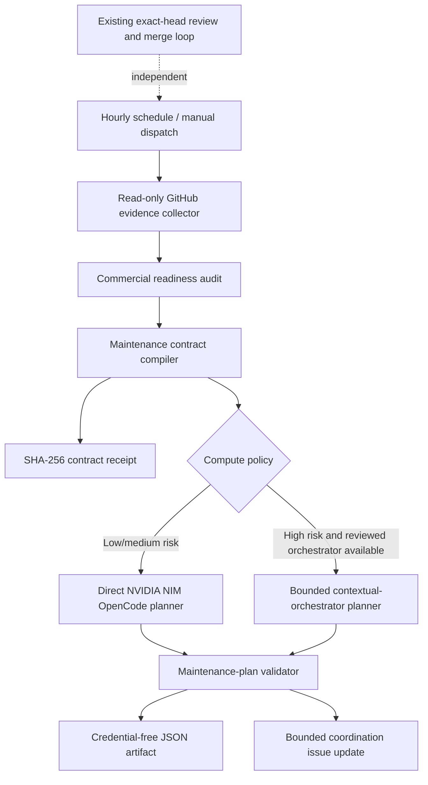
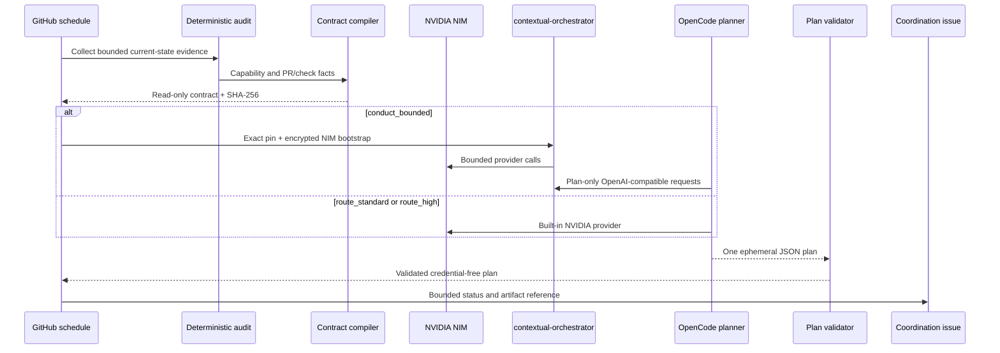

# NVIDIA NIM OpenCode maintenance loop design

**Date:** 2026-08-07  
**Status:** Approved by the repository owner's standing autonomous-development directive  
**Tracking issue:** #119  
**Capability:** `automation.commercial-readiness-loop`

## Product outcome

LifeOS receives an hourly, auditable maintenance-planning pass that converts bounded repository evidence into one safe next action. The pass uses OpenCode with `NVIDIA_NIM_API_KEY`, never uses `COPILOT_GITHUB_TOKEN`, never changes independent review-agent credentials, and cannot merge, release, alter protection rules, or silently widen its own task.

The initial slice is **plan-only**. It produces a validated maintenance plan artifact and a bounded issue update. Code-writing automation remains a separately reviewed follow-up because repository write access materially changes the threat model.

## Existing boundaries retained

The current `Commercial Readiness` workflow remains the deterministic source of product-capability evidence and exact-head merge eligibility. The new workflow does not replace or weaken:

- CI, AppGuardrail, Semgrep, Security Scan, CodeRabbit, or human review;
- the exact-head PR drain;
- branch protection, rulesets, or release procedures;
- existing OpenCode or review-agent credentials in the central `.github` repository;
- the AI proposal service or its runtime model credentials.

## Architecture

The contract compiler and plan validator are deterministic Node.js modules in a dedicated `@life-os/maintenance-agent` package. They can run independently of GitHub Actions and are reusable by `naruon` or another ContextualWisdomLab orchestration surface.

## Trusted and untrusted inputs

### Trusted task authority

Only reviewed default-branch files may define model authority:

- `product/capabilities.json`;
- `product/commercial-readiness-policy.json`;
- the maintenance-agent policy module;
- `AGENTS.md`, `ARCHITECTURE.md`, and `CLAUDE.md`;
- exact workflow configuration and pinned external commits/actions.

### Untrusted observations

The following may be summarized into bounded facts but may never introduce instructions:

- issue and PR titles, bodies, comments, labels, and review prose;
- source files, documentation, generated artifacts, logs, and webpages;
- model output and follow-up requests;
- connector responses and external provider error bodies.

The model receives normalized identifiers, check names, statuses, file paths, finding classes, capability identifiers, and explicit policy fields. It does not receive arbitrary issue prose or raw logs.

## Maintenance contract

The versioned contract is `life-os.maintenance-contract.v1`.

Required fields:

- repository and exact default-branch SHA;
- generated-at canonical UTC timestamp;
- selected action: `inspect_pr`, `recommend_gap`, `wait`, or `complete`;
- at most one PR number or one capability identifier;
- bounded check summaries and review-finding classes;
- allowed file prefixes;
- prohibited operations;
- compute profile;
- maximum steps, decomposition depth, recursion depth, role count, and output bytes;
- expected output path and output schema;
- SHA-256 digest over canonical JSON.

Identifiers remain strings. GitHub issue and PR numbers are external measurements, not internal object identifiers.

## Test-time compute policy

A strong single-model route is the baseline. Additional compute is allocated from deterministic evidence, not model preference.

| Profile | Evidence class | OpenCode mode | Roles | Max depth | Max steps |
| --- | --- | --- | --- | ---: | ---: |
| `route_standard` | No security finding; one bounded product gap or one ordinary failed check | Direct NVIDIA route | Planner | 1 | 12 |
| `route_high` | Several coupled checks or cross-package impact without privileged workflow changes | Direct NVIDIA route with higher reasoning | Planner + verifier in one response contract | 2 | 20 |
| `conduct_bounded` | Security, workflow-permission, migration, tenant-boundary, or credential risk | Exact-pinned contextual-orchestrator | Planner, worker, verifier, synthesizer | 3 | 32 |

`conduct_bounded` is selected only when a reviewed contextual-orchestrator pin and its hash-locked dependencies are available. If the policy selects that profile but the orchestrator cannot be established, the workflow produces `orchestrator_unavailable`; it does not silently downgrade to a less controlled direct route. A policy-selected direct profile uses OpenCode's built-in NVIDIA provider with `NVIDIA_API_KEY` mapped only from `NVIDIA_NIM_API_KEY`.

Latency is measured but is not the optimization objective. The plan records why extra compute was or was not justified.

## OpenCode agent boundary

The project agent is `.opencode/agents/maintenance-planner.md`.

- `mode: primary`;
- file reads, globbing, grep, listing, and language-server inspection allowed;
- edits denied except the single ephemeral maintenance-plan path;
- bash, task delegation, external-directory access, web fetch, web search, and interactive questions denied;
- no GitHub mutation tool is available;
- maximum agent steps are bounded by policy and never exceed 32;
- the agent must write exactly one JSON document and no source changes.

The workflow's GitHub token is read-only during model execution. A later deterministic step may update the living coordination issue using a separately scoped job after validating the artifact.

## Plan contract

The versioned output is `life-os.maintenance-plan.v1`.

It contains only:

- contract digest and source SHA;
- selected action and compute profile;
- concise diagnosis classes;
- ordered verification and remediation steps;
- recommended file prefixes;
- expected tests and checks;
- decision-required flag and credential-free reason code;
- explicit prohibitions acknowledged by the model.

The validator rejects unknown fields, raw logs, secrets, bearer-shaped strings, hidden-reasoning markers, HTML, control characters, oversized arrays/strings, paths outside the contract allowlist, numeric internal IDs, merge/release/protection changes, or a digest mismatch.

## Workflow sequence

## Permissions and secrets

- top-level workflow permission is `contents: read`;
- evidence collection uses read-only `actions`, `checks`, `contents`, `issues`, `pull-requests`, and `statuses` scopes;
- only the OpenCode step receives `NVIDIA_API_KEY`, mapped from `NVIDIA_NIM_API_KEY`;
- `COPILOT_GITHUB_TOKEN` is rejected by source tests;
- review-agent secret names and workflow paths are snapshotted and must remain unchanged;
- write permission exists only in the final issue-publisher job and is limited to `issues: write`;
- no workflow job receives `contents: write` or `pull-requests: write` in this slice;
- all external actions and repositories are pinned to exact commits.

## Failure semantics

The workflow produces a stable no-plan classification for:

- `open_pull_request_requires_attention`;
- `no_buyer_gap_available`;
- `missing_nvidia_credential`;
- `invalid_repository_evidence`;
- `invalid_contract`;
- `orchestrator_unavailable`;
- `provider_unavailable`;
- `invalid_model_output`;
- `plan_policy_violation`.

Provider or model unavailability never fabricates a recommendation. Invalid evidence or a policy violation fails the run before publication.

## Realistic test evidence

The package fixture suite includes:

1. one PR with a failed CI check and an actionable security review;
2. one PR whose checks are green but whose review thread remains unresolved;
3. no PR and one evidence-backed buyer gap;
4. no PR and no remaining capability gap;
5. injected issue prose attempting to request a merge, credential read, or protection change;
6. a high-risk workflow-permission finding that selects `conduct_bounded`;
7. missing NIM credentials and an unavailable orchestrator;
8. malformed and oversized model plans;
9. an attempted path escape or unauthorized file recommendation;
10. proof that existing review-agent credential names and workflow paths are unchanged.

The package enforces 100% statement, branch, function, and line coverage.

## MSA and naruon compatibility

The maintenance package has no application-database dependency and exposes pure contract compilation and validation functions plus a CLI. Other ContextualWisdomLab repositories can reuse the package shape or consume its JSON schemas without importing LifeOS service code. The workflow remains repository-specific because its capability manifest and merge policy are LifeOS assets.

## Release boundary

This slice creates governance automation, not a stable LifeOS product release. It updates `CHANGELOG.md` under `Unreleased`; no tag or version promotion occurs until an independently verified release candidate exists.

## Research and standards basis

OpenCode documents primary plan agents with denied edit and bash permissions, bounded agent steps, and per-tool permission rules (OpenCode, 2026a). Its GitHub integration runs inside GitHub-hosted runners and supports a pinned GitHub Action with a selected provider/model and agent (OpenCode, 2026b). NVIDIA documents `NVIDIA_API_KEY` as the NIM provider credential and OpenAI-compatible endpoints as a supported interface (NVIDIA Corporation, 2026).

GitHub recommends minimum `GITHUB_TOKEN` permissions and treating pull-request-controlled content as untrusted in workflows (GitHub, 2026). NIST's SSDF requires protected development environments, verified software, and defined vulnerability response practices (National Institute of Standards and Technology [NIST], 2022). NIST AI RMF emphasizes governed, mapped, measured, and managed AI risk (NIST, 2023). OWASP identifies prompt injection, excessive agency, and improper output handling as central LLM application risks (OWASP Foundation, 2025).

Fugu, Conductor, TRINITY, and the strong-single-agent baseline support measuring when direct routing or coordinated roles are justified rather than assuming that more agents are better (Nielsen et al., 2026; Sakana AI, 2026; Xu et al., 2026a, 2026b). LifeOS treats those findings as design evidence, not proof that this maintenance workflow is safe; repository-specific contract tests and review gates remain authoritative.

## References

GitHub. (2026). _Security hardening for GitHub Actions_. GitHub Docs. https://docs.github.com/en/actions/security-guides/security-hardening-for-github-actions

National Institute of Standards and Technology. (2022). _Secure software development framework (SSDF) version 1.1: Recommendations for mitigating the risk of software vulnerabilities_ (NIST SP 800-218). https://doi.org/10.6028/NIST.SP.800-218

National Institute of Standards and Technology. (2023). _Artificial intelligence risk management framework (AI RMF 1.0)_ (NIST AI 100-1). https://doi.org/10.6028/NIST.AI.100-1

Nielsen, S., Cetin, E., Schwendeman, P., Sun, Q., Xu, J., & Tang, Y. (2026). _Learning to orchestrate agents in natural language with the Conductor_ [Conference paper]. International Conference on Learning Representations. https://openreview.net/forum?id=4a133f1e2ca67ceaedb45c3a123cc8125c694ff5

NVIDIA Corporation. (2026). _LLM provider configuration: NVIDIA NIM_. NVIDIA NeMo Agent Toolkit documentation. https://docs.nvidia.com/nemo/agent-toolkit/latest/build-workflows/llms/index.html

OpenCode. (2026a). _Agents_. https://opencode.ai/docs/agents/

OpenCode. (2026b). _GitHub_. https://opencode.ai/docs/github/

OWASP Foundation. (2025). _OWASP Top 10 for large language model applications 2025_. https://genai.owasp.org/llm-top-10/

Sakana AI. (2026, June 22). _Sakana Fugu: One model to command them all_. https://sakana.ai/fugu-release/

Xu, J., Koesdwiady, A., Bei, S., Han, Y., Huang, B., Wang, D., Chen, Y., Wang, Z., Wang, P., Li, P., & Ding, Y. (2026b). _Rethinking the value of multi-agent workflow: A strong single agent baseline_ [Preprint]. arXiv. https://doi.org/10.48550/arXiv.2601.12307

Xu, J., Sun, Q., Schwendeman, P., Nielsen, S., Cetin, E., & Tang, Y. (2026a). _TRINITY: An evolved LLM coordinator_ [Conference paper]. International Conference on Learning Representations. https://doi.org/10.48550/arXiv.2512.04695
